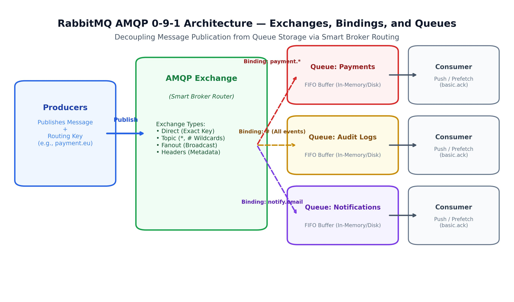

# Distributed Event Streaming and Message Brokers

> *"An event log is the ultimate source of historical truth. In a distributed architecture, message brokers serve as the central nervous system, routing states across service boundaries."*


## Event Streaming in System Design

In microservice architectures, services must communicate asynchronously. Interview candidates often default to saying: *"We will send a message via Kafka."* 

If you stop there, you miss the opportunity to demonstrate depth. A senior systems architect must explain how the message broker is structured, how partition keys guarantee message ordering under concurrency, and how to achieve **Exactly-Once Semantics (EOS)** across transactions.

In this chapter, we deep-dive into Apache Kafka's storage internals and partition routing mechanics, showing how AuraPay shards event streams to maintain ledger correctness.

{width=90%}


## Apache Kafka Internals & Sharding

Apache Kafka is designed as a distributed, partitioned, commit log. Understanding its storage structure is critical for scaling system throughput:

> **Why is it called "Kafka"?** LinkedIn engineer Jay Kreps named it after **Franz Kafka**, the Czech novelist famous for writing about surreal, labyrinthine bureaucracies. Kreps chose the name because Kafka is *"a system optimized for writing"* — and Franz Kafka was a writer. The literary nod is fitting: just as Kafka's novels depict characters navigating complex, opaque systems, Apache Kafka routes millions of messages through complex distributed topologies. The name stuck, and today "Kafka" is synonymous with high-throughput event streaming.

### Core Concepts

1. **The Commit Log:** A Kafka partition is an append-only, ordered sequence of records. Each record consists of a key, a value, and a timestamp. Records are immutable and assigned a sequential ID called an **offset**.
2. **Partitions:** Topics are divided into multiple partitions distributed across Kafka brokers. Partitions are the unit of scalability in Kafka: while a single partition can only handle a throughput limited by its host broker, multiple partitions allow parallel writes and reads across the cluster.
3. **Consumer Groups:** A consumer group is a collection of consumers working together to read messages from a topic. Kafka guarantees that each partition is assigned to exactly *one* consumer instance within a consumer group. This prevents duplicate processing of messages.

{width=85%}

### Replication and Durability
Each partition is replicated across multiple brokers for fault tolerance:

- **Leader Replica:** Handles all read and write requests for the partition.
- **Follower Replicas:** Passively replicate data from the leader. If the leader broker fails, a follower is promoted to leader via the controller election process.
- **ISR (In-Sync Replicas):** The active set of replicas currently caught up with the leader partition. When producers set `acks=all` (or `acks=-1`), the leader will only acknowledge the write once **all** current members of the ISR have appended the record to their local logs.
- **Minimum In-Sync Replicas (`min.insync.replicas`):** Defines the minimum size the ISR must maintain to accept writes when `acks=all` is configured. If replication lags or broker outages reduce the active ISR below this threshold (e.g., `min.insync.replicas=2` when only 1 node is alive), the leader rejects writes with a `NotEnoughReplicasException`, prioritizing consistency and durability over availability.


## The Ordering Invariant & Partition Keys

A common failure mode in message broker design is **out-of-order message delivery**. 
For example, if a user performs two actions:

1. Deposit \$100 (Event A)
2. Withdraw \$80 (Event B)

If the consumer processes Event B before Event A due to network concurrency, the withdrawal may be rejected due to insufficient funds, violating the system's business invariants.

### Guaranteeing In-Order Delivery
To guarantee in-order delivery, Kafka enforces a strict rule: **messages written to the same partition are always read in the exact order they were written.**

- If you publish messages without a key (null key), Kafka distributes them across partitions using a round-robin algorithm, losing all ordering guarantees.
- **The Solution:** Publish messages with a **Partition Key** (e.g., `accountId`). Kafka hashes the key to determine the partition:

```
Partition ID = hash(accountId) % Number of Partitions
```

By sharding on `accountId`, all transaction events for a specific account are guaranteed to land in the same partition and be processed in exact chronological order by a single consumer thread.

The following code illustrates this partition-key routing implementation in a Kafka producer:

```csharp
using Confluent.Kafka;
using System.Threading.Tasks;

public class TransactionEventProducer 
{
    private final IProducer<string, string> _producer;
    private final string _topic;

    public TransactionEventProducer(string bootstrapServers, string topic) 
    {
        var config = new ProducerConfig
        {
            BootstrapServers = bootstrapServers,
            EnableIdempotence = true,
            Acks = Acks.All
        };
        _producer = new ProducerBuilder<string, string>(config).Build();
        _topic = topic;
    }

    public async Task PublishEventAsync(string accountId, string eventJson) 
    {
        // Shard by accountId to guarantee partition message ordering
        var message = new Message<string, string> { Key = accountId, Value = eventJson };
        await _producer.ProduceAsync(_topic, message);
    }
}
```


Setting `enable.idempotence = true` ensures that network retries by the producer do not result in duplicate messages landing in the partition log.


## Exactly-Once Semantics (EOS)

In system design interviews, clearing the **Exactly-Once** challenge is a major differentiator.
How do you guarantee that a transaction is processed exactly once, even if the network fails midway?

Kafka achieves Exactly-Once Semantics (EOS) using a combination of three mechanisms:

1. **Idempotent Producers:** The producer appends a unique sequence number to each message. If a broker receives a duplicate sequence number due to a network retry, it discards the duplicate write.
2. **Transactional Writes:** When a service must read a message from an input topic, process it, and write the output to another topic (the Read-Process-Write pattern), Kafka allows wrapping these steps in a transaction.
3. **Offset Commits in DB:** Alternatively, when writing to a database (like AuraPay's ledger), combine the database write and the event offset commit inside a single database transaction. This is the **Transactional Outbox Pattern** (discussed in the Enterprise Integration and Resiliency chapter), ensuring that either both the database update and the event publish succeed, or both roll back.


## Consumer Group Rebalancing and Failure Recovery

When a consumer instance crashes or a new instance joins the group, Kafka triggers a **rebalance** — redistributing partition assignments across the remaining consumers:

### The Rebalancing Problem
During a rebalance, all consumers in the group temporarily stop processing. This "stop-the-world" pause can cause latency spikes in real-time systems.

### Mitigation Strategies

1. **Sticky Assignor:** Use the `StickyAssignor` partition assignment strategy. Unlike the default `RangeAssignor`, it minimizes partition movement during rebalances — consumers keep their existing assignments, and only the partitions owned by the departing consumer are redistributed.
2. **Cooperative Rebalancing:** Kafka 2.4+ supports **incremental cooperative rebalancing**, where only the affected partitions are revoked and reassigned. Non-affected consumers continue processing without interruption.
3. **Static Group Membership:** Assign a fixed `group.instance.id` to each consumer. When a consumer restarts within the `session.timeout.ms` window, Kafka recognizes it as the same member and skips the rebalance entirely.

### Dead Letter Queues (DLQ)
When a consumer repeatedly fails to process a message (e.g., due to a malformed payload or a downstream service outage), it must not block the entire partition:

- After a configurable number of retry attempts (e.g., 3), route the failed message to a **Dead Letter Queue** — a separate Kafka topic (e.g., `transactions.dlq`).
- The main consumer continues processing subsequent messages.
- A separate monitoring service reads the DLQ, alerts the operations team, and supports manual inspection and replay.


### Mock Interview Transcript: Consumer Group Rebalancing

> **Interviewer:** Your Kafka consumer group is experiencing rebalancing storms. The consumers keep dropping and rejoining, causing massive processing delays. How do you diagnose and fix this?
> **Candidate:** A rebalance storm usually means consumers are failing to send heartbeats or taking too long to process batches. I'd first check the `session.timeout.ms` and `max.poll.interval.ms` metrics. If our message processing is database-heavy, the consumer might exceed the poll interval, causing Kafka to assume it's dead. I'd tune `max.poll.records` down so the consumer processes smaller batches and polls more frequently.
> **Interviewer:** That stabilizes the group. But what if one partition has 10x the traffic of the others because of a highly active user?
> **Candidate:** That's a hot partition problem. In a financial ledger, appending a random salt to the partition key for a heavy user is strictly forbidden because breaking in-order event delivery causes balance corruption and false overdraft rejections. For high-volume omnibus or market-maker accounts, we implement an in-memory Batch Aggregator at the producer layer before emitting events to Kafka, or divide the omnibus account into deterministic sub-accounts reconciled during clearing windows. If strict order per account is maintained, we scale performance by optimizing consumer-side batch processing.
> **Interviewer:** Let's say the rebalancing was caused by a malformed message crashing the consumer. How do you handle poison pill messages?
> **Candidate:** We wrap the deserialization and processing logic in a `try-catch` block. If a message fails validation after a few retries, we acknowledge the offset and forward the payload to a Dead Letter Queue (DLQ).
> **Interviewer:** How can we minimize the impact when we legitimately need to restart consumers for a deployment?
> **Candidate:** We'd enable static group membership by setting `group.instance.id`, and use the cooperative sticky assignor so only the partitions belonging to the restarting node are temporarily paused.

**Technical Summary:** The candidate effectively diagnosed rebalancing storms by identifying poll interval exhaustion, proposed Dead Letter Queues for poison pill messages, and utilized static group membership with cooperative rebalancing to minimize deployment disruptions. They correctly identified the strict ordering constraints of financial ledgers, explicitly rejecting key-salting anti-patterns in favor of micro-batching.

> [!NOTE]
> **Modern Kafka Architecture: KRaft (Kafka Raft) Consensus:**
> In modern Kafka releases (v3.0+), Apache Kafka has replaced Apache ZooKeeper with **KRaft (Kafka Raft Metadata Mode)**. KRaft manages cluster metadata directly inside Kafka itself using an internal Raft quorum, improving cluster scalability, supporting millions of partitions, and drastically speeding up metadata recovery times during broker failures.


## Event Schema Evolution

As your system evolves, the structure of event payloads will change. Adding new fields, renaming properties, or changing data types can break downstream consumers if not managed carefully:

### Schema Registry (Confluent)

- **Central Registry:** All event schemas are registered in a **Schema Registry** (e.g., Confluent Schema Registry) using Avro, Protobuf, or JSON Schema formats.
- **Compatibility Modes:**
  - **BACKWARD:** New schema can read data written with the old schema. Achieved by only adding optional fields with defaults.
  - **FORWARD:** Old schema can read data written with the new schema. Achieved by only removing optional fields.
  - **FULL:** Both backward and forward compatible — the safest option for production systems.
- **Enforcement:** Producers must validate their serialized payload against the registered schema before publishing. If the payload violates the compatibility rules, the write is rejected at the producer level, preventing corrupt data from entering the topic.


## RabbitMQ & AMQP Architecture: The Smart Broker Paradigm

While Apache Kafka is designed as a distributed, partitioned commit log, **RabbitMQ** implements the **Advanced Message Queuing Protocol (AMQP 0-9-1)**, built on the principle of the **"Smart Broker, Dumb Consumer."** In enterprise system design, RabbitMQ is the premier choice for complex message routing, granular task distribution, and individual message lifecycle management.

### The AMQP Topology: Exchanges, Bindings, and Queues

Unlike Kafka—where producers publish directly to topic partitions—in RabbitMQ, producers **never** write directly to queues. Instead, the architecture separates message ingestion from storage through three distinct decoupled entities:

1. **Producer:** Publishes a message to an Exchange along with an optional string metadata tag known as the **Routing Key**.
2. **Exchange:** An agent inside the broker that receives messages and evaluates routing rules to determine which destination queues should receive copies.
3. **Binding:** A configuration link that attaches a Queue to an Exchange with a **Binding Key** (routing rule).
4. **Queue:** A FIFO buffer in memory (or backed by disk) that holds messages until consumed.

{width=85%}

### The 4 Canonical Exchange Types

RabbitMQ's routing flexibility stems from four exchange types:

- **Direct Exchange (Exact Match):** Routes messages to queues whose binding key exactly matches the message routing key. For example, a routing key of `payment.charge` routes exclusively to the `payments_worker_queue`. Ideal for unicast point-to-point task queues.
- **Topic Exchange (Pattern Match with Wildcards):** Routes messages based on wildcard matching against dot-delimited routing keys.
  - `*` (asterisk) matches **exactly one** word (e.g., `audit.*.failed` matches `audit.us.failed` and `audit.eu.failed`).
  - `#` (hash) matches **zero or more** words (e.g., `logs.eu.#` matches `logs.eu.security.critical`).
  - This enables dynamic multi-tenant event filtering without reconfiguring producers.
- **Fanout Exchange (Broadcast):** Duplicates and routes incoming messages to *all* queues bound to it, completely ignoring routing keys. Used for standard publish-subscribe broadcast (e.g., notifying cache invalidation, audit loggers, and metrics services simultaneously).
- **Headers Exchange (Attribute Match):** Routes messages based on key-value pairs in the AMQP message headers table rather than the routing key string.

### Architectural Philosophy: Kafka vs. RabbitMQ

Understanding the philosophical divergence between Kafka and RabbitMQ is a frequent Staff-level interview differentiator:

- **Smart Broker (RabbitMQ):** The broker actively tracks consumer state, delivers messages to consumers via push (`basic.deliver`), handles granular per-message acknowledgments (`basic.ack` / `basic.nack` with requeue options), and deletes messages from the queue immediately upon successful acknowledgment. Consumers control flow using `basic.qos(prefetch_count=N)` to prevent memory exhaustion.
- **Dumb Broker, Smart Consumer (Kafka):** The broker acts as an immutable, append-only sequential disk log. It does not track consumer state or individual message ACKs. The consumer group tracks its own position using commit offsets, pulling batches of messages on demand. Messages persist on disk for days or weeks according to retention policies, allowing historical replaying and event sourcing.

> **Staff-Level Design Rule:** Choose **RabbitMQ** when you need fine-grained routing, per-message acknowledgments, dead-letter re-routing per individual task, or push-based task queue distribution. Choose **Kafka** when you need high-throughput distributed event streaming, permanent log retention, replayability, or strict partition-key-ordered processing (such as financial ledgers).


## Kafka vs. Event-Driven Alternatives

### When NOT to Use Kafka
Kafka excels at high-throughput, ordered event streaming. However, it is not always the right choice:

- **Simple Task Queues:** If you need to distribute work items across workers without ordering guarantees (e.g., image resizing, email sending), a dedicated task queue like **RabbitMQ** or **AWS SQS** reduces operational complexity and provides individual task retries without partition head-of-line blocking.
- **Real-Time WebSocket Push:** Kafka is pull-based. For real-time push notifications to browsers or mobile clients, use **Redis Pub/Sub** or a dedicated WebSocket gateway.
- **Sub-Millisecond Latency:** Kafka's batching and replication introduce millisecond-range latency. For ultra-low-latency inter-process communication (e.g., inside a matching engine), use shared memory or in-process queues.

## Message Broker Comparison Matrix

Selecting the right broker technology depends on the architectural requirements:

| Dimension | Apache Kafka | RabbitMQ | AWS SQS / SNS |
|---|---|---|---|
| **Architecture** | Partitioned commit log (pull-based) | Smart broker, dumb consumer (push-based) | Cloud-managed queue (pull/push-based) |
| **Throughput Scale** | **Extreme** (10M+ messages/sec via sequential disc I/O) | High (Capped by broker memory and queue routing complexity) | High (Managed automatically by cloud scaling limits) |
| **Routing Capability** | Basic (consumer groups read whole topic partitions) | **Complex** (supports exchange routing keys, fanout, headers) | Basic (SNS topic fanout to SQS queues) |
| **Ordering Guarantees** | Strict order *per partition* via keys | Order guaranteed only for single consumers | Strict order only when utilizing FIFO queues (low throughput) |
| **Backpressure** | Managed by consumer (consumer pulls when ready) | Smart broker manages queue size (pushes back on producer) | Managed by consumer pooling configurations |
| **Retention** | Durable (retains messages on disk for days/weeks) | Transient (messages are deleted immediately after consumption) | Transient (messages deleted after poll commit, max 14 days) |
| **Schema Evolution** | Schema Registry (Avro/Protobuf) | No native schema support | No native schema support |


> ⭐ **STAR Moment: The Ordering Guarantee**
> 
> In a system design interview, explain: *"We will configure our payment topics with a partitioning key based on the ledger account ID. This guarantees that all transactions affecting a specific account are processed sequentially by a single thread in our consumer group, eliminating race conditions and balance corruption during high-frequency parallel events. We use the StickyAssignor with cooperative rebalancing to minimize processing pauses when consumers scale, and route poison messages to a Dead Letter Queue after three retry attempts to prevent partition blocking."* This shows deep understanding of partition routing, failure recovery, and operational maturity.
