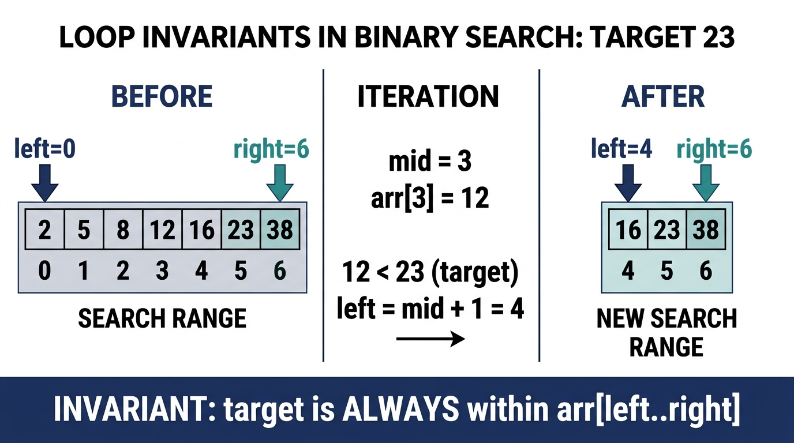

# The Invariant-First Interview Strategy

> *"Before you build a system, draw the boundaries. Code written within correct boundaries cannot drift into error."*


## The Panic of the Blank Editor

It is a common scenario in technical interviews: the interviewer presents a coding challenge, and the candidate immediately starts typing. They construct loops, initialize local counters, and write complex nested conditionals. The candidate is trying to solve the problem by writing code, using the editor as a scratching post to find a solution.

This approach is fragile. In the pressure of a live interview or a timed online assessment (like CodeSignal), writing code without a design roadmap leads to cognitive overload. You are trying to manage algorithmic logic, syntax rules, memory allocation, and edge cases simultaneously. When the first test run fails, you start modifying conditions arbitrarily—changing `<` to `<=`, adding random `+1` offsets, or introducing temporary boolean flags. 

This is the "hack-and-test" methodology, and it signals to the interviewer that you lack structural discipline. A senior engineer or manager must demonstrate a systematic, predictable approach to code correctness. The solution is the **Invariant-First Strategy**.


## Defining the Invariant Wall

The Invariant-First Strategy requires you to define the mathematical and logical boundaries of your solution before implementing any code. In computer science, an **invariant** is a property that remains true throughout a specific phase of execution. 

When you apply this to coding assessments, you construct an "Invariant Wall" composed of three layers:

1.  **Pre-conditions:** Constraints on the inputs that must be true before a function or method is executed. If a caller violates a pre-condition, the method should fail immediately (e.g., throwing an `IllegalArgumentException` in Java).
2.  **Post-conditions:** Guarantees that the method promises to satisfy upon successful execution. This defines what "correctness" means for the operation.
3.  **Class/Data Invariants:** State rules that must always hold true for a domain object throughout its entire lifecycle.

{width=70%}

By declaring these boundaries upfront, you decouple *what* the system must do from *how* it will do it. You establish a contract. Once the contract is clear, writing the code is simply a matter of executing that contract.


### Hoare Logic & Formal Program Verification

In formal computer science, program correctness is verified using **Hoare Logic** (formalized by C.A.R. Hoare in 1969). A computation step is represented as a **Hoare Triple**:

$$\{ P \} \; C \; \{ Q \}$$

- **$P$ (Pre-condition):** An assertion about the system state that must hold true *before* executing command block $C$.
- **$C$ (Command Block):** The executable algorithm or method body.
- **$Q$ (Post-condition):** An assertion about the system state guaranteed to hold true *after* executing command block $C$.

```text
               Hoare Triple Contract Execution:
               ┌───────────────────────────────┐
               │    Pre-condition P (Valid)    │
               └──────────────┬────────────────┘
                              │
                              ▼
               ┌───────────────────────────────┐
               │    Command Execution (C)      │
               └──────────────┬────────────────┘
                              │
                              ▼
               ┌───────────────────────────────┐
               │    Post-condition Q (Guaranteed)
               └───────────────────────────────┘
```

**Total Correctness** requires establishing two distinct mathematical proofs:

1. **Partial Correctness:** Proving that *if* the algorithm terminates, the final state satisfies the post-condition $Q$ (proved via Loop Invariants).
2.

**Termination:** Proving that the algorithm cannot enter an infinite loop and *must* terminate in finite steps (proved via a Loop Variant Metric).

### Design by Contract (DbC) in Enterprise Software

Originating from Bertrand Meyer's Eiffel programming language, **Design by Contract (DbC)** maps Hoare triples into software architecture:

- **Client Obligation:** The caller must supply arguments satisfying the method's pre-conditions.
- **Supplier Guarantee:** If the pre-conditions are met, the method guarantees to produce a state satisfying the post-conditions and preserving class invariants.
- **Fail-Fast Enforcement:** If a pre-condition is violated, the method immediately rejects execution (e.g., throwing `IllegalArgumentException`), preventing silent state corruption.


## The Invariant Interview Framework

When faced with a technical coding challenge in an interview, follow this four-step spec-driven framework:

### Define the Boundary Invariants (Clarification Phase)
Before writing any code, state the inputs, outputs, and their mathematical bounds. For example, if you are asked to process a list of transactions:

- What are the pre-conditions? Can the input list be null or empty? Can transaction amounts be negative?
- What are the post-conditions? Does the output preserve the original order of transactions? How are duplicate entries handled?
Write these down as comments in the IDE or verbalize them to the interviewer.

### Declare the Data Invariants (Type Design Phase)
Design your types to enforce invariants natively. Do not use generic types (like raw integers or strings) where a domain-specific type can prevent invalid states. 
For example, instead of passing a raw `double` representing a monetary amount, define a `Money` record that guarantees the amount cannot be negative and uses the correct currency scale.

### Establish the Loop Invariants (Algorithmic Phase)
If your algorithm requires an iterative process (such as a search or a sliding window), define what remains true during each iteration of the loop.
For instance, in a sliding window algorithm finding the maximum subarray sum:

- *Loop Invariant:* At the start of each iteration `i`, `current_window_sum` represents the sum of elements from index `left` to `i - 1`.
If you can maintain this invariant, your loop is guaranteed to be correct, and off-by-one errors are eliminated.

### Implement and Enforce
Write the code, beginning with explicit checks for your pre-conditions. Use modern language features to keep the code clean and expressive, ensuring that your logic never violates the declared invariants.


## Worked Example: Proving Binary Search

To demonstrate the mathematical power of invariants, let us examine the classic binary search algorithm. Many developers struggle with binary search, often getting trapped in infinite loops or off-by-one errors because they guess the boundary updates (e.g., `right = mid` vs. `right = mid - 1`).

{width=85%}

### The Challenge
Given a sorted array of integers `nums` and a `target` value, return the index of the `target` if it exists in the array, or `-1` if it does not.

### Define the Boundaries (Step 1)

- **Pre-condition:** `nums` is sorted in ascending order ($nums[i] \le nums[i+1]$).
- **Post-condition:** The returned index $idx$ satisfies $nums[idx] == target$, or if $idx == -1$, then $target \notin nums$.

### Establish the Loop Invariant (Step 3)
We define two pointers, `left` and `right`, defining our active search range $[left, right]$.

- **The Loop Invariant:** *If the target is present in the array, it must reside within the active index boundaries $[left, right]$:*

$$\mathcal{P}(left, right) \iff \Big(\text{target} \in nums \implies \exists k \in [left, right] \text{ s.t. } nums[k] = \text{target}\Big)$$

### Mathematical Proof of Correctness & Total Termination

#### A. Initialization
Before the loop starts, the invariant $\mathcal{P}$ must hold true. We initialize `left = 0` and `right = nums.length - 1`.
Since the array is sorted, if the target is in the array, it must lie within the initial search space $[0, nums.length - 1]$. The invariant holds.

#### B. Maintenance (Partial Correctness) & Integer Overflow Arithmetic
During each iteration, calculating the midpoint as `(left + right) / 2` presents a dangerous 32-bit integer overflow bug:

- In two's complement 32-bit signed integers, `Integer.MAX_VALUE` is $2,147,483,647$.
- If `left = 1,500,000,000` and `right = 2,000,000,000`, their mathematical sum is $3,500,000,000$.
- In a 32-bit register, $3,500,000,000$ overflows to $-794,967,296$. Dividing by 2 yields $-397,483,648$, causing an instant `ArrayIndexOutOfBoundsException`.

To eliminate overflow, we use either subtraction-based allocation or unsigned logical right shift:
$$\text{mid} = \text{left} + \frac{\text{right} - \text{left}}{2} \quad \text{or} \quad \text{mid} = (\text{left} + \text{right}) \ggg 1$$

We check three cases:

**Case 1: $nums[mid] == target$**
The target is found, returning `mid` and satisfying the post-condition.

**Case 2: $nums[mid] < target$**
Since the array is sorted, all elements at or to the left of `mid` are strictly less than `target` ($nums[k] \le nums[mid] < target$ for all $k \le mid$). Therefore, `target` cannot reside in $[left, mid]$. We set `left = mid + 1`, contracting the search space to $[mid + 1, right]$. The invariant $\mathcal{P}$ is maintained.

**Case 3: $nums[mid] > target$**
All elements at or to the right of `mid` are strictly greater than `target`. The target cannot reside in $[mid, right]$. We set `right = mid - 1`, contracting the search space to $[left, mid - 1]$. The invariant $\mathcal{P}$ is maintained.

#### C. Termination & The Loop Variant Metric
To guarantee that the loop cannot run indefinitely, we define the **Loop Variant Metric**:

$$V(left, right) = right - left + 1$$

1. **Well-Founded Domain:** $V \in \mathbb{N}_0$. The loop condition `left <= right` corresponds to $V > 0$.
2. **Strict Monotonic Contraction:** At each step, because $mid = \lfloor (left + right)/2 \rfloor$, updating `left = mid + 1` or `right = mid - 1` strictly reduces $V_{t+1} \le \lfloor V_t / 2 \rfloor < V_t$.
3. **Termination Guarantee:** Since $V$ is a strictly decreasing sequence of non-negative integers, $V$ must hit 0 in at most $\lfloor \log_2 N \rfloor + 1$ iterations, forcing loop termination when `left > right`.

When $V = 0$, the search space $[left, right]$ is empty. Combining $V = 0$ with invariant $\mathcal{P}$ proves that $\text{target} \notin nums$. Returning `-1` is mathematically sound.

### Boundary Topologies: Closed vs. Half-Open Intervals

| Interval Model | Boundary Notation | Loop Condition | Left Update | Right Update | Loop Termination State |
| :--- | :--- | :--- | :--- | :--- | :--- |
| **Closed Interval** | $[left, right]$ | `while (left <= right)` | `left = mid + 1` | `right = mid - 1` | `left == right + 1` (Empty set) |
| **Half-Open Interval** | $[left, right)$ | `while (left < right)` | `left = mid + 1` | `right = mid` | `left == right` (Points to insertion index) |

> [!TIP]
> **How to Verbalize This in an Interview (30-Second Summary):**
> Tell your interviewer: *"I define my active search space as the closed interval [left, right]. My loop invariant states that if the target exists, it MUST lie within [left, right]. At each step, I compute mid without integer overflow using left + (right - left) / 2. Depending on the comparison, I strictly contract the search space to [left, mid - 1] or [mid + 1, right], strictly reducing my loop variant metric V = right - left + 1. This guarantees O(log N) termination without off-by-one errors."*

### Implementation (Step 4)
Because we have proved our updates mathematically, we do not need to guess the loop conditions:

```java
public int binarySearch(int[] nums, int target) {
    // 1. Enforce Pre-conditions
    if (nums == null || nums.length == 0) {
        return -1;
    }

    int left = 0;
    int right = nums.length - 1;

    // Maintain Invariant: target is in nums[left...right]
    while (left <= right) {
        int mid = left + (right - left) / 2;

        if (nums[mid] == target) {
            return mid; // Post-condition satisfied
        } else if (nums[mid] < target) {
            left = mid + 1; // Invariant maintained
        } else {
            right = mid - 1; // Invariant maintained
        }
    }

    return -1; // Search range is empty -> target not in nums
}
```


By applying this invariant-first approach, we eliminate all cognitive overhead. We do not need to "dry-run" multiple edge cases or guess boundary updates. The math guarantees the correctness of our implementation.

### Invariant Proof #2: The Sliding Window Maximum

Prove the invariant for maintaining a monotonic deque that tracks the maximum element in a sliding window of size $K$:

**Invariant:** At every step $i$, the deque contains indices in strictly decreasing order of their corresponding values, and all indices are contained within the current window $[i - K + 1, i]$.

**Initialization:** The deque is empty before processing begins. Vacuously true.

**Maintenance & The Dominance Lemma:** When processing element $A[i]$:

1. **Dominance (Elimination) Lemma:** For any prior index $j < i$ inside the deque where $A[j] \le A[i]$, index $j$ can **never** be the maximum of the current window or any future window containing $i$. Why? Because $A[i]$ is both larger/equal in value AND has a later expiration boundary ($i + K - 1 > j + K - 1$). Thus, popping $j$ from the back preserves optimal sub-structure.
2. **Window Bounds Guard:** Remove the front index if $deque.peekFirst() < i - K + 1$ (evicting expired elements).
3. **Enqueue:** Push current index $i$ to the back.

After these operations, $deque.peekFirst()$ strictly holds the index of the maximum element in the current window.

**Termination & Amortized Complexity Proof (The Potential Method):**
To prove the $\mathcal{O}(1)$ amortized time per element ($\mathcal{O}(N)$ total runtime), define the potential function $\Phi(S_t) = |\text{deque}_t|$:

- Let $\Phi(S_0) = 0$. Since $|\text{deque}| \ge 0$, the non-negativity condition $\Phi(S_t) \ge 0$ holds universally.
- At step $i$, suppose $k_i$ smaller elements are popped before $A[i]$ is enqueued.
  - Actual computation cost: $c_i = 1 + k_i$ ($1$ push + $k_i$ pops).
  - Potential delta: $\Delta \Phi_i = \Phi(S_i) - \Phi(S_{i-1}) = 1 - k_i$.
  - Amortized cost: $\hat{c}_i = c_i + \Delta \Phi_i = (1 + k_i) + (1 - k_i) = 2 = \mathcal{O}(1)$.
- Summing across all $N$ elements: $\sum c_i \le \sum \hat{c}_i = 2N = \mathcal{O}(N)$. Total work is strictly bounded.


> ⭐ **STAR Moment: The $O(1)$ Failure Principle**
> 
> A robust system fails fast and fails explicitly. The first lines of any method should always be pre-condition validation. If an input is invalid, fail immediately. Do not allow execution to proceed with corrupted or unexpected state, as this leads to hard-to-debug failures deep inside your call stack. In an interview, writing explicit input validations shows that you design for production safety, not just passing test suites.
