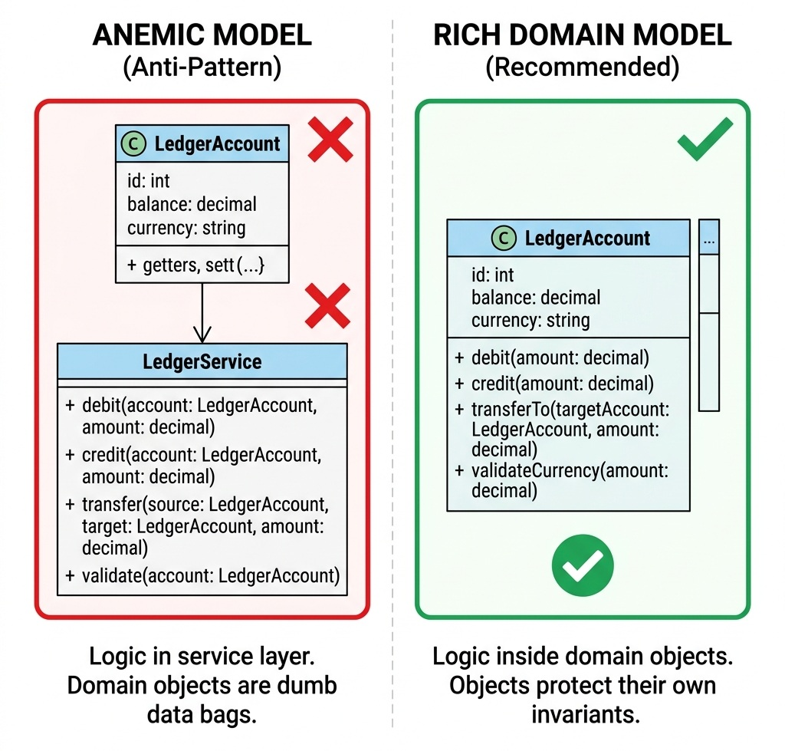

# Principles of Object-Oriented Design

> *"Do not expose your state to the world. Encapsulate your data, expose your contracts, and let polymorphism handle the variance."*


## The Anemic Domain Model Anti-Pattern

In many enterprise applications, domain classes are treated as passive data holders—simple collections of fields with auto-generated getters and setters. This is the **Anemic Domain Model** anti-pattern. 

When your domain models are anemic, the business logic shifts into stateless service classes (e.g., `LedgerService`). The service pulls the state out of the domain model, performs validation, modifies the fields, and pushes the data back to the database. The danger of this design is that the domain object itself has no control over its state. Any developer can instantiate a ledger account, set the balance to a negative value without checks, and persist it, violating the core safety boundaries of the system.

The following code illustrates this fragile, anemic design:

```java
// Anemic Account Model (Fragile Data Holder)
public class Account {
    private String id;
    private BigDecimal balance;
    private String currency;

    public String getId() { return id; }
    public void setId(String id) { this.id = id; }
    public BigDecimal getBalance() { return balance; }
    public void setBalance(BigDecimal balance) { this.balance = balance; }
    public String getCurrency() { return currency; }
    public void setCurrency(String currency) { this.currency = currency; }
}

// Stateless Service containing business invariants (Anti-pattern)
public class LedgerService {
    public void transfer(Account from, Account to, BigDecimal amount) {
        if (from.getBalance().compareTo(amount) < 0) {
            throw new IllegalArgumentException("Insufficient funds");
        }
        if (!from.getCurrency().equals(to.getCurrency())) {
            throw new IllegalArgumentException("Currency mismatch");
        }
        from.setBalance(from.getBalance().subtract(amount));
        to.setBalance(to.getBalance().add(amount));
    }
}
```

### Why the Anemic Model Fails in Production

1. **Lack of Encapsulation:** Any part of the application can modify the account balance directly: `account.setBalance(new BigDecimal("-1000.00"))`, bypassing the business checks entirely.
2. **Scatter-Shot Validation:** Validation logic is duplicated across multiple services (e.g., `BillingService`, `PayoutService`, `TransferService`). If a validation rule changes, you must locate and modify every instance across the codebase, risking logic drift.
3. **Concurrency Vulnerability:** In high-concurrency systems, separating state from checks leads to **Time-of-Check to Time-of-Use (TOCTOU)** race conditions, resulting in balance corruption.

In a senior coding or architecture interview, presenting an anemic model is a missed opportunity. To demonstrate true software craftsmanship, you must show how to design **rich domain models** that encapsulate state and enforce invariants.

{width=85%}


## Refactoring Walkthrough: From Anemic to Rich

To refactor a fragile anemic domain into a secure, self-validating rich domain model, follow these three rules:

### Protect Domain Invariants in the Constructor
Ensure that an object can never be created in an invalid state. Validate all inputs during instantiation. If a pre-condition is violated, fail-fast immediately by throwing an exception.

### Remove Setters and Restrict State Access
Eliminate all public setter methods. Fields should be `private` and, where possible, `final`. The only way to modify state is through explicit, domain-specific methods that protect the object's invariants.

### Move Operations Inside the Aggregate Boundary
Instead of letting external service classes manipulate fields, encapsulate the business behavior inside the entity itself. The entity must protect its own state.


## Abstraction & Encapsulation

Encapsulation is not merely the practice of making fields `private` and exposing public getters and setters. True encapsulation means that an object protects its own state, ensuring that its internal data can never enter an invalid state.

In AuraPay, our `LedgerAccount` domain model is rich. It contains its own `debit`, `credit`, and `transferTo` methods, making it impossible to perform a transfer without validating currencies, checking overdraft limits, and preventing concurrency deadlocks.

The following code illustrates this rich encapsulation:

```java
package com.aurapay.domain;

import java.math.BigDecimal;
import java.util.Objects;

/**
 * Demonstrates a rich domain model encapsulating transfer logic and enforcing 
 * cross-entity invariants.
 */
public class LedgerAccount {
    private final String accountId;
    private final String currency;
    private BigDecimal balance;
    private final BigDecimal overdraftLimit;

    public LedgerAccount(String accountId, String currency, BigDecimal initialBalance, BigDecimal overdraftLimit) {
        this.accountId = Objects.requireNonNull(accountId);
        this.currency = Objects.requireNonNull(currency);
        this.balance = Objects.requireNonNull(initialBalance);
        this.overdraftLimit = Objects.requireNonNull(overdraftLimit);
    }

    public synchronized BigDecimal getBalance() { return balance; }
    public String getCurrency() { return currency; }

    public synchronized void debit(BigDecimal amount) {
        if (amount.compareTo(BigDecimal.ZERO) <= 0) {
            throw new IllegalArgumentException("Debit amount must be positive");
        }
        BigDecimal newBalance = this.balance.subtract(amount);
        if (newBalance.add(this.overdraftLimit).compareTo(BigDecimal.ZERO) < 0) {
            throw new InsufficientFundsException("Overdraft limit exceeded");
        }
        this.balance = newBalance;
    }

    public synchronized void credit(BigDecimal amount) {
        if (amount.compareTo(BigDecimal.ZERO) <= 0) {
            throw new IllegalArgumentException("Credit amount must be positive");
        }
        this.balance = this.balance.add(amount);
    }

    /**
     * Executes a thread-safe transfer to a target account, enforcing business invariants.
     * Prevents mismatched currencies (pre-condition) and double-debiting.
     */
    public void transferTo(LedgerAccount target, BigDecimal amount) {
        Objects.requireNonNull(target, "Destination account cannot be null");
        Objects.requireNonNull(amount, "Transfer amount cannot be null");

        // PRE-CONDITION ENFORCEMENT: Currency matching
        if (!this.currency.equals(target.getCurrency())) {
            throw new CurrencyMismatchException(
                String.format("Cannot transfer between mismatched currencies: %s and %s", 
                this.currency, target.getCurrency())
            );
        }

        // PRE-CONDITION ENFORCEMENT: Self-transfer check
        if (this.accountId.equals(target.accountId)) {
            throw new IllegalArgumentException("Cannot transfer to the same account");
        }

        // To prevent deadlocks, lock accounts in a stable global order
        LedgerAccount firstLock = this.accountId.compareTo(target.accountId) < 0 ? this : target;
        LedgerAccount secondLock = firstLock == this ? target : this;

        synchronized (firstLock) {
            synchronized (secondLock) {
                // Execute atomic debit-credit sequence
                this.debit(amount);
                target.credit(amount);
            }
        }
    }
}
```


### Deadlock Prevention via Global Ordering
Notice the synchronization logic inside the `transferTo` method. In a high-concurrency payment engine, locking two entities simultaneously (e.g., account $A$ transferring to $B$, while $B$ is transferring to $A$) can lead to a circular wait deadlock. 

To prevent this, the method compares the account identifiers (`this.accountId` and `target.accountId`) and locks them in a consistent, alphabetical global order. This is a classic concurrency pattern that demonstrates your readiness to design banking-grade production code.


## OOP Principles vs. DDD Concepts

Object-Oriented Design and Domain-Driven Design (DDD) are deeply interconnected. When designing enterprise systems, OOD principles map directly to DDD tactical design patterns:

| OOP Principle | DDD Tactical Pattern | Architectural Mapping |
|---|---|---|
| **Encapsulation** | Aggregate Root | The aggregate root acts as a consistency boundary, encapsulating internal entities and protecting invariants from external modification. |
| **Immutability** | Value Object | Objects without distinct identity (like `Money`) are designed as immutable value objects, preventing side effects during sharing. |
| **Polymorphism** | Domain Strategy | Swapping of algorithm strategies (like different fee calculations) is modeled as polymorphic strategy interfaces. |
| **Abstraction** | Repository / Service | Shielding the domain from infrastructure adapters (database, message queues) using clean interface abstractions. |


## Composition over Inheritance

A common mistake in object-oriented design is abusing inheritance. For example, if you are asked to support different settlement networks (ACH, FedWire, Visa), a naive developer might create a base `SettlementService` class and subclass it: `AchSettlementService`, `FedWireSettlementService`, etc.

This creates tight coupling. If you need to change how fees are calculated, or add a new network channel, you risk breaking parent behaviors. The first rule of enterprise OOP design is to **favor composition over inheritance**.

Instead of sub-classing, we compose our routing engine by injecting a collection of independent strategy routes. The core engine is decoupled from the network-specific details.

{width=85%}


## Polymorphism over Conditional Logic

One of the easiest ways to spot a junior candidate's code is looking for large `if-else` or `switch` blocks that inspect the type of an object to determine behavior. For example:

```java
// Anti-pattern: Inspecting properties to determine routing
if (tx.getAmount().compareTo(LIMIT) > 0) {
    fedWireRoute.process(tx);
} else {
    achRoute.process(tx);
}
```


This violates the Open/Closed Principle. Every time you support a new payment network, you must modify this routing block.

Polymorphism allows you to clean this up. By defining a generic `SettlementRoute` interface, the routing engine can iterate through all available routes, asking each route if it supports the transaction, and executing the process dynamically.

The following code defines this polymorphic settlement design:

```java
package com.aurapay.settlement;

import com.aurapay.domain.TransactionRecord;
import java.math.BigDecimal;

/**
 * Interface defining the polymorphic contract for payment settlement networks.
 */
public interface SettlementRoute {
    boolean supports(TransactionRecord transaction);
    void process(TransactionRecord transaction);
    BigDecimal calculateFees(TransactionRecord transaction);
}

/**
 * Concrete implementation for the ACH network (low cost, delayed).
 */
public class AchRoute implements SettlementRoute {
    private static final BigDecimal ACH_FLAT_FEE = new BigDecimal("0.50");

    @Override
    public boolean supports(TransactionRecord transaction) {
        // ACH supports amounts up to $100,000
        return transaction.amount().compareTo(new BigDecimal("100000.00")) <= 0;
    }

    @Override
    public void process(TransactionRecord transaction) {
        System.out.println("Routing transaction " + transaction.transactionId() + " via ACH network.");
    }

    @Override
    public BigDecimal calculateFees(TransactionRecord transaction) {
        return ACH_FLAT_FEE;
    }
}

/**
 * Concrete implementation for the FedWire network (instant, high cost).
 */
public class FedWireRoute implements SettlementRoute {
    private static final BigDecimal WIRE_FLAT_FEE = new BigDecimal("15.00");

    @Override
    public boolean supports(TransactionRecord transaction) {
        // FedWire is used for high-value transactions above $10,000
        return transaction.amount().compareTo(new BigDecimal("10000.00")) > 0;
    }

    @Override
    public void process(TransactionRecord transaction) {
        System.out.println("Routing transaction " + transaction.transactionId() + " via FedWire network.");
    }

    @Override
    public BigDecimal calculateFees(TransactionRecord transaction) {
        return WIRE_FLAT_FEE;
    }
}
```


By utilizing this interface, the main transaction processor can execute settlements using a clean polymorphic loop, completely decoupled from specific network implementations:

```java
public class SettlementProcessor {
    private final List<SettlementRoute> routes;

    public SettlementProcessor(List<SettlementRoute> routes) {
        this.routes = routes;
    }

    public void execute(TransactionRecord transaction) {
        SettlementRoute activeRoute = routes.stream()
            .filter(route -> route.supports(transaction))
            .findFirst()
            .orElseThrow(() -> new NoRouteFoundException("No supported route found"));
            
        activeRoute.process(transaction);
    }
}
```


> ⭐ **STAR Moment: The Encapsulation Test**
> 
> When designing class structures in a technical interview, ask yourself: *Can this class enter an invalid state?* If a client developer can instantiate your object and set its properties to values that violate business rules, your encapsulation has failed. Build your validation boundaries directly into the constructors and state-transition methods of your domain objects.
