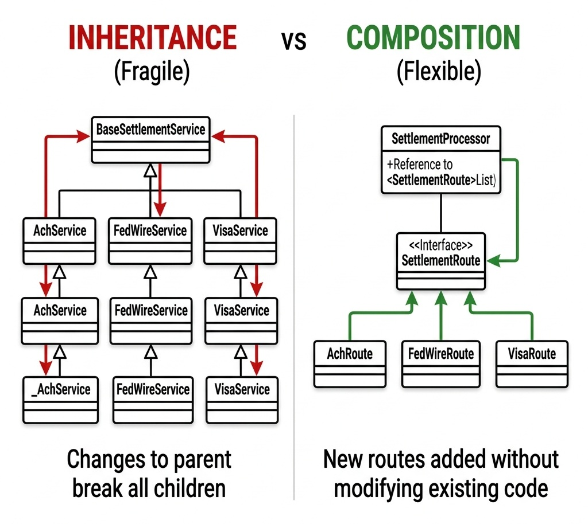

# Principles of Object-Oriented Design & Domain-Driven Craftsmanship

> *"Do not expose your state to the world. Encapsulate your data, expose your contracts, and let polymorphism handle the variance."*

## The Foundations: Connecting OOP Principles to Domain-Driven Design (DDD)

In enterprise software engineering and senior-level technical interviews, Object-Oriented Programming (OOP) is not merely about syntax or class hierarchies. Its primary purpose is to model real-world business domains, enforce critical invariants, and protect data integrity under high concurrency.

When designing large-scale enterprise systems, core OOP principles map directly to **Domain-Driven Design (DDD)** tactical patterns. Understanding this bridge prevents code from degenerating into unmaintainable scripts:

{width=90%}

### Core DDD Definitions Every Candidate Must Master:

1. **Entities:** Objects defined by a unique, enduring identity that persists across state changes (e.g., a `LedgerAccount` identified by a unique `accountId`). Two entities with identical balances are distinct if their IDs differ.
2. **Value Objects:** Immutable objects defined entirely by their attribute values, possessing no conceptual identity (e.g., `Money`, `Currency`, or `Address`). If two `Money` objects both represent `$100 USD`, they are completely interchangeable.
3. **Aggregates & Aggregate Roots:** A cluster of associated domain objects (Entities and Value Objects) treated as a single unit for data changes. The **Aggregate Root** is the sole gateway through which external code interacts with internal objects, guaranteeing that all domain invariants remain valid across operations.
4. **Domain Services:** Operations or business transformations that do not naturally belong to a single Entity or Value Object (e.g., cross-account fund routing engines).

## The Anemic Domain Model Anti-Pattern

Despite understanding basic OOP syntax, many enterprise applications fall into a common architectural trap: treating domain classes as passive data holders—simple bags of private fields with auto-generated getters and setters. Martin Fowler termed this the **Anemic Domain Model** anti-pattern.

When domain models are anemic, business logic escapes into external, stateless service classes (e.g., `LedgerService`). The service pulls raw data out of the domain object, validates it externally, mutates the fields via setters, and pushes the modified object back to storage.

{width=90%}

The following code illustrates this fragile, anemic design:

```java
// Anemic Account Model (Fragile Data Holder)
public class Account {
    private String id;
    private BigDecimal balance;
    private String currency;

    public String getId() { return id; }
    public void setId(String id) { this.id = id; }
    public BigDecimal getBalance() { return balance; }
    public void setBalance(BigDecimal balance) { this.balance = balance; }
    public String getCurrency() { return currency; }
    public void setCurrency(String currency) { this.currency = currency; }
}

// Stateless Service containing business invariants (Anti-pattern)
public class LedgerService {
    public void transfer(Account from, Account to, BigDecimal amount) {
        if (from.getBalance().compareTo(amount) < 0) {
            throw new IllegalArgumentException("Insufficient funds");
        }
        if (!from.getCurrency().equals(to.getCurrency())) {
            throw new IllegalArgumentException("Currency mismatch");
        }
        from.setBalance(from.getBalance().subtract(amount));
        to.setBalance(to.getBalance().add(amount));
    }
}
```


### Why the Anemic Model Fails in Production

1. **Loss of Encapsulation & Invariant Leakage:** Any component in the application can directly modify account state (e.g., `account.setBalance(new BigDecimal("-1000.00"))`), bypassing validation checks entirely and creating invalid data.
2. **Scatter-Shot Business Logic:** Validation rules become duplicated across multiple service layers (`BillingService`, `PayoutService`, `TransferService`). When a business rule changes, developers must hunt through every service to update logic, risking logic drift and bugs.
3. **Concurrency Vulnerability (TOCTOU):** Separating state checks from state mutation in external services creates **Time-of-Check to Time-of-Use (TOCTOU)** race conditions in multi-threaded environments, leading to negative balances and ledger corruption.

In a senior coding or architecture interview, presenting an anemic model signals a lack of software craftsmanship. Candidates must demonstrate how to refactor anemic structures into **rich domain models**.

## Refactoring Walkthrough: Building Rich Aggregate Boundaries

To refactor an anemic domain model into a secure, self-validating rich aggregate, adhere to three core refactoring rules:

### Rule 1: Protect Domain Invariants in the Constructor (Fail-Fast Instantiation)
An object must never exist in an invalid state. Validate all pre-conditions inside the constructor or static factory method. If invalid arguments are passed (e.g., null currency, negative initial balance), fail-fast immediately by throwing an explicit domain exception.

### Rule 2: Eliminate Setters and Restrict Direct State Access
Remove all public setter methods. Mark internal fields as `private` (and `final` where applicable). The only way external code can modify state is by invoking explicit, intent-revealing business methods (`debit()`, `credit()`, `freeze()`).

### Rule 3: Encapsulate Operations & Concurrency Protections Inside the Aggregate
Move validation checks and mutation logic directly into the entity. The aggregate root must protect its own state boundaries and manage its internal synchronization.

## Rich Abstraction & Encapsulation in Practice

In AuraPay, our `LedgerAccount` domain model is a rich aggregate root. It encapsulates its own `debit()`, `credit()`, and `transferTo()` methods, ensuring that no transfer occurs without validating currencies, enforcing overdraft limits, and acquiring locks safely.

The following code demonstrates rich encapsulation:

```java
package com.aurapay.domain;

import java.math.BigDecimal;
import java.util.Objects;

/**

 * Demonstrates a rich domain model encapsulating transfer logic and enforcing 
 * cross-entity invariants.
 */
public class LedgerAccount {
    private final String accountId;
    private final String currency;
    private BigDecimal balance;
    private final BigDecimal overdraftLimit;

    public LedgerAccount(String accountId, String currency, BigDecimal initialBalance, BigDecimal overdraftLimit) {
        this.accountId = Objects.requireNonNull(accountId);
        this.currency = Objects.requireNonNull(currency);
        this.balance = Objects.requireNonNull(initialBalance);
        this.overdraftLimit = Objects.requireNonNull(overdraftLimit);
    }

    public synchronized BigDecimal getBalance() { return balance; }
    public String getCurrency() { return currency; }

    public synchronized void debit(BigDecimal amount) {
        if (amount.compareTo(BigDecimal.ZERO) <= 0) {
            throw new IllegalArgumentException("Debit amount must be positive");
        }
        BigDecimal newBalance = this.balance.subtract(amount);
        if (newBalance.add(this.overdraftLimit).compareTo(BigDecimal.ZERO) < 0) {
            throw new InsufficientFundsException("Overdraft limit exceeded");
        }
        this.balance = newBalance;
    }

    public synchronized void credit(BigDecimal amount) {
        if (amount.compareTo(BigDecimal.ZERO) <= 0) {
            throw new IllegalArgumentException("Credit amount must be positive");
        }
        this.balance = this.balance.add(amount);
    }

    /**

     * Executes a thread-safe transfer to a target account, enforcing business invariants.
     * Prevents mismatched currencies (pre-condition) and double-debiting.
     */
    public void transferTo(LedgerAccount target, BigDecimal amount) {
        Objects.requireNonNull(target, "Destination account cannot be null");
        Objects.requireNonNull(amount, "Transfer amount cannot be null");

        // PRE-CONDITION ENFORCEMENT: Currency matching
        if (!this.currency.equals(target.getCurrency())) {
            throw new CurrencyMismatchException(
                String.format("Cannot transfer between mismatched currencies: %s and %s", 
                this.currency, target.getCurrency())
            );
        }

        // PRE-CONDITION ENFORCEMENT: Self-transfer check
        if (this.accountId.equals(target.accountId)) {
            throw new IllegalArgumentException("Cannot transfer to the same account");
        }

        // To prevent deadlocks, lock accounts in a stable global order
        LedgerAccount firstLock = this.accountId.compareTo(target.accountId) < 0 ? this : target;
        LedgerAccount secondLock = firstLock == this ? target : this;

        synchronized (firstLock) {
            synchronized (secondLock) {
                // Execute atomic debit-credit sequence
                this.debit(amount);
                target.credit(amount);
            }
        }
    }
}
```


### Deadlock Prevention via Global Lock Ordering

Notice the synchronization logic inside `transferTo()`. In high-concurrency payment engines, locking two entities simultaneously (e.g., Account A transferring to B while Account B is transferring to A) creates a classic circular-wait deadlock.

The aggregate enforces two strict invariants before locking:

1. **Self-Transfer Precondition:** The method immediately rejects transfers where `this.accountId.equals(target.accountId)` (throwing an `InvalidTransferException`), preventing redundant reentrant lock acquisitions.
2. **Deterministic Lock Ordering:** To eliminate circular wait deadlocks, the method compares the two account identifiers and acquires intrinsic/explicit locks in a deterministic **lexicographical ordering** (e.g., locking the account with the smaller UUID/string ID first, regardless of transfer direction). This guarantees that concurrent transfers between the same two accounts always acquire locks in identical sequence.

## Composition over Inheritance

A frequent OOP mistake in technical interviews is abusing inheritance to support distinct feature variations. For example, when building a settlement routing engine for different payment networks (ACH, FedWire, Visa), a candidate might create a base `SettlementService` class and subclass it: `AchSettlementService`, `FedWireSettlementService`, etc.

This introduces tight coupling and brittle hierarchies. Modifying parent behavior or adding multi-network routing rules risks breaking child implementations. The golden rule of enterprise OOP design is to **favor composition over inheritance**.

Instead of subclassing, compose the routing engine by injecting a collection of independent strategy routes. The core engine is decoupled from network-specific settlement details:

{width=85%}

## Polymorphism over Conditional Branching

A common indicator of junior-level code is using long `if-else` or `switch` blocks that inspect object types or enum flags to determine execution logic:

```java
// Anti-pattern: Inspecting properties to determine routing
if (tx.getAmount().compareTo(LIMIT) > 0) {
    fedWireRoute.process(tx);
} else {
    achRoute.process(tx);
}
```


This violates the **Open/Closed Principle (OCP)**. Adding a new payment network requires modifying existing routing blocks, increasing regression risks.

Polymorphism resolves this cleanly. By defining a generic `SettlementRoute` interface, the routing engine iterates through available route implementations, asking each route if it supports the transaction, and executing settlement dynamically:

```java
package com.aurapay.settlement;

import com.aurapay.domain.TransactionRecord;
import java.math.BigDecimal;

/**

 * Interface defining the polymorphic contract for payment settlement networks.
 */
public interface SettlementRoute {
    boolean supports(TransactionRecord transaction);
    void process(TransactionRecord transaction);
    BigDecimal calculateFees(TransactionRecord transaction);
}

/**

 * Concrete implementation for the ACH network (low cost, delayed).
 */
public class AchRoute implements SettlementRoute {
    private static final BigDecimal ACH_FLAT_FEE = new BigDecimal("0.50");

    @Override
    public boolean supports(TransactionRecord transaction) {
        // ACH supports amounts up to $100,000
        return transaction.amount().compareTo(new BigDecimal("100000.00")) <= 0;
    }

    @Override
    public void process(TransactionRecord transaction) {
        System.out.println("Routing transaction " + transaction.transactionId() + " via ACH network.");
    }

    @Override
    public BigDecimal calculateFees(TransactionRecord transaction) {
        return ACH_FLAT_FEE;
    }
}

/**

 * Concrete implementation for the FedWire network (instant, high cost).
 */
public class FedWireRoute implements SettlementRoute {
    private static final BigDecimal WIRE_FLAT_FEE = new BigDecimal("15.00");

    @Override
    public boolean supports(TransactionRecord transaction) {
        // FedWire is used for high-value transactions above $10,000
        return transaction.amount().compareTo(new BigDecimal("10000.00")) > 0;
    }

    @Override
    public void process(TransactionRecord transaction) {
        System.out.println("Routing transaction " + transaction.transactionId() + " via FedWire network.");
    }

    @Override
    public BigDecimal calculateFees(TransactionRecord transaction) {
        return WIRE_FLAT_FEE;
    }
}
```


The main transaction processor can then execute settlements via a clean, extensible polymorphic loop:

```java
public class SettlementProcessor {
    private final List<SettlementRoute> routes;

    public SettlementProcessor(List<SettlementRoute> routes) {
        this.routes = routes;
    }

    public void execute(TransactionRecord transaction) {
        SettlementRoute activeRoute = routes.stream()
            .filter(route -> route.supports(transaction))
            .findFirst()
            .orElseThrow(() -> new NoRouteFoundException("No supported route found"));
            
        activeRoute.process(transaction);
    }
}
```


> ⭐ **STAR Moment: The Encapsulation & Aggregate Test**
> 
> During object-oriented design interviews, evaluate your domain classes with this test: *Can a client developer instantiate this object or invoke a method that leaves the system in an invalid state?* If setters allow negative balances, unvalidated currencies, or race conditions, encapsulation has failed. Emphasize in your interview: *"I encapsulate state inside Rich Aggregate Roots with fail-fast constructors and intent-revealing methods, ensuring domain invariants are protected natively without relying on external services."*
