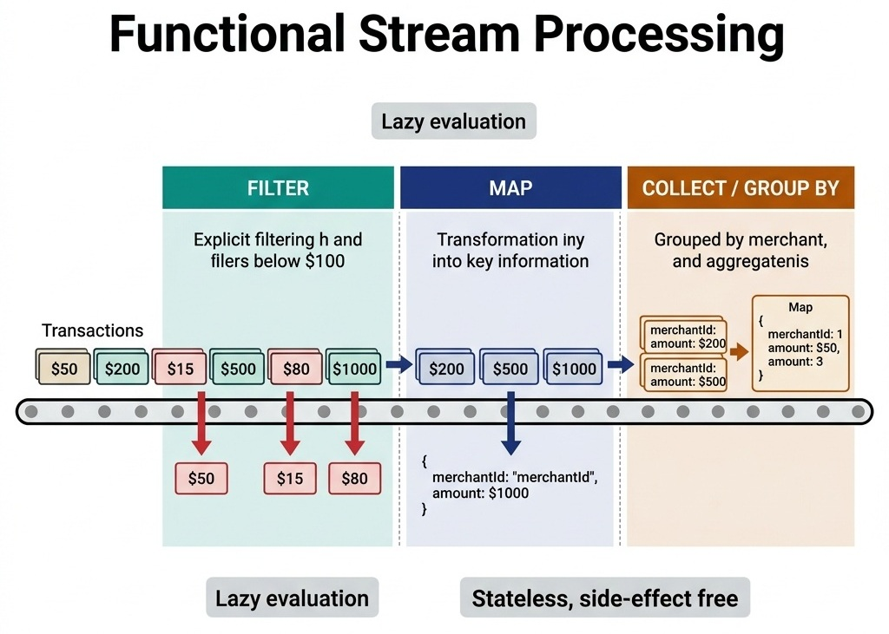

# Modern Functional Programming and Stream APIs

> *"A pipeline of pure functions is a system without side effects. It is a system that can be scaled, tested, and parallelized without fear."*


## The Imperative Loop Trap

A classic interview task is to process a collection of records—filtering out invalid data, transforming the items, and aggregating the result. Historically, developers solved this using imperative structures: `for` loops, nested `if` statements, and mutable local variables.

```java
// Imperative anti-pattern: Hard to read, mutable state, difficult to parallelize
Map<UUID, BigDecimal> volumes = new HashMap<>();
for (TransactionRecord tx : transactions) {
    if (tx.amount().compareTo(threshold) >= 0) {
        UUID merchantId = tx.destinationAccountId();
        BigDecimal currentSum = volumes.getOrDefault(merchantId, BigDecimal.ZERO);
        volumes.put(merchantId, currentSum.add(tx.amount()));
    }
}
```


While correct, this approach has drawbacks:

- It is highly **imperative**, forcing the reader to track *how* the execution runs rather than *what* is being achieved.
- It relies on **mutable state** (`volumes` map), making it unsafe to parallelize without explicit synchronization locks.
- It lacks clean boundaries, combining filtering, mapping, and aggregation into a single block of code.

Modern software engineering favors the **declarative** approach. Using functional pipelines (Java Streams, C# LINQ, Python Generators), you describe the data transformations as a sequence of side-effect-free operations.

## The AuraPay Batch Pipeline

In AuraPay, we aggregate merchant transaction volumes using functional streams. This allows us to process batches of transactions cleanly.

The following code illustrates this functional pipeline:

```java
package com.aurapay.analytics;

import com.aurapay.domain.TransactionRecord;
import java.math.BigDecimal;
import java.util.List;
import java.util.Map;
import java.util.Objects;
import java.util.UUID;
import java.util.stream.Collectors;

/**
 * Demonstrates high-performance batch transaction analytics using Java Streams.
 */
public class TransactionAnalytics {

    /**
     * Processes a list of transactions to aggregate total volume per merchant,
     * filtering out high-risk or low-value records.
     */
    public Map<UUID, BigDecimal> aggregateMerchantVolumes(
        List<TransactionRecord> transactions, 
        BigDecimal minAmountThreshold
    ) {
        Objects.requireNonNull(transactions, "Transaction list cannot be null");
        Objects.requireNonNull(minAmountThreshold, "Threshold cannot be null");

        // Declarative functional pipeline
        return transactions.stream()
            // 1. Filter: Retain only transactions meeting the value criteria (side-effect-free)
            .filter(t -> t.amount().compareTo(minAmountThreshold) >= 0)
            
            // 2. Collect: Group by merchant and sum the transaction volume
            .collect(Collectors.toMap(
                TransactionRecord::destinationAccountId, // Key mapper: Merchant ID
                TransactionRecord::amount,              // Value mapper: Transaction amount
                BigDecimal::add                         // Merge function: Sum volumes
            ));
    }

    /**
     * Finds the transaction IDs of all transfers exceeding a safety limit, 
     * sorted chronologically.
     */
    public List<UUID> getHighValueTransactionIds(
        List<TransactionRecord> transactions, 
        BigDecimal limit
    ) {
        return transactions.stream()
            .filter(t -> t.amount().compareTo(limit) > 0)
            .map(TransactionRecord::transactionId)
            .collect(Collectors.toList());
    }
}
```


{width=90%}

By declaring the operations as a stream pipeline, the code becomes a readable translation of the business spec:

1.  **Filter** out transaction records below the threshold.
2.  **Collect** the results by grouping by the merchant ID and adding their amounts.


## Understanding Method References (`::` Syntax)

In Java, the `::` operator is a **method reference** — a shorthand for a lambda expression that simply delegates to an existing method. Method references make stream pipelines more readable by replacing verbose lambdas with direct method pointers.

There are four types of method references:

**1. Static Method Reference — `ClassName::staticMethod`**

Calls a static method. The stream element is passed as the argument.

```java
// Lambda form:
.map(s -> Integer.parseInt(s))
// Method reference form:
.map(Integer::parseInt)
```

**2. Instance Method on a Specific Object — `instance::method`**

Calls an instance method on a specific, already-existing object.

```java
TransactionValidator validator = new TransactionValidator();
// Lambda form:
.filter(tx -> validator.isValid(tx))
// Method reference form:
.filter(validator::isValid)
```

**3. Instance Method on the Stream Element — `ClassName::instanceMethod`**

Calls an instance method on each element flowing through the stream. The element itself becomes the `this` reference.

```java
// Lambda form:
.map(tx -> tx.amount())
// Method reference form:
.map(TransactionRecord::amount)

// Lambda form:
.map(s -> s.toUpperCase())
// Method reference form:
.map(String::toUpperCase)
```

**4. Constructor Reference — `ClassName::new`**

Calls a constructor to create new objects from stream elements.

```java
// Lambda form:
.map(name -> new Merchant(name))
// Method reference form:
.map(Merchant::new)
```

> **Interview Signal:** Using method references consistently signals that you write idiomatic, clean functional code. When reviewing a pipeline in a live coding session, interviewers expect `Transaction::amount` over `tx -> tx.amount()`.


## Stream Operations Deep-Dive

Every stream pipeline consists of three parts: a **source**, zero or more **intermediate operations** (lazy), and exactly one **terminal operation** (triggers execution).

### Key Intermediate Operations (Lazy — Build the Pipeline)

| Operation | Purpose | Example |
|---|---|---|
| `filter(Predicate)` | Keep elements matching a condition | `.filter(tx -> tx.amount() > 100)` |
| `map(Function)` | Transform each element to a new value | `.map(Transaction::merchantId)` |
| `flatMap(Function)` | Flatten nested collections into a single stream | `.flatMap(tx -> tx.items().stream())` |
| `distinct()` | Remove duplicate elements (uses `.equals()`) | `.distinct()` |
| `sorted()` | Sort elements (natural order or by Comparator) | `.sorted()` |
| `peek(Consumer)` | Inspect elements without modifying (for debugging) | `.peek(tx -> log.info(tx))` |
| `limit(n)` | Take only the first N elements | `.limit(10)` |
| `skip(n)` | Skip the first N elements | `.skip(5)` |

### Key Terminal Operations (Eager — Trigger Execution)

| Operation | Purpose | Example |
|---|---|---|
| `collect(Collector)` | Accumulate into a collection or summary | `.collect(Collectors.toList())` |
| `forEach(Consumer)` | Perform an action on each element | `.forEach(System.out::println)` |
| `reduce(identity, BinaryOp)` | Combine all elements into a single result | `.reduce(BigDecimal.ZERO, BigDecimal::add)` |
| `count()` | Count elements | `.count()` |
| `findFirst()` | Return the first element (wrapped in Optional) | `.findFirst()` |
| `anyMatch(Predicate)` | Check if any element satisfies a condition | `.anyMatch(tx -> tx.isFraud())` |
| `allMatch(Predicate)` | Check if all elements satisfy a condition | `.allMatch(tx -> tx.amount() > 0)` |
| `toArray()` | Collect into an array | `.toArray(String[]::new)` |

### Collectors: The Power of `collect()`

The `Collectors` utility class provides powerful aggregation operations:

```java
// Group transactions by merchant, summing amounts
Map<UUID, BigDecimal> volumeByMerchant = transactions.stream()
    .collect(Collectors.groupingBy(
        TransactionRecord::merchantId,
        Collectors.reducing(BigDecimal.ZERO, TransactionRecord::amount, BigDecimal::add)
    ));

// Partition transactions into two groups: above/below threshold
Map<Boolean, List<TransactionRecord>> partitioned = transactions.stream()
    .collect(Collectors.partitioningBy(tx -> tx.amount().compareTo(threshold) > 0));

// Join merchant names into a comma-separated string
String merchantList = merchants.stream()
    .map(Merchant::name)
    .collect(Collectors.joining(", "));

// Compute statistics on amounts
DoubleSummaryStatistics stats = transactions.stream()
    .mapToDouble(tx -> tx.amount().doubleValue())
    .summaryStatistics();
// stats.getAverage(), stats.getMax(), stats.getMin(), stats.getCount()
```


## When to Use `.map()` vs Collectors Directly

A common source of confusion is deciding whether to use `.map()` as an intermediate transformation step, or to go directly to a `Collectors.toMap()` or `Collectors.groupingBy()` call in the terminal `collect()`. The rule is straightforward:

**Use `.map()` when you need ONE thing from each element into a simple collection.**

The `.map()` operation transforms what is flowing through the stream. After `.map(TransactionRecord::transactionId)`, the stream is no longer `Stream<TransactionRecord>` — it becomes `Stream<UUID>`. Use this when you only need to extract a single field and collect it into a `List` or `Set`.

```java
// Goal: Get a list of transaction IDs for high-value transactions
List<UUID> highValueIds = transactions.stream()
    .filter(tx -> tx.amount().compareTo(limit) > 0)
    .map(TransactionRecord::transactionId)     // Stream<TransactionRecord> -> Stream<UUID>
    .collect(Collectors.toList());              // Simple List<UUID>
```

**Use `Collectors.toMap()` or `groupingBy()` when you need TWO or more things from each element into a Map.**

When you need to extract both a key and a value from the same object, you cannot use `.map()` — mapping to one field loses access to the other. Instead, pass both extractor functions directly into the collector.

```java
// Goal: Map each merchant to their total transaction volume
Map<UUID, BigDecimal> volumes = transactions.stream()
    .filter(tx -> tx.amount().compareTo(threshold) >= 0)
    .collect(Collectors.toMap(
        TransactionRecord::destinationAccountId,  // key: need accountId
        TransactionRecord::amount,                 // value: need amount
        BigDecimal::add                            // merge: sum on collision
    ));
// No .map() here — we need BOTH fields from the same TransactionRecord
```

### Decision Guide

Ask yourself: *Do I need to build a Map (key -> value) from each element?*

- **Yes** -> Use `Collectors.toMap()` or `groupingBy()` directly. You need the full object to extract both key and value.
- **No** -> *Do I need to transform each element to a different type?*
  - **Yes** -> Use `.map()` then `.collect(Collectors.toList())` or `.toSet()`
  - **No** -> Just `.filter()` then `.collect(Collectors.toList())`

### Five Patterns Side-by-Side

```java
// Pattern 1: Extract one field -> List
List<UUID> ids = records.stream()
    .map(TransactionRecord::transactionId)
    .collect(Collectors.toList());

// Pattern 2: Extract one field -> Set (deduplicate)
Set<String> currencies = records.stream()
    .map(TransactionRecord::currency)
    .collect(Collectors.toSet());

// Pattern 3: Two fields -> Map (no duplicates expected)
Map<UUID, BigDecimal> balances = records.stream()
    .collect(Collectors.toMap(
        TransactionRecord::transactionId,
        TransactionRecord::amount));

// Pattern 4: Two fields -> Map with aggregation (sum duplicates)
Map<UUID, BigDecimal> totals = records.stream()
    .collect(Collectors.toMap(
        TransactionRecord::destinationAccountId,
        TransactionRecord::amount,
        BigDecimal::add));

// Pattern 5: Group into lists -> Map<Key, List<Record>>
Map<String, List<TransactionRecord>> byCurrency = records.stream()
    .collect(Collectors.groupingBy(TransactionRecord::currency));
```

> **Interview Tip:** If an interviewer asks you to aggregate data by a key, reach for `Collectors.toMap()` with a merge function or `Collectors.groupingBy()`. If they ask you to extract or transform elements, use `.map()` followed by a simple `toList()` or `toSet()`. Explaining *why* you chose one over the other demonstrates pipeline design fluency.


## Senior Interview Critical Knowledge: Performance Pitfalls

In senior developer and manager interviews, showing that you can write a stream is not enough. You must demonstrate a deep understanding of the **performance costs and runtime implications** of functional APIs.

### The Parallel Stream Thread Starvation Trap
In Java, calling `.parallelStream()` instead of `.stream()` splits the workload across multiple threads automatically. Candidates often present this as an easy optimization.

**The Danger:** By default, all parallel streams in a JVM share a single, static **ForkJoinPool.commonPool()**. The size of this pool is set to `Runtime.getRuntime().availableProcessors() - 1`.
If you run an I/O-bound operation (e.g., calling an external billing gateway or querying a database) inside a parallel stream, you block a thread in the common pool. If multiple requests execute these I/O tasks concurrently, the common pool becomes completely starved. 
Consequently, **every other parallel stream in the entire JVM application stalls**, including critical background system tasks.

> **Design Rule:** Never run I/O-bound operations inside parallel streams. Only use parallel streams for CPU-bound computations on large collections where the overhead of thread scheduling is outweighed by the calculation size.

### Intermediate Object Overhead & Garbage Collection
Functional pipelines construct intermediate objects for every stage of the pipeline. In high-throughput settlement engines processing millions of transactions per second, this causes significant memory overhead.

- Every `.map()` or `.filter()` operation instantiates wrapper objects.
- Primitive boxing (e.g., converting a raw `double` to a `Double` object) triggers heap allocations, putting heavy pressure on the JVM Garbage Collector.

> **Design Rule:** In performance-critical loops, utilize primitive streams (e.g., `IntStream`, `DoubleStream`) to prevent boxing overhead, or fall back to plain array iterations if zero-allocation execution is required.

### Lazy Evaluation and Exception Handling
Stream operations are **lazy**—they are not executed when they are declared, but only when a **terminal operation** (like `.collect()`, `.findFirst()`, or `.forEach()`) is invoked.
This creates debugging challenges. If a filter operation throws an exception, the stack trace will point to the terminal operation invocation, not where the pipeline was declared. Furthermore, standard functional interfaces do not allow checked exceptions, forcing you to write messy wrappers or handle runtime failures globally.


## Performance Comparison: Imperative vs. Streams

Selecting the correct loop structure is a trade-off between readability and raw execution speed. The following table contrasts the runtime behaviors of different processing paradigms:

| Metric | Imperative Loops | Sequential Streams | Parallel Streams |
|---|---|---|---|
| **Execution Time** | Fastest (zero overhead) | Slow to medium | Fast for massive sets; slower for small sets |
| **Heap Allocations** | None (in-place) | High (wrapper nodes, builders) | Very high (coordination nodes) |
| **GC Pressure** | Zero | Medium to high | High |
| **Scale Limits** | Single CPU core | Single CPU core | Scales with cores (CPU-bound only) |
| **Starvation Risk** | Zero | Zero | Extreme (I/O in common pool) |
| **Readability** | Low (boilerplate) | High (declarative) | High (simple conversion) |


## Standard Streams vs. Reactive Streams

In high-concurrency systems, candidates must distinguish between standard Java Streams and **Reactive Streams** (e.g., Spring WebFlux, Project Reactor, RxJava, C# Reactive Extensions):

- **Standard Streams (Pull-Based):** Synchronous and blocking. They operate on finite, in-memory collections. The consumer pulls data from the stream.
- **Reactive Streams (Push-Based):** Asynchronous and non-blocking. They operate on infinite event streams (e.g., live stock feeds, WebSocket connections). The producer pushes data to the consumer.
- **Backpressure:** Reactive streams support backpressure, allowing a slow consumer to signal to a fast producer to slow down, preventing the consumer from exhausting its heap memory buffer during spikes.

### Reactive Streams Example: Real-Time Transaction Monitor

Consider AuraPay's real-time fraud monitoring pipeline. New transactions arrive continuously from multiple payment gateways. We need to filter suspicious transactions, enrich them with account data, and emit alerts — all without blocking threads.

```java
// Reactive pipeline using Project Reactor (Spring WebFlux)
Flux<FraudAlert> fraudAlerts = transactionEventStream   // Infinite push-based stream
    .filter(tx -> tx.amount().compareTo(highValueThreshold) > 0)
    .flatMap(tx -> accountService.findById(tx.accountId())  // Non-blocking DB call
        .map(account -> new EnrichedTransaction(tx, account)))
    .filter(enriched -> enriched.riskScore() > 0.85)
    .map(enriched -> new FraudAlert(enriched, Instant.now()))
    .onBackpressureBuffer(1000)   // Buffer up to 1000 if consumer is slow
    .doOnNext(alert -> log.warn("FRAUD ALERT: {}", alert.transactionId()));

// Subscribe to start processing (nothing happens until subscribe)
fraudAlerts.subscribe(
    alert -> alertService.dispatch(alert),   // onNext: process each alert
    error -> log.error("Pipeline error", error),   // onError: handle failures
    () -> log.info("Stream completed")       // onComplete: stream ended
);
```

The critical differences from standard streams:

| Aspect | Standard Stream | Reactive Stream |
|---|---|---|
| **Data Source** | Finite collection (`List`, `Set`) | Infinite event source (Kafka, WebSocket) |
| **Execution** | Blocking (thread waits for each step) | Non-blocking (event loop, no thread waiting) |
| **Threading** | Caller's thread or ForkJoinPool | Scheduler-managed (e.g., `Schedulers.boundedElastic()`) |
| **Error Handling** | Try-catch or runtime exception | `.onErrorResume()`, `.retry()` operators |
| **Backpressure** | Not supported | Built-in (`onBackpressureBuffer`, `onBackpressureDrop`) |
| **Lifecycle** | Runs once, then garbage collected | Runs continuously until cancelled |


## Stream Practice Questions

The following problems are commonly asked in interviews to test functional programming fluency. Try solving each one using streams before reviewing the solution.

**Q1. Find the three highest transaction amounts (no duplicates)**

```java
List<BigDecimal> topThree = transactions.stream()
    .map(TransactionRecord::amount)
    .distinct()
    .sorted(Comparator.reverseOrder())
    .limit(3)
    .collect(Collectors.toList());
```

**Q2. Group transactions by currency, counting how many in each**

```java
Map<String, Long> countByCurrency = transactions.stream()
    .collect(Collectors.groupingBy(
        TransactionRecord::currency,
        Collectors.counting()
    ));
```

**Q3. Find the first transaction over $10,000 (or return empty)**

```java
Optional<TransactionRecord> highValue = transactions.stream()
    .filter(tx -> tx.amount().compareTo(new BigDecimal("10000")) > 0)
    .findFirst();
```

**Q4. Flatten a list of orders (each containing line items) into all items**

```java
List<LineItem> allItems = orders.stream()
    .flatMap(order -> order.getLineItems().stream())
    .collect(Collectors.toList());
```

**Q5. Compute a comma-separated string of all merchant names, sorted alphabetically**

```java
String result = merchants.stream()
    .map(Merchant::name)
    .sorted()
    .collect(Collectors.joining(", "));
```

**Q6. Check if all transactions are in USD**

```java
boolean allUsd = transactions.stream()
    .allMatch(tx -> "USD".equals(tx.currency()));
```

**Q7. Convert a list of strings to a map of string -> length (handling duplicates)**

```java
Map<String, Integer> nameLengths = names.stream()
    .collect(Collectors.toMap(
        name -> name,
        String::length,
        (existing, replacement) -> existing  // Keep first on collision
    ));
```


## Debugging Functional Pipelines

Debugging streams can be difficult due to their lazy execution model. To inspect stream internals during test failures, apply these tactics:

1. **Injecting `peek()` for Logging:**
   Use the `.peek()` intermediate operation to log elements as they flow through specific stages of the pipeline:
   ```java
   transactions.stream()
       .filter(t -> t.amount() > 100)
       .peek(t -> log.debug("Passed Filter: {}", t.id()))
       .map(Transaction::merchantId)
       .collect(Collectors.toList());
   ```

2. **Utilizing IDE Stream Debuggers:**
   Modern IDEs (like IntelliJ IDEA or Visual Studio) contain visual stream debuggers. When you set a breakpoint on a stream statement, the debugger can render a visual representation of how elements are filtered and mapped at each stage.

3. **Splitting the Pipeline for Stack Traces:**
   If a pipeline throws an exception, temporarily break the pipeline into separate intermediate variables to isolate the throwing operation in the stack trace.


> ⭐ **STAR Moment: The Stateless Pipeline Principle**
> 
> A functional stream pipeline must never modify state variables outside the stream. If you write a `.forEach()` or `.map()` that mutates a shared list or updates a local counter, you have violated the functional contract. You lose thread safety, and your code cannot be parallelized. Keep your lambdas pure, stateless, and side-effect-free. In an interview, say: *"I use `collect()` and `reduce()` to accumulate results rather than mutating external variables, because stateless pipelines are safe to parallelize and easy to reason about."*
