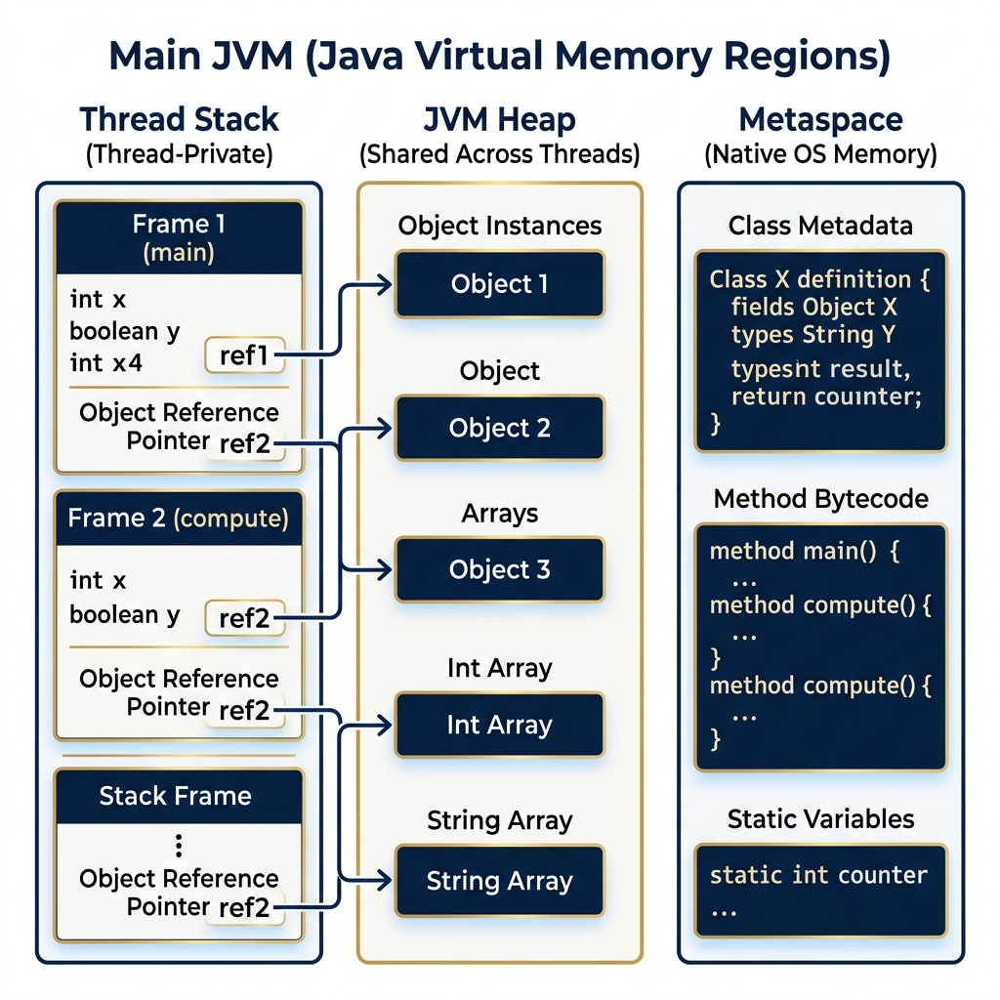
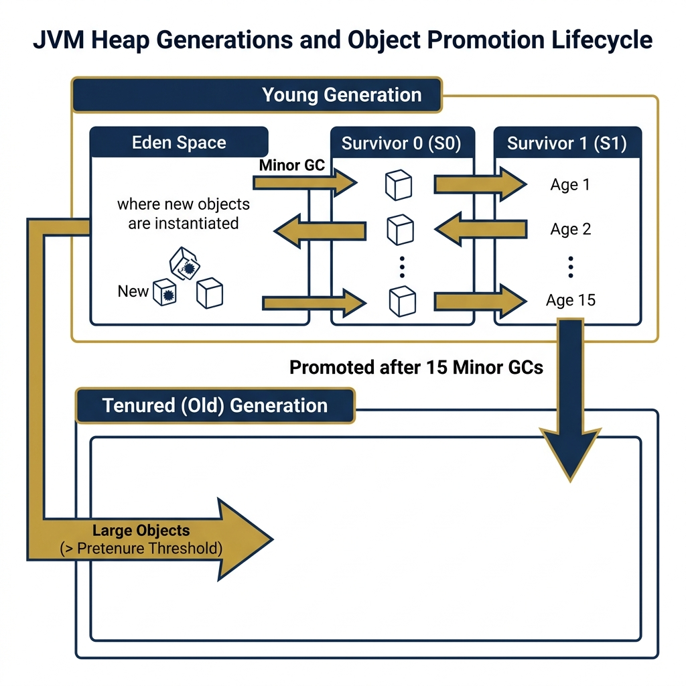

# Designing for Performance and Concurrency

> *"High throughput is achieved not by making code run faster, but by eliminating waiting, contention, and coordination."*


## Concurrency in System Design Interviews

When interviewing for a senior staff or engineering manager role, you will inevitably face questions about system bottlenecks. Typical candidates suggest "adding a cache" or "using multi-threading." 

An interviewer wants to hear about the trade-offs of thread management and database contention. You must be able to detail the trade-offs between **Virtual Threads** (Loom) and **Reactive Programming**, explain why a database connection pool that is too large actually degrades system throughput, and articulate exactly when to use **Optimistic** vs. **Pessimistic Concurrency Control** in high-stakes financial operations.

In this chapter, we explore how AuraPay designs its ledger persistence layers to sustain high-volume transaction throughput without risking data drift or transaction races.


## Concurrency Models: Virtual Threads vs. Reactive

In Java 21+, the JVM introduces **Virtual Threads** (Project Loom). In the past, scaling web applications to handle thousands of concurrent connections required reactive frameworks (e.g., Spring WebFlux, Project Reactor). 

### The Thread-per-Request Model
Historically, web servers mapped one platform thread to one HTTP request. Since platform threads map 1-to-1 with operating system threads, they are expensive. Memory footprints (typically 1MB per thread stack) and operating system context-switching overhead capped JVM throughput at a few thousand concurrent threads.

### The Reactive Approach
Reactive programming solved this by decoupling processing execution from threads. Event loops processed chunks of data asynchronously via non-blocking callbacks. 

*   **Advantage:** Extreme scalability with very low resource utilization.
*   **Disadvantage:** Increased code complexity ("callback hell"), difficult stack traces, and complete incompatibility with standard Java threading tools like `ThreadLocal`.

### The Virtual Thread Revolution
Virtual threads are lightweight threads managed by the JVM rather than the OS. They are mounted onto a small carrier pool of platform threads. When a virtual thread blocks on I/O (e.g., executing a SQL query), the JVM unmounts the virtual thread, parking it, and assigns the carrier thread to another task.

*   **Impact:** You can run millions of virtual threads concurrently while writing standard, synchronous, block-on-write code that is easy to read, debug, and trace.

{width=85%}


## Database Locking: Optimistic vs. Pessimistic

When two concurrent transactions attempt to debit the same ledger account, we must prevent double-debiting and race conditions. This requires strict concurrency control.

### Pessimistic Concurrency Control (PCC)
Pessimistic locking assumes that a conflict is highly likely. It blocks concurrent transactions by locking the records at the database level:

```sql
SELECT * FROM accounts WHERE id = ? FOR UPDATE;
```

*   **Pros:** Guaranteed safety; concurrent transactions wait in line until the lock is released.
*   **Cons:** High lock contention, database thread starvation, and high risk of deadlocks under load.
*   **When to use:** When transaction frequency on a single account (e.g., a corporate merchant account) is extremely high, and you cannot afford transaction retries.

### Optimistic Concurrency Control (OCC)
Optimistic locking assumes conflicts are rare. It allows concurrent threads to read and edit records without blocking. When saving the entity, the engine verifies that the record has not been modified by checking a `version` field.

{width=70%}

The following code illustrates this version-checking implementation:

```java
package com.aurapay.persistence;

import java.math.BigDecimal;
import java.util.Objects;
import java.util.UUID;

/**
 * Represents a database-mapped Ledger Account Entity with versioning for
 * Optimistic Concurrency Control (OCC).
 */
public class AccountEntity {
    private final UUID id;
    private BigDecimal balance;
    private final String currency;
    private long version; // Enforces OCC state check

    public AccountEntity(UUID id, BigDecimal balance, String currency, long version) {
        this.id = Objects.requireNonNull(id);
        this.balance = Objects.requireNonNull(balance);
        this.currency = Objects.requireNonNull(currency);
        this.version = version;
    }

    public UUID getId() { return id; }
    public BigDecimal getBalance() { return balance; }
    public String getCurrency() { return currency; }
    public long getVersion() { return version; }

    public void updateBalance(BigDecimal newBalance) {
        this.balance = Objects.requireNonNull(newBalance);
    }

    public void incrementVersion() {
        this.version++;
    }
}

/**
 * Repository implementation executing the version check update query.
 */
public class DatabaseLedgerRepository {

    /**
     * Updates the account in the database using a strict version-matching query.
     * Throws an exception if another thread modified the record concurrently.
     */
    public void save(AccountEntity account) {
        // Under the hood, this compiles to the SQL query:
        // UPDATE accounts SET balance = ?, version = version + 1 WHERE id = ? AND version = ?;
        String query = "UPDATE accounts SET balance = :balance, version = :version + 1 " +
                       "WHERE id = :id AND version = :version";

        int rowsUpdated = mockExecuteUpdateQuery(query, account);

        // OCC FAILURE CHECK: If no rows were updated, a concurrent transaction modified the version first.
        if (rowsUpdated == 0) {
            throw new OptimisticLockingFailureException(
                String.format("Optimistic lock conflict on account %s. Outdated version: %d", 
                account.getId(), account.getVersion())
            );
        }

        account.incrementVersion();
    }

    private int mockExecuteUpdateQuery(String query, AccountEntity account) {
        // Simulates the DB executing the update. In a real system, the database engine
        // returns 0 if the WHERE clause (matching ID and version) matches no records.
        return 1; // Returns 1 on success, 0 on concurrent modification conflict
    }
}
```


*   **Pros:** High throughput; no database locks are held while executing business logic.
*   **Cons:** If a conflict occurs, one of the transactions fails, forcing the application to catch the exception and retry the entire workflow.
*   **When to use:** In low-to-medium contention systems where write conflicts are rare, maximizing parallel performance.


## Concurrency Control & Locking Matrix

When designing financial ledgers, selecting the right locking paradigm is critical. The following matrix contrasts the three primary concurrency control options:

| Criteria | Optimistic Locking (OCC) | Pessimistic Locking (PCC) | Distributed Locking (e.g., Redis Redlock) |
|---|---|---|---|
| **Mechanism** | Application version check (`WHERE version = ?`) | Database row-level locks (`SELECT FOR UPDATE`) | In-memory distributed key lease |
| **Complexity** | Low (handled natively by ORM/SQL) | Medium (requires managing database locks) | High (requires distributed lock manager infrastructure) |
| **Contention Cost** | Low (no blocking, fails fast) | High (blocking threads waiting for lock) | Medium (spins or rejects requests) |
| **Lock Duration** | Nanoseconds (during DB UPDATE commit) | Milliseconds (entire DB transaction block) | Leased duration (typically 5–30 seconds) |
| **Starvation Risk** | High for hot accounts (constant retries) | Low (threads queue in order) | Medium (depends on retry/backoff settings) |
| **Scale Limits** | Scales with DB capacity | Hard limit based on DB connection pool size | Scales horizontally with distributed key store |
| **Deadlock Risk** | Zero | High (requires strict alphabetical locking of aggregates) | Medium (depends on lock lease expiration / release logic) |


## Caching Patterns & Consistency Deep-Dive

In high-throughput platforms, caching is used to offload read traffic from the primary database. However, introducing a cache creates the classic problem of **cache invalidation**.

### Caching Architectures

1. **Cache-Aside (Recommended for Ledgers):**

   - The application queries the cache first.
   - On a *cache hit*, the application returns the cached data.
   - On a *cache miss*, the application queries the database, writes the result to the cache, and returns it.
2. **Write-Through:**

   - The application writes directly to the cache, and the cache synchronizes that write to the database synchronously.
3. **Write-Behind (Write-Back):**

   - The application writes to the cache. The cache buffers these writes and flushes them to the database asynchronously.
   - **WARNING:** Do not use Write-Behind for financial ledgers. A crash of the cache server before the buffer is flushed results in permanent data loss.

### Cache Invalidation & Race Conditions
When updating the database, the application must invalidate the cache key.

- **Naïve Update:** Modifying the database and then updating the cache value. This introduces a race condition: if two concurrent writes occur, they can write to the database and cache in different orders, leading to stale cache states.
- **Correct Pattern:** Always **delete** the cache key after writing to the database. By deleting the key, you force the next read operation to perform a Cache-Aside query from the source database, guaranteeing consistency.
- **Transactional Safety:** Ensure the cache key deletion occurs inside the database transaction's post-commit hook. If the database transaction rolls back, the cache key must not be deleted.


## Memory Architecture: Thread Stack, Managed Heap, Metaspace, and GC Lifecycle

In enterprise Java systems (such as financial ledgers and trade matching engines), performance optimization requires a precise understanding of how the Java Virtual Machine (JVM) manages memory. High object allocation rates lead to frequent Garbage Collection (GC) pauses, cache misses, and latency spikes.

### The JVM Memory Regions

The JVM divides memory into distinct regions, broadly categorized into thread-private memory (Stack) and shared memory (Heap and Metaspace).

{width=85%}

#### 1. The Thread Stack (Stack Memory)
- **Scope:** Thread-private. Every thread (platform thread or virtual thread) has its own dedicated execution stack.
- **Contents:** Primitive local variables (e.g., `int`, `double`), method parameters, and **object references** (pointers pointing to objects on the Heap).
- **Behavior:** Operates strictly on a Last-In, First-Out (LIFO) stack frame structure. When a method is called, a new stack frame is pushed; when the method returns, the frame is popped.
- **Garbage Collection:** Stack memory is never garbage collected. Allocation and deallocation are instantaneous as stack frames move.

#### 2. The JVM Heap (Heap Memory)
- **Scope:** Shared across all threads in the JVM process.
- **Contents:** All object instances (e.g., `new LedgerAccount()`), arrays, and instance fields of objects.
- **Garbage Collection:** Managed entirely by the automatic Garbage Collector.

#### 3. Metaspace (Native Memory)
- **Scope:** Shared across all threads. Introduced in Java 8 (replacing legacy `PermGen`).
- **Contents:** Class metadata, method bytecodes, the runtime constant pool, and static variables.
- **Memory Source:** Metaspace is allocated out of native OS memory (off-heap RAM), meaning its size is not limited by `-Xmx` (max heap size), though it can be bounded via `-XX:MaxMetaspaceSize`.

---

### Object Storage: What Goes Where?

A common interview question asks candidates to trace where specific variables reside in memory. The following rules govern object placement:

| Variable / Element Type | Memory Location | Explanation |
|---|---|---|
| **Local Primitive** (`int x = 5` inside a method) | **Thread Stack Frame** | Stored directly on the stack frame of the executing thread. |
| **Local Reference Pointer** (`Account acc = new Account()`) | **Thread Stack Frame** | The reference variable `acc` (a 64-bit pointer) lives on the Stack; the actual `Account` object instance lives on the Heap. |
| **Instance Primitive Field** (`private int age` inside `User` class) | **JVM Heap** | Primitive fields declared inside an object instance are stored *inside* the object layout on the Heap. |
| **Instance Reference Field** (`private String name` inside `User`) | **JVM Heap** | The reference field pointer AND the underlying `String` object live on the Heap. |
| **Static Variable** (`public static final int MAX_LIMIT = 100`) | **Metaspace / Class Metadata** | Associated with the class definition in Metaspace. |

---

### The Heap Generations & Object Promotion Lifecycle

To optimize Garbage Collection efficiency, the HotSpot JVM divides the Heap into two main generations based on the **Weak Generational Hypothesis**: *most objects die young (shortly after allocation).*

{width=85%}

#### 1. The Young Generation
The Young Generation is dedicated to newly allocated objects and is divided into three spaces:
- **Eden Space:** The initial landing pad where 99% of new objects are instantiated.
- **Survivor Spaces ($S_0$ / $S_1$ or "From" / "To"):** Two equal-sized spaces used during Minor GC to age surviving objects.

#### 2. The Tenured (Old) Generation
Stores long-lived objects that have survived multiple Minor GC cycles (e.g., Spring singletons, connection pools, long-term domain caches).

---

### The Object Promotion Walkthrough (Step-by-Step)

1. **Instantiation:** When code executes `new Transaction()`, the object is allocated in the **Eden Space**.
2. **Minor GC Triggered:** When Eden fills up, a **Minor GC** occurs. The JVM stops application threads briefly (Stop-The-World pause).
3. **Survivor Move ($S_0$):** Live objects in Eden are copied to $S_0$ (Survivor 0). Dead objects in Eden are abandoned. Eden is wiped clean. The surviving object receives an age counter of `1`.
4. **Survivor Ping-Pong ($S_0 \rightarrow S_1$):** On the next Minor GC, live objects in Eden AND $S_0$ are copied to $S_1$ (Survivor 1). $S_0$ is cleared. The age counter increments to `2`. The roles of $S_0$ and $S_1$ swap.
5. **Promotion to Tenured (Old Gen):** When an object's age counter reaches the **Tenuring Threshold** (default `-XX:MaxTenuringThreshold=15` in HotSpot), the object is promoted to the **Tenured (Old) Generation**.
6. **Pretenure Bypass:** Exceptionally large objects (e.g., massive byte arrays exceeding `-XX:PretenureSizeThreshold`) bypass the Young Generation entirely and are allocated directly in the Old Generation to prevent expensive copying across Survivor spaces.

---

### Impact on High-Performance Systems

- **Minor GC vs. Major/Full GC:** Minor GCs clear the Young Gen in sub-milliseconds. Major/Full GCs inspect the Old Gen and Metaspace, causing longer STW pauses that degrade real-time throughput.
- **Zero-Allocation Programming:** In high-frequency matching engines (ZenithTrade), developers pre-allocate reusable object pools to achieve zero allocations in the hot path, preventing Eden from filling up and completely eliminating Minor GC pauses.


## CPU Cache Locality (L1/L2/L3) in HFT Matching Loops

In ultra-low-latency matching engines (like ZenithTrade), garbage collection pauses and CPU cache misses are the primary bottlenecks. To write code that runs in the microsecond range, you must design for **cache locality**:

- **The Problem with Linked Lists:** A standard `LinkedList` contains nodes linked by memory references. These references can be scattered randomly across heap memory. When the CPU traverses a linked list to match orders, it incurs constant **L1/L2/L3 cache misses**, forcing the CPU to fetch data from physical RAM, which is up to 200 times slower than L1 cache.
- **The Array/Contiguous Layout:** To minimize cache misses, the matching loop must use contiguous memory structures. By storing orders in flat array layouts or utilizing pre-allocated object pools, the CPU can load adjacent elements into L1/L2 cache pre-emptively, accelerating execution speed.


## Connection Pool Sizing: The HikariCP Formula

A common design flaw is over-allocating database connection pool sizes. If you have 500 thread workers, candidates often set the connection pool size to 500.

**The Pitfall:** A database engine is limited by physical resources (CPU cores, disk write I/O speed, memory). When hundreds of threads attempt to execute database operations concurrently, the database server spends more time performing CPU context switches than executing queries.

HikariCP (the industry-standard connection pool manager) uses a formula derived from PostgreSQL benchmark testing to size database pools:

$$Pool\ Size = (Core\ Count \times 2) + Effective\ Spindle\ Count$$

For example, a database server with 8 CPU cores and an SSD array (spindle count of 1) should have a pool size of:

$$(8 \times 2) + 1 = 17\ Connections$$

Setting the pool size to 17 will yield *higher* overall throughput than setting it to 100, due to the minimization of CPU context switching and disk spindle thrashing.

{width=85%}

> **Why is it called "Hikari"?** The name is not a person — **Hikari (光)** is the Japanese word for **"light."** Creator Brett Wooldridge was working in Japan when he built it, frustrated by the bloat and slowness of existing connection pools (C3P0, DBCP, BoneCP). He designed HikariCP to be *light* in weight (~130KB jar, zero dependencies), *light* in speed (fastest JDBC pool ever benchmarked), and *light* in complexity. His obsession with zero-overhead engineering — using `ConcurrentBag` instead of `LinkedBlockingQueue` to eliminate lock contention, and a custom `FastList` to skip array bounds checks — made it so fast that Spring Boot adopted it as the **default connection pool** starting in version 2.0 (2018). Today, if you add `spring-boot-starter-data-jpa` to your project, HikariCP is already running under the hood. Fun fact: Japan's famous bullet train (Shinkansen) has a service tier called *Hikari* — the name fits perfectly.


> ⭐ **STAR Moment: The Cache Invalidation Design**
> 
> When discussing performance during an interview, never say *"We will add a cache."* Say: *"We will implement a Cache-Aside pattern using Redis. To prevent stale reads in our double-entry ledger, we will use a transactional write-through strategy, invalidating cache keys atomically inside the database commit boundary to ensure absolute consistency."* This shows you understand caching boundaries in financial transaction systems.
