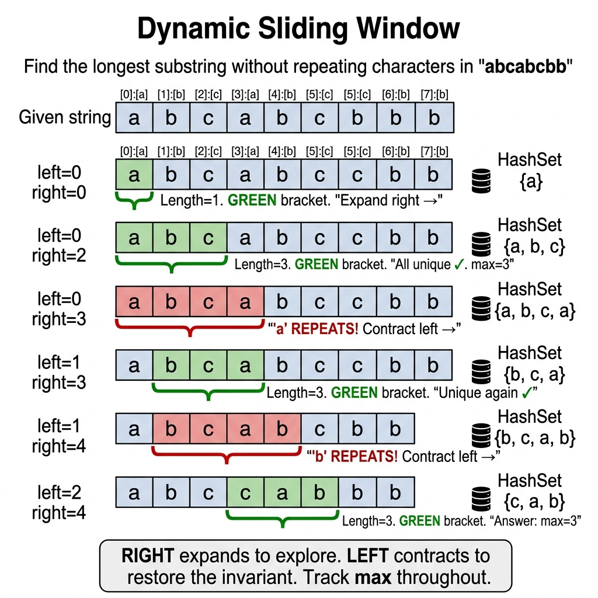
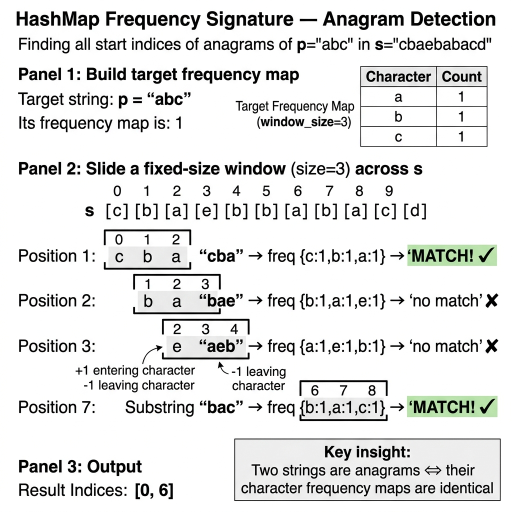

# Medium-Hard-tier Mastery — Dynamic Sliding Windows, HashMap Frequency Signatures, and Prefix Sum Analytics

> **The Window Contract:** Every sliding window problem has a hidden invariant — a *contract* that defines when the window is valid. In Chapter 10, the window was implicit (two pointers). Here, the window becomes explicit: a `left..right` range with a HashMap frequency signature that must satisfy a constraint (e.g., "at most $k$ distinct characters"). Define this contract before coding, then expand `right` to explore and contract `left` to restore validity. At production scale, this same pattern powers rate limiters (Chapter 17, Solution 3) and streaming aggregation pipelines.

## Essential Terminology & Vocabulary

**Dynamic Sliding Window**
A technique where a window expands to the right to include elements and contracts from the left when a specific invariant or constraint is violated. It matters because it optimizes $\mathcal{O}(N^2)$ brute-force subarray checks into $\mathcal{O}(N)$ operations by avoiding redundant recalculations. Use when searching for the longest/shortest contiguous subarray satisfying a condition.

{width=85%}

**Fixed-Size Sliding Window vs Dynamic Sliding Window**

| Feature | Fixed-Size Window | Dynamic Sliding Window |
|:-----------------|:--------------------------------------------|:--------------------------------------------|
| **Window Size** | Constant (e.g., length K). | Variable (expands and contracts). |
| **Movement** | Move both left and right pointers together. | Move right continuously, move left only to fix invariants. |
| **Use Case** | Anagrams in a fixed window, max sum of K elements. | Longest substring with K distinct chars, minimum subarray sum. |

**HashMap Frequency Signature**
Creating a unique key for a group of items (like anagrams) based on their character frequencies rather than sorting. Usually represented as a mapped string of an `int[26]` array. This avoids the $\mathcal{O}(N \log N)$ sorting cost, providing an $\mathcal{O}(N)$ way to group items.

{width=85%}

**Prefix Sum Array & Cumulative Matching**
An array where `pref[i]` stores the sum of elements from index $0$ to $i$. The trick `pref[j] - pref[i] = K` allows finding a subarray sum $K$ in $\mathcal{O}(1)$ time by rearranging to `pref[i] = pref[j] - K` and looking up previously seen prefix sums.

**Prefix Sum with HashMap**
A pattern combining prefix sums with a HashMap to count the occurrences of each prefix sum. This allows counting how many subarrays sum to a specific value $K$ in $\mathcal{O}(N)$ time.

**Two-Pointer for Sorted Arrays**
Using two pointers, usually starting at the beginning and end of a sorted array, that converge towards the middle. Used to find pairs summing to a target in $\mathcal{O}(N)$ time without extra space.

**Interval Merging and Insertion**
Sorting a collection of intervals by start time and iterating through them to combine overlapping ranges (where `current.start <= previous.end`). 

**Monotonic Stack/Queue**
A data structure that maintains elements in a strictly increasing or decreasing order. Useful for finding the "next greater element" or managing the maximum/minimum in a sliding window in $\mathcal{O}(N)$ time.

**Character Frequency Signature**
Using a fixed-size array (like `int[26]` for lowercase English letters) to count character occurrences. By converting this array to a string (or checking array equality), it acts as a canonical $\mathcal{O}(1)$ space key for anagrams.

**Modular Arithmetic in Prefix Sums**
Using the modulo operator with prefix sums. If `pref[i] % K == pref[j] % K`, then the subarray between $i$ and $j$ has a sum divisible by $K$.

### 'At Most K' to 'Exactly K' Reduction & Monotonicity Proof

Why cannot a standard two-pointer sliding window directly count subarrays with **exactly** $K$ distinct elements?

- **Monotonicity Violation:** As window $[L, R]$ expands ($R++$), the count of distinct elements is **monotonically non-decreasing**. But the property "distinct count $== K$" is **non-monotonic** — expanding $R$ might temporarily keep it equal to $K$, or increase it to $K+1$. Contracting $L$ can decrease it back to $K$.
- Because validity is not monotonic, a single window cannot decide when to shrink without missing valid subarrays.

#### The Dual-Window Mathematical Reduction
Instead, we express the problem using cumulative monotonic predicates:
$$\text{Exactly}(K) \equiv \text{AtMost}(K) - \text{AtMost}(K - 1)$$

- $\text{AtMost}(K)$: "Subarrays with $\le K$ distinct elements" is **strictly monotonic**. If window $[L, R]$ has $\le K$ distinct elements, then **every** subarray ending at $R$ starting from any index $j \in [L, R]$ also has $\le K$ distinct elements.
- Number of valid subarrays added at step $R$:
  $$\Delta = R - L + 1$$

- Computing $\text{AtMost}(K)$ and $\text{AtMost}(K-1)$ requires two pure monotonic $\mathcal{O}(N)$ passes, yielding the exact answer in $\mathcal{O}(N)$ time and $\mathcal{O}(K)$ space.

### Negative Modulo Arithmetic in Prefix Sums

When finding subarrays whose sum is divisible by $K$ ($\sum_{m=i+1}^j A[m] \equiv 0 \pmod K$), we look for identical prefix remainders:
$$\text{pref}[j] \equiv \text{pref}[i] \pmod K \implies (\text{pref}[j] - \text{pref}[i]) \pmod K == 0$$

#### The Negative Remainder Trap
In languages like Java, C#, and C++, the `%` operator is the **remainder operator**, not the mathematical modulo operator:
$$-7 \mathbin{\%} 5 = -2 \quad (\text{mathematical modulo should be } +3, \text{ since } -7 = -2 \times 5 + 3)$$

If $\text{pref}[i] = -2$ and $\text{pref}[j] = 3$, their difference is $3 - (-2) = 5$ (divisible by 5). But looking up $-2$ in a remainder map will fail to match $+3$!

**The Canonical Non-Negative Modulo Formula:**
$$\text{mod} = ((\text{pref} \mathbin{\%} K) + K) \mathbin{\%} K$$

- If $\text{pref} = -7, K = 5$: $(-7 \mathbin{\%} 5) = -2 \implies (-2 + 5) \mathbin{\%} 5 = 3 \mathbin{\%} 5 = 3$. Correctly normalizes all remainders into the closed domain $[0, K-1]$.

### Index Negation Trick
This technique marks elements as 'seen' by negating the value at the corresponding index, such as `nums[abs(val)-1] = -nums[abs(val)-1]`. It only works for array values bounded within the range `[1, N]`.
Why it matters: It provides O(1) space duplicate or missing element detection without using extra data structures.

### Cyclic Sort / Index Placement
This sorting pattern places each value `v` precisely at its correct target index `nums[v-1]`. It continuously swaps elements until the current position holds the correct value.
Why it matters: It is the optimal strategy to find the first missing positive integer in O(N) time and O(1) space.

### Expand-Around-Center
This technique treats each index (and the space between indices) as a potential palindrome center. It then expands outwards as long as the mirrored characters match.
Why it matters: It is a O(N²) approach for the longest palindromic substring problem.

### Frequency Bucket Sort
This sorting alternative groups elements by their frequency into buckets ranging from `0` to `N`. You then scan these buckets in reverse order to collect the most frequent items.
Why it matters: It solves Top-K frequent elements problems in O(N) time without requiring a heap.

### Deferred Deletion / Lazy Invalidation
Instead of immediately removing items from a data structure, this technique marks entries as invalid. The actual cleanup happens later during traversal or retrieval.
Why it matters: It avoids ConcurrentModificationExceptions and eliminates priority queue update overhead.

### Combinatorial Contribution Counting

Instead of iterating through all $\mathcal{O}(N^2)$ possible subarrays to compute sum of subarray minimums/maximums, calculate the total contribution of each element $A[i]$ directly.

#### The Combinatorial Invariant
Let $L$ be the index of the **Strictly Previous Smaller Element** ($A[L] < A[i]$).
Let $R$ be the index of the **Next Smaller or Equal Element** ($A[R] \le A[i]$).

```text
Subarray Range where A[i] is the Minimum:
[ ... L ] <--- choices for start index ---> [ i ] <--- choices for end index ---> [ R ... ]
```

- Number of valid subarray start indices: $(i - L)$ (any index from $L+1$ to $i$).
- Number of valid subarray end indices: $(R - i)$ (any index from $i$ to $R-1$).
- Total subarrays where $A[i]$ is the minimum:
  $$\text{Count}(i) = (i - L) \times (R - i)$$

- Total contribution to answer:
  $$\text{Contribution}(i) = A[i] \times (i - L) \times (R - i)$$

Using a Monotonic Stack to find $L$ and $R$ for all elements in $\mathcal{O}(N)$ transforms an intractable $\mathcal{O}(N^2)$ problem into an elegant single pass.

### Greedy Interval Scheduling
This algorithm sorts given intervals by their end times first. It then greedily picks the next non-overlapping interval to maximize total count.
Why it matters: It is a provably optimal approach for finding the maximum number of non-overlapping intervals.

## Reusable Code Templates

### Template A: Dynamic Sliding Window
```java
int left = 0, maxLen = 0;
for (int right = 0; right < arr.length; right++) {
    // 1. Add arr[right] to window state
    while (/* window state violates invariant */) {
        // 2. Remove arr[left] from window state
        left++;
    }
    // 3. Update maxLen or minLen
    maxLen = Math.max(maxLen, right - left + 1);
}
```

### Template B: Fixed-Size Sliding Window
```java
int k = 3, sum = 0, max = 0;
for (int i = 0; i < arr.length; i++) {
    sum += arr[i]; // Add current element
    if (i >= k - 1) {
        max = Math.max(max, sum); // Update result
        sum -= arr[i - (k - 1)];  // Remove leftmost element for next iteration
    }
}
```

### Template C: Prefix Sum + HashMap Counter
```java
Map<Integer, Integer> map = new HashMap<>();
map.put(0, 1); // Base case for subarrays starting at index 0
int sum = 0, count = 0;
for (int num : nums) {
    sum += num;
    if (map.containsKey(sum - k)) {
        count += map.get(sum - k);
    }
    map.put(sum, map.getOrDefault(sum, 0) + 1);
}
```

### Template D: HashMap Frequency Grouping
```java
Map<String, List<String>> map = new HashMap<>();
for (String s : strs) {
    int[] count = new int[26];
    for (char c : s.toCharArray()) count[c - 'a']++;
    String key = Arrays.toString(count);
    map.putIfAbsent(key, new ArrayList<>());
    map.get(key).add(s);
}
```


## Solved Exemplar Problems

**1. Longest Substring Without Repeating Characters**
**Specification:** Given a string, find the length of the longest substring without repeating characters.

**Example:** `s = "abcabcbb"` -> Output: `3` ("abc")

**Pattern:** Dynamic Sliding Window + HashMap

**Explanation:** We expand the right pointer. If the character is in the set, we contract the left pointer until the duplicate is removed, ensuring the window always contains unique characters.
```java
public int lengthOfLongestSubstring(String s) {
    Set<Character> set = new HashSet<>();
    int left = 0, max = 0;
    for (int right = 0; right < s.length(); right++) {
        // Contract if duplicate found
        while (set.contains(s.charAt(right))) {
            set.remove(s.charAt(left++));
        }
        set.add(s.charAt(right)); // Add current char
        max = Math.max(max, right - left + 1);
    }
    return max;
}
// Time Complexity: O(N) | Space Complexity: O(min(N, M))
```


* * *

**2. Subarray Sum Equals K**
**Specification:** Find the total number of continuous subarrays whose sum equals to K.

**Example:** `nums = [1,1,1], k = 2` -> Output: `2`

**Pattern:** Prefix Sum + HashMap

**Explanation:** We maintain a running sum. If `sum - k` exists in our frequency map, it means there is a subarray ending at the current index that sums to K.
```java
public int subarraySum(int[] nums, int k) {
    Map<Integer, Integer> map = new HashMap<>();
    map.put(0, 1); // Base case
    int sum = 0, count = 0;
    for (int num : nums) {
        sum += num;
        // Check if required prefix exists
        if (map.containsKey(sum - k)) count += map.get(sum - k);
        map.put(sum, map.getOrDefault(sum, 0) + 1);
    }
    return count;
}
// Time Complexity: O(N) | Space Complexity: O(N)
```


* * *

**3. Group Anagrams**
**Specification:** Group strings that are anagrams of each other.

**Example:** `["eat", "tea", "tan", "ate", "nat", "bat"]`  
$\to$ Output: `[["bat"], ["nat", "tan"], ["ate", "eat", "tea"]]`

**Pattern:** HashMap Frequency Signature

**Explanation:** Generate a 26-element character count array for each string, convert it to a string key, and use it in a HashMap to group anagrams together.
```java
public List<List<String>> groupAnagrams(String[] strs) {
    Map<String, List<String>> map = new HashMap<>();
    for (String s : strs) {
        int[] count = new int[26];
        for (char c : s.toCharArray()) count[c - 'a']++; // Build signature
        String key = Arrays.toString(count);
        map.computeIfAbsent(key, k -> new ArrayList<>()).add(s);
    }
    return new ArrayList<>(map.values());
}
// Time Complexity: O(N * L) | Space Complexity: O(N * L)
```


* * *

**4. Find All Anagram Start Indices**
**Specification:** Find all start indices of p's anagrams in s.

**Example:** `s = "cbaebabacd", p = "abc"` -> Output: `[0, 6]`

**Pattern:** Fixed-Size Sliding Window + Frequency Array

**Explanation:** Use a window of size `p.length()`. Keep arrays of character frequencies for `p` and the current window in `s`. If they match, add the index.
```java
public List<Integer> findAnagrams(String s, String p) {
    List<Integer> res = new ArrayList<>();
    if (s.length() < p.length()) return res;
    int[] pCount = new int[26], sCount = new int[26];
    for (char c : p.toCharArray()) pCount[c - 'a']++;
    for (int i = 0; i < s.length(); i++) {
        sCount[s.charAt(i) - 'a']++;
        if (i >= p.length()) sCount[s.charAt(i - p.length()) - 'a']--; // Contract
        if (Arrays.equals(pCount, sCount)) res.add(i - p.length() + 1); // Match
    }
    return res;
}
// Time Complexity: O(N) | Space Complexity: O(1)
```


* * *

**5. Longest Substring with At Most K Distinct Characters**
**Specification:** Find the length of the longest substring with at most K distinct characters.

**Example:** `s = "eceba", k = 2` -> Output: `3` ("ece")

**Pattern:** Dynamic Sliding Window

**Explanation:** Use a HashMap to track character frequencies. When map size exceeds K, shrink window from left until size is K again.
```java
public int lengthOfLongestSubstringKDistinct(String s, int k) {
    Map<Character, Integer> map = new HashMap<>();
    int left = 0, max = 0;
    for (int right = 0; right < s.length(); right++) {
        char c = s.charAt(right);
        map.put(c, map.getOrDefault(c, 0) + 1);
        while (map.size() > k) { // Invariant broken
            char leftChar = s.charAt(left++);
            map.put(leftChar, map.get(leftChar) - 1);
            if (map.get(leftChar) == 0) map.remove(leftChar);
        }
        max = Math.max(max, right - left + 1);
    }
    return max;
}
// Time Complexity: O(N) | Space Complexity: O(K)
```


* * *

**6. Minimum Window Substring (Hard)**

> [!IMPORTANT]
> **Assessment Strategy Note:** Minimum Window Substring requires managing two frequency maps and a `formed` character counter. In a 70-minute assessment, if this appears as Question 3 or 4, establish your two-pointer expanding/contracting invariant in comments first before coding to secure partial credit.

**Specification:** Given strings s and t, find the minimum substring of s containing all characters in t.

**Example:** `s = "ADOBECODEBANC", t = "ABC"` -> Output: `"BANC"`

**Pattern:** Dynamic Sliding Window

**Explanation:** Maintain a frequency map targetMap for string t and a dynamic window map windowMap. Track formed—the number of unique characters in t whose target frequency is met in the current window. Expand right until formed == targetMap.size(). Then contract left step-by-step to record the minimal valid window length, updating windowMap and decrementing formed when a required character count drops below target.
```java
public String minWindow(String s, String t) {
    int[] map = new int[128];
    for (char c : t.toCharArray()) map[c]++;
    int left = 0, count = t.length(), minLen = Integer.MAX_VALUE, minStart = 0;
    for (int right = 0; right < s.length(); right++) {
        if (map[s.charAt(right)]-- > 0) count--; // Found required char
        while (count == 0) { // All chars found
            if (right - left + 1 < minLen) {
                minLen = right - left + 1;
                minStart = left;
            }
            if (++map[s.charAt(left++)] > 0) count++; // Removed required char
        }
    }
    return minLen == Integer.MAX_VALUE ? "" : s.substring(minStart, minStart + minLen);
}
// Time Complexity: O(N) | Space Complexity: O(1)
```


* * *

**7. Group Shifted Strings**
**Specification:** Group strings that can be formed by shifting characters uniformly.

**Example:** `["abc", "bcd", "acef", "xyz", "az", "ba", "a", "z"]` -> Output groups `["abc","bcd","xyz"]`, etc.

**Pattern:** Difference-Based Signature

**Explanation:** Compute the normalized relative distance between adjacent characters using (s.charAt(i) - s.charAt(i-1) + 26) % 26. The resulting sequence of difference offsets forms a canonical HashMap key that groups all uniformly shifted strings together.
```java
public List<List<String>> groupStrings(String[] strings) {
    Map<String, List<String>> map = new HashMap<>();
    for (String s : strings) {
        StringBuilder key = new StringBuilder();
        for (int i = 1; i < s.length(); i++) {
            int diff = (s.charAt(i) - s.charAt(i-1) + 26) % 26; // Circular difference
            key.append(diff).append(",");
        }
        map.computeIfAbsent(key.toString(), k -> new ArrayList<>()).add(s);
    }
    return new ArrayList<>(map.values());
}
// Time Complexity: O(N * L) | Space Complexity: O(N * L)
```


* * *

**8. Contiguous Array Equal 0s and 1s**
**Specification:** Find the maximum length of a contiguous subarray with an equal number of 0s and 1s.

**Example:** `[0, 1, 0]` -> Output: `2`

**Pattern:** Prefix Sum (+1/-1 trick)

**Explanation:** Treat 0s as -1. If the running sum is seen again, it means the subarray between those two indices sums to 0, implying equal 0s and 1s.
```java
public int findMaxLength(int[] nums) {
    Map<Integer, Integer> map = new HashMap<>();
    map.put(0, -1);
    int sum = 0, max = 0;
    for (int i = 0; i < nums.length; i++) {
        sum += nums[i] == 0 ? -1 : 1; // Map 0 to -1
        if (map.containsKey(sum)) {
            max = Math.max(max, i - map.get(sum));
        } else {
            map.put(sum, i); // Store first occurrence
        }
    }
    return max;
}
// Time Complexity: O(N) | Space Complexity: O(N)
```


* * *

**9. Subarray Product Less Than K**
**Specification:** Count contiguous subarrays where the product is strictly less than K.

**Example:** `nums = [10,5,2,6], k = 100` -> Output: `8`

**Pattern:** Dynamic Sliding Window

**Explanation:** Maintain a running product. If product >= k, shrink from left. Number of valid subarrays ending at `right` is `right - left + 1`.
```java
public int numSubarrayProductLessThanK(int[] nums, int k) {
    if (k <= 1) return 0;
    int prod = 1, left = 0, count = 0;
    for (int right = 0; right < nums.length; right++) {
        prod *= nums[right];
        while (prod >= k) prod /= nums[left++]; // Shrink
        count += right - left + 1; // Add valid subarrays
    }
    return count;
}
// Time Complexity: O(N) | Space Complexity: O(1)
```


* * *

**10. Permutation in String**
**Specification:** Return true if s2 contains a permutation of s1.

**Example:** `s1 = "ab", s2 = "eidbaooo"` -> Output: `true`

**Pattern:** Fixed-Size Window Frequency Match

**Explanation:** Same logic as Anagram Start Indices. Maintain a window of size `s1.length()` and compare character counts.
```java
public boolean checkInclusion(String s1, String s2) {
    if (s1.length() > s2.length()) return false;
    int[] s1map = new int[26], s2map = new int[26];
    for (char c : s1.toCharArray()) s1map[c - 'a']++;
    for (int i = 0; i < s2.length(); i++) {
        s2map[s2.charAt(i) - 'a']++;
        if (i >= s1.length()) s2map[s2.charAt(i - s1.length()) - 'a']--;
        if (Arrays.equals(s1map, s2map)) return true;
    }
    return false;
}
// Time Complexity: O(N) | Space Complexity: O(1)
```


* * *

**11. Maximum Erasure Value**
**Specification:** Find the maximum score (sum) from a subarray of unique elements.

**Example:** `nums = [4,2,4,5,6]` -> Output: `17`

**Pattern:** Dynamic Sliding Window + HashSet

**Explanation:** Use a set to track uniqueness. Expand right, add to sum. If duplicate found, shrink from left, subtracting from sum until unique.
```java
public int maximumUniqueSubarray(int[] nums) {
    Set<Integer> set = new HashSet<>();
    int sum = 0, max = 0, left = 0;
    for (int right = 0; right < nums.length; right++) {
        while (set.contains(nums[right])) {
            set.remove(nums[left]);
            sum -= nums[left++]; // Remove duplicate
        }
        set.add(nums[right]);
        sum += nums[right];
        max = Math.max(max, sum);
    }
    return max;
}
// Time Complexity: O(N) | Space Complexity: O(N)
```


* * *

**12. Longest Repeating Character Replacement**
**Specification:** Longest substring of same letters after replacing at most k chars.

**Example:** `s = "AABABBA", k = 1` -> Output: `4`

**Pattern:** Window with Max Frequency Tracking

**Explanation:** If `window size - max_freq_char_count > k`, we have too many differing chars, so we shrink the window.
```java
public int characterReplacement(String s, int k) {
    int[] count = new int[26];
    int maxCount = 0, left = 0, maxLen = 0;
    for (int right = 0; right < s.length(); right++) {
        maxCount = Math.max(maxCount, ++count[s.charAt(right) - 'A']);
        if (right - left + 1 - maxCount > k) { // Invalid window
            count[s.charAt(left++) - 'A']--;
        }
        maxLen = Math.max(maxLen, right - left + 1);
    }
    return maxLen;
}
// Time Complexity: O(N) | Space Complexity: O(1)
```


* * *

**13. Fruit Into Baskets**
**Specification:** Max fruit collected with 2 baskets (equivalent to max substring with <= 2 distinct characters).

**Example:** `[1,2,3,2,2]` -> Output: `4`

**Pattern:** Dynamic Sliding Window

**Explanation:** Keep a frequency map. When distinct fruit types exceed 2, increment left pointer to shrink.
```java
public int totalFruit(int[] fruits) {
    Map<Integer, Integer> count = new HashMap<>();
    int left = 0, max = 0;
    for (int right = 0; right < fruits.length; right++) {
        count.put(fruits[right], count.getOrDefault(fruits[right], 0) + 1);
        while (count.size() > 2) {
            count.put(fruits[left], count.get(fruits[left]) - 1);
            if (count.get(fruits[left]) == 0) count.remove(fruits[left]);
            left++;
        }
        max = Math.max(max, right - left + 1);
    }
    return max;
}
// Time Complexity: O(N) | Space Complexity: O(1)
```


* * *

**14. Continuous Subarray Sum Multiple of K**
**Specification:** Check if a subarray of length >= 2 has a sum multiple of K.

**Example:** `nums = [23,2,4,6,7], k = 6` -> Output: `true`

**Pattern:** Prefix Sum Modular Math

**Explanation:** If `pref[i] % k == pref[j] % k`, the sum between $i$ and $j$ is a multiple of $K$. Store remainder and its first seen index.
```java
public boolean checkSubarraySum(int[] nums, int k) {
    Map<Integer, Integer> map = new HashMap<>();
    map.put(0, -1);
    int sum = 0;
    for (int i = 0; i < nums.length; i++) {
        sum += nums[i];
        int mod = k == 0 ? sum : ((sum % k) + k) % k;
        if (map.containsKey(mod)) {
            if (i - map.get(mod) > 1) return true; // Length >= 2
        } else {
            map.put(mod, i);
        }
    }
    return false;
}
// Time Complexity: O(N) | Space Complexity: O(min(N, K))
```


* * *

**15. Max Consecutive Ones III**
**Specification:** Longest contiguous 1s after flipping at most K zeros.

**Example:** `nums = [1,1,1,0,0,0,1,1,1,1,0], k = 2` -> Output: `6`

**Pattern:** Window with Zero-Flip Budget

**Explanation:** Expand window. If 0 encountered, decrease K. If K < 0, shrink window until a 0 is excluded.
```java
public int longestOnes(int[] nums, int k) {
    int left = 0;
    for (int right = 0; right < nums.length; right++) {
        if (nums[right] == 0) k--;
        if (k < 0) { // Over budget
            if (nums[left++] == 0) k++;
        }
    }
    return nums.length - left; // Trick to return max valid length seen
}
// Time Complexity: O(N) | Space Complexity: O(1)
```


* * *

**16. Find All Duplicates in Array**
**Specification:** Find elements appearing twice in an array containing integers in range [1, n].

**Example:** `[4,3,2,7,8,2,3,1]` -> Output: `[2,3]`

**Pattern:** Index Negation Trick

**Explanation:** Use the array itself as a hash table. Mark the number at index `abs(num) - 1` negative. If it's already negative, it's a duplicate.
```java
public List<Integer> findDuplicates(int[] nums) {
    List<Integer> res = new ArrayList<>();
    for (int num : nums) {
        int idx = Math.abs(num) - 1;
        if (nums[idx] < 0) res.add(Math.abs(num)); // Found duplicate
        else nums[idx] = -nums[idx]; // Mark seen
    }
    return res;
}
// Time Complexity: O(N) | Space Complexity: O(1)
```


* * *

**17. Task Scheduler CPU Units**
**Specification:** Minimum CPU intervals to finish tasks given a cooldown of `n` between identical tasks.

**Example:** `tasks = ["A","A","A","B","B","B"], n = 2` -> Output: `8`

**Pattern:** Frequency Math

**Explanation:** Calculate idle slots based on the most frequent task. `maxIdle = (maxFreq - 1) * n`. Fill slots with other tasks.
```java
public int leastInterval(char[] tasks, int n) {
    int[] count = new int[26];
    int max = 0, maxCount = 0;
    for (char c : tasks) {
        count[c - 'A']++;
        if (count[c - 'A'] == max) maxCount++;
        else if (count[c - 'A'] > max) { max = count[c - 'A']; maxCount = 1; }
    }
    int emptySlots = (max - 1) * (n - (maxCount - 1));
    int availableTasks = tasks.length - max * maxCount;
    int idles = Math.max(0, emptySlots - availableTasks);
    return tasks.length + idles;
}
// Time Complexity: O(N) | Space Complexity: O(1)
```


* * *

**18. Insert & Merge Overlapping Intervals**
**Specification:** Insert a new interval into a sorted list and merge if necessary.

**Example:** `[[1,3],[6,9]], new = [2,5]` -> Output: `[[1,5],[6,9]]`

**Pattern:** Interval Merging

**Explanation:** Three phases: Add all before new, merge overlapping with new, add all after new.
```java
public int[][] insert(int[][] intervals, int[] newInterval) {
    List<int[]> res = new ArrayList<>();
    int i = 0, n = intervals.length;
    while (i < n && intervals[i][1] < newInterval[0]) res.add(intervals[i++]); // Before
    while (i < n && intervals[i][0] <= newInterval[1]) { // Merge
        newInterval[0] = Math.min(newInterval[0], intervals[i][0]);
        newInterval[1] = Math.max(newInterval[1], intervals[i][1]);
        i++;
    }
    res.add(newInterval);
    while (i < n) res.add(intervals[i++]); // After
    return res.toArray(new int[res.size()][]);
}
// Time Complexity: O(N) | Space Complexity: O(N)
```


* * *

**19. Top K Frequent Elements**
**Specification:** Return the K most frequent elements.

**Example:** `nums = [1,1,1,2,2,3], k = 2` -> Output: `[1,2]`

**Pattern:** HashMap + Min-Heap

**Explanation:** Count frequencies in a map, then keep a min-heap of size K based on frequencies.
```java
public int[] topKFrequent(int[] nums, int k) {
    Map<Integer, Integer> count = new HashMap<>();
    for (int n : nums) count.put(n, count.getOrDefault(n, 0) + 1);
    PriorityQueue<Integer> heap = new PriorityQueue<>((a, b) -> count.get(a) - count.get(b));
    for (int n : count.keySet()) {
        heap.add(n);
        if (heap.size() > k) heap.poll(); // Keep size K
    }
    return heap.stream().mapToInt(i -> i).toArray();
}
// Time Complexity: O(N log K) | Space Complexity: O(N)
```


* * *

**20. First Missing Positive Integer**
**Specification:** Find the smallest missing positive integer in an unsorted array.

**Example:** `[3,4,-1,1]` -> Output: `2`

**Pattern:** Cyclic Sort (Index placement)

**Explanation:** Place number `x` at index `x-1`. Then scan to find the first index that doesn't have `i+1`.
```java
public int firstMissingPositive(int[] nums) {
    int i = 0;
    while (i < nums.length) {
        // Swap to correct position if valid
        if (nums[i] > 0 && nums[i] <= nums.length && nums[nums[i] - 1] != nums[i]) {
            int temp = nums[nums[i] - 1];
            nums[nums[i] - 1] = nums[i];
            nums[i] = temp;
        } else {
            i++;
        }
    }
    for (i = 0; i < nums.length; i++) {
        if (nums[i] != i + 1) return i + 1; // Missing
    }
    return nums.length + 1;
}
// Time Complexity: O(N) | Space Complexity: O(1)
```


* * *

**21. Minimum Size Subarray Sum**
**Specification:** Min length of subarray with sum >= target.

**Example:** `target = 7, nums = [2,3,1,2,4,3]` -> Output: `2`

**Pattern:** Dynamic Window with Target Sum

**Explanation:** Keep expanding until sum >= target, then shrink to find minimum.
```java
public int minSubArrayLen(int target, int[] nums) {
    int left = 0, sum = 0, min = Integer.MAX_VALUE;
    for (int right = 0; right < nums.length; right++) {
        sum += nums[right];
        while (sum >= target) {
            min = Math.min(min, right - left + 1);
            sum -= nums[left++];
        }
    }
    return min == Integer.MAX_VALUE ? 0 : min;
}
// Time Complexity: O(N) | Space Complexity: O(1)
```


* * *

**22. Substring with Concatenation of All Words**
**Specification:** Find starting indices of substrings that are a concatenation of all words in an array exactly once.

**Example:** `s = "barfoothefoobarman", words = ["foo","bar"]` -> Output: `[0, 9]`

**Pattern:** Fixed-Size Window with Inner HashMap

**Explanation:** Use a map for word counts. Slide a window of length `words.length * wordLen` and verify word counts inside.
```java
public List<Integer> findSubstring(String s, String[] words) {
    List<Integer> res = new ArrayList<>();
    if (s.isEmpty() || words.length == 0) return res;
    int wordLen = words[0].length(), totalLen = wordLen * words.length;
    Map<String, Integer> counts = new HashMap<>();
    for (String w : words) counts.put(w, counts.getOrDefault(w, 0) + 1);
    
    for (int i = 0; i <= s.length() - totalLen; i++) {
        Map<String, Integer> seen = new HashMap<>();
        int j = 0;
        while (j < words.length) {
            String w = s.substring(i + j * wordLen, i + (j + 1) * wordLen);
            if (counts.containsKey(w)) {
                seen.put(w, seen.getOrDefault(w, 0) + 1);
                if (seen.get(w) > counts.get(w)) break;
            } else break;
            j++;
        }
        if (j == words.length) res.add(i);
    }
    return res;
}
// Time Complexity: O(N * M * L) | Space Complexity: O(M)
```


* * *

**23. Contains Duplicate II**
**Specification:** Check if array has duplicates within distance k.

**Example:** `[1,2,3,1], k = 3` -> Output: `true`

**Pattern:** Sliding Window Set

**Explanation:** Keep a sliding set of size k. If add fails, duplicate found.
```java
public boolean containsNearbyDuplicate(int[] nums, int k) {
    Set<Integer> set = new HashSet<>();
    for (int i = 0; i < nums.length; i++) {
        if (i > k) set.remove(nums[i - k - 1]);
        if (!set.add(nums[i])) return true;
    }
    return false;
}
// Time Complexity: O(N) | Space Complexity: O(K)
```


* * *

**24. Count Number of Nice Subarrays**
**Specification:** Count subarrays with exactly k odd numbers.

**Example:** `nums = [1,1,2,1,1], k = 3` -> Output: `2`

**Pattern:** Prefix Sum of Odds

**Explanation:** Treat odds as 1s, evens as 0s. Same as subarray sum equals K.
```java
public int numberOfSubarrays(int[] nums, int k) {
    Map<Integer, Integer> map = new HashMap<>();
    map.put(0, 1);
    int sum = 0, count = 0;
    for (int num : nums) {
        sum += num % 2;
        count += map.getOrDefault(sum - k, 0);
        map.put(sum, map.getOrDefault(sum, 0) + 1);
    }
    return count;
}
// Time Complexity: O(N) | Space Complexity: O(N)
```


* * *

**25. Frequency of Most Frequent Element**
**Specification:** Max frequency of an element after incrementing at most K operations.

**Example:** `[1,2,4], k = 5` -> Output: `3`

**Pattern:** Sort + Sliding Window

**Explanation:** Sort first. To make all elements in window equal to `nums[right]`, we need `nums[right] * window_length - window_sum <= k`.
```java
public int maxFrequency(int[] nums, int k) {
    Arrays.sort(nums);
    int left = 0;
    long sum = 0;
    for (int right = 0; right < nums.length; right++) {
        sum += nums[right];
        if ((long)nums[right] * (right - left + 1) - sum > k) {
            sum -= nums[left++];
        }
    }
    return nums.length - left;
}
// Time Complexity: O(N log N) | Space Complexity: O(1)
```


* * *

**26. Subarrays with K Different Integers**
**Specification:** Count subarrays with exactly K distinct integers.

**Example:** `[1,2,1,2,3], K = 2` -> Output: `7`

**Pattern:** At-Most-K Trick

**Explanation:** Counting subarrays with exactly K distinct elements directly using dynamic sliding window is difficult because contracting left can omit valid starting bounds non-monotonically. We compute exact K using cumulative bounds: Exactly(K) = AtMost(K) - AtMost(K-1), where atMost(X) uses a standard dynamic window.
```java
public int subarraysWithKDistinct(int[] nums, int k) {
    return atMostK(nums, k) - atMostK(nums, k - 1);
}
private int atMostK(int[] nums, int k) {
    int[] count = new int[nums.length + 1];
    int left = 0, res = 0, distinct = 0;
    for (int right = 0; right < nums.length; right++) {
        if (count[nums[right]]++ == 0) distinct++;
        while (distinct > k) {
            if (--count[nums[left++]] == 0) distinct--;
        }
        res += right - left + 1;
    }
    return res;
}
// Time Complexity: O(N) | Space Complexity: O(N)
```


* * *

**27. Longest Palindromic Substring**
**Specification:** Find the longest substring that reads same backwards.

**Example:** `"babad"` -> Output: `"bab"`

**Pattern:** Expand Around Center

**Explanation:** Treat each character and between-character as a center and expand outwards to check for palindrome.
```java
public String longestPalindrome(String s) {
    int start = 0, end = 0;
    for (int i = 0; i < s.length(); i++) {
        int len1 = expand(s, i, i);
        int len2 = expand(s, i, i + 1);
        int len = Math.max(len1, len2);
        if (len > end - start) {
            start = i - (len - 1) / 2;
            end = i + len / 2;
        }
    }
    return s.substring(start, end + 1);
}
private int expand(String s, int L, int R) {
    while (L >= 0 && R < s.length() && s.charAt(L) == s.charAt(R)) { L--; R++; }
    return R - L - 1;
}
// Time Complexity: O(N^2) | Space Complexity: O(1)
```


* * *

**28. 3Sum**
**Specification:** Find all unique triplets that sum to zero.

**Example:** `[-1,0,1,2,-1,-4]` -> Output: `[[-1,-1,2],[-1,0,1]]`

**Pattern:** Sort + Two Pointer

**Explanation:** Sort array. Iterate `i`, and use two pointers `L` and `R` to find pairs summing to `-nums[i]`. Skip duplicates.
```java
public List<List<Integer>> threeSum(int[] nums) {
    Arrays.sort(nums);
    List<List<Integer>> res = new ArrayList<>();
    for (int i = 0; i < nums.length - 2; i++) {
        if (i > 0 && nums[i] == nums[i-1]) continue;
        int L = i + 1, R = nums.length - 1;
        while (L < R) {
            int sum = nums[i] + nums[L] + nums[R];
            if (sum == 0) {
                res.add(Arrays.asList(nums[i], nums[L], nums[R]));
                while (L < R && nums[L] == nums[L+1]) L++;
                while (L < R && nums[R] == nums[R-1]) R--;
                L++; R--;
            }
            else if (sum < 0) L++;
            else R--;
        }
    }
    return res;
}
// Time Complexity: O(N^2) | Space Complexity: O(1)
```


* * *

**29. 4Sum**
**Specification:** Find unique quadruplets summing to target.

**Example:** `nums = [1,0,-1,0,-2,2], target = 0` -> Output: `[[-2,-1,1,2],[-2,0,0,2],[-1,0,0,1]]`

**Pattern:** Sort + Nested Two Pointer

**Explanation:** Extend 3Sum by adding one more outer loop.
```java
public List<List<Integer>> fourSum(int[] nums, int target) {
    Arrays.sort(nums);
    List<List<Integer>> res = new ArrayList<>();
    for (int i = 0; i < nums.length - 3; i++) {
        if (i > 0 && nums[i] == nums[i-1]) continue;
        for (int j = i + 1; j < nums.length - 2; j++) {
            if (j > i + 1 && nums[j] == nums[j-1]) continue;
            int L = j + 1, R = nums.length - 1;
            while (L < R) {
                long sum = (long)nums[i] + nums[j] + nums[L] + nums[R];
                if (sum == target) {
                    res.add(Arrays.asList(nums[i], nums[j], nums[L], nums[R]));
                    while (L < R && nums[L] == nums[L+1]) L++;
                    while (L < R && nums[R] == nums[R-1]) R--;
                    L++; R--;
                }
                else if (sum < target) L++;
                else R--;
            }
        }
    }
    return res;
}
// Time Complexity: O(N^3) | Space Complexity: O(1)
```


* * *

**30. Number of Distinct Islands**
**Specification:** Count number of uniquely shaped islands in a grid.

**Example:** Grid with two identical 2x2 islands -> Output: `1`

**Pattern:** DFS + Path Signature Hashing

**Explanation:** Record the direction moved ('U', 'D', 'L', 'R') during DFS traversal. Crucially, append a backtrack marker (e.g., 'B') upon returning from each recursive call to prevent signature collisions between distinct island geometries. Store the resulting path strings in a HashSet.
```java
public int numDistinctIslands(int[][] grid) {
    Set<String> set = new HashSet<>();
    for (int i = 0; i < grid.length; i++) {
        for (int j = 0; j < grid[0].length; j++) {
            if (grid[i][j] == 1) {
                StringBuilder sb = new StringBuilder();
                dfs(grid, i, j, "S", sb); // Start with 'S'
                set.add(sb.toString());
            }
        }
    }
    return set.size();
}
private void dfs(int[][] grid, int r, int c, String dir, StringBuilder sb) {
    if (r < 0 || c < 0 || r >= grid.length || c >= grid[0].length || grid[r][c] == 0) return;
    grid[r][c] = 0; // mark visited
    sb.append(dir);
    dfs(grid, r + 1, c, "D", sb);
    dfs(grid, r - 1, c, "U", sb);
    dfs(grid, r, c + 1, "R", sb);
    dfs(grid, r, c - 1, "L", sb);
    sb.append("B"); // Backtrack to distinguish paths
}
// Time Complexity: O(R * C) | Space Complexity: O(R * C)
```


## Practice Problem Bank

**1. Contiguous Subarray Max Vowels**
**Specification:** Given string `s` and length `k`, find the maximum number of vowels in a substring of length `k`.

**Example:** `s = "abciiidef", k = 3` -> Output: `3` (for "iii")

**Constraints:** $1 \le s.length \le 10^5$, $1 \le k \le s.length$. Lowercase English letters.

**Strategic Hint:** Fixed-Size Sliding Window counting vowels as it slides.

**2. Number of Subarrays with Bounded Maximum**
**Specification:** Count subarrays such that the maximum value in the subarray is between `left` and `right` inclusive.

**Example:** `nums = [2,1,4,3], left = 2, right = 3` -> Output: `3` ([2], [2, 1], [3])

**Constraints:** $1 \le nums.length \le 10^5$, $0 \le nums[i] \le 10^9$.

**Strategic Hint:** Two-pointer tracking valid range start and last valid number seen.

**3. Grumpy Bookstore Owner**
**Specification:** Maximize customers satisfied over an array. The owner is grumpy at some indices. You have one `minutes` long secret technique to keep them not grumpy.

**Example:** `customers=[1,0,1,2,1,1,7,5], grumpy=[0,1,0,1,0,1,0,1], minutes=3` -> Output: `16`

**Constraints:** Arrays equal length $\le 2 \times 10^4$.

**Strategic Hint:** Fixed-size window tracking the max potential customer gain.

**4. Minimum Flips to Make Binary String Alternating**
**Specification:** You can remove the first char and append it to the end. Find the min operations to change the string into an alternating string of 0s and 1s.

**Example:** `"111000"` -> Output: `2`

**Constraints:** $1 \le s.length \le 10^5$.

**Strategic Hint:** Double the string string (`s+s`) and use a Fixed-Size Sliding Window of length $N$.

**5. Maximize the Confusion of an Exam**
**Specification:** Given a string of 'T' and 'F', flip at most $K$ answers to maximize consecutive identical answers.

**Example:** `"TTFF", k=2` -> Output: `4`

**Constraints:** $1 \le len \le 5 \times 10^4$.

**Strategic Hint:** Apply Max Consecutive Ones III logic separately for 'T' and 'F'.

**6. Longest Subarray of 1s After Deleting One Element**
**Specification:** You must delete exactly one element. Find the max continuous 1s remaining.

**Example:** `[1,1,0,1]` -> Output: `3`

**Constraints:** $1 \le nums.length \le 10^5$.

**Strategic Hint:** Dynamic Window with a zero-budget of exactly 1.

**7. Repeated DNA Sequences**
**Specification:** Find all 10-letter-long sequences occurring more than once.

**Example:** `"AAAAACCCCCAAAAACCCCCCAAAAAGGGTTT"` -> Output: `["AAAAACCCCC","CCCCCAAAAA"]`

**Constraints:** $1 \le s.length \le 10^5$.

**Strategic Hint:** Fixed window length 10 hashing strings or bitmask signatures.

**8. K-diff Pairs in an Array**
**Specification:** Count unique pairs $(i,j)$ such that $|nums[i] - nums[j]| == k$.

**Example:** `[3,1,4,1,5], k=2` -> Output: `2` (1,3 and 3,5)

**Constraints:** Array length $\le 10^4$.

**Strategic Hint:** HashMap counting frequencies. Check `num + k` for $k > 0$ and frequency $> 1$ for $k=0$.

**9. Check if Array Pairs Are Divisible by k**
**Specification:** Can we pair up all elements such that every pair sum is divisible by $k$?

**Example:** `[1,2,3,4,5,10,6,7,8,9], k=5` -> Output: `true`

**Constraints:** Array length even, $\le 10^5$.

**Strategic Hint:** Modulo arithmetic counts array. Count of `x` must equal count of `k - x`.

**10. Count Vowel Substrings of a String**
**Specification:** Substrings containing only vowels, and at least one of each ('a','e','i','o','u').

**Example:** `"aeiouu"` -> Output: `2`

**Constraints:** $1 \le s.length \le 100$.

**Strategic Hint:** Dynamic Window with vowel frequency tracking.

**11. Subarray Sums Divisible by K**
**Specification:** Count subarrays whose sum is divisible by $K$.

**Example:** `[4,5,0,-2,-3,1], k = 5` -> Output: `7`

**Constraints:** $1 \le nums.length \le 3 \times 10^4$.

**Strategic Hint:** Prefix Sum + Modulo HashMap grouping.

**12. Find the Longest Substring Containing Vowels in Even Counts**
**Specification:** Max length substring with all vowels appearing an even number of times.

**Example:** `"eleetminicoworoep"` -> Output: `13`

**Constraints:** $1 \le s.length \le 5 \times 10^5$.

**Strategic Hint:** Prefix Sum with Bitmask (5 bits) mapped to first occurrence indices.

**13. Matrix Block Sum**
**Specification:** Compute sum of elements in a submatrix defined by a distance $K$.

**Example:** $3\times3$ grid, $K=1$. Output is block sums.

**Constraints:** Matrix dimensions $\le 100$.

**Strategic Hint:** 2D Prefix Sum Array. `pref[i][j] = val + pref[i-1][j] + pref[i][j-1] - pref[i-1][j-1]`.

**14. Replace the Substring for Balanced String**
**Specification:** String has 'Q', 'W', 'E', 'R'. Replace a minimal substring to make counts exactly $N/4$.

**Example:** `"QWER"` -> Output: `0`. `"QQWE"` -> Output: `1`.

**Constraints:** length is multiple of 4.

**Strategic Hint:** Dynamic Window matching missing characters needed outside the window.

**15. Longest Substring Of All Vowels in Order**
**Specification:** Substring must contain all 5 vowels in alphabetical order.

**Example:** `"aeiaaioaaaaeiiiiouuuooaauuaeiu"` -> Output: `13`

**Constraints:** string size $\le 5 \times 10^5$.

**Strategic Hint:** Dynamic Window resetting when order is broken or char is not a vowel.

**16. Count Good Meals**
**Specification:** Number of pairs of items whose sum is a power of two.

**Example:** `[1,3,5,7,9]` -> Output: `4`

**Constraints:** Elements $\le 2^{20}$.

**Strategic Hint:** Two Sum with target looping through all 22 powers of two.

**17. Largest Subarray of 0's and 1's**
**Specification:** Exact same as 'Contiguous Array', formulated differently.

**Example:** `[0,1]` -> Output: `2`

**Constraints:** size $\le 10^5$.

**Strategic Hint:** Prefix sum converting 0 to -1, check map for first occurrence.

**18. Sort Characters By Frequency**
**Specification:** Sort string based on character frequencies descending.

**Example:** `"tree"` -> Output: `"eert"` or `"eetr"`

**Constraints:** $1 \le len \le 5 \times 10^5$.

**Strategic Hint:** HashMap for frequencies, then PriorityQueue or Bucket Sort.

**19. Number of Pairs of Strings With Concatenation Equal to Target**
**Specification:** Given array of strings, count pairs $(i,j)$ where `nums[i]+nums[j] == target`.

**Example:** `nums = ["777","7","77","77"], target = "7777"` -> Output: `4`

**Constraints:** $\le 100$ strings.

**Strategic Hint:** Hashmap string frequencies. Check target prefixes and suffixes.

**20. Arithmetic Slices**
**Specification:** Count contiguous subarrays forming arithmetic progressions of length $\ge 3$.

**Example:** `[1,2,3,4]` -> Output: `3`

**Constraints:** size $\le 5000$.

**Strategic Hint:** Dynamic Window or DP tracking consecutive diffs.

**21. Number of Submatrices That Sum to Target**
**Specification:** 2D version of Subarray Sum Equals K.

**Example:** $2\times2$ grid, target 0.

**Constraints:** Matrix $\le 100\times100$.

**Strategic Hint:** 2D Prefix Sums flattened into 1D for every pair of rows + HashMap.

**22. Count Trippets That Can Form Two Arrays of Equal XOR**
**Specification:** $a = arr[i] \dots arr[j-1]$, $b = arr[j] \dots arr[k]$. Count $(i,j,k)$ where $a == b$.

**Example:** `[2,3,1,6,7]` -> Output: `4`

**Constraints:** length $\le 300$.

**Strategic Hint:** Prefix XOR. $a == b \implies arr[i \dots k] == 0$.

**23. Maximum Number of Vowels in a Substring of Given Length**
**Specification:** Another variation of vowel counting with fixed K.

**Example:** `"leetcode", k=3` -> Output: `2`

**Constraints:** length $\le 10^5$.

**Strategic Hint:** Fixed window `O(N)` linear scan.

**24. Subarray With Given Sum**
**Specification:** Non-negative integers, find continuous subarray summing to S. (Return bounds).

**Example:** `[1,2,3,7,5], S=12` -> Output: `[2,4]` (1-based)

**Constraints:** Elements $> 0$.

**Strategic Hint:** Dynamic Window (since all positive, monotonic sum).

**25. Minimum Operations to Reduce X to Zero**
**Specification:** Remove elements from either left or right ends to make target X. Minimum ops.

**Example:** `nums = [1,1,4,2,3], x = 5` -> Output: `2`

**Constraints:** Elements $> 0$.

**Strategic Hint:** Find max length subarray summing to `TotalSum - X`.

**26. Distinct Numbers in Each Subarray**
**Specification:** Count distinct numbers in every window of size K.

**Example:** `[1,2,3,2,2,1,3], k=3` -> Output: `[3,2,2,2,3]`

**Constraints:** $1 \le n \le 10^5$.

**Strategic Hint:** Fixed size window with HashMap counting frequencies.

**27. Subarray Sums Divisible by K**
**Specification:** Find the number of non-empty subarrays whose sum is divisible by $K$.

**Example:** `nums = [4,5,0,-2,-3,1], k = 5` -> Output: `7`

**Constraints:** $1 \le N \le 3 \times 10^4, 2 \le K \le 10^4$.

**Strategic Hint:** Prefix Sum + Modulo Arithmetic. Two prefix sums with the same remainder modulo $K$ enclose a subarray divisible by $K$. Store remainder frequencies in a HashMap/array `count[(prefix_sum % K + K) % K]++`.

**28. Make Sum Divisible by P**
**Specification:** Remove smallest subarray so remaining array sum is divisible by P.

**Example:** `[3,1,4,2], p=6` -> Output: `1` (remove [4])

**Constraints:** Length $\le 10^5$.

**Strategic Hint:** Target remainder is `total_sum % P`. Find shortest subarray with this mod.

**29. Continuous Subarrays**
**Specification:** Subarrays where absolute diff between any two elements is $\le 2$.

**Example:** `[5,4,2,4]` -> Output: `8`

**Constraints:** Length $\le 10^5$.

**Strategic Hint:** Dynamic Window with TreeMap or Monotonic Queues to track min/max.

**30. Longest Subarray With Maximum Bitwise AND**
**Specification:** Find max bitwise AND possible, then find longest subarray with that value.

**Example:** `[1,2,3,3,2,2]` -> Output: `2`

**Constraints:** Length $\le 10^5$.

**Strategic Hint:** Max AND is just the max element. Find longest contiguous sequence of the max element.
