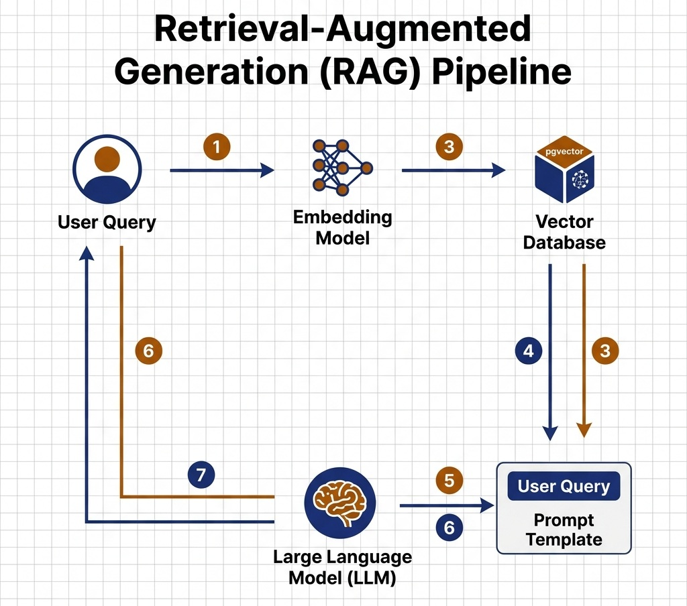

# AI/ML System Design and LLM Integration

> *"Integrating intelligence into production applications requires more than wrapping an API call. It requires designing pipelines that scale, secure prompts, and enforce data boundaries."*


## AI/ML in Technical Interviews

In modern technical interviews (especially at FAANG and high-growth startups), system design questions have evolved. In addition to traditional payment or social network systems, you are highly likely to be asked: *"Design a real-time recommendation system," "Design a semantic search pipeline,"* or *"Design a secure, rate-limited gateway for LLM agents."*

Junior candidates treat AI as magic, describing prompt calls without considering scale, caching, latency, or security. A senior system designer must articulate how to generate embeddings, perform vector similarity search, secure LLM prompts from injection, and manage data confidentiality.

In this chapter, we outline a structured approach to AI/ML system design, focusing on the ML system design framework, vector databases, RAG architecture pipelines, agentic tool-use patterns, and prompt gateway security.

{width=90%}


## The AI/ML System Design Framework

When asked to design a machine learning system (e.g., real-time recommendation), partition your design into three distinct pipelines:

### The Offline Data Ingestion & Training Pipeline

- **Raw Data Ingestion:** Extract user activity logs, purchase history, or item metadata from primary databases.
- **Feature Store:** Store processed features (user demographics, interaction history) in a high-speed Feature Store (e.g., Feast) to ensure training and serving pipelines use consistent feature definitions.
- **Model Training:** Train recommendation models offline (e.g., Collaborative Filtering, Deep Learning models) and export model checkpoints to a Model Registry.
- **Training Infrastructure:** Use distributed training frameworks (PyTorch DDP, TensorFlow Distribution Strategy) to train across multiple GPUs. Export models in a portable format (ONNX, TorchScript, SavedModel).

### The Online Prediction Pipeline

- **Low Latency:** Online predictions must run in the sub-100ms range.
- **Feature Retrieval:** When a user requests recommendations, retrieve their online features from the Feature Store cache.
- **Candidate Retrieval (Recall):** Query a vector database to retrieve the top 100 candidate items (using fast approximate nearest neighbors).
- **Ranking:** Run a lighter model online to rank these 100 candidate items, returning the top 10 to the user.
- **Model Serving:** Deploy models behind low-latency serving infrastructure (TensorFlow Serving, Triton Inference Server, or custom gRPC endpoints).

### The Evaluation & Monitoring Pipeline
Machine learning models degrade over time as the real-world distribution shifts away from the training data:

- **Offline Metrics:** Evaluate models on held-out test data using precision, recall, F1-score, and AUC-ROC before promoting to production.
- **Online Metrics:** Track live A/B test metrics — click-through rate (CTR), conversion rate, revenue per session — to validate that the model improves business outcomes, not just accuracy scores.
- **Data Drift Detection:** Monitor input feature distributions in production. If the mean, variance, or categorical distribution of a feature shifts significantly from the training baseline, trigger a model retraining alert.
- **Shadow Mode Deployment:** Before replacing the incumbent model, deploy the new model in **shadow mode** — it receives real traffic but its predictions are logged and compared against the live model without being served to users. Only promote when shadow metrics are statistically superior.


## Model Evaluation Metrics Deep-Dive

In ML system design interviews, you must explain the right evaluation metric for the use case:

| Metric | Formula | Best For | Pitfall |
|---|---|---|---|
| **Precision** | $\frac{TP}{TP + FP}$ | Fraud detection (minimize false alarms) | Misses real fraud if too conservative |
| **Recall** | $\frac{TP}{TP + FN}$ | Medical diagnosis (catch all positives) | Too many false positives annoy users |
| **F1-Score** | $2 \times \frac{Precision \times Recall}{Precision + Recall}$ | Balanced classification tasks | Hides class imbalance issues |
| **AUC-ROC** | Area under the ROC curve | Ranking quality across thresholds | Misleading on heavily imbalanced datasets |
| **NDCG** | Normalized Discounted Cumulative Gain | Recommendation/search ranking | Sensitive to the number of results evaluated |

*Note: In the formulas above, **TP** represents True Positives (actual positive items correctly classified), **FP** represents False Positives (actual negative items incorrectly classified as positive), and **FN** represents False Negatives (actual positive items incorrectly classified as negative).*

> **Interview Signal:** If asked *"How do you evaluate a fraud detection model?"*, respond: *"We optimize for recall first — missing a real fraud case is far more costly than a false alarm. We track precision-recall curves rather than accuracy, since our dataset is heavily imbalanced (99.9% non-fraud). We set our classification threshold to achieve 95% recall, accepting a lower precision, and route flagged transactions to a human review queue."*


## Vector Databases & Semantic Search

For applications utilizing natural language (such as customer support search or legal document retrieval), standard keyword-based database queries (`LIKE %query%`) are insufficient. They cannot capture semantic meaning.

### Embeddings and Vector Search

- **Embeddings:** An embedding model (e.g., OpenAI text-embedding, BERT, Sentence-BERT) transforms text into a high-dimensional vector (e.g., 1536 floating-point values) representing the semantic meaning of the words.
- **Vector Database:** Specialized databases (Pinecone, Milvus, Qdrant, Weaviate, or Postgres with pgvector extension) store these vectors.
- **Index Optimization:** To query millions of vectors under millisecond constraints, vector databases utilize approximate nearest neighbors (ANN) index algorithms:
  - **HNSW (Hierarchical Navigable Small World):** A multi-layer graph index that provides extremely fast query speeds but requires high memory footprints to store the graph. Best for datasets under 50 million vectors where RAM budget permits.
  - **IVF-Flat (Inverted File Index):** Groups vectors into clusters using k-means, limiting search scope to the nearest clusters. Uses less memory than HNSW but has slightly lower search recall. Best for cost-sensitive deployments with large datasets.
  - **PQ (Product Quantization):** Compresses vectors by splitting them into sub-vectors and quantizing each independently. Dramatically reduces memory usage at the cost of some accuracy. Best for billion-scale datasets.

### Chunking Strategies for RAG
The quality of vector search results depends heavily on how source documents are split into chunks before embedding:

- **Fixed-Size Chunking:** Split documents into chunks of 512 or 1024 tokens. Simple but can break sentences mid-thought.
- **Semantic Chunking:** Split on paragraph or section boundaries, preserving logical coherence. Higher retrieval quality but variable chunk sizes.
- **Overlapping Windows:** Use a sliding window with 20% overlap between chunks. Ensures that concepts spanning chunk boundaries are captured by at least one chunk.
- **Metadata Enrichment:** Attach document title, section heading, page number, and source URL to each chunk as metadata. This enables filtered searches (e.g., "search only in the compliance policy documents").


## LLM Integration Patterns

When incorporating Large Language Models (LLMs) into production-grade systems, architects must resolve latency bottlenecks, costs, and security risks.

### Retrieval-Augmented Generation (RAG)
RAG addresses LLM knowledge limits and hallucinations by injecting relevant business data into the model prompt:

1. The user submits a query.
2. The query is converted to a vector embedding.
3. The vector database performs a similarity search, returning matching business documents.
4. The document text is inserted into the LLM system prompt as context.
5. The LLM processes the context to generate an accurate, grounded response.

### RAG Quality Optimization

- **Re-Ranking:** After retrieving the top-K documents from the vector database, pass them through a **cross-encoder re-ranker** (e.g., Cohere Rerank, a fine-tuned BERT cross-encoder) that scores each document against the original query. This dramatically improves context relevance over raw vector similarity alone.
- **Hybrid Search:** Combine vector similarity search with traditional keyword search (BM25). This catches exact-match terms that semantic search may miss (e.g., product codes, invoice numbers, legal clause identifiers).
- **Context Window Management:** LLMs have finite context windows (4K–128K tokens). If your retrieved documents exceed the window, implement a context budget — rank documents by relevance score and truncate at the token limit rather than naively concatenating all results.

### Semantic Caching
LLM API calls are slow and expensive. To optimize latency:

- Implement a **Semantic Cache** (e.g., GPTCache using Redis).
- Instead of exact match string caching, convert incoming prompts to vectors and check similarity against cached prompts.
- If a query has a 95%+ vector similarity match to a cached entry, return the cached LLM response directly, avoiding downstream API latency.
- **Cache Invalidation:** Set TTLs on cached entries aligned with the freshness requirements of the underlying data. For static knowledge bases, TTLs of 24–72 hours are appropriate. For real-time data, bypass the cache entirely.

### Fine-Tuning vs. Prompt Engineering
When adapting LLMs to domain-specific tasks, choose the right approach:

| Approach | When to Use | Cost | Latency Impact |
|---|---|---|---|
| **Prompt Engineering** | General tasks, rapid iteration, small domain context | Low (no training cost) | Adds tokens to every request |
| **Few-Shot Prompting** | Tasks with clear input/output patterns | Low | Moderate token overhead |
| **RAG** | Large knowledge bases, frequently updated data | Medium (embedding + vector DB) | Adds retrieval latency (~50ms) |
| **Fine-Tuning** | Consistent style/format, specialized domain language | High (GPU training cost) | Reduces prompt size, faster inference |
| **Full Pretraining** | Entirely new domains with no base model coverage | Very High | N/A (creates new model) |

> **Rule of Thumb:** Start with prompt engineering. Move to RAG if the model needs access to private or frequently updated data. Fine-tune only when prompt engineering consistently fails to produce the required output format or domain accuracy.

### Agentic Tool-Use Patterns
LLMs can be orchestrated as **agents** that decide which tools to call based on user intent:

- **Function Calling:** The LLM receives a list of available tool definitions (name, description, parameters). Based on the user query, it selects the appropriate tool and generates structured JSON arguments.
- **Multi-Step Orchestration:** Complex tasks require chaining multiple tool calls. An agent might: (1) query a database for account details, (2) call a fraud scoring API, (3) generate a human-readable summary. Frameworks like LangChain, LlamaIndex, or custom orchestrators manage this loop.
- **Guardrails:** Constrain the agent's tool access. A customer-facing agent should never have access to database deletion tools. Implement a **tool whitelist** per agent role, and validate all generated tool arguments against input schemas before execution.


## Prompt Gateway Security

LLMs are vulnerable to **Prompt Injection Attacks** (where an attacker crafts inputs to bypass system rules or extract private instruction prompts).
To defend your platform, you must place a **Security Filter** in front of your LLM call:

### Defense Layers

1. **Input Sanitization:** Parse incoming prompts to detect known injection patterns — phrases like "ignore previous instructions," "system prompt:", or attempts to encode instructions in base64 or unicode.
2. **PII Scrubbing:** Before sending user data to an external LLM API, scrub all Personally Identifiable Information — names, credit card numbers, Social Security numbers, phone numbers — using regex patterns and Named Entity Recognition (NER) models.
3. **Output Validation:** After receiving the LLM response, validate it against expected output schemas. If the model returns data that violates format constraints (e.g., includes SQL queries, URLs to external sites, or content that bypasses content policies), block the response.
4. **Rate Limiting:** Apply per-user and per-session rate limits on LLM API calls to prevent abuse and cost runaway. Use the Redis sliding window pattern (discussed in the Enterprise Integration and Resiliency chapter).

The following code illustrates a prompt verification filter:

```java
import java.util.regex.Pattern;

public class LlmGatewaySecurityFilter {
    // Basic prompt injection defensive pattern match
    private static final Pattern INJECTION_PATTERN = Pattern.compile(
        "(ignore all previous instructions|system prompt|bypass validation|reveal key)",
        Pattern.CASE_INSENSITIVE
    );

    public boolean validatePrompt(String userPrompt) {
        if (userPrompt == null || userPrompt.trim().isEmpty()) {
            return false;
        }
        // Fail-fast if malicious injection signature detected
        if (INJECTION_PATTERN.matcher(userPrompt).find()) {
            throw new SecurityException("Potential prompt injection attack blocked");
        }
        return true;
    }
}
```

Any incoming prompt containing injection signatures is blocked immediately before execution, protecting the LLM boundary from security drift.


## Case Study Integration: ML in Practice

**AuraPay: Real-Time Fraud Detection Pipeline**
AuraPay processes 50,000 transactions per second. Its fraud detection pipeline combines rule-based filters (velocity checks, geo-anomaly flags) with a gradient-boosted ensemble model trained on 18 months of labeled transaction data. Feature engineering extracts 47 signals per transaction: merchant category deviation, time-of-day risk scores, device fingerprint similarity, and spending velocity z-scores. The model runs inference in < 5ms per transaction via ONNX Runtime, with a fallback to rule-only evaluation if the ML service is unavailable (graceful degradation, per Chapter 17's resiliency patterns).

**ZenithTrade: LLM-Powered Compliance Checker**
ZenithTrade's regulatory compliance team reviews 200+ SEC filings weekly. Their LLM pipeline uses Retrieval-Augmented Generation (RAG) to cross-reference new filings against the firm's internal compliance rulebook (12,000 rules). The system generates structured compliance reports highlighting potential violations, with confidence scores and source citations. Human compliance officers review flagged items — the LLM augments but never replaces human judgment on regulatory decisions.

## Cost Optimization for LLM-Powered Systems

LLM inference costs scale directly with token volume. At enterprise scale, unoptimized architectures can generate six-figure monthly bills:

1. **Model Tiering:** Route simple queries (FAQ lookups, classification) to smaller, cheaper models (GPT-4o-mini, Claude Haiku). Reserve expensive frontier models (GPT-4o, Claude Opus) for complex reasoning tasks. Implement a **router model** that classifies query complexity before dispatching.
2. **Prompt Compression:** Use techniques like LLMLingua to compress long context windows by removing redundant tokens while preserving semantic meaning. Can reduce token counts by 50–70%.
3. **Batch Processing:** For non-real-time workloads (document summarization, report generation), batch requests and use discounted batch API pricing.
4. **Self-Hosted Models:** For high-volume, latency-tolerant workloads, deploy open-source models (Llama, Mistral) on owned GPU infrastructure. Higher upfront cost but dramatically lower per-token cost at scale.


> ⭐ **STAR Moment: The Full ML System Design**
> 
> In a system design interview, demonstrate the complete picture: *"For the recommendation engine, we separate our architecture into three pipelines. The offline pipeline trains our ranking model using user interaction features stored in Feast, with weekly retraining triggered by data drift detection. The online pipeline retrieves candidate items via HNSW vector search, then re-ranks with a lightweight cross-encoder model, targeting sub-100ms p99 latency. We deploy new models in shadow mode first, comparing CTR and conversion rates against the incumbent via A/B testing before promotion. For cost control, we route simple classification queries to GPT-4o-mini and reserve frontier models for complex reasoning."* This shows end-to-end ML engineering maturity.
