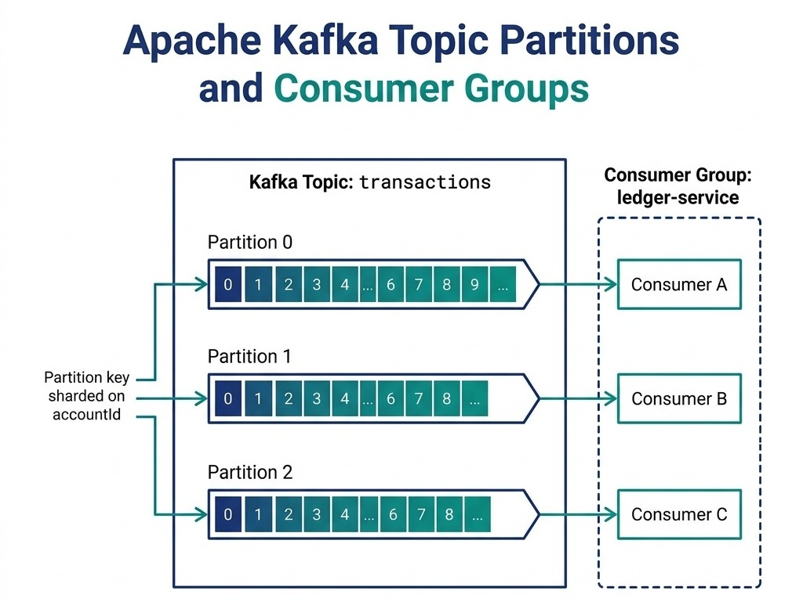
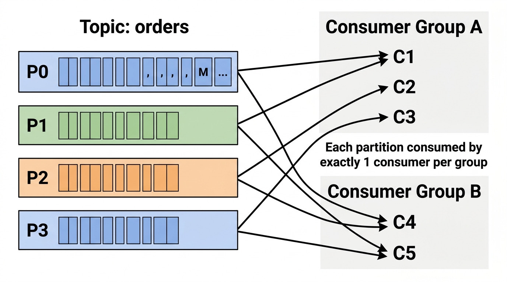

# Distributed Event Streaming and Message Brokers

> *"An event log is the ultimate source of historical truth. In a distributed architecture, message brokers serve as the central nervous system, routing states across service boundaries."*


## Event Streaming in System Design

In microservice architectures, services must communicate asynchronously. Interview candidates often default to saying: *"We will send a message via Kafka."* 

If you stop there, you miss the opportunity to demonstrate depth. A senior systems architect must explain how the message broker is structured, how partition keys guarantee message ordering under concurrency, and how to achieve **Exactly-Once Semantics (EOS)** across transactions.

In this chapter, we deep-dive into Apache Kafka's storage internals and partition routing mechanics, showing how AuraPay shards event streams to maintain ledger correctness.

{width=90%}


## Apache Kafka Internals & Sharding

Apache Kafka is designed as a distributed, partitioned, commit log. Understanding its storage structure is critical for scaling system throughput:

> **Why is it called "Kafka"?** LinkedIn engineer Jay Kreps named it after **Franz Kafka**, the Czech novelist famous for writing about surreal, labyrinthine bureaucracies. Kreps chose the name because Kafka is *"a system optimized for writing"* — and Franz Kafka was a writer. The literary nod is fitting: just as Kafka's novels depict characters navigating complex, opaque systems, Apache Kafka routes millions of messages through complex distributed topologies. The name stuck, and today "Kafka" is synonymous with high-throughput event streaming.

### Core Concepts & Partition Mechanics

1. **The Commit Log:** A Kafka partition is an append-only, ordered sequence of records. Each record consists of a key, a value, and a timestamp. Records are immutable and assigned a sequential ID called an **offset**.
2. **Partitions:** Topics are divided into multiple partitions distributed across Kafka brokers. Partitions are the fundamental unit of scalability in Kafka: while a single partition can only handle a throughput limited by its host broker, multiple partitions allow parallel writes and reads across the cluster.
3. **Consumer Groups:** A consumer group is a collection of consumers working together to read messages from a topic. Kafka guarantees that each partition is assigned to exactly *one* consumer instance within a consumer group. This prevents duplicate processing of messages.


## Topic, Partition & Multi-Broker Cluster Topology

How does Kafka distribute topic partitions across physical brokers, and what happens under concurrent read/write operations?

### Topic Partition Replica Distribution Matrix
Consider Topic `payments` configured with 3 Partitions ($P_0, P_1, P_2$) and a Replication Factor $RF=3$ across a 4-Broker cluster:

| Broker Node | Hosted Partition Replicas | Role & Traffic Handled |
| :--- | :--- | :--- |
| **Broker 1** | **$P_0$ (Leader)**, $P_1$ (Follower), $P_2$ (Follower) | Serves all writes and primary reads for Partition 0; replicates $P_1, P_2$. |
| **Broker 2** | $P_0$ (Follower), **$P_1$ (Leader)**, $P_2$ (Follower) | Serves all writes and primary reads for Partition 1; replicates $P_0, P_2$. |
| **Broker 3** | $P_0$ (Follower), $P_1$ (Follower), **$P_2$ (Leader)** | Serves all writes and primary reads for Partition 2; replicates $P_0, P_1$. |
| **Broker 4** | *(Standby / Spare Capacity)* | Available for dynamic partition rebalancing and failover headroom. |

### Can a Partition Have Multiple Active Brokers (Multi-Leader)?

A frequent and critical system design interview question is: **"Can a single Kafka partition have multiple active leaders simultaneously to increase write throughput?"**

The answer is strictly **NO**. A single partition can have **at most ONE active Leader Broker** at any given moment.

#### Why Multi-Leader Partitions Are Impossible in Kafka:
1. **Total Linear Order Invariant:** A Kafka partition guarantees a strict total ordering of records: $0, 1, 2, 3, \dots, N$. If two brokers concurrently accepted writes for Partition 0, both brokers would assign the same sequential offsets to different records, leading to log divergence and split-brain data corruption.
2. **Deterministic Append-Only Storage:** Only the single active leader is permitted to append new records to its local segment files and advance the **High Watermark (HW)** offset.
3. **Followers are Passive Replicas:** Follower brokers do not accept writes. They run continuous background `ReplicaFetcher` threads that issue fetch requests to the partition leader, copying bytes into their local logs to remain inside the **In-Sync Replicas (ISR)** set.

#### The KIP-392 Read Exception (Fetch from Closest Replica):
While **writes** must always route to the single partition leader, modern Kafka (v2.4+) supports **Rack-Aware / Zone-Aware Follower Fetching (KIP-392)**. In multi-availability-zone (AZ) cloud environments (e.g., AWS us-east-1a, 1b, 1c), consumers can be configured with `client.rack` matching the broker's rack ID. If an in-sync follower is located in the *same* availability zone as the consumer, the consumer reads directly from the follower. This eliminates cross-AZ network egress bandwidth costs and drastically cuts read latency without compromising single-leader write consistency.


## Apache ZooKeeper vs. KRaft: Metadata & Consensus Evolution

A core architectural milestone in distributed systems is how Kafka manages cluster coordination, broker membership, and partition leadership state.

### The Classic Architecture: Apache ZooKeeper Ensemble

In Kafka versions prior to 3.0, an external **Apache ZooKeeper** ensemble (typically 3 or 5 nodes) was mandatory for cluster coordination:

| ZooKeeper znode Path | Purpose & Coordination Function | Lifecycle |
| :--- | :--- | :--- |
| `/controller` | **Active Controller Election:** The first broker to write an ephemeral znode becomes the cluster Controller. Other brokers set watches; if the controller crashes, a new election fires immediately. | Ephemeral |
| `/brokers/ids/[id]` | **Broker Liveness & Membership:** Each active broker maintains an ephemeral node with its host, port, and rack info. Session heartbeat expiration signals broker failure. | Ephemeral |
| `/brokers/topics/[topic]/partitions/[p]/state` | **Partition Leadership & ISR Set:** Stores the leader broker ID, leader epoch, and active In-Sync Replicas (ISR) list. | Persistent |
| `/config/changes` | **Dynamic Configuration:** Propagates topic-level config overrides, quotas, and ACL updates across all brokers via ZooKeeper watches. | Persistent |

### Why Kafka Replaced ZooKeeper: The Metadata Bottleneck
While ZooKeeper was reliable, it introduced severe architectural bottlenecks at enterprise scale:

1. **Dual-State Synchronization Latency:** Metadata existed in two places—ZooKeeper and the Controller broker memory. Propagating updates required multi-hop serialization RPCs.
2. **Controller Failover Delay:** When a Controller broker crashed, the newly elected Controller had to synchronously read all topic and partition metadata for the entire cluster from ZooKeeper into memory. In clusters with 200,000+ partitions, this caused a **"stop-the-world" cluster freeze lasting several minutes**.
3. **Partition Scalability Ceiling:** Clusters were constrained to $\approx 200,000$ partitions per cluster because of ZooKeeper watch memory and network serialization overhead.
4. **Operational Overhead:** Running, monitoring, securing, and backing up two distinct distributed consensus systems (ZooKeeper + Kafka) created significant DevOps complexity.

### The Modern Architecture: KRaft (Kafka Raft Metadata Mode - KIP-500)
In modern Kafka (v3.0+ and production-default in v3.3+), ZooKeeper is completely removed. Kafka manages its own metadata using an internal **Raft consensus quorum (KRaft)**:

- **Event-Sourced Metadata Log:** Cluster metadata is stored as an internal, append-only Kafka topic named `@metadata`.
- **Active Controller Quorum:** A dedicated subset of brokers act as the Raft Quorum (typically 3 or 5 controller nodes). One node is elected the active KRaft Leader.
- **Instantaneous Failover:** Because follower controllers continuously replicate the `@metadata` log via Raft, a controller failover takes **sub-seconds** ($<500\text{ms}$) with zero metadata re-loading pause.
- **Scale to Millions of Partitions:** KRaft enables a single Kafka cluster to seamlessly manage **over 10,000,000 partitions**.


## Consumer Group Scaling & Partition Assignment Mechanics

Kafka achieves horizontal scalability on the consumption side through **Consumer Groups**. Understanding the mathematical relationship between partition count ($P$) and consumer instances ($C$) is essential for sizing infrastructure.

### The Golden Invariant of Consumer Groups
> **The Partition Exclusivity Invariant:** Within a single Consumer Group, each partition is assigned to **at most one consumer instance** at any given time. However, a single consumer instance can process **multiple partitions**.

### Consumer Instance to Partition Mapping Scenarios

| Operational Scenario | Consumer to Partition Ratio | Parallelism & Throughput Behavior |
| :--- | :---: | :--- |
| **Case A: Under-Subscribed ($C < P$)**<br>Example: 2 Consumers, 4 Partitions | $1:2$ | Each consumer processes 2 partitions. Workload is evenly shared, but cluster throughput is constrained by consumer compute limits. |
| **Case B: Optimal Sizing ($C = P$)**<br>Example: 4 Consumers, 4 Partitions | $1:1$ | **Maximum parallel throughput state.** Each consumer thread has exclusive ownership of exactly one partition. |
| **Case C: Over-Subscribed ($C > P$)**<br>Example: 6 Consumers, 4 Partitions | $1:1$ + 2 Idle | 4 consumers actively stream data; **2 consumers sit completely idle** as hot standbys. Adding extra consumers beyond partition count $P$ yields $0\%$ throughput increase. |
| **Pub/Sub Multi-Group Fan-Out**<br>Example: Payments, Fraud, Audit | $N$ Groups | Multiple independent consumer groups read the exact same partitions simultaneously at separate offsets without lock contention or interference. |


## Scaling Kafka Infrastructure: Horizontal vs. Vertical Strategies

To support enterprise workloads scaling from $10,000\text{ msg/sec}$ to $>10,000,000\text{ msg/sec}$, architects must apply both **Horizontal** (scale-out) and **Vertical** (scale-up) optimization strategies.

| Dimension | Horizontal Scaling (Scale-Out) | Vertical Scaling (Scale-Up) |
| :--- | :--- | :--- |
| **Primary Mechanism** | Adding broker nodes & expanding topic partitions. | Upgrading host RAM, NVMe storage mounts, and network NICs. |
| **Throughput Target** | Linear expansion ($>10\text{M msg/sec}$) across nodes. | Maximizing single-node saturation ($>1\text{M msg/sec}$ per broker). |
| **Memory Strategy** | Distributed across cluster memory pools. | Small JVM heap ($6\text{--}10\text{ GB}$) + $90\%$ RAM to OS Page Cache. |
| **Storage Strategy** | Tiered Storage (KIP-405) offloading cold segments to S3. | Multiple physical NVMe mounts configured in `log.dirs`. |
| **Concurrency Tuning** | KRaft metadata quorum supporting $10^6$ partitions. | Sizing `num.network.threads` ($2\times \text{cores}$) and `num.io.threads` ($2\times \text{disks}$). |

### Horizontal Scaling Strategies (Scale-Out)

1. **Adding Brokers & Partition Reassignment:**
   - When CPU, network, or disk utilization on existing brokers exceeds safe thresholds ($>70\%$), add new broker nodes to the cluster.
   - Run partition reassignment (`kafka-reassign-partitions.sh` or LinkedIn's automated **Cruise Control**) to migrate partition replicas from overloaded brokers to new brokers.
   - **Throttling Guard:** Always specify `--throttle <bytes/sec>` (e.g., `50MB/s`) during reassignment to prevent inter-broker replication traffic from saturating the production network and starving consumer fetchers.

2. **Increasing Topic Partitions:**
   - Increase partition count dynamically (`kafka-topics.sh --alter --partitions 16`) to unlock higher consumer parallelism.
   - **The Key-Hashing Modulo Shift Hazard:** Be aware that changing partition count from $P_{\text{old}}$ to $P_{\text{new}}$ changes the key routing formula:
     $$\text{Partition} = \text{murmur2}(\text{key}) \pmod{P_{\text{new}}}$$
     This means subsequent messages for an existing key may land on a different partition than previous messages, temporarily breaking strict historical ordering for that key. If per-key strict ordering is critical, provision ample partitions upfront or implement application-level virtual partitioning.

3. **KRaft Metadata Quorum (KIP-500):**
   - Traditional ZooKeeper-based Kafka clusters hit scalability limits around 200,000 partitions due to metadata sync bottlenecks.
   - **KRaft (Kafka Raft)** manages metadata as an event-sourced log internally across controller nodes. This enables clusters to scale to **millions of partitions** with sub-second controller failover times.

4. **Tiered Storage (KIP-405):**
   - Decouple compute from storage. Active, hot log segments ($<2\text{ hours}$ old) remain on fast local NVMe SSDs.
   - Inactive historical segments are asynchronously offloaded to cheap object storage (Amazon S3, Google Cloud Storage).
   - This allows brokers to retain years of event history without requiring massive local disk arrays, cutting storage infrastructure costs by up to $70\%$.

### Vertical Scaling Strategies (Scale-Up)

1. **OS Page Cache vs. Small JVM Heap Tuning:**
   - **The Anti-Pattern:** Allocating a massive 64 GB JVM heap to Kafka. This causes catastrophic multi-second Garbage Collection (GC) pauses.
   - **The Production Standard:** Size the Kafka JVM heap to a lean **$6\text{ GB to } 10\text{ GB}$** with G1GC.
   - Allocate the remaining $90\%$ of host RAM ($128\text{ GB to } 512\text{ GB}$) to the **Linux OS Page Cache**. When consumers read recent messages, the kernel serves data directly out of physical RAM Page Cache via zero-copy `sendfile()`, avoiding physical disk reads entirely.

2. **Network & I/O Thread Pool Sizing:**
   - `num.network.threads`: Set to $2 \times \text{number of CPU cores}$. Handles socket reads/writes and converts network requests into internal Kafka request queues.
   - `num.io.threads`: Set to $2 \times \text{number of physical disk drives}$. Handles writing request batches to the OS Page Cache and disk subsystem.

3. **Disk Subsystem Configuration:**
   - Configure multiple physical NVMe drives specified in the `log.dirs` comma-separated property (e.g., `log.dirs=/data/disk1/kafka,/data/disk2/kafka`).
   - Kafka evenly spreads new partition replicas across all configured directory mounts, achieving parallel I/O bus throughput without software RAID overhead.

4. **Batching and Compression Throughput Amplification:**
   - Producers achieve massive scale through micro-batching:
     - `linger.ms = 20`: Waits up to 20ms to allow incoming records to coalesce into larger batches.
     - `batch.size = 65536` ($64\text{ KB}$): Maximum batch byte size.
     - `compression.type = zstd` or `snappy`: Compresses the entire batch before network transmission.
   - Batch compression reduces network transfer volume by $50\text{--}75\%$, drastically increasing effective broker throughput per second.

#### Kafka Zero-Copy OS Architecture & `sendfile()` Syscall

Why can a single Kafka broker saturate a $10\text{ Gbps}$ or $40\text{ Gbps}$ network card with $>1\text{ million messages/sec}$ while keeping CPU utilization below $15\%$?

The secret lies in eliminating the memory copying and context switching overhead inherent in traditional I/O operations through the Linux kernel's **Zero-Copy DMA** subsystem (invoked in Java via `FileChannel.transferTo()`, which maps directly to the `sendfile64` system call).

##### The Traditional Data Transfer Path (4 Context Switches, 4 Memory Copies)
When a traditional application (like an older web server or standard message queue) reads a message from disk and sends it over the network to a client, the byte stream traverses four distinct memory buffers and forces four user/kernel mode transitions:

```text
                       TRADITIONAL PATH (read() + write())
                       
  User Space        Kernel Space                    Hardware Tier
 ┌──────────┐      ┌─────────────┐                 ┌─────────────┐
 │          │      │             │   1. DMA Copy   │             │
 │          │      │ Page Cache  │◄────────────────┤ Disk (NVMe) │
 │          │      │             │                 │             │
 │          │      └──────┬──────┘                 └─────────────┘
 │          │             │ 2. CPU Copy
 │          │             ▼
 │ JVM Heap │      ┌─────────────┐
 │ Memory   ├─────►│ Socket Buf  │
 │          │ 3.   │             │   4. DMA Copy   ┌─────────────┐
 │          │ CPU  └──────┬──────┘────────────────►│ Network Card│
 └──────────┘ Copy        │                        │ (NIC TX)    │
                          └───────────────────────►└─────────────┘
  Context Switches: 4 (read sysenter, read sysexit, write sysenter, write sysexit)
  CPU Data Copies:  2 (Page Cache -> User Space, User Space -> Socket Buffer)
  DMA Copies:       2 (Disk -> Page Cache, Socket Buffer -> NIC)
```

1. **`read()` Syscall:** Context switch from User Mode to Kernel Mode. The DMA engine reads bytes from disk into the OS **Page Cache** (DMA Copy 1).
2. The CPU copies data from the kernel Page Cache into the application's **JVM Heap Buffer** in User Space (CPU Copy 1). Context switch back to User Mode.
3. **`write()` Syscall:** Context switch from User Mode to Kernel Mode. The CPU copies data from the JVM Heap Buffer into the kernel's **Socket Buffer** (CPU Copy 2).
4. The DMA engine copies data from the Socket Buffer directly to the **Network Interface Card (NIC) buffer** for transmission (DMA Copy 2). Context switch back to User Mode.

**The Bottleneck:** Every gigabyte of throughput requires the CPU to copy two gigabytes of memory between user and kernel boundaries, thrashing L1/L2 CPU caches and triggering heavy Garbage Collection (GC) pauses as temporary buffers accumulate on the JVM heap.

##### The Modern Zero-Copy Path (`sendfile()` with Scatter-Gather DMA)
Kafka completely bypasses user-space memory when serving consumer read requests. The Kafka broker executes `FileChannel.transferTo()`:

```text
                       KAFKA ZERO-COPY PATH (sendfile())
                       
  User Space        Kernel Space                    Hardware Tier
 ┌──────────┐      ┌─────────────┐                 ┌─────────────┐
 │          │      │             │   1. DMA Copy   │             │
 │  Kafka   │      │ Page Cache  │◄────────────────┤ Disk (NVMe) │
 │  Broker  │      │             │                 │             │
 │ (No Byte │      └──────┬──────┘                 └─────────────┘
 │  Access) │             │ (Only memory descriptors & length: ~32 bytes)
 │          │             ▼
 │          │      ┌─────────────┐
 │          │      │ Socket Buf  │
 │          │      │(Descriptors)│   2. Direct DMA Copy
 │          │      └──────┬──────┘ (Scatter-Gather) ┌─────────────┐
 └──────────┘             └────────────────────────►│ Network Card│
                                                    │ (NIC TX)    │
                                                    └─────────────┘
  Context Switches: 2 (sendfile sysenter, sendfile sysexit)
  CPU Data Copies:  0 (ZERO CPU COPYING!)
  DMA Copies:       2 (Disk -> Page Cache, Page Cache -> NIC)
```

1. **The `sendfile()` Syscall:** A single system call switches context to Kernel Mode once.
2. If data is not already cached, the disk DMA controller streams bytes into the **OS Page Cache** (DMA Copy 1). For warm topics, messages already reside in the Page Cache from producer writes!
3. **Scatter-Gather Descriptors:** Instead of copying the actual data bytes to the Socket Buffer, the kernel appends only lightweight **buffer descriptors** (the physical memory addresses and byte lengths, $\approx 32\text{ bytes}$) to the Socket Buffer.
4. **Direct DMA to NIC:** The network adapter's DMA controller directly fetches the actual message payload directly from the **OS Page Cache** into the NIC transmit ring buffer (DMA Copy 2).
5. A single context switch returns execution to User Mode.

**The Architectural Impact:**

- **Zero CPU Data Copying:** The host CPU never reads or touches a single byte of message payload during transit.
- **Cache Preservation:** L1/L2/L3 CPU caches remain pristine, dedicated entirely to network protocol framing and security.
- **Line-Rate Saturation:** A broker can saturate $40\text{ Gbps}$ or $100\text{ Gbps}$ network interfaces at line rate with under $10\%$ CPU utilization.

{width=85%}

### Replication and Durability
Each partition is replicated across multiple brokers for fault tolerance:

- **Leader Replica:** Handles all read and write requests for the partition.
- **Follower Replicas:** Passively replicate data from the leader. If the leader broker fails, a follower is promoted to leader via the controller election process.
- **ISR (In-Sync Replicas):** The active set of replicas currently caught up with the leader partition. When producers set `acks=all` (or `acks=-1`), the leader will only acknowledge the write once **all** current members of the ISR have appended the record to their local logs.
- **Minimum In-Sync Replicas (`min.insync.replicas`):** Defines the minimum size the ISR must maintain to accept writes when `acks=all` is configured. If replication lags or broker outages reduce the active ISR below this threshold (e.g., `min.insync.replicas=2` when only 1 node is alive), the leader rejects writes with a `NotEnoughReplicasException`, prioritizing consistency and durability over availability.


## Architectural Trade-off: Smart Broker (RabbitMQ) vs. Dumb Broker (Kafka)

| Feature | RabbitMQ (AMQP 0-9-1) | Apache Kafka (Distributed Log) |
| :--- | :--- | :--- |
| **Broker Philosophy** | **Smart Broker, Dumb Consumer** (Broker tracks consumer state, routing, and message acknowledgments). | **Dumb Broker, Smart Consumer** (Broker is an immutable log; consumers track their own offsets). |
| **Message Routing** | Rich exchange routing (Direct, Fanout, Topic, Headers). | Partition key hashing (`hash(key) % partitions`). |
| **Message Retention** | Messages deleted immediately upon consumer acknowledgment (`ack`). | Messages retained for days/months based on retention policy, regardless of consumer state. |
| **Message Replay** | Cannot replay consumed messages. | Consumers can rewind offsets to re-read historical streams. |
| **Throughput Target** | $20,000\text{--}50,000\text{ msg/sec}$ per node. | $>1,000,000\text{ msg/sec}$ per broker. |
| **Primary Use Cases** | Complex task queues, microservice RPC routing, priority queues. | High-throughput event streaming, event sourcing, telemetry, real-time analytics. |

### RabbitMQ AMQP Exchange Topologies

In RabbitMQ, producers publish to Exchanges, which evaluate bindings to distribute messages to bound queues:

1. **Direct Exchange:** Routes messages strictly matching the `routing_key` directly to bound queues (e.g., `routing_key: "payment.usd"`).
2. **Fanout Exchange:** Broadcasts messages unconditionally to all bound queues, ignoring routing keys (used for pub/sub notifications).
3. **Topic Exchange:** Routes messages based on wildcard matching patterns:
   - `*` (asterisk) matches exactly one word (e.g., `orders.*.europe`).
   - `#` (hash) matches zero or more words (e.g., `audit.#` matches `audit.orders.created.v1`).
4. **Dead Letter Exchange (DLX):** When messages are rejected (`nack(requeue=false)`) or message TTL expires, RabbitMQ automatically routes failed payloads to a configured Dead Letter Exchange for investigation.


## The Ordering Invariant & Partition Keys

A common failure mode in message broker design is **out-of-order message delivery**. 
For example, if a user performs two actions:

1. Deposit \$100 (Event A)
2. Withdraw \$80 (Event B)

If the consumer processes Event B before Event A due to network concurrency, the withdrawal may be rejected due to insufficient funds, violating the system's business invariants.

### Guaranteeing In-Order Delivery
To guarantee in-order delivery, Kafka enforces a strict rule: **messages written to the same partition are always read in the exact order they were written.**

- If you publish messages without a key (null key), Kafka distributes them across partitions using a round-robin algorithm, losing all ordering guarantees.
- **The Solution:** Publish messages with a **Partition Key** (e.g., `accountId`). Kafka hashes the key to determine the partition:

```text
Partition ID = hash(accountId) % Number of Partitions
```

By sharding on `accountId`, all transaction events for a specific account are guaranteed to land in the same partition and be processed in exact chronological order by a single consumer thread.

The following code illustrates this partition-key routing implementation in a Kafka producer:

```java
import org.apache.kafka.clients.producer.KafkaProducer;
import org.apache.kafka.clients.producer.ProducerRecord;
import java.util.Properties;

public class TransactionEventProducer {
    private final KafkaProducer<String, String> producer;
    private final String topic;

    public TransactionEventProducer(String bootstrapServers, String topic) {
        Properties props = new Properties();
        props.put("bootstrap.servers", bootstrapServers);
        props.put("key.serializer", "org.apache.kafka.common.serialization.StringSerializer");
        props.put("value.serializer", "org.apache.kafka.common.serialization.StringSerializer");
        // Guarantee exactly-once idempotency
        props.put("enable.idempotence", "true");
        props.put("acks", "all");

        this.producer = new KafkaProducer<>(props);
        this.topic = topic;
    }

    public void publishEvent(String accountId, String eventJson) {
        // Shard by accountId (key) to guarantee in-order processing per partition
        ProducerRecord<String, String> record = new ProducerRecord<>(topic, accountId, eventJson);
        producer.send(record, (metadata, exception) -> {
            if (exception != null) {
                log.error("Failed to publish event for account: " + accountId, exception);
            }
        });
    }
}
```


Setting `enable.idempotence = true` ensures that network retries by the producer do not result in duplicate messages landing in the partition log.


## Exactly-Once Semantics (EOS)

In system design interviews, clearing the **Exactly-Once** challenge is a major differentiator.
How do you guarantee that a transaction is processed exactly once, even if the network fails midway?

Kafka achieves Exactly-Once Semantics (EOS) using a combination of three mechanisms:

1. **Idempotent Producers:** The producer appends a unique sequence number to each message. If a broker receives a duplicate sequence number due to a network retry, it discards the duplicate write.
2. **Transactional Writes:** When a service must read a message from an input topic, process it, and write the output to another topic (the Read-Process-Write pattern), Kafka allows wrapping these steps in a transaction.
3. **Offset Commits in DB:** Alternatively, when writing to a database (like AuraPay's ledger), combine the database write and the event offset commit inside a single database transaction. This is the **Transactional Outbox Pattern** (discussed in the Enterprise Integration and Resiliency chapter), ensuring that either both the database update and the event publish succeed, or both roll back.


## Consumer Group Rebalancing and Failure Recovery

When a consumer instance crashes, restarts, or a new instance joins the consumer group, Kafka triggers a **rebalance** to redistribute partition ownership across the active consumers.

In high-throughput enterprise systems, understanding the underlying rebalancing protocol is the difference between a resilient streaming backbone and catastrophic "rebalance storms" that paralyze message consumption for hours.

### The Rebalancing Protocols: Eager vs. Incremental Cooperative

Kafka has evolved through two distinct rebalance architectures. Choosing the correct assignor strategy determines whether a rebalance causes an enterprise-wide outage or a seamless background migration:

```text
EAGER REBALANCE (Stop-the-World):
Consumer 1: [P0, P1] ──(Revoke ALL)──► [PAUSE ALL CONSUMPTION] ──(Rejoin)──► [P0]
Consumer 2: [P2, P3] ──(Revoke ALL)──► [PAUSE ALL CONSUMPTION] ──(Rejoin)──► [P1, P2]
Consumer 3: (Joins)  ────────────────► [PAUSE ALL CONSUMPTION] ──(Rejoin)──► [P3]
                                       ▲
                                       │ Stop-The-World Freeze Across All Partitions!

INCREMENTAL COOPERATIVE REBALANCE (KIP-429):
Consumer 1: [P0, P1] ──(Retain P0, Revoke P1)──► [Continues P0] ────────────► [P0]
Consumer 2: [P2, P3] ──(Retains P2, P3)────────► [Continues P2, P3]─────────► [P2, P3]
Consumer 3: (Joins)  ──────────────────────────► [Assigned Revoked P1]──────► [P1]
                                                 ▲
                                                 │ Zero Processing Interruption on P0, P2, P3!
```

#### The Classical Eager Rebalance Protocol (Stop-the-World)
Under legacy assignors (`RangeAssignor`, `RoundRobinAssignor`):

1. **Total Partition Revocation:** The moment the Group Coordinator broker detects a group membership change, it instructs all consumers to revoke **all** assigned partitions.
2. **Global Stop-the-World Pause:** Every consumer in the group halts message processing and commits pending offsets. Message consumption drops to zero across the entire topic.
3. **JoinGroup & SyncGroup Barrier:** All consumers submit a `JoinGroup` request to the coordinator. The coordinator selects one consumer as the Group Leader, which runs the assignment algorithm and transmits the plan via `SyncGroup`.
4. **The Latency Penalty:** If even a single consumer takes 30 seconds to flush its internal buffers before revoking, **the entire consumer group is stalled for 30 seconds**. In large consumer groups (100+ nodes), this causes severe backlog spikes and violates end-to-end SLAs.
5. **Loss of Locality:** Partitions that could have remained on their original node are revoked and re-assigned, destroying in-memory caches and forcing stateful stream processors (such as Kafka Streams or RocksDB) to reload terabytes of state over the network.

#### The Modern Incremental Cooperative Rebalance Protocol (KIP-429)
Configured via `partition.assignment.strategy = org.apache.kafka.clients.consumer.CooperativeStickyAssignor`:

1. **Non-Blocking Operation:** When a rebalance begins, consumers **do NOT revoke** their partitions. They continue fetching and processing messages from their existing partitions throughout the negotiation phase.
2. **Two-Round Incremental Handshake:**
   - **Round 1 (Assessment):** Consumers send their current partition ownership list in their `JoinGroup` requests while continuing to process incoming messages. The group leader computes the desired target state and identifies *only the exact partitions that must migrate*.
   - **Targeted Revocation:** Only the consumer currently owning a migrating partition revokes that specific partition, commits its offset, and triggers a second quick rebalance round. All other consumers continue streaming unhindered.
   - **Round 2 (Reassignment):** The newly freed partitions are assigned to the target consumer.
3. **State Preservation:** Consumers retain ownership of untouched partitions, maintaining local cache locality and eliminating RocksDB state recreation pauses.


### Diagnosing & Mitigating Rebalance Storms

A **Rebalance Storm** occurs when consumers continuously drop out of and rejoin the group in an endless cascade, keeping the cluster in a perpetual rebalancing loop:

| Root Cause | Diagnostic Indicator | Production Remediation |
| :--- | :--- | :--- |
| **Poll Timeout Exhaustion** | Consumer logs: `CommitFailedException` or `max.poll.interval.ms exceeded`. | The processing loop took longer than `max.poll.interval.ms` (default $300\text{s}$). Reduce `max.poll.records` (e.g. from 500 down to 50) or offload heavy processing to worker thread pools with context timeouts. |
| **Transient JVM GC Pauses** | Broker logs: `Heartbeat timed out after session.timeout.ms`. | G1GC or Stop-the-World GC pauses froze the heartbeat thread. Tune JVM flags (`-XX:+UseG1GC`, `-XX:MaxGCPauseMillis=20`) and set `heartbeat.interval.ms` to $\le \frac{1}{3} \times \text{session.timeout.ms}$. |
| **Rolling Deployment Cascades** | Every container restart triggers a full group rebalance. | Enable **Static Group Membership** (KIP-345) by setting a persistent `group.instance.id = "payment-consumer-node-01"`. The coordinator allows the restarting container up to `session.timeout.ms` to reconnect without triggering any rebalance! |
| **Poison Pill Messages** | Consumer crashes repeatedly on a specific malformed payload. | Catch deserialization and parsing exceptions immediately. Route failed records to a **Dead Letter Queue (DLQ)** topic after 3 failed retries, commit the offset, and resume processing subsequent messages. |

### Dead Letter Queues (DLQ) & Poison Pill Mitigation
When a consumer repeatedly fails to process a message (e.g., due to a malformed payload, JSON schema violation, or unrecoverable downstream database constraint), it must not block the entire partition:

- **Dead Letter Queue (DLQ):** Route the failed payload to a dedicated Kafka topic (e.g., `payments.dlq`) along with diagnostic metadata headers (`x-exception-message`, `x-original-topic`, `x-original-partition`, `x-retry-count`).
- **Offset Commit:** The consumer commits the offset of the poison record and proceeds to the next offset, preventing partition head-of-line blocking.
- **Out-of-Band Inspection:** Operations teams monitor the DLQ via automated alerts, inspect malformed payloads, patch downstream schema bugs, and execute automated replay tools (`kafka-mirror-maker` or custom replay consumers) once fixes are deployed.


### Mock Interview Transcript: Consumer Group Rebalancing

> **Interviewer:** Your Kafka consumer group is experiencing rebalancing storms. The consumers keep dropping and rejoining, causing massive processing delays. How do you diagnose and fix this?
> **Candidate:** A rebalance storm usually means consumers are failing to send heartbeats or taking too long to process batches. I'd first check the `session.timeout.ms` and `max.poll.interval.ms` metrics. If our message processing is database-heavy, the consumer might exceed the poll interval, causing Kafka to assume it's dead. I'd tune `max.poll.records` down so the consumer processes smaller batches and polls more frequently.
> **Interviewer:** That stabilizes the group. But what if one partition has 10x the traffic of the others because of a highly active user?
> **Candidate:** That's a hot partition problem. In a financial ledger, appending a random salt to the partition key for a heavy user is strictly forbidden because breaking in-order event delivery causes balance corruption and false overdraft rejections. For high-volume omnibus or market-maker accounts, we implement an in-memory Batch Aggregator at the producer layer before emitting events to Kafka, or divide the omnibus account into deterministic sub-accounts reconciled during clearing windows. If strict order per account is maintained, we scale performance by optimizing consumer-side batch processing.
> **Interviewer:** Let's say the rebalancing was caused by a malformed message crashing the consumer. How do you handle poison pill messages?
> **Candidate:** We wrap the deserialization and processing logic in a `try-catch` block. If a message fails validation after a few retries, we acknowledge the offset and forward the payload to a Dead Letter Queue (DLQ).
> **Interviewer:** How can we minimize the impact when we legitimately need to restart consumers for a deployment?
> **Candidate:** We'd enable static group membership by setting `group.instance.id`, and use the cooperative sticky assignor so only the partitions belonging to the restarting node are temporarily paused.

**Technical Summary:** The candidate effectively diagnosed rebalancing storms by identifying poll interval exhaustion, proposed Dead Letter Queues for poison pill messages, and utilized static group membership with cooperative rebalancing to minimize deployment disruptions. They correctly identified the strict ordering constraints of financial ledgers, explicitly rejecting key-salting anti-patterns in favor of micro-batching.

> [!NOTE]
> **Modern Kafka Architecture: KRaft (Kafka Raft) Consensus:**
> In modern Kafka releases (v3.0+), Apache Kafka has replaced Apache ZooKeeper with **KRaft (Kafka Raft Metadata Mode)**. KRaft manages cluster metadata directly inside Kafka itself using an internal Raft quorum, improving cluster scalability, supporting millions of partitions, and drastically speeding up metadata recovery times during broker failures.


## Event Schema Evolution

As your system evolves, the structure of event payloads will change. Adding new fields, renaming properties, or changing data types can break downstream consumers if not managed carefully:

### Schema Registry (Confluent)

- **Central Registry:** All event schemas are registered in a **Schema Registry** (e.g., Confluent Schema Registry) using Avro, Protobuf, or JSON Schema formats.
- **Compatibility Modes:**
  - **BACKWARD:** New schema can read data written with the old schema. Achieved by only adding optional fields with defaults.
  - **FORWARD:** Old schema can read data written with the new schema. Achieved by only removing optional fields.
  - **FULL:** Both backward and forward compatible — the safest option for production systems.
- **Enforcement:** Producers must validate their serialized payload against the registered schema before publishing. If the payload violates the compatibility rules, the write is rejected at the producer level, preventing corrupt data from entering the topic.


## RabbitMQ & AMQP Architecture: The Smart Broker Paradigm

While Apache Kafka is designed as a distributed, partitioned commit log, **RabbitMQ** implements the **Advanced Message Queuing Protocol (AMQP 0-9-1)**, built on the principle of the **"Smart Broker, Dumb Consumer."** In enterprise system design, RabbitMQ is the premier choice for complex message routing, granular task distribution, and individual message lifecycle management.

### The AMQP Topology: Exchanges, Bindings, and Queues

Unlike Kafka—where producers publish directly to topic partitions—in RabbitMQ, producers **never** write directly to queues. Instead, the architecture separates message ingestion from storage through three distinct decoupled entities:

1. **Producer:** Publishes a message to an Exchange along with an optional string metadata tag known as the **Routing Key**.
2. **Exchange:** An agent inside the broker that receives messages and evaluates routing rules to determine which destination queues should receive copies.
3. **Binding:** A configuration link that attaches a Queue to an Exchange with a **Binding Key** (routing rule).
4. **Queue:** A FIFO buffer in memory (or backed by disk) that holds messages until consumed.

{width=85%}

### The 4 Canonical Exchange Types

RabbitMQ's routing flexibility stems from four exchange types:

- **Direct Exchange (Exact Match):** Routes messages to queues whose binding key exactly matches the message routing key. For example, a routing key of `payment.charge` routes exclusively to the `payments_worker_queue`. Ideal for unicast point-to-point task queues.
- **Topic Exchange (Pattern Match with Wildcards):** Routes messages based on wildcard matching against dot-delimited routing keys.
  - `*` (asterisk) matches **exactly one** word (e.g., `audit.*.failed` matches `audit.us.failed` and `audit.eu.failed`).
  - `#` (hash) matches **zero or more** words (e.g., `logs.eu.#` matches `logs.eu.security.critical`).
  - This enables dynamic multi-tenant event filtering without reconfiguring producers.
- **Fanout Exchange (Broadcast):** Duplicates and routes incoming messages to *all* queues bound to it, completely ignoring routing keys. Used for standard publish-subscribe broadcast (e.g., notifying cache invalidation, audit loggers, and metrics services simultaneously).
- **Headers Exchange (Attribute Match):** Routes messages based on key-value pairs in the AMQP message headers table rather than the routing key string.

### Architectural Philosophy: Kafka vs. RabbitMQ

Understanding the philosophical divergence between Kafka and RabbitMQ is a frequent Staff-level interview differentiator:

- **Smart Broker (RabbitMQ):** The broker actively tracks consumer state, delivers messages to consumers via push (`basic.deliver`), handles granular per-message acknowledgments (`basic.ack` / `basic.nack` with requeue options), and deletes messages from the queue immediately upon successful acknowledgment. Consumers control flow using `basic.qos(prefetch_count=N)` to prevent memory exhaustion.
- **Dumb Broker, Smart Consumer (Kafka):** The broker acts as an immutable, append-only sequential disk log. It does not track consumer state or individual message ACKs. The consumer group tracks its own position using commit offsets, pulling batches of messages on demand. Messages persist on disk for days or weeks according to retention policies, allowing historical replaying and event sourcing.

> **Staff-Level Design Rule:** Choose **RabbitMQ** when you need fine-grained routing, per-message acknowledgments, dead-letter re-routing per individual task, or push-based task queue distribution. Choose **Kafka** when you need high-throughput distributed event streaming, permanent log retention, replayability, or strict partition-key-ordered processing (such as financial ledgers).


## Kafka vs. Event-Driven Alternatives

### When NOT to Use Kafka
Kafka excels at high-throughput, ordered event streaming. However, it is not always the right choice:

- **Simple Task Queues:** If you need to distribute work items across workers without ordering guarantees (e.g., image resizing, email sending), a dedicated task queue like **RabbitMQ** or **AWS SQS** reduces operational complexity and provides individual task retries without partition head-of-line blocking.
- **Real-Time WebSocket Push:** Kafka is pull-based. For real-time push notifications to browsers or mobile clients, use **Redis Pub/Sub** or a dedicated WebSocket gateway.
- **Sub-Millisecond Latency:** Kafka's batching and replication introduce millisecond-range latency. For ultra-low-latency inter-process communication (e.g., inside a matching engine), use shared memory or in-process queues.

## Message Broker Comparison Matrix

Selecting the right broker technology depends on the architectural requirements:

| Dimension | Apache Kafka | RabbitMQ | AWS SQS / SNS |
|---|---|---|---|
| **Architecture** | Partitioned commit log (pull-based) | Smart broker, dumb consumer (push-based) | Cloud-managed queue (pull/push-based) |
| **Throughput Scale** | **Extreme** (10M+ messages/sec via sequential disc I/O) | High (Capped by broker memory and queue routing complexity) | High (Managed automatically by cloud scaling limits) |
| **Routing Capability** | Basic (consumer groups read whole topic partitions) | **Complex** (supports exchange routing keys, fanout, headers) | Basic (SNS topic fanout to SQS queues) |
| **Ordering Guarantees** | Strict order *per partition* via keys | Order guaranteed only for single consumers | Strict order only when utilizing FIFO queues (low throughput) |
| **Backpressure** | Managed by consumer (consumer pulls when ready) | Smart broker manages queue size (pushes back on producer) | Managed by consumer pooling configurations |
| **Retention** | Durable (retains messages on disk for days/weeks) | Transient (messages are deleted immediately after consumption) | Transient (messages deleted after poll commit, max 14 days) |
| **Schema Evolution** | Schema Registry (Avro/Protobuf) | No native schema support | No native schema support |


> ⭐ **STAR Moment: The Ordering Guarantee**
> 
> In a system design interview, explain: *"We will configure our payment topics with a partitioning key based on the ledger account ID. This guarantees that all transactions affecting a specific account are processed sequentially by a single thread in our consumer group, eliminating race conditions and balance corruption during high-frequency parallel events. We use the StickyAssignor with cooperative rebalancing to minimize processing pauses when consumers scale, and route poison messages to a Dead Letter Queue after three retry attempts to prevent partition blocking."* This shows deep understanding of partition routing, failure recovery, and operational maturity.
