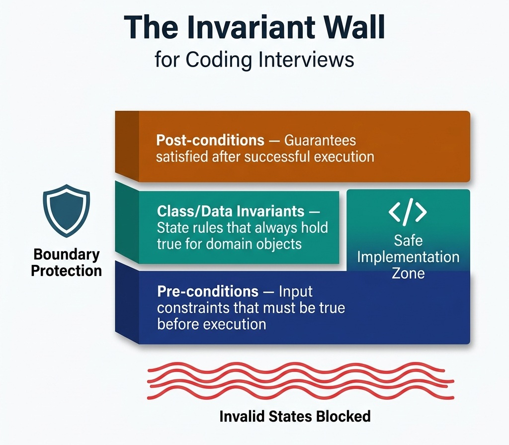

# The Invariant-First Interview Strategy

> *"Before you build a system, draw the boundaries. Code written within correct boundaries cannot drift into error."*


## The Panic of the Blank Editor

It is a common scenario in technical interviews: the interviewer presents a coding challenge, and the candidate immediately starts typing. They construct loops, initialize local counters, and write complex nested conditionals. The candidate is trying to solve the problem by writing code, using the editor as a scratching post to find a solution.

This approach is fragile. In the pressure of a live interview or a timed online assessment (like CodeSignal), writing code without a design roadmap leads to cognitive overload. You are trying to manage algorithmic logic, syntax rules, memory allocation, and edge cases simultaneously. When the first test run fails, you start modifying conditions arbitrarily—changing `<` to `<=`, adding random `+1` offsets, or introducing temporary boolean flags. 

This is the "hack-and-test" methodology, and it signals to the interviewer that you lack structural discipline. A senior engineer or manager must demonstrate a systematic, predictable approach to code correctness. The solution is the **Invariant-First Strategy**.


## Defining the Invariant Wall

The Invariant-First Strategy requires you to define the mathematical and logical boundaries of your solution before implementing any code. In computer science, an **invariant** is a property that remains true throughout a specific phase of execution. 

When you apply this to coding assessments, you construct an "Invariant Wall" composed of three layers:

1.  **Pre-conditions:** Constraints on the inputs that must be true before a function or method is executed. If a caller violates a pre-condition, the method should fail immediately (e.g., throwing an `IllegalArgumentException` in Java).
2.  **Post-conditions:** Guarantees that the method promises to satisfy upon successful execution. This defines what "correctness" means for the operation.
3.  **Class/Data Invariants:** State rules that must always hold true for a domain object throughout its entire lifecycle.

{width=70%}

By declaring these boundaries upfront, you decouple *what* the system must do from *how* it will do it. You establish a contract. Once the contract is clear, writing the code is simply a matter of executing that contract.


## The Invariant Interview Framework

When faced with a technical coding challenge in an interview, follow this four-step spec-driven framework:

### Define the Boundary Invariants (Clarification Phase)
Before writing any code, state the inputs, outputs, and their mathematical bounds. For example, if you are asked to process a list of transactions:

- What are the pre-conditions? Can the input list be null or empty? Can transaction amounts be negative?
- What are the post-conditions? Does the output preserve the original order of transactions? How are duplicate entries handled?
Write these down as comments in the IDE or verbalize them to the interviewer.

### Declare the Data Invariants (Type Design Phase)
Design your types to enforce invariants natively. Do not use generic types (like raw integers or strings) where a domain-specific type can prevent invalid states. 
For example, instead of passing a raw `double` representing a monetary amount, define a `Money` record that guarantees the amount cannot be negative and uses the correct currency scale.

### Establish the Loop Invariants (Algorithmic Phase)
If your algorithm requires an iterative process (such as a search or a sliding window), define what remains true during each iteration of the loop.
For instance, in a sliding window algorithm finding the maximum subarray sum:

- *Loop Invariant:* At the start of each iteration `i`, `current_window_sum` represents the sum of elements from index `left` to `i - 1`.
If you can maintain this invariant, your loop is guaranteed to be correct, and off-by-one errors are eliminated.

### Implement and Enforce
Write the code, beginning with explicit checks for your pre-conditions. Use modern language features to keep the code clean and expressive, ensuring that your logic never violates the declared invariants.


## Worked Example: Proving Binary Search

To demonstrate the mathematical power of invariants, let us examine the classic binary search algorithm. Many developers struggle with binary search, often getting trapped in infinite loops or off-by-one errors because they guess the boundary updates (e.g., `right = mid` vs. `right = mid - 1`).

{width=85%}

### The Challenge
Given a sorted array of integers `nums` and a `target` value, return the index of the `target` if it exists in the array, or `-1` if it does not.

### Define the Boundaries (Step 1)

- **Pre-condition:** `nums` is sorted in ascending order.
- **Post-condition:** The returned index $idx$ satisfies $nums[idx] == target$, or if $idx == -1$, then $target \notin nums$.

### Establish the Loop Invariant (Step 3)
We define two pointers, `left` and `right`, defining our active search range $[left, right]$.

- **The Loop Invariant:** *If target is present in the array, it must reside within the index boundaries:*

$$\text{Invariant } P(left, right): \text{target} \in nums[left \dots right]$$

### Mathematical Proof of Correctness
To prove the algorithm is correct, we must prove three properties of our loop invariant:

#### A. Initialization
Before the loop starts, the invariant must hold true. We initialize `left = 0` and `right = nums.length - 1`.

- Since the array is sorted, if the target is in the array, it must be within the range $[0, nums.length - 1]$. The invariant holds.

#### B. Maintenance
If the invariant is true before an iteration, we must prove it remains true after updating our pointers.
During the loop, we calculate:

$$mid = left + \frac{right - left}{2}$$

We check three cases:

**Case 1: $nums[mid] == target$**

The target is found, and we return `mid`, satisfying the post-condition.

**Case 2: $nums[mid] < target$**

Since the array is sorted, all elements at or to the left of `mid` are strictly less than the target. Therefore, the target cannot reside in the range $[left, mid]$.

We update `left = mid + 1`. The new range is $[mid + 1, right]$. If the target exists, it must lie within this new range. The invariant is maintained.

**Case 3: $nums[mid] > target$**

All elements at or to the right of `mid` are strictly greater than the target. The target cannot reside in the range $[mid, right]$.

We update `right = mid - 1`. The new range is $[left, mid - 1]$. The invariant is maintained.

#### C. Termination
When the loop terminates, the invariant must help us prove correctness.
The loop terminates when `left > right`.

- If `left > right`, the search range $[left, right]$ has become empty.
- Combining this with our loop invariant (which states that if the target is present, it must lie within $[left, right]$), we prove that the target is **not** present in the array. We return `-1` with mathematical confidence.

### Implementation (Step 4)
Because we have proved our updates mathematically, we do not need to guess the loop conditions:

```python
def binary_search(nums: list[int], target: int) -> int:
    # 1. Enforce Pre-conditions
    if not nums:
        return -1

    left = 0
    right = len(nums) - 1

    # Maintain Invariant: target is in nums[left...right]
    while left <= right:
        mid = left + (right - left) // 2

        if nums[mid] == target:
            return mid  # Post-condition satisfied
        elif nums[mid] < target:
            left = mid + 1  # Invariant maintained
        else:
            right = mid - 1  # Invariant maintained

    return -1  # Search range is empty -> target not in nums
```

By applying this invariant-first approach, we eliminate all cognitive overhead. We do not need to "dry-run" multiple edge cases or guess boundary updates. The math guarantees the correctness of our implementation.

### Invariant Proof #2: The Sliding Window Maximum

Prove the invariant for maintaining a monotonic deque that tracks the maximum element in a sliding window of size K:

**Invariant:** At every step, the deque contains indices in strictly decreasing order of their corresponding values, and all indices are within the current window [i-K+1, i].

**Initialization:** The deque is empty before processing begins. Vacuously true.
**Maintenance:** When processing element A[i]:
1. Remove all indices from the back where A[deque.peekLast()] ≤ A[i] (maintains decreasing order)
2. Remove the front if deque.peekFirst() < i-K+1 (maintains window bounds)
3. Add i to the back

After these operations, deque.peekFirst() always holds the index of the maximum element in the current window.

**Termination:** After processing all N elements, we have extracted N-K+1 window maximums, each in O(1) amortized time.

This proves the Monotonic Deque pattern [PAT-20] achieves O(N) total time for sliding window maximum.


> ⭐ **STAR Moment: The $O(1)$ Failure Principle**
> 
> A robust system fails fast and fails explicitly. The first lines of any method should always be pre-condition validation. If an input is invalid, fail immediately. Do not allow execution to proceed with corrupted or unexpected state, as this leads to hard-to-debug failures deep inside your call stack. In an interview, writing explicit input validations shows that you design for production safety, not just passing test suites.
