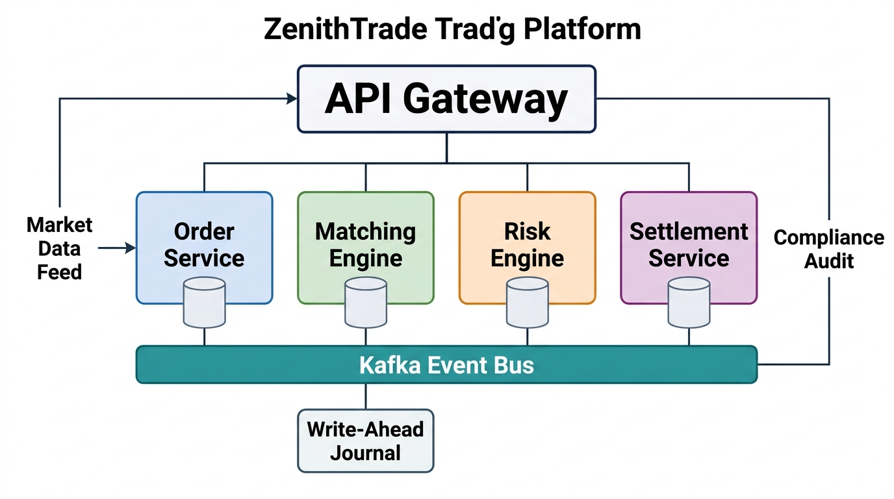

# The Three System-Scale Case Studies

> *"If you want to evaluate an engineer's design skill, do not ask them about theory. Ask them to design a ledger, an exchange, or a wallet under high-concurrency and security constraints."*


## AuraPay: Core Ledger & Asynchronous Settlement (Canonical)

AuraPay is the primary case study we will implement throughout this book. It is a distributed, banking-grade payment ledger and asynchronous settlement system. 

### Key System Requirements

- **Double-Entry Bookkeeping:** All ledger updates must obey double-entry rules (every debit must have a corresponding credit, and the net balance change of any transaction across the system must be exactly zero).
- **ACID Transaction Isolation:** The ledger must prevent race conditions and double-spending, maintaining strict consistency even under heavy concurrent load on "hot" accounts.
- **Asynchronous Settlement Routing:** Payments are routed to different processing networks (ACH, FedWire, Visa/Mastercard) based on speed, cost, and transaction limits.

### Enforcing the Domain Invariants
To demonstrate the spec-driven approach, we begin by defining the core domain objects of AuraPay: the `TransactionRecord` (an immutable value object representing a transaction intent) and the `LedgerAccount` (a stateful entity enforcing balance and overdraft invariants).

Here is the immutable, self-validating transaction representation:

```python
from dataclasses import dataclass
from decimal import Decimal
from datetime import datetime
from uuid import UUID

@dataclass(frozen=True)
class TransactionRecord:
    """
    Represents an immutable, validated financial transaction record in AuraPay.
    Enforces pre-conditions on initialization.
    """
    transaction_id: UUID
    source_account_id: UUID
    destination_account_id: UUID
    amount: Decimal
    currency: str
    timestamp: datetime

    def __post_init__(self):
        if not self.transaction_id or not self.source_account_id or not self.destination_account_id:
            raise ValueError("Account IDs and Transaction ID cannot be null")
        if not self.amount or not self.currency or not self.timestamp:
            raise ValueError("Amount, currency, and timestamp cannot be null")
        if self.source_account_id == self.destination_account_id:
            raise ValueError("Source and destination accounts must be distinct")
        if self.amount <= 0:
            raise ValueError("Transaction amount must be strictly positive")
        if not self.currency.strip():
            raise ValueError("Currency code cannot be empty")
```


Next, we define the stateful `LedgerAccount` that enforces balance boundaries and thread-safe operations during fund transfers:

```python
from decimal import Decimal
from uuid import UUID
import threading

class LedgerAccount:
    """
    Represents a stateful Ledger Account in AuraPay, enforcing business invariants
    during state transitions.
    """
    def __init__(self, account_id: UUID, currency: str, initial_balance: Decimal, overdraft_limit: Decimal):
        if not account_id or not currency:
            raise ValueError("Account ID and Currency cannot be null")
        if initial_balance is None or overdraft_limit is None:
            raise ValueError("Initial balance and overdraft limit cannot be null")
        if overdraft_limit < 0:
            raise ValueError("Overdraft limit cannot be negative")
        if initial_balance + overdraft_limit < 0:
            raise ValueError("Initial balance violates the overdraft limit")

        self.account_id = account_id
        self.currency = currency
        self._balance = initial_balance
        self.overdraft_limit = overdraft_limit
        self._lock = threading.Lock()

    @property
    def balance(self) -> Decimal:
        with self._lock:
            return self._balance

    def credit(self, amount: Decimal):
        """Credits the account. Enforces positive credit amount."""
        if amount is None or amount <= 0:
            raise ValueError("Credit amount must be positive")
        with self._lock:
            self._balance += amount

    def debit(self, amount: Decimal):
        """Debits the account. Enforces balance invariants and overdraft limits."""
        if amount is None or amount <= 0:
            raise ValueError("Debit amount must be positive")
        
        with self._lock:
            new_balance = self._balance - amount
            # INVARIANT ENFORCEMENT
            if new_balance + self.overdraft_limit < 0:
                raise ValueError(
                    f"Debit of {amount} exceeds account overdraft boundary. "
                    f"Balance: {self._balance}, Limit: -{self.overdraft_limit}"
                )
            self._balance = new_balance
```


{width=80%}

In the following chapters, we will use these domain classes to demonstrate OOP design, SOLID boundary enforcement, Java Streams collection processing, and database concurrency controls.


## ZenithTrade: High-Frequency Matching Engine (Reference Architecture)

ZenithTrade is a high-frequency, low-latency order matching engine. It is designed to process incoming buy and sell limit orders and execute matches in real time.

{width=85%}

### Key System Requirements

- **Order Book State:** Maintains separate buy (bid) and sell (ask) order books, sorted by price (highest bid first, lowest ask first) and arrival time (FIFO).
- **Sub-Millisecond Latency:** The engine must execute order matching with minimal latency, avoiding memory allocations and garbage collection pauses.
- **Data Structure Mastery:** Utilizes custom priority queues, heaps, and double-ended queues for low-overhead bookkeeping.

### Reference Architecture Starter Scaffolding
To begin implementing the ZenithTrade engine, use the following `Order` entity as your starting point. It establishes the basic structure of a limit order, enforcing invariants like positive price and quantity:

```python
from enum import Enum

class Side(Enum):
    BUY = 0
    SELL = 1

class Order:
    def __init__(self, id: str, instrument_id: str, side: Side, price: int, quantity: int):
        if price <= 0:
            raise ValueError("Price must be positive")
        if quantity <= 0:
            raise ValueError("Quantity must be positive")
        self.id = id
        self.instrument_id = instrument_id
        self.side = side
        self.price = price # Fixed-point integer
        self.quantity = quantity
```

These architectures serve as running case studies throughout the book. You will implement components of each system as you learn the patterns in Parts II, III, and IV. Do not attempt to design these systems now — let the patterns guide you.


## ChiramTrust: Decentralized Identity Consent Wallet (Reference Architecture)

ChiramTrust is a decentralized identity wallet that allows users to store credentials locally, negotiate sharing terms with verifiers, and establish consensus-based recovery.

{width=85%}

### Key System Requirements

- **W3C DID Compatibility:** Supports W3C Decentralized Identifiers (DIDs) for verifying cryptographic signatures on claims.
- **Granular Consent Engine:** Enforces user-defined access scopes, ensuring verifiers only receive requested claims (e.g., age verification without sharing birth dates).
- **Consensus Recovery:** Shares cryptographic key shards across a network of trusted guardians, using threshold secret sharing (Shamir's) to recover lost keys.

### The Mechanics of Threshold Consensus (Shamir's Secret Sharing)

To implement consensus-based key recovery, the user's private key $S$ is split into $N$ distinct shares. We construct a random polynomial of degree $T - 1$ (where $T$ is the threshold of guardians needed to recover the key):

$$f(x) = a_0 + a_1 x + a_2 x^2 + \dots + a_{T-1} x^{T-1} \pmod P$$

where $a_0 = S$ (the secret key), and the coefficients $a_1, \dots, a_{T-1}$ are randomly generated integers. The prime $P$ defines the finite field $\mathbb{F}_P$. Each guardian $i$ receives a coordinate point $(i, f(i))$. 

By the properties of polynomial interpolation:

1.  **Any $T$ guardians** can pool their shares $(x_i, y_i)$ and reconstruct the polynomial $f(x)$ using Lagrange interpolation, finding $f(0) = a_0 = S$:
   
    $$S = \sum_{i=1}^{T} y_i \prod_{j \neq i} \frac{-x_j}{x_i - x_j} \pmod P$$
   
2.  **Any $T - 1$ or fewer guardians** possess a system of equations with infinite solutions, revealing absolutely zero information about the secret key $S$.

### Reference Architecture Starter Scaffolding

To implement the ChiramTrust wallet, use the following `DidConsentRecord` aggregate root as your starting point. It handles W3C identifier validation and thread-safe consent scope modifications:

```python
class DidConsentRecord:
    def __init__(self, did: str, consent_scopes: dict[str, bool]):
        if not did or not did.startswith("did:"):
            raise ValueError("Invalid W3C DID format")
        self.did = did
        self._consent_scopes = dict(consent_scopes)

    def has_consent(self, scope: str) -> bool:
        return self._consent_scopes.get(scope, False)

    def revoke_consent(self, scope: str) -> None:
        self._consent_scopes[scope] = False
```

### Interview Drill: Applying Bounded Context Isolation

Here is a mock interview dialogue showing how to apply the Bounded Context Isolation rule in a real design interview:

**Interviewer:** *"If the AuraPay Ledger database experiences a write lag or becomes temporarily unavailable, how does that affect ZenithTrade's matching engine? How do you prevent ledger issues from cascading and bringing down the trading platform?"*

**Candidate:** "We enforce strict Bounded Context Isolation. The ZenithTrade matching engine runs entirely in-memory and communicates with the AuraPay Ledger asynchronously via a transaction event stream. When an order matches, the matching engine commits the trade to its local state and publishes a `TradeExecuted` event. The Ledger service consumes this event and updates account balances. 

To ensure zero-loss durability, ZenithTrade employs a write-ahead journal (WAJ) inspired by the LMAX Disruptor architecture. Every order and match event is sequentially appended to a persistent ring buffer on NVMe storage BEFORE the in-memory state is updated. On node failure, the engine replays the journal to reconstruct its complete order book state. Additionally, periodic snapshots compress the journal, enabling sub-second recovery times. This design achieves both the microsecond latency of in-memory processing and the durability guarantees required by financial regulators."

If the Ledger database slows down or halts, the matching engine continues to process trades in memory without interruption. The event broker queues the trade events until the ledger recovers. This decoupling guarantees fault isolation and maintains a high-availability trading path."

> ⭐ **STAR Moment: Bounded Context Isolation**
> 
> During system design interviews, explain that microservice division should mirror DDD Bounded Contexts. Say: *"We will isolate the ZenithTrade Matching Engine from the AuraPay Ledger. If the ledger experiences a database write lag, our matching engine can continue to accept and queue orders in memory, preventing system-wide downtime."* This shows you design for fault isolation.
