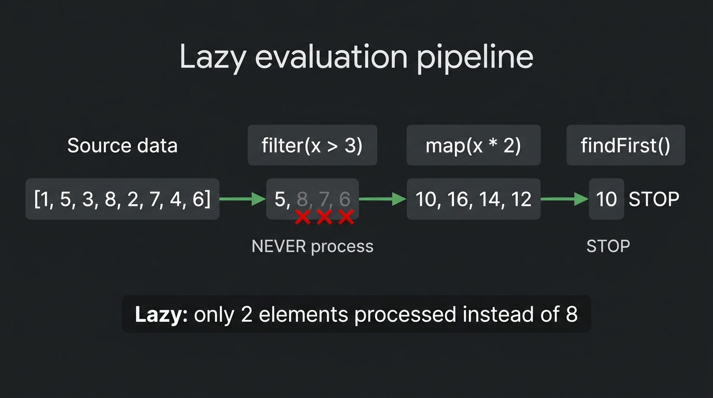

# Modern Functional Programming and Stream APIs

> *"A pipeline of pure functions is a system without side effects. It is a system that can be scaled, tested, and parallelized without fear."*

## The Paradigm Shift: Declarative vs. Imperative Thinking

In modern technical coding interviews, interviewers closely evaluate how candidates manipulate collections of data. Historically, developers solved collection processing using **imperative code**: explicit `for` loops, nested `if` conditionals, and mutable accumulator variables.

While functional imperative code can be correct, it forces the reader to track *how* execution iterates step-by-step rather than *what* transformation is being performed. Furthermore, relying on mutable shared state makes imperative code brittle and unsafe to parallelize.

Modern software engineering favors the **declarative functional paradigm** (Java Streams, C# LINQ, Python Generators & Comprehensions). Using functional pipelines, data transformations are expressed as a sequence of pure, side-effect-free operations.

{width=90%}

### The Imperative Loop Anti-Pattern

Consider this imperative approach for aggregating merchant transaction volumes:

```python
# Imperative anti-pattern: Hard to read, mutable state, difficult to parallelize
volumes = {}
for tx in transactions:
    if tx.amount >= threshold:
        merchant_id = tx.destination_account_id
        volumes[merchant_id] = volumes.get(merchant_id, 0) + tx.amount
```


#### Why the Imperative Approach Struggles in Enterprise Interviews:

1. **State Mutation:** It relies on mutating a shared local map (`volumes`), making it vulnerable to concurrency bugs if executed across multiple worker threads.
2. **Poor Separation of Concerns:** Filtering logic, key extraction, and accumulation are tightly coupled inside a single loop block.
3. **Lack of Composability:** Reusing individual processing steps (such as applying a new fee discount) requires rewriting the loop body.

## Anatomy of a Functional Stream Pipeline

Every stream processing pipeline consists of three distinct stages:

{width=90%}

### The Power of Lazy Evaluation

Intermediate operations (such as `.filter()` and `.map()`) are **lazy**. They do not execute immediately when declared. Instead, they build an execution plan. Processing is only triggered when a **terminal operation** (such as `.collect()`, `.reduce()`, or `.findFirst()`) is invoked.

Lazy evaluation allows the runtime engine to optimize processing, merging multiple map operations into a single pass and performing **short-circuiting** (stopping iteration as soon as a matching element is found).

{width=85%}

## The AuraPay Batch Processing Pipeline

In AuraPay, we aggregate transaction volumes across high-volume merchants using functional stream pipelines:

```python
from decimal import Decimal
from typing import List, Dict
from uuid import UUID
from collections import defaultdict
from functools import reduce

class TransactionAnalytics:
    """
    Demonstrates high-performance batch transaction analytics in Python.
    """
    def aggregate_merchant_volumes(
        self, 
        transactions: List, 
        min_amount_threshold: Decimal
    ) -> Dict[UUID, Decimal]:
        if transactions is None or min_amount_threshold is None:
            raise ValueError("Transactions and threshold cannot be null")

        # 1. Filter: Retain transactions meeting the value criteria
        filtered_txs = filter(lambda t: t.amount >= min_amount_threshold, transactions)

        # 2. Collect/Reduce: Group by merchant and sum the transaction volume
        merchant_volumes = defaultdict(Decimal)
        for tx in filtered_txs:
            merchant_volumes[tx.destination_account_id] += tx.amount

        return dict(merchant_volumes)

    def get_high_value_transaction_ids(self, transactions: List, limit: Decimal) -> List[UUID]:
        # Declarative list comprehension matching functional map/filter
        return [
            t.transaction_id 
            for t in transactions 
            if t.amount > limit
        ]
```


### Granular Code Dissection & Stream Pipeline Annotations

Let us examine the mechanical steps executing within `aggregateMerchantVolumes()`:

- **`<1>` Fail-Fast Input Invariants (`Objects.requireNonNull`):**  
  Eliminates defensive checks inside intermediate stream lambdas. If `transactions` is null, the method fails instantly before pipeline construction begins.

- **`<2>` Non-Mutating Stateless Filter (`.filter(...)`):**  
  Evaluates each `TransactionRecord` against the threshold. Because `t.amount()` is an immutable `BigDecimal` and the lambda produces no side effects, this operation is referentially transparent and can be reordered or parallelized safely.

- **`<3>` Collector Merge Reducer (`Collectors.toMap` with `BigDecimal::add`):**  
  Instead of instantiating an external mutable map and calling `map.merge()`, the terminal operation uses a thread-safe downstream reduction. When duplicate merchant IDs appear in the stream, the binary operator `BigDecimal::add` merges conflicting values atomically without locking.

{width=90%}

By declaring operations as a stream pipeline, the code becomes an exact, self-documenting translation of the business specification:

1. **Filter:** Retain only transaction records exceeding the minimum threshold.
2. **Collect:** Group transactions by merchant ID and sum their decimal amounts into a result map.


## Spliterator Splitting Mechanics & Parallel Efficiency Matrix

How does a parallel stream (`.parallelStream()`) divide a dataset across multiple CPU cores without thread synchronization locks?

Every stream is backed by a **`Spliterator<T>`** (Splitable Iterator). The runtime uses a divide-and-conquer strategy:

1. The coordinator thread invokes `spliterator.trySplit()`.
2. If the collection can be partitioned, `trySplit()` returns a new `Spliterator` covering roughly half the elements, while the original `Spliterator` adjusts its range to cover the remaining half.
3. Sub-tasks are pushed into the `ForkJoinPool` until task chunks reach a minimum threshold, after which worker threads process leaf tasks sequentially.

```text
Spliterator Divide-and-Conquer Decomposition:
                    [Root Spliterator: 0 .. 100,000]
                                  │
                 ┌────────────────┴────────────────┐
                 ▼                                 ▼
      [Sub-Spliterator: 0 .. 50,000]    [Sub-Spliterator: 50,001 .. 100,000]
                 │                                 │
           ┌─────┴─────┐                     ┌─────┴─────┐
           ▼           ▼                     ▼           ▼
      [0 .. 25k]  [25k .. 50k]          [50k .. 75k] [75k .. 100k]
```

### Collection Splitting Performance Characteristics

Not all data structures split equally. Parallel stream performance is fundamentally governed by the time complexity of `trySplit()`:

| Backing Collection | `trySplit()` Complexity | Splitting Quality & Balance | Parallel Scaling Recommendation |
| :--- | :---: | :--- | :--- |
| **`ArrayList` / Primitive Array** | $\mathcal{O}(1)$ | **Perfect:** Array midpoint split via index arithmetic ($mid = \frac{start + end}{2}$). Zero pointer chasing. | **Ideal for Parallel Streams:** Scales linearly across CPU cores. |
| **`ArrayDeque`** | $\mathcal{O}(1)$ | **Excellent:** Circular buffer index splitting. Fast and cache-friendly. | Highly efficient for parallel batch aggregation. |
| **`HashSet` / `TreeSet`** | $\mathcal{O}(\log N)$ | **Good:** Tree or hash bucket partition splitting. Occasional imbalance. | Moderately efficient for large collections ($N > 50,000$). |
| **`LinkedList`** | $\mathcal{O}(N)$ | **Catastrophic:** Splitting requires traversing half the linked nodes sequentially to find the midpoint! | **NEVER parallelize over `LinkedList`:** Parallel overhead is slower than a single-threaded loop. |
| **`Files.lines()` / I/O Stream** | $\mathcal{O}(N)$ | **Poor:** Line delimiters are variable length. Stream must read sequentially from disk to find line breaks. | Inefficient; parallel threads stall on disk I/O bottlenecks. |


## Hardware SIMD Vectorization: When Imperative Loops Beat Streams

In high-performance computing, low-latency financial order routing, and algorithmic assessments, a crucial staff-level question is: *When should you deliberately reject functional streams in favor of a raw imperative `for` loop?*

The answer lies in **CPU L1 Cache Locality** and **Single Instruction, Multiple Data (SIMD) Vectorization**:

### How Modern Compilers Auto-Vectorize Primitive Loops
When the HotSpot C2 compiler or LLVM inspects a simple, contiguous array loop:

```java
// Hardware-Friendly Imperative Loop
long sum = 0;
for (int i = 0; i < prices.length; i++) {
    sum += prices[i];
}
```

The compiler unrolls the loop and compiles it into hardware **AVX-512** or **ARM NEON vector instructions**. Instead of adding one 64-bit integer per cycle:

- A single 512-bit ZMM register loads **eight 64-bit integers simultaneously**.
- A single `VPADDQ` CPU instruction executes eight additions in **1 clock cycle**!

### Why Functional Object Streams Break SIMD Vectorization
If the same loop is written using an object stream (`transactions.stream().mapToLong(...).sum()`):

1. **Lambda Virtual Call Overhead:** Even when inlined, the `accept()` method call chain inside the `Sink` pipeline prevents the JIT compiler from guaranteeing simple memory stride alignments.
2. **Pointer Indirection:** In object streams, elements are heap references (`TransactionRecord`). The CPU cannot prefetch sequential memory blocks into the L1 cache because each object pointer points to an arbitrary DRAM memory address. Cache miss stalls dominate execution time.

> **Engineering Rule of Thumb:**  
> - Use **Functional Streams** for enterprise business domain pipelines: where readability, declarative transformation, and expressiveness outweigh nanosecond latency.  
> - Use **Imperative Loops over Primitive Arrays** (`int[]`, `long[]`, or `Span<T>`) for inner-loop mathematical bottlenecks, financial matching engines, and competitive algorithmic challenges where SIMD vectorization and L1 cache hits are required.


### Functors, Monads, and Railway Oriented Pipelines

Functional programming concepts like `Optional`, `Stream`, and `CompletableFuture` are practical applications of category theory:

1. **Functor:** A container type $F\langle T \rangle$ implementing a `map` function:
   $$\text{map}: (T \to U) \implies F\langle T \rangle \to F\langle U \rangle$$
   It transforms the wrapped value without altering the outer container structure.

2. **Monad:** A Functor that additionally implements `unit` (instantiation) and `flatMap` (binding):
   $$\text{flatMap}: (T \to M\langle U \rangle) \implies M\langle T \rangle \to M\langle U \rangle$$

```text
Without flatMap (Nested Monad Hell):
Optional<User> ──► user.getAddress() ──► Optional<Optional<Address>> ──► Optional<Optional<Optional<Zip>>>

With flatMap (Linear Monadic Railway):
Optional<User> ──flatMap(getAddress)──► Optional<Address> ──flatMap(getZip)──► Optional<Zip>
```

Monadic binding automatically unwraps nested contexts, allowing developers to compose linear, null-safe data pipelines without deeply nested `if (val != null)` condition trees.

### Pure Functions & Referential Transparency

A function is **Pure** if:

1. It is deterministic: Given identical arguments, it always returns the exact same result.
2. It is free of side effects: It does not mutate external memory, perform I/O, or modify its inputs.

A pure function exhibits **Referential Transparency**: any call to $f(x)$ can be replaced with its evaluated result without altering program behavior. This enables:

- **Memoization:** Caching function evaluations safely.
- **Compiler Optimizations:** Dead-code elimination and algebraic expression reordering.
- **Fearless Concurrency:** Pure functions can execute across 1,000 CPU cores without synchronization locks.

### Stream Pipeline Internals: The `Sink` Chaining Engine

How does a stream execute lazily without allocating intermediate collections?

- When stream operations are chained (`.filter().map().collect()`), the runtime constructs a linked list of **`Sink` interfaces**.
- Each `Sink<T>` has three lifecycle methods: `begin(size)`, `accept(element)`, and `end()`.
- On terminal operation invocation, elements from the underlying spliterator are pushed sequentially through the `Sink` chain:

```text
[Spliterator Source] ──accept()──► [FilterSink] ──(if true)──► [MapSink] ──accept()──► [CollectorSink]
```
Each element traverses the entire pipeline from end-to-end in a single CPU cache pass, eliminating intermediate array allocations.


## The 4 Essential Stream Transformations Every Candidate Must Master

When solving collection and aggregation problems in interviews, map your data pipeline to one of these four core functional transformations. Regardless of your primary interview language, master the corresponding idioms across Java Streams, C# LINQ, and Python comprehensions:

### Filter & Map (1-to-1 Transformation)
* **Goal:** Select elements matching a boolean predicate and project each remaining element into a transformed representation.
* **Java Streams:** `.filter(tx -> tx.isApproved()).map(tx -> tx.getAmount())`
* **C# LINQ:** `.Where(tx => tx.IsApproved).Select(tx => tx.Amount)`
* **Python:** `[tx.amount for tx in transactions if tx.is_approved]`

### FlatMap (Unnesting 1-to-N Collections)
* **Goal:** Flatten nested collections into a single contiguous stream (e.g., converting a list of `User` objects, where each user has a list of `Order` records, into a unified stream of `Order` items).
* **Java Streams:** `.flatMap(user -> user.getOrders().stream())`
* **C# LINQ:** `.SelectMany(user => user.Orders)`
* **Python:** `[order for user in users for order in user.orders]` *(or `itertools.chain.from_iterable(...)`)*

### Grouping & Reduction (N-to-1 Aggregation)
* **Goal:** Partition elements by a bucket key and compute summary metrics (sum, count, average, max).
* **Java Streams:** `.collect(Collectors.groupingBy(Tx::getMerchantId, Collectors.summingDouble(Tx::getAmount)))`
* **C# LINQ:** `.GroupBy(tx => tx.MerchantId).ToDictionary(g => g.Key, g => g.Sum(tx => tx.Amount))`
* **Python:** 
  ```python
  from collections import defaultdict
  merchant_totals = defaultdict(float)
  for tx in transactions:
      merchant_totals[tx.merchant_id] += tx.amount
  ```

### Short-Circuiting Search (0-or-1 Retrieval)
* **Goal:** Locate the first element satisfying a predicate without eagerly evaluating the remainder of the collection.
* **Java Streams:** `.filter(tx -> tx.isFraudulent()).findFirst()`
* **C# LINQ:** `.FirstOrDefault(tx => tx.IsFraudulent)`
* **Python:** `next((tx for tx in transactions if tx.is_fraudulent), None)`


## Critical Interview Pitfalls & Staff-Level Nuances

To stand out in technical interviews, candidates must demonstrate an understanding of operational edge cases when using functional streams:

### Pitfall 1: Mutating External State Inside Lambdas (Side-Effect Anti-Pattern)
* **Mistake:** Writing `.forEach(item -> externalList.add(item))` or modifying a local counter inside a lambda.
* **Why it Fails:** Modifying shared mutable state inside lambdas destroys thread safety and breaks stream parallelization.
* **Correct Approach:** Always use pure terminal collectors (`.collect(Collectors.toList())` or `.reduce()`).

### Pitfall 2: Reusing Closed Streams
* **Mistake:** Saving a `Stream` variable and invoking multiple terminal operations on it.
* **Why it Fails:** Streams are single-pass pipelines. Once a terminal operation completes, the stream is consumed and closed. Subsequent calls throw an `IllegalStateException`.

### Pitfall 3: Parallel Streams & ForkJoinPool Work-Stealing Starvation
* **Mistake:** Calling `.parallelStream()` on long-running or blocking I/O tasks (e.g., fetching network HTTP endpoints inside a `.map()`).
* **Under the Hood (ForkJoinPool):** Java parallel streams utilize the shared JVM-wide `ForkJoinPool.commonPool()`.
  - Each worker thread maintains a double-ended queue (deque).
  - The owning thread pushes and pops sub-tasks from the **LIFO Head** (cache locality).
  - Idle worker threads steal tasks from the **FIFO Tail** of busy threads' deques.

```text
Worker Thread 1 (Busy)              Worker Thread 2 (Idle)
┌────────────────────────┐          ┌────────────────────────┐
│ LIFO Head (Own Task A) │          │ LIFO Head (Empty)      │
│ Task B                 │          │                        │
│ Task C                 │          └────────────────────────┘
├────────────────────────┤                     ▲
│ FIFO Tail (Stealable)  │ ════ Steal Task ════╝
└────────────────────────┘
```
If a worker thread blocks on HTTP/database I/O, it remains blocked in the common pool. Because the default common pool size equals $\text{CPU Cores} - 1$, blocking just a few threads halts all parallel streams, CompletableFutures, and reactive event loops across the entire JVM.

### Pitfall 4: Primitive Boxing & Allocation Overhead (JVM Focus)
* **Mistake:** Using generic object streams (`Stream<Double>` or `Stream<Integer>`) on the JVM for high-throughput mathematical loops.
* **Why it Fails:** On the JVM, generic type erasure forces primitive numbers into heap-allocated wrapper objects (`java.lang.Integer`), triggering millions of short-lived allocations and GC pressure. *(Note: C# LINQ natively avoids this because the CLR supports reified generics over value-type `structs` like `IEnumerable<int>` without heap boxing).*

```text
Primitive int[] vs Boxed Integer[] Memory Layout:
int[] arr = [ 10, 20, 30, 40 ]
┌──────────────┬────┬────┬────┬────┐
│ Array Header │ 10 │ 20 │ 30 │ 40 │ (Contiguous 4-byte values in L1 CPU Cache)
└──────────────┴────┴────┴────┴────┘

Integer[] arr = [ 10, 20, 30, 40 ]
┌──────────────┬──────┬──────┬──────┬──────┐
│ Array Header │ ptr1 │ ptr2 │ ptr3 │ ptr4 │ (Array of 8-byte heap references)
└──────────────┴───┬──┴───┬──┴───┬──┴───┬──┘
                   ▼      ▼      ▼      ▼
                 [Obj1] [Obj2] [Obj3] [Obj4] (24 bytes each, scattered across DRAM)
```

* **Correct Approach (Java):** Use specialized primitive streams (`IntStream`, `LongStream`, `DoubleStream`) or primitive arrays to process numeric data directly in contiguous stack/cache memory without garbage collection overhead.


## Debugging Functional Stream Pipelines

Because stream pipelines execute lazily, debugging test failures requires deliberate strategies:

1. **Injecting `.peek()` for Stage-by-Stage Logging:**
   Use `.peek()` to inspect elements as they transition between operations without altering the pipeline:
```python
def log_and_map(t):
    log.debug(f"Passed Filter: {t.id}")
    return t.merchant_id

merchant_ids = [log_and_map(t) for t in transactions if t.amount > 100]
```


2. **Utilizing IDE Visual Stream Debuggers:**
   Modern IDEs (IntelliJ IDEA, Visual Studio) feature visual stream debuggers. Setting a breakpoint on a stream statement allows you to visually trace how elements are filtered and mapped at each step.

3. **Splitting Pipelines for Stack Trace Isolation:**
   If a complex pipeline throws an exception, temporarily break the chain into intermediate variables to isolate the failing stage in stack trace logs.

> ⭐ **STAR Moment: The Stateless Pipeline Principle**
> 
> During technical interviews, summarize your functional design with this principle: *"I design stream pipelines to be pure, stateless, and free of side-effects. By avoiding external state mutations inside lambdas and using built-in collectors, the pipeline remains easy to reason about, simple to unit test, and safe to parallelize."*
