# Core Algorithms & Assessment Tactical Guide

> *"Algorithms are not trivia; they are the baseline vocabulary of computational efficiency under resource constraints."*


## General Coding Assessment (GCA) Tactics

Many organizations (such as Capital One, fintech firms, and major technology companies) screen candidates using standardized online coding assessments (e.g., CodeSignal GCA, HackerRank, or Codility). The most common and highest-stress format is the **70-Minute, 4-Question Speed Run**.

Candidates often fail not because they lack coding skills, but because they manage their time poorly. Under stress, they get stuck debugging a minor edge case on Question 3, leaving zero time for Question 4, which carries the highest scoring weight. To score a perfect 800+ on these assessments, you must treat the test as a tactical exercise.

### The 4-Question Blueprint

| Question | Difficulty | Archetype | Time Target | Tactical Rule |
|---|---|---|---|---|
| **Q1** | Easy | Basic array manipulation or string formatting | 5–8 Min | Write clean, brute-force code immediately. Do not over-optimize. |
| **Q2** | Medium | 2D matrix transformation, array rotation, or simulation | 10–12 Min | Watch for array bounds and off-by-one errors. Keep helper functions simple. |
| **Q3** | Medium-Hard | Hashmap state-tracking, custom key groupings, or string alignments | 15–20 Min | Identify the map key early. Keep data structures simple. |
| **Q4** | Hard | Monotonic stack/queue, advanced sliding window, or binary search optimization | 20–25 Min | If brute force is $O(N^2)$, look for a monotonic property to reduce to $O(N)$. |

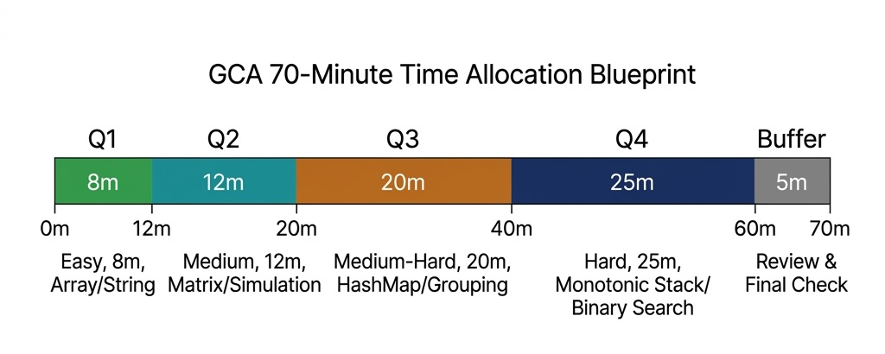{width=85%}

### The 70-Minute GCA Master Plan
To secure a top-tier score under pressure, you must follow a strict, disciplined time-boxing strategy:

**1. The 3-Minute Limit.** If you get stuck on a compile or logic bug for more than 3 minutes, comment out your changes, revert to your last working baseline, and rethink your boundary conditions. Do not write code blindly hoping it will pass.

**2. Never print in a loop.** Printing to standard output (`System.out.println`, `print()`, `Console.WriteLine`) inside loops kills execution speed and can cause the platform to timeout on large hidden test cases.

**3. Submit immediately.** Once your solution passes the visible test cases, submit it and move to the next question. Do not waste time cleaning up variable names or optimizing unless a performance timeout occurs.

**4. Solve in order (1 -> 2 -> 4 -> 3).** On platforms like CodeSignal, Q4 is often worth significantly more points than Q3, and it is usually more deterministic (e.g., a standard Monotonic Stack or Binary Search) compared to Q3, which can be a tedious simulation or string parsing problem. If you finish Q1 and Q2 quickly, scan Q4. If it matches an algorithmic archetype you recognize, solve it before tackling Q3.

### Cracking Live Technical Rounds (Teams / Zoom / In-Person)
Unlike asynchronous online assessments, live coding rounds evaluate your communication, structured thinking, and collaborative problem-solving:

**Talk Out Loud Constantly.** Do not code in silence. Explain your thought process, what variables you are declaring, and why. The interviewer wants to see *how* you think.

**State the Invariants First.** Before writing code, state the pre-conditions, post-conditions, and loop invariants to the interviewer. This shows that you are a disciplined software engineer rather than a syntax hacker.

**Dry-Run with Small Test Cases.** Walk through your logic with a simple test case by tracing variable values manually on the screen before running the code.

**Handle Feedback Gracefully.** If the interviewer points out a bug or asks, *"What happens if this input is null?"*, do not get defensive. Acknowledge it, state the pre-condition check you will add, and implement the fix.


## Data Structures Primer for Coding Assessments

Before diving into algorithm patterns, you must be fluent in the data structures they depend on. Many candidates know the algorithm conceptually but lose time during interviews because they cannot remember the correct method names or choose the wrong collection type. This section is your quick-reference guide.

### ArrayList — Dynamic Array

The workhorse of coding interviews. An automatically resizing array with $O(1)$ random access.

```python
lst = []
lst.append(42)             # Append to end — O(1) amortized
lst.insert(0, 99)          # Insert at index 0 — O(N) shift
lst[0]                     # Random access — O(1)
lst[1] = 50                # Replace at index — O(1)
del lst[0]                 # Remove at index — O(N) shift
len(lst)                   # Current element count
42 in lst                  # Linear search — O(N)
not lst                    # Check if empty (Pythonic)
lst.sort()                 # Sort in-place — O(N log N)
```


**When to use:** Default choice when you need an ordered, indexable collection. Prefer over `LinkedList` for almost all interview problems.

### HashMap and HashSet — O(1) Lookup

The most critical data structure in interviews. `HashMap` maps keys to values. `HashSet` stores unique elements. Both provide $O(1)$ average-case lookup, insert, and delete.

```python
# dict: Key -> Value mapping
map = {}
map["apple"] = 3                           # Insert/update — O(1)
map["apple"]                               # Lookup — O(1), raises KeyError if missing
map.get("banana", 0)                       # Lookup with fallback — O(1)
"apple" in map                             # Key existence check — O(1)
del map["apple"]                           # Remove by key — O(1)
map.keys()                                 # All keys (for iteration)
map.values()                               # All values
map.items()                                # All key-value pairs

# Frequency counting pattern (extremely common)
from collections import Counter
freq = Counter(text)                       # One-liner frequency count

# set: Unique element storage
seen = set()
seen.add(42)               # Add element — O(1)
42 in seen                 # Membership check — O(1)
seen.discard(42)           # Remove element — O(1), no error if missing
```


**When to use:** Frequency counting, duplicate detection, two-sum lookups, graph adjacency lists, caching previously computed results (memoization).

### Deque (ArrayDeque) — Double-Ended Queue

A `Deque` (pronounced "deck") supports insertion and removal at **both ends** in $O(1)$ time. It is the backbone of sliding window problems and is also the recommended implementation for stacks and queues in modern Java.

```python
from collections import deque

d = deque()

# --- As a double-ended queue ---
d.appendleft(1)            # Add to front — O(1)
d.append(2)                # Add to back — O(1)
d[0]                       # View front without removing — O(1)
d[-1]                      # View back without removing — O(1)
d.popleft()                # Remove from front — O(1)
d.pop()                    # Remove from back — O(1)

# --- As a Stack (LIFO) ---
d.append(42)               # Push onto stack (adds to right)
d[-1]                      # View top element
d.pop()                    # Pop from stack (removes from right)

# --- As a Queue (FIFO) ---
d.append(42)               # Enqueue (adds to right)
d[0]                       # View head
d.popleft()                # Dequeue (removes from left)

not d                      # Check if empty (Pythonic)
len(d)                     # Current element count
```


**Why ArrayDeque over Stack and LinkedList?** Java's `java.util.Stack` class is synchronized (slow) and extends `Vector` (legacy). `LinkedList` has pointer-chasing overhead. `ArrayDeque` is backed by a resizable circular array — it is the fastest general-purpose stack and queue implementation.

**When to use:** Sliding window maximum/minimum (store indices), BFS (as a queue), DFS iteratively (as a stack), monotonic deque problems.

### Queue — First-In, First-Out (FIFO)

Used primarily for BFS traversal. While `ArrayDeque` is the best implementation, you will often see `LinkedList` used in interview solutions.

```python
from collections import deque

queue = deque()
queue.append(1)            # Enqueue — O(1)
queue.append(2)
queue[0]                   # View head (returns 1) — O(1)
queue.popleft()            # Dequeue (removes 1) — O(1)
not queue                  # Check if empty (Pythonic)
len(queue)                 # Current element count
```


**When to use:** BFS graph/tree traversal, topological sort (Kahn's algorithm), level-order processing.

### Stack Behavior — Last-In, First-Out (LIFO)

There is no preferred standalone `Stack` class in modern Java. Use `ArrayDeque` with `push`/`pop`/`peek`.

```python
stack = []
stack.append(10)           # Push — O(1)
stack.append(20)
stack.append(30)
stack[-1]                  # View top (returns 30) — O(1)
stack.pop()                # Pop (removes 30) — O(1)
```


**When to use:** Bracket matching (valid parentheses), monotonic stack (next greater element), DFS iterative traversal, expression evaluation, undo operations.

### PriorityQueue — Min-Heap / Max-Heap

A `PriorityQueue` is a binary heap that always keeps the smallest element at the top (min-heap by default). Insertion and removal are $O(\log N)$. Peeking at the top is $O(1)$.

```python
import heapq

# Min-Heap (default) — smallest element first
min_heap = []
heapq.heappush(min_heap, 30)
heapq.heappush(min_heap, 10)
heapq.heappush(min_heap, 20)
min_heap[0]                # Returns 10 (smallest) — O(1)
heapq.heappop(min_heap)    # Removes 10 — O(log N)

# Max-Heap — negate values as workaround
max_heap = []
heapq.heappush(max_heap, -30)
heapq.heappush(max_heap, -10)
-max_heap[0]               # Returns 30 (largest) — O(1)

# Custom comparator — use tuples (priority, value)
pq = []
heapq.heappush(pq, (priority, value))  # Sort by first tuple element
```


**When to use:** Top-K problems (K-th largest element), streaming median (dual-heap), Dijkstra's shortest path, merge K sorted lists, task scheduling by priority.

### LinkedList — Node-Based Sequential Access

A doubly-linked list where each node points to its predecessor and successor. Rarely the best choice for array-style problems, but essential for pointer-manipulation questions.

```python
from collections import deque

# Python has no built-in LinkedList; use deque for similar behavior
linked = deque()
linked.appendleft(1)       # Add to head — O(1)
linked.append(2)           # Add to tail — O(1)
linked[0]                  # View head — O(1)
linked[-1]                 # View tail — O(1)
linked.popleft()           # Remove head — O(1)
linked.pop()               # Remove tail — O(1)
# For true linked-list pointer problems, define a ListNode class
```


**When to use:** Fast/slow pointer problems (cycle detection, find middle), LRU cache implementation (with HashMap), problems that explicitly say "linked list" in the prompt.

### TreeMap and TreeSet — Sorted Collections

A `TreeMap` is a red-black tree that keeps keys in **sorted order**. All operations are $O(\log N)$. It provides powerful navigation methods that `HashMap` cannot.

```python
from sortedcontainers import SortedDict, SortedList

# SortedDict — sorted key-value mapping (pip install sortedcontainers)
sd = SortedDict()
sd[10] = "ten"
sd[30] = "thirty"
sd[20] = "twenty"

sd.peekitem(0)             # Smallest key-value pair — O(log N)
sd.peekitem(-1)            # Largest key-value pair — O(log N)
sd.bisect_left(25)         # Index where 25 would be inserted

# SortedList — sorted unique elements with O(log N) operations
sl = SortedList([30, 10, 20])
sl[0]                      # 10 (smallest)
sl[-1]                     # 30 (largest)
sl.bisect_left(25)         # Index for floor/ceiling calculations
# Floor: sl[sl.bisect_right(25) - 1]  -> 20
# Ceiling: sl[sl.bisect_left(25)]     -> 30
```


**When to use:** Sliding window median, interval problems requiring sorted order, problems needing "nearest value" queries (`floor`/`ceiling`), calendar scheduling conflicts.

### Quick Reference: Choosing the Right Data Structure

| Problem Signal | Data Structure | Key Advantage |
|---|---|---|
| "Find if X exists" / "Count occurrences" | HashMap / HashSet | $O(1)$ lookup |
| "Sliding window max/min" | ArrayDeque | $O(1)$ add/remove both ends |
| "BFS" / "Level-order" / "Shortest path" | Queue (ArrayDeque) | FIFO ordering |
| "Matching brackets" / "Next greater element" | Stack (ArrayDeque) | LIFO ordering |
| "K-th largest" / "Top K" / "Merge K lists" | PriorityQueue | $O(\log N)$ min/max access |
| "Sorted order" / "Floor/ceiling queries" | TreeMap / TreeSet | $O(\log N)$ sorted operations |
| "Cycle detection" / "Find middle node" | LinkedList | Pointer manipulation |
| "Random access by index" | ArrayList | $O(1)$ index access |


## Broad LeetCode Structural Patterns

To crack senior-level assessments, you must recognize the structural pattern of the problem instantly. We organize the ten essential archetypes into two groups: patterns for linear data (arrays, strings, sequences) and patterns for relational data (graphs, trees, complex structures).

### Group A: Arrays, Strings & Sequences

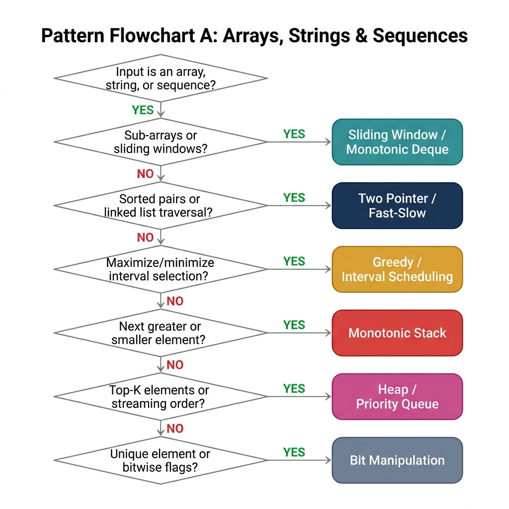{width=90%}

### Monotonic Deque & Sliding Window

When you are asked to track properties (like the maximum, minimum, or sum) of sub-arrays that slide across a larger array, you are dealing with a **Sliding Window** problem. 

If the window size is $K$ and the array size is $N$, a brute-force search at each step takes $O(N \times K)$ time. We can optimize this to **$O(N)$ linear time** by maintaining a **Monotonic Deque** (double-ended queue) containing array indices. 

The deque maintains a strict invariant: elements corresponding to indices in the deque are stored in strictly decreasing order.

Here is the implementation:

```python
from collections import deque
from typing import List

class SlidingWindowSolver:
    """
    Implements the Sliding Window Maximum algorithm using a Monotonic Deque.
    """
    def max_sliding_window(self, nums: List[int], k: int) -> List[int]:
        if not nums or k <= 0:
            return []

        n = len(nums)
        result = []
        q = deque()  # Stores array indices

        for i in range(n):
            # 1. Remove indices that are out of the current window boundary
            if q and q[0] < i - k + 1:
                q.popleft()

            # 2. Maintain monotonic invariant: Remove indices of elements smaller
            # than the current element from the tail of the deque
            while q and nums[q[-1]] < nums[i]:
                q.pop()

            # 3. Add current element's index to the tail
            q.append(i)

            # 4. If window size has reached K, store the maximum in the result
            if i >= k - 1:
                result.append(nums[q[0]])

        return result
```


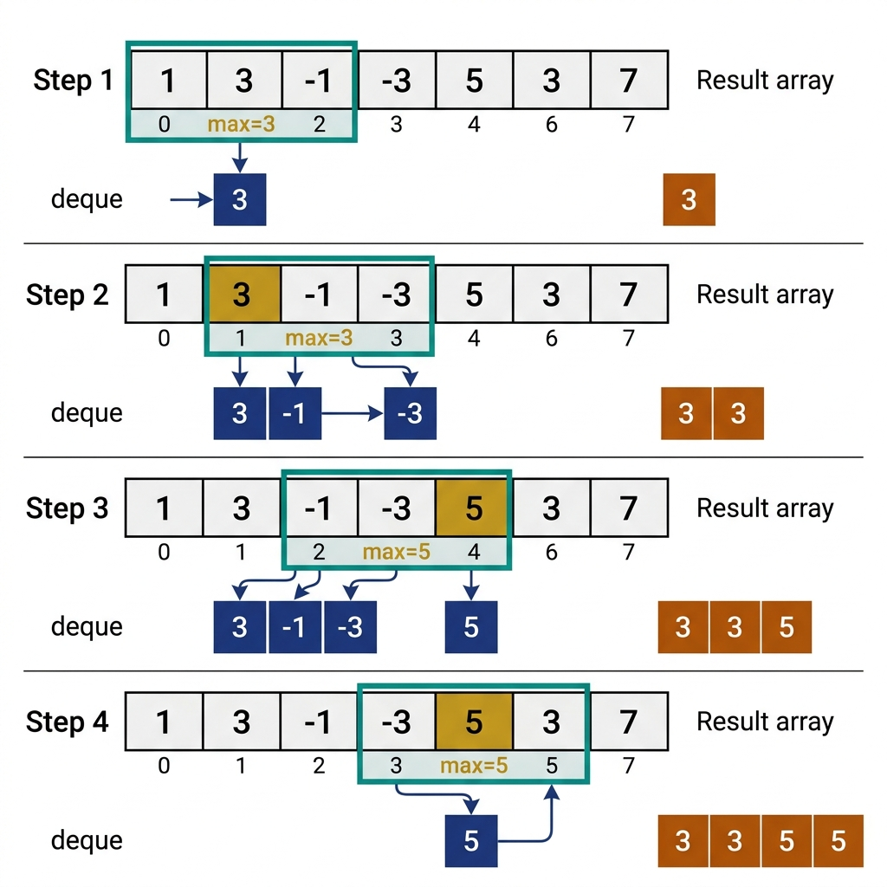{width=70%}

**The Core Insight:** If a new element `B` enters the window and `B > A` (where `A` is already in the deque), then `A` can *never* be the maximum for the current window or any future window — because `B` is both **larger** and **newer** (it will stay in the window longer). So `A` is useless, and we discard it by popping from the back of the deque. This keeps the deque values in **strictly decreasing order**, with the current maximum always at the front.

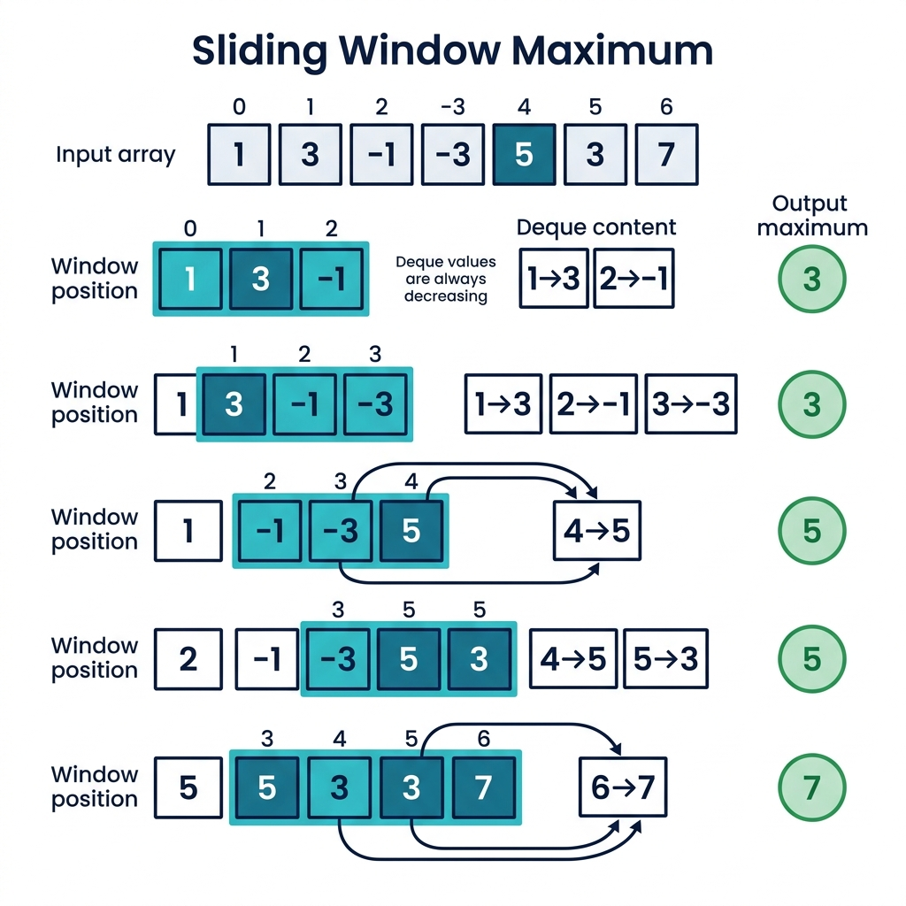{width=65%}

**Full Execution Trace** — Array: `[1, 3, -1, -3, 5, 3, 7]`, k=3:

| Step | i | Value | Why We Do What We Do | Deque (idx->val) | Window | Max |
|------|---|-------|---------------------|-----------------|--------|-----|
| 0 | 0 | 1 | Deque empty -> push index 0. Window not full yet. | [0->1] | — | — |
| 1 | 1 | 3 | 3 > 1 (back). Pop 0 — *1 can never be max while 3 exists*. Push 1. | [1->3] | — | — |
| 2 | 2 | -1 | -1 < 3 (back). Keep 3 — *-1 might be max after 3 leaves window*. Push 2. Window full! | [1->3, 2->-1] | [1,3,-1] | **3** |
| 3 | 3 | -3 | Front idx 1 still in window [1,3]. -3 < -1 (back). Push 3. | [1->3, 2->-1, 3->-3] | [3,-1,-3] | **3** |
| 4 | 4 | 5 | Front idx 1 **out of window** [2,4] -> pop front! Then 5 > -3 pop, 5 > -1 pop — *both useless now*. Push 4. | [4->5] | [-1,-3,5] | **5** |
| 5 | 5 | 3 | Front idx 4 in window [3,5]. 3 < 5 (back). Push 5. | [4->5, 5->3] | [-3,5,3] | **5** |
| 6 | 6 | 7 | 7 > 3 pop, 7 > 5 pop — *both useless*. Push 6. | [6->7] | [5,3,7] | **7** |

**Result: [3, 3, 5, 5, 7]**

The three rules the code follows at each step `i`:

1. **Evict expired:** If the front index is outside the window (`< i - k + 1`), pop it from the front.
2. **Maintain decreasing order:** While the back element $\leq$ current element, pop from the back (those elements will never be useful).
3. **Record answer:** After the window is full (`i` $\geq$ `k - 1`), the front of the deque is always the index of the current maximum.

> **Why is this O(N) despite the while loop?** The `while` loop looks dangerous — a loop inside a loop usually means $O(N^2)$. But count the total operations *across the entire algorithm*: each of the N elements is **pushed exactly once** and **popped at most once**. That means the while loop executes at most N pops *total* across all iterations of the for loop — not N pops *per* iteration. In our 7-element example, the total pops were: Step 1 (1 pop) + Step 4 (3 pops) + Step 6 (2 pops) = **6 pops total** for 7 elements. The amortized cost per element is $O(1)$, giving $O(N)$ total.


### The Two-Pointer & Fast/Slow Pointer Pattern

This pattern is used to process linear data structures (arrays, linked lists) using two pointer variables that move at different speeds or in different directions.

**Opposite Direction.** Left and right pointers moving toward the center (e.g., finding pairs in a sorted array, reversing arrays). Reduces search spaces from $O(N^2)$ to $O(N)$.

**Fast/Slow Pointers.** A "slow" pointer moving 1 step at a time, while a "fast" pointer moves 2 steps (e.g., Floyd's Cycle Detection, finding the middle of a linked list).

#### Problem: Two Sum (Sorted Array)

Given a **sorted** array of integers `numbers` (1-indexed) and a target integer `target`, find two numbers that add up to `target`. Return their indices as `[index1, index2]` where `index1 < index2`. You must use only $O(1)$ extra space.

Here is the implementation:

```python
from typing import List

class TwoPointerSolver:
    """
    Implements the Two-Pointer pattern to find two numbers that sum to a target
    in a 1-indexed sorted array.
    Time Complexity: O(N) where N is the size of the array.
    Space Complexity: O(1) auxiliary space.
    """

    def find_matching_numbers(self, numbers: List[int], target: int) -> List[int]:
        """
        Finds indices of the two numbers that add up to the target.
        Uses two pointers moving from opposite ends inward.
        """
        start = 1
        last = len(numbers)

        while start < last:
            current_sum = numbers[start - 1] + numbers[last - 1]
            if current_sum == target:
                return [start, last]
            if current_sum < target:
                start += 1
            else:
                last -= 1
        return [0, 0] # Returns [0, 0] if no match is found
```


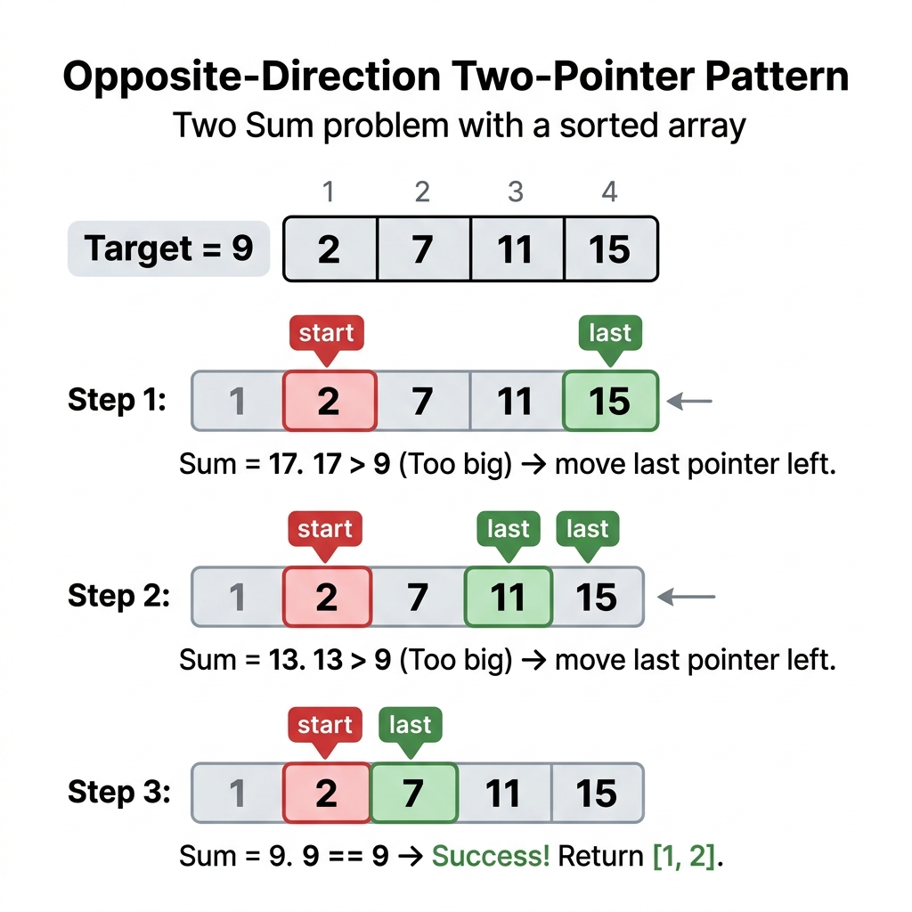{width=65%}

**Full Execution Trace** — Array: `[2, 7, 11, 15]`, target = 9:

| Step | start | last | current_sum | Decision Logic | Pointers | Output |
|------|-------|------|-------------|----------------|----------|--------|
| 1 | 1 (val 2) | 4 (val 15) | 17 | $17 > 9$ (too large) $\rightarrow$ decrement `last` | `start=1`, `last=4` | — |
| 2 | 1 (val 2) | 3 (val 11) | 13 | $13 > 9$ (too large) $\rightarrow$ decrement `last` | `start=1`, `last=3` | — |
| 3 | 1 (val 2) | 2 (val 7) | 9 | $9 == 9$ $\rightarrow$ Target matched! | `start=1`, `last=2` | **[1, 2]** |

**Elimination Logic:** Because the array is sorted, each pointer movement eliminates an entire set of invalid pairs. For instance, in Step 1, since the sum of $2 + 15 = 17$ is too large, the sum of $15$ with *any* other element in the array is guaranteed to be larger than target. Thus, we can safely eliminate the index of $15$ entirely by decrementing `last`.


#### Problem: Container With Most Water

Given $n$ non-negative integers representing an elevation map where the width of each bar is 1, find two lines that together with the x-axis form a container, such that the container contains the most water.

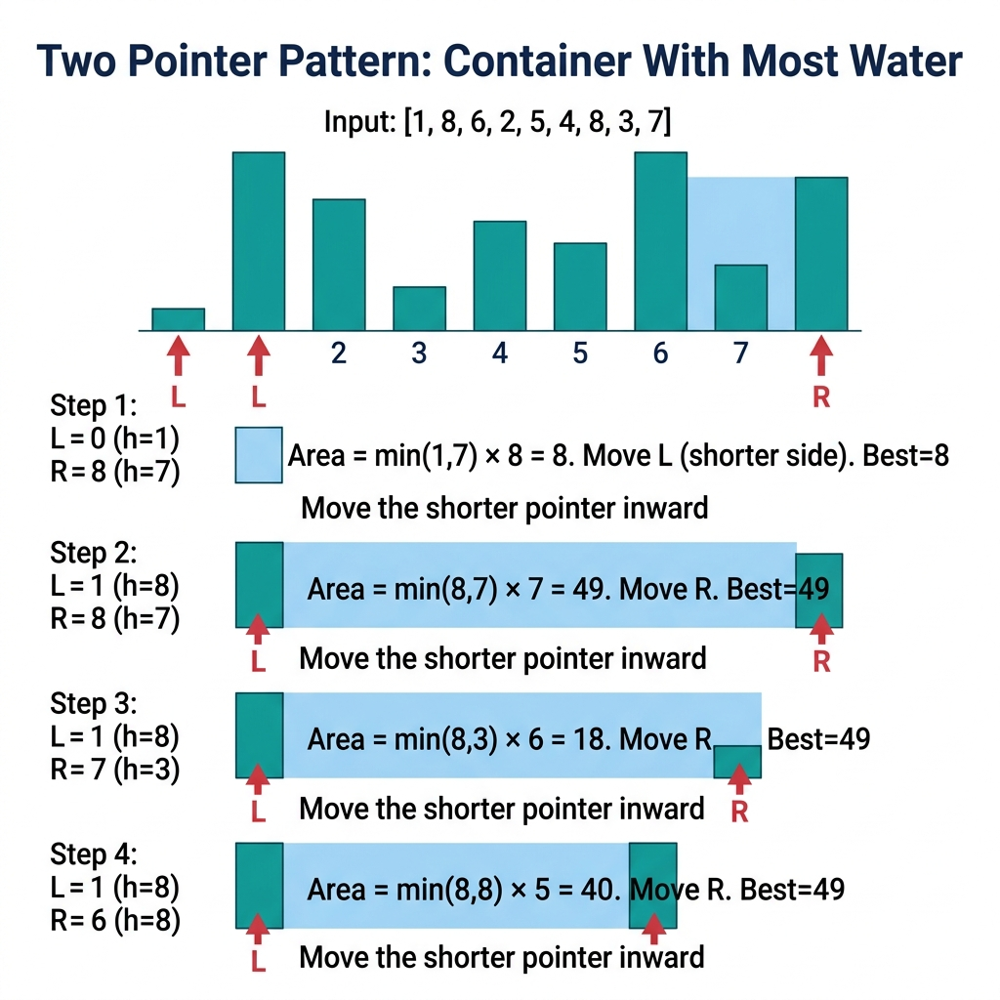{width=65%}

> **How to read this trace:** Two pointers start at opposite ends. At each step, we calculate the area between them. We then move the pointer pointing to the shorter bar inward — because moving the taller bar can never improve the area (the width shrinks and the height is still limited by the shorter bar). This greedy elimination guarantees we never miss the optimal pair.


#### Problem: Linked List Cycle Detection (Fast/Slow Pointers)

Given the head of a singly linked list, determine if the linked list has a cycle in it. A cycle exists if some node can be reached again by continuously following the `next` pointer.

Here is the implementation:

```python
from typing import Optional

class ListNode:
    def __init__(self, x: int):
        self.val = x
        self.next = None

class CycleDetector:
    """
    Implements the Fast/Slow Pointer (Tortoise and Hare) pattern to detect cycles
    in a singly linked list.
    Time Complexity: O(N) where N is the number of nodes.
    Space Complexity: O(1) auxiliary space.
    """

    def has_cycle(self, head: Optional[ListNode]) -> bool:
        """
        Detects if a linked list contains a cycle.
        Moves slow pointer by 1 step, fast pointer by 2 steps.
        """
        slow = head
        fast = head

        while fast is not None and fast.next is not None:
            slow = slow.next          # Tortoise: 1 step
            fast = fast.next.next     # Hare: 2 steps

            if slow == fast:
                return True # Fast pointer caught up to slow pointer -> cycle!

        return False # Fast pointer reached the end -> no cycle
```


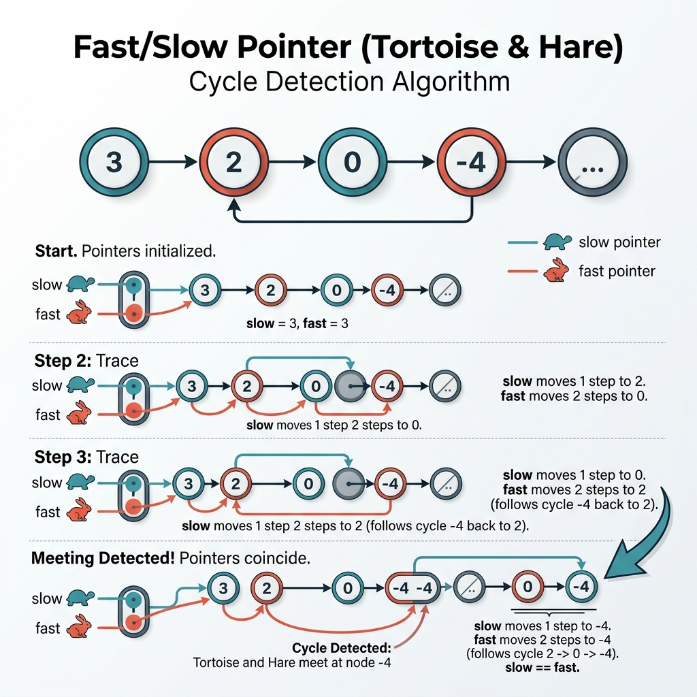{width=65%}

**Full Execution Trace** — List: `3 -> 2 -> 0 -> -4` (cycle from `-4` back to `2`):

| Step | slow (Tortoise) | fast (Hare) | slow == fast | State / Decision Logic |
|------|-----------------|-------------|--------------|------------------------|
| 1 | 3 | 3 | True | Initial state. Skip check on Step 1 to avoid instant termination. |
| 2 | 2 | 0 | False | slow moves 1 step $\rightarrow$ 2. fast moves 2 steps $\rightarrow$ 0. |
| 3 | 0 | 2 | False | slow moves 1 step $\rightarrow$ 0. fast moves 2 steps $\rightarrow$ 2 (loops back). |
| 4 | -4 | -4 | True | slow moves 1 step $\rightarrow$ -4. fast moves 2 steps $\rightarrow$ -4. Meeting detected! |

**Cycle Detection Logic:** If there is no cycle, `fast` will eventually reach `null` and terminate the algorithm in $O(N)$ time. If a cycle exists, `fast` enters the cycle first. Since `fast` reduces the distance between itself and `slow` by 1 node at each step, they are guaranteed to meet inside the cycle. This ensures $O(1)$ space complexity as we only track reference memory pointers without storing nodes.

> **Mathematical Proof of Start of Cycle:** Let $A$ be the distance from head to start of cycle, $B$ be the distance from start of cycle to meeting point, and $C$ be the cycle length. The distance slow traveled is $A + B$. The distance fast traveled is $2(A + B)$. Since fast traveled some integer number of loops $k$ more than slow, $2(A + B) = A + B + kC \rightarrow A + B = kC \rightarrow A = kC - B$. This mathematically proves that if we reset one pointer to head and keep the other at the meeting point, moving both at speed 1 will cause them to meet exactly at the start of the cycle ($A$ steps later).


#### Dual Application: Finding a Duplicate in an Array (Floyd's on Arrays)

A classic advanced coding interview problem asks you to find a duplicate number in an array under strict constraints:

1. Do **not modify** the input array (forbidding Cyclic Sort or in-place sorting).
2. Use only **$O(1)$ auxiliary space** (forbidding HashSets or frequency arrays).
3. The array contains $N + 1$ integers, where each integer is strictly in the range $[1, N]$.

> 💡 **Design Insight: Floyd's vs. Cyclic Sort**
> 
> While Cyclic Sort is the most intuitive $O(N)$ way to find duplicates, it requires swapping elements in-place. If an interviewer adds a constraint banning array modification, you must shift your perspective and treat the array values as memory pointers to indices (i.e., an implicit linked list where index $i$ points to index $\text{nums}[i]$). 
>
> This technique uses **Floyd's Cycle-Finding Algorithm** (named after Turing Award winner Robert W. Floyd who published it in 1967). It is also known as the **Tortoise and Hare** algorithm because it uses two pointers moving at different speeds to detect the cycle's entrance (which represents the duplicate number) without modifying a single element.

Here is the implementation:

```python
from typing import List

class DuplicateArrayFinder:
    """
    Finds the duplicate number in an array using Floyd's Cycle Detection.
    Time Complexity: O(N) where N is the size of the array.
    Space Complexity: O(1) auxiliary space.
    Constraint: The array must contain N + 1 elements, each between 1 and N.
    """

    def find_duplicate(self, nums: List[int]) -> int:
        # Phase 1: Detect cycle (meeting point)
        slow = nums[0]
        fast = nums[0]

        while True:
            slow = nums[slow]          # Move 1 step
            fast = nums[nums[fast]]    # Move 2 steps
            if slow == fast:
                break

        # Phase 2: Find cycle entrance (duplicate value)
        slow = nums[0] # Reset slow to start
        while slow != fast:
            slow = nums[slow] # Move 1 step
            fast = nums[fast] # Move 1 step

        return slow # The duplicate value
```


#### Problem: In-place Reversal of a Linked List

Reversing the pointers of a singly linked list in-place without allocating new nodes is a fundamental coding pattern. It forms the basis of many harder list manipulation questions (like reversing sub-lists or checking if a list is a palindrome).

Here is the implementation:

```python
from typing import Optional

class ListNode:
    def __init__(self, x: int):
        self.val = x
        self.next = None

class LinkedListReversal:
    """
    Reverses a singly linked list in-place.
    Time Complexity: O(N) where N is the number of nodes.
    Space Complexity: O(1) auxiliary space.
    """

    def reverse_list(self, head: Optional[ListNode]) -> Optional[ListNode]:
        prev = None
        curr = head

        while curr is not None:
            next_temp = curr.next  # 1. Save the next node
            curr.next = prev       # 2. Reverse current pointer
            prev = curr            # 3. Move prev forward
            curr = next_temp       # 4. Move curr forward

        return prev # New head node
```


**Reversal Invariant:** At each step, we maintain three pointers: `prev` (already reversed part), `curr` (node currently being reversed), and `nextTemp` (temporarily stores the rest of the list so we don't lose it when we break the link). We simply point `curr.next` to `prev`, then slide both `prev` and `curr` one node forward.


#### Problem: Cyclic Sort (In-place Array Sorting)

When you are given an array of numbers in a contiguous range from $1$ to $N$ (or $0$ to $N$), you can sort the array in $O(N)$ time and $O(1)$ space using **Cyclic Sort**. It is the go-to pattern for finding missing or duplicate numbers.

Here is the implementation:

```python
from typing import List

class CyclicSort:
    """
    Sorts an array containing numbers from 1 to N in-place.
    Time Complexity: O(N) where N is the size of the array.
    Space Complexity: O(1) auxiliary space.
    """

    def sort(self, nums: List[int]) -> None:
        i = 0
        while i < len(nums):
            correct_index = nums[i] - 1  # Value X belongs at index X-1
            if nums[i] != nums[correct_index]:
                # Swap to correct position
                nums[i], nums[correct_index] = nums[correct_index], nums[i]
            else:
                i += 1  # Increment only when correct
```


**Sorting Invariant:** Since elements are in the range $[1, N]$, the number $X$ belongs exactly at index $X - 1$. We iterate through the array. If the current element is not at its correct index, we swap it with the element at its correct index. We only increment our loop pointer `i` when the element at index `i` is already correct. Since each swap places at least one element in its final correct position, the algorithm finishes in at most $2N$ steps — giving $O(N)$ linear time.


### Interval Scheduling & Greedy Algorithms

Greedy algorithms make the locally optimal choice at each step with the hope of finding a global optimum. A classic implementation is **Interval Scheduling** (e.g., matching non-overlapping transaction batches or scheduling CPU tasks).

To maximize the number of non-overlapping intervals, you must apply the **earliest deadline first** heuristic: sort the intervals by their end times, and greedily select the next interval that starts after the end of the previously selected one.

Here is the implementation:

```python
from typing import List

class TransactionInterval:
    def __init__(self, start: int, end: int):
        self.start = start
        self.end = end

class IntervalScheduler:
    """
    Solves the Interval Scheduling problem using a Greedy approach.
    """
    def max_non_overlapping_transactions(self, intervals: List[TransactionInterval]) -> int:
        if not intervals:
            return 0

        # GREEDY INVARIANT: Sort intervals by their end time.
        sorted_intervals = sorted(intervals, key=lambda x: x.end)

        count = 1
        last_selected_end = sorted_intervals[0].end

        for i in range(1, len(sorted_intervals)):
            # If start time is greater than or equal to last selected end time
            if sorted_intervals[i].start >= last_selected_end:
                count += 1
                last_selected_end = sorted_intervals[i].end

        return count
```


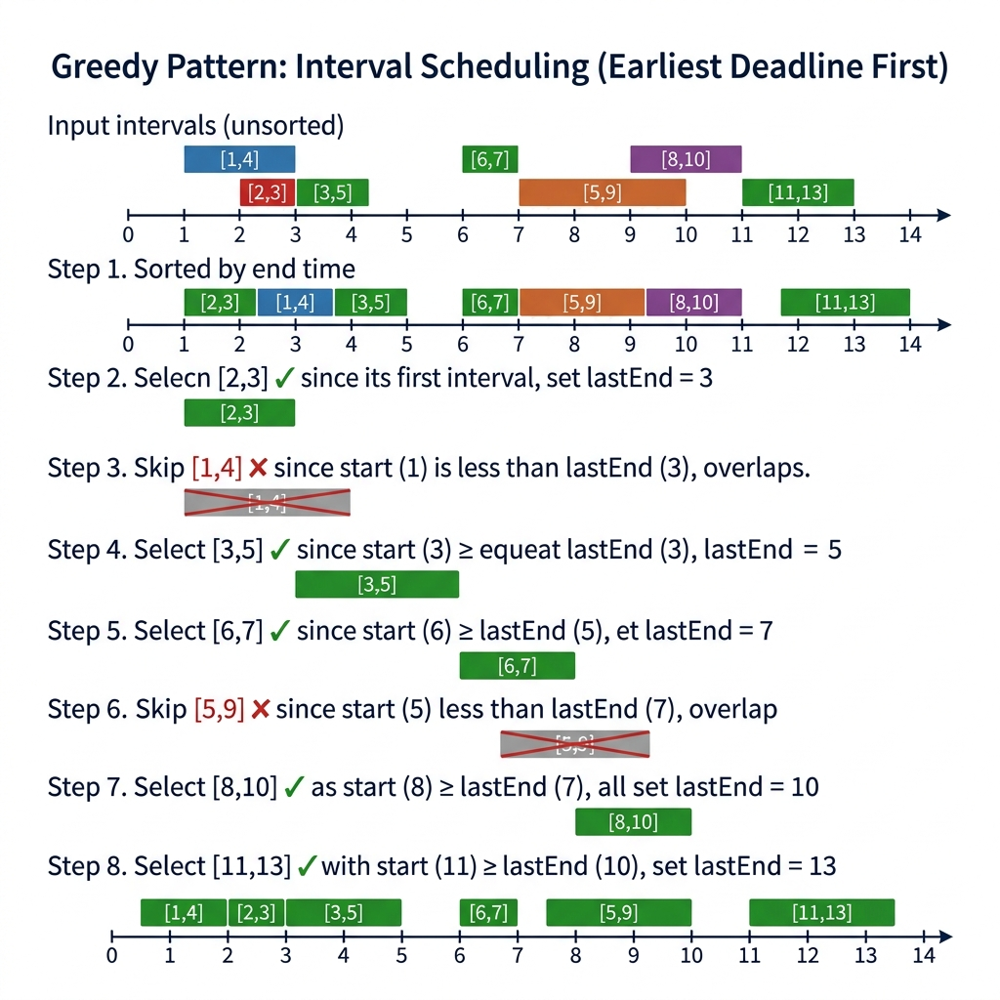{width=65%}

> **How to read this trace:** After sorting intervals by end time, we greedily pick the next interval whose start time does not overlap with the last selected interval's end time. Green intervals are selected; red intervals are skipped because they overlap.


### Group B: Graphs, Trees & Complex Structures

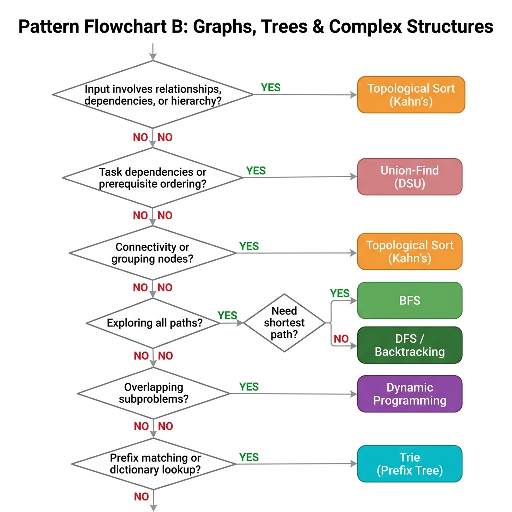{width=90%}

### Backtracking, DFS, and BFS

These patterns are used to traverse trees, graphs, or search spaces.

**Breadth-First Search (BFS).** Uses a queue to explore nodes level-by-level. Always use BFS when you need to find the **shortest path** or minimum steps in an unweighted graph.

**Depth-First Search (DFS).** Uses recursion (call stack) to explore branches as deeply as possible before backtracking.

**Backtracking.** A refined DFS that prunes invalid search branches early. For example, when generating all valid payment routing paths, if a path violates a limit constraint (pre-condition failure), backtrack immediately rather than continuing down that branch.

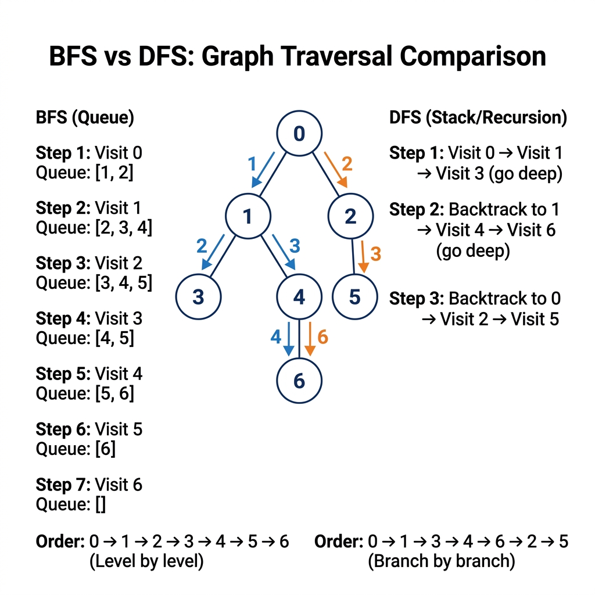{width=65%}

> **How to read this trace:** BFS (left) uses a queue — it visits all nodes at distance 1 before distance 2, guaranteeing the shortest path. DFS (right) uses recursion — it dives as deep as possible along one branch before backtracking. Choose BFS for shortest-path problems, DFS for exhaustive search or cycle detection.


**Island Pattern (Matrix Traversal).** A very common assessment pattern involves traversing a 2D grid (matrix) where cells are connected horizontally or vertically (e.g., counting "islands" of connected 1s in a sea of 0s). We treat the grid as an implicit graph where each cell $(r, c)$ has up to four neighbors: $(r\pm 1, c)$ and $(r, c\pm 1)$. When visiting a cell, we mark it as visited (or sink it by changing 1 to 0) and recursively trigger DFS or BFS to traverse all connected cells.
### Dynamic Programming (DP)

Dynamic Programming is used to solve optimization problems by breaking them down into overlapping subproblems, solving each subproblem once, and storing the results (memoization).

#### The Case Study: Climbing Stairs

To master DP, let's look at the classic problem: **Climbing Stairs**.
> *You are climbing a staircase. It takes $N$ steps to reach the top. Each time you can either climb 1 or 2 steps. In how many distinct ways can you climb to the top?*

#### Naive DFS (Decision Trees)
Every DP problem begins with a decision. If you are standing at step $N$, you could have arrived there in one of two ways:

1. By climbing **1 step** from step $N - 1$.
2. By climbing **2 steps** from step $N - 2$.

Therefore, the total ways to reach step $N$ is:
$$\text{climb}(N) = \text{climb}(N - 1) + \text{climb}(N - 2)$$

This is a simple recursive relationship. Here is the implementation using naive DFS:

```java
public int climbStairs(int n) {
    if (n <= 1) return 1; // Base case: 1 way to stay on step 0 or 1
    return climbStairs(n - 1) + climbStairs(n - 2);
}
```

##### Naive DFS Complexity Analysis:
*   **Time Complexity: $O(2^N)$**. The recursion tree doubles in size at each level.
*   **Space Complexity: $O(N)$**. The maximum depth of the call stack is $N$.

Why is this $O(2^N)$ time complexity a disaster? Look at the recursion tree for $N = 5$:

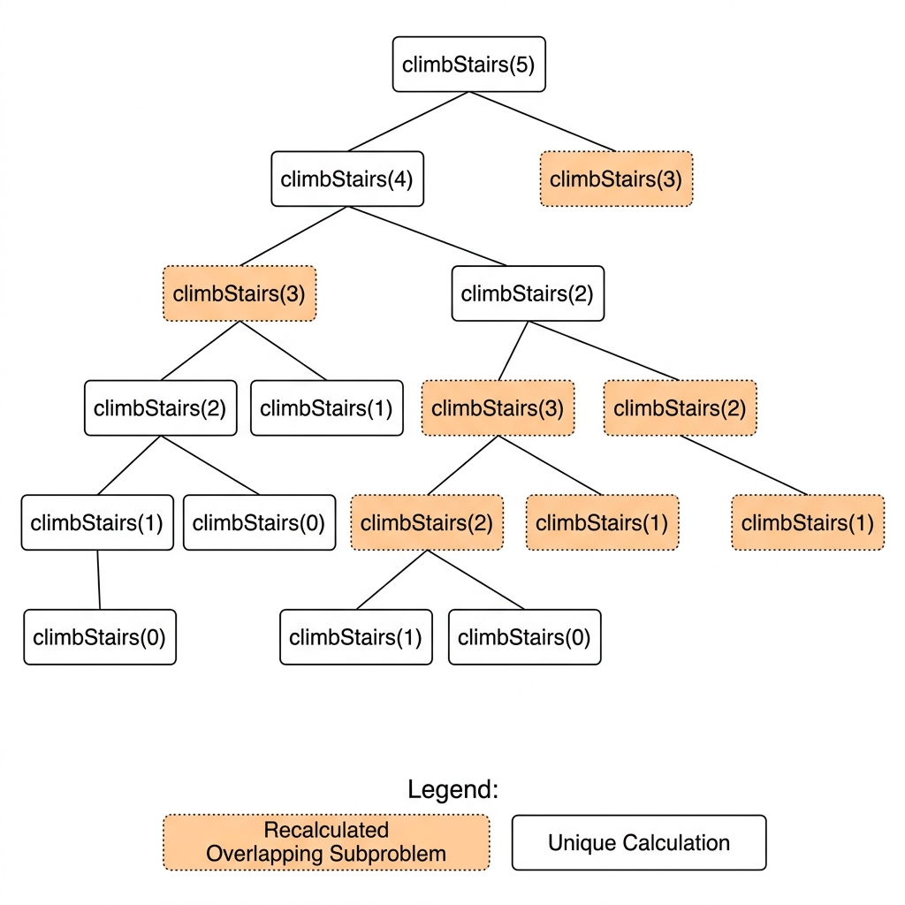{width=85%}

Notice that `climbStairs(3)` is calculated **2 separate times**, `climbStairs(2)` is calculated **3 separate times**, and `climbStairs(1)` is calculated **5 separate times**! As $N$ grows, this redundant calculation causes the program to halt.

---

#### Top-Down DP (Memoization)
To fix the $O(2^N)$ time complexity, we simply **remember the past**. We add a cache (a memoization array `memo`) to store the result of `climbStairs(i)` the first time we calculate it. If the recursion ever visits that step again, we return the cached value in $O(1)$ time.

```java
public int climbStairs(int n) {
    int[] memo = new int[n + 1];
    return dfs(n, memo);
}

private int dfs(int n, int[] memo) {
    if (n <= 1) return 1;
    
    // Return cached result if already calculated
    if (memo[n] != 0) {
        return memo[n];
    }
    
    // Store in cache before returning
    memo[n] = dfs(n - 1, memo) + dfs(n - 2, memo);
    return memo[n];
}
```

##### Memoized Complexity Analysis:
*   **Time Complexity: $O(N)$**. We calculate each step value exactly once.
*   **Space Complexity: $O(N)$**. We use $O(N)$ space for the cache array and $O(N)$ space on the recursive call stack.

---

#### Bottom-Up DP (Tabulation)
While Memoization is fast, it relies on **recursion**. In Java, every recursive call creates a new stack frame on the call stack. If $N$ is very large (e.g. $10,000$), recursive DFS will crash with a `StackOverflowError` because the call stack size is limited.

To prevent this, we use **Tabulation**. Instead of working top-down from $N$, we start at the bottom (base cases `0` and `1`) and fill a table iteratively using a simple `for` loop:

```java
public int climbStairs(int n) {
    if (n <= 1) return 1;
    
    int[] dp = new int[n + 1];
    dp[0] = 1;
    dp[1] = 1;
    
    for (int i = 2; i <= n; i++) {
        dp[i] = dp[i - 1] + dp[i - 2];
    }
    
    return dp[n];
}
```

##### Tabular Complexity Analysis:
*   **Time Complexity: $O(N)$**. A single loop from $2$ to $N$.
*   **Space Complexity: $O(N)$**. The `dp` array stores $N + 1$ values in heap memory, and there is no recursive call stack.

---

#### Space-Optimized DP
Look closely at the tabulation loop:
`dp[i] = dp[i - 1] + dp[i - 2]`

To compute `dp[i]`, we only need the values of the **last two elements** (`dp[i-1]` and `dp[i-2]`). We do not need the rest of the historical values in the array! We can discard the array and simply track those two values using two variables:

```java
public int climbStairs(int n) {
    if (n <= 1) return 1;
    
    int prev2 = 1; // Represents dp[i - 2]
    int prev1 = 1; // Represents dp[i - 1]
    
    for (int i = 2; i <= n; i++) {
        int curr = prev1 + prev2;
        prev2 = prev1; // Move prev2 forward
        prev1 = curr;  // Move prev1 forward
    }
    
    return prev1;
}
```

##### Space-Optimized Complexity Analysis:
*   **Time Complexity: $O(N)$**.
*   **Space Complexity: $O(1)$**. We only use two variables regardless of how large $N$ is.

---

#### Understanding the General DP State Formula

When preparing for system design or advanced coding loops, you will often see generalized DP formulas that look highly abstract. Let's demystify the classic **0/1 Knapsack** formula so you can correlate its variables directly:

$$DP[i][w] = \max(DP[i-1][w], DP[i-1][w - weight_i] + value_i)$$

**Where do $i$ and $w$ come from?**
Imagine you are packing a bag (knapsack) that has a maximum weight capacity $W$. You have a list of items, each with a specific `weight` and `value`. You want to find the combination of items that gives the maximum value without breaking your bag.

*   **$i$ (The Item Choice):** The index of the item you are currently evaluating (e.g. item 3).
*   **$w$ (The Remaining Capacity):** The amount of weight capacity left in your bag.
*   **$DP[i][w]$:** The maximum value you can achieve using the first $i$ items when your bag has $w$ capacity remaining.

**The Decision logic:**
At item $i$, you have exactly two choices:

1.  **Exclude the item (Leave it):** The bag's capacity stays at $w$. Your max value is simply whatever you could achieve using the previous $i-1$ items: $DP[i-1][w]$.
2.  **Include the item (Take it):** The bag's remaining capacity drops by the item's weight ($w - weight_i$). You gain the item's value ($value_i$). Your total value is: $DP[i-1][w - weight_i] + value_i$.

The transition equation simply takes the `max()` of these two choices.

---

**Tactical Tip.** In an interview, start by writing a simple recursive DFS solution. Once it works, add a cache (memoization table) to optimize it. This is a "top-down" approach, which is often easier to write under pressure than a "bottom-up" iterative DP table.

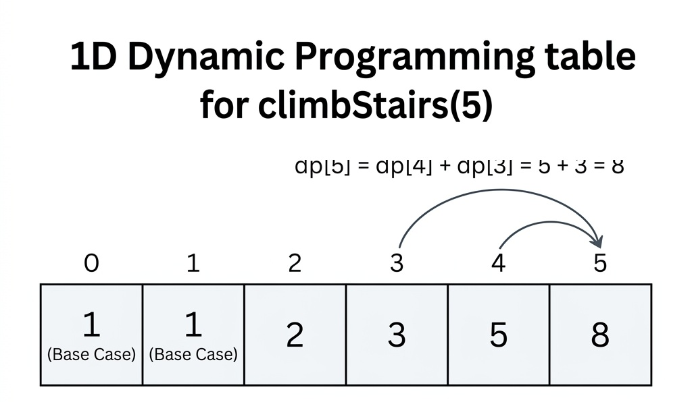{width=65%}

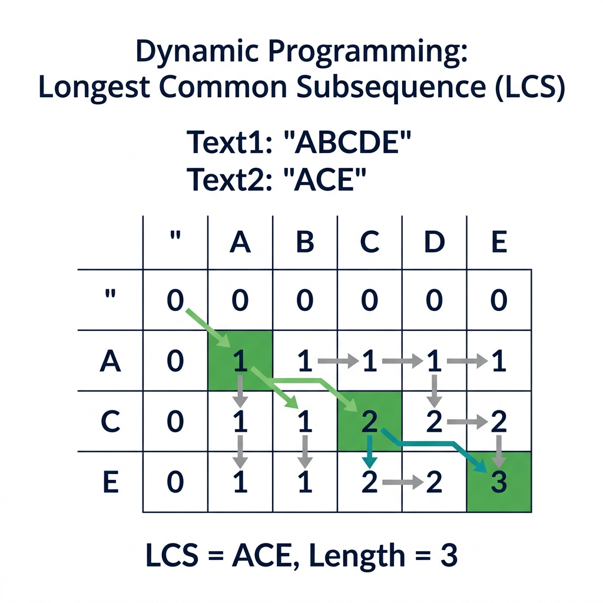{width=65%}

> **How to read this trace:** The DP table is filled row by row. When the characters match (diagonal green arrow), we take the diagonal value + 1. When they don't match (gray), we take the maximum of the cell above or to the left. The backtrack path (highlighted) reveals the LCS itself.


### Topological Sort (Dependency Ordering)

Topological Sort produces a linear ordering of vertices in a Directed Acyclic Graph (DAG) such that for every edge $(u, v)$, vertex $u$ comes before $v$. It is the standard answer for dependency resolution problems — course prerequisites, build system task ordering, and microservice deployment sequencing.

**When to use it:** The problem mentions "prerequisites," "dependencies," "ordering constraints," or asks you to detect cycles in a directed graph.

**The Invariant.** A node is only processed after all of its incoming dependencies have been resolved. In Kahn's algorithm, a node enters the queue only when its in-degree reaches zero.

```python
from collections import deque

def topological_sort(num_nodes: int, edges: list[list[int]]) -> list[int]:
    adj = [[] for _ in range(num_nodes)]
    in_degree = [0] * num_nodes

    for src, dst in edges:
        adj[src].append(dst)
        in_degree[dst] += 1

    queue = deque(i for i in range(num_nodes) if in_degree[i] == 0)

    order = []
    while queue:
        node = queue.popleft()
        order.append(node)
        for neighbor in adj[node]:
            in_degree[neighbor] -= 1
            if in_degree[neighbor] == 0:
                queue.append(neighbor)

    if len(order) != num_nodes:
        raise ValueError("Cycle detected")
    return order
```


> **Interview Signal:** If the result list size is less than the total node count, a cycle exists in the graph. This is how you detect circular dependencies in build systems or deadlocks in task schedulers.


### Union-Find (Disjoint Set Union)

Union-Find tracks which elements belong to the same connected group. It supports two operations in near-constant time: `find(x)` (which group does x belong to?) and `union(x, y)` (merge the groups of x and y).

**When to use it:** The problem asks about connectivity, connected components, grouping, or redundant connections in an undirected graph. Classic problems include "Number of Provinces," "Redundant Connection," and network clustering.

**The Invariant.** Every element points to a representative (root) of its group. Path compression flattens the tree on every `find()` call, keeping operations amortized $O(\alpha(N))$ — effectively constant.

```python
class UnionFind:
    def __init__(self, n: int):
        self.parent = list(range(n))
        self.rank = [0] * n
        self.component_count = n

    def find(self, x: int) -> int:
        if self.parent[x] != x:
            self.parent[x] = self.find(self.parent[x])  # Path compression
        return self.parent[x]

    def union(self, x: int, y: int) -> bool:
        root_x, root_y = self.find(x), self.find(y)
        if root_x == root_y:
            return False
        if self.rank[root_x] < self.rank[root_y]:
            root_x, root_y = root_y, root_x
        self.parent[root_y] = root_x
        if self.rank[root_x] == self.rank[root_y]:
            self.rank[root_x] += 1
        self.component_count -= 1
        return True
```


### Tries (Prefix Trees)

A Trie is a tree-shaped data structure where each node represents a character, and paths from root to leaf form complete words. It enables $O(L)$ prefix lookup (where $L$ is the word length), regardless of how many words are stored.

**When to use it:** The problem involves autocomplete, spell checking, prefix matching, word search in a grid, or dictionary operations. Classic problems include "Implement Trie," "Word Search II," and "Design Search Autocomplete System."

**The Invariant.** Every path from the root to a node marked `isEnd = true` represents a valid word in the dictionary.

```python
class TrieNode:
    def __init__(self):
        self.children: dict[str, 'TrieNode'] = {}
        self.is_end: bool = False

class Trie:
    def __init__(self):
        self.root = TrieNode()

    def insert(self, word: str) -> None:
        node = self.root
        for c in word:
            if c not in node.children:
                node.children[c] = TrieNode()
            node = node.children[c]
        node.is_end = True

    def search(self, word: str) -> bool:
        node = self._find_node(word)
        return node is not None and node.is_end

    def starts_with(self, prefix: str) -> bool:
        return self._find_node(prefix) is not None

    def _find_node(self, s: str) -> TrieNode | None:
        node = self.root
        for c in s:
            if c not in node.children:
                return None
            node = node.children[c]
        return node
```


### Heaps and Priority Queues (Top-K Problems)

A heap (min-heap or max-heap) maintains a partially sorted structure that allows $O(\log N)$ insertion and $O(1)$ access to the smallest (or largest) element. It is the standard answer for "Top-K" problems.

**When to use it:** The problem asks for the K-th largest element, K most frequent elements, median from a data stream, or any scenario requiring efficient access to extreme values while processing a continuous flow of data.

**The Invariant.** A min-heap of size K always contains the K largest elements seen so far. The heap's root is the K-th largest.

```python
import heapq

def find_kth_largest(nums: list[int], k: int) -> int:
    min_heap: list[int] = []
    for num in nums:
        heapq.heappush(min_heap, num)
        if len(min_heap) > k:
            heapq.heappop(min_heap)
    return min_heap[0]
```


**Dual-Heap Pattern for Streaming Median.** Maintain a max-heap (lower half) and a min-heap (upper half). The median is either the top of the max-heap or the average of both tops. This is a frequently asked senior-level problem.


**K-way Merge Pattern.** Merging $K$ sorted lists or arrays into a single sorted list is a very common priority queue pattern. It is the engine behind external sorting algorithms and distributed log mergers.

Here is the implementation:

```python
import heapq
from typing import List

class KWayMerge:
    """
    Merges K sorted lists into one sorted list using a Min-Heap.
    Time Complexity: O(N log K) where N is total elements, K is number of lists.
    Space Complexity: O(K) auxiliary space for the heap.
    """

    def merge_k_lists(self, lists: List[List[int]]) -> List[int]:
        min_heap = []
        result = []

        # 1. Initialize heap with the first element of each list
        # Heap stores tuples: (value, list_index, element_index)
        for i in range(len(lists)):
            if lists[i]:
                # We push the tuple into the heap. heapq compares elements element-by-element,
                # so it will sort primarily by lists[i][0] (the value).
                heapq.heappush(min_heap, (lists[i][0], i, 0))

        # 2. Extract min and push the next element from that list
        while min_heap:
            val, list_idx, elem_idx = heapq.heappop(min_heap)
            result.append(val)

            next_elem_idx = elem_idx + 1
            if next_elem_idx < len(lists[list_idx]):
                heapq.heappush(min_heap, (lists[list_idx][next_elem_idx], list_idx, next_elem_idx))

        return result
```


**Merge Invariant:** A Min-Heap of size $K$ holds the current smallest unprocessed element from each of the $K$ sorted lists. We pop the smallest element from the heap, append it to our result, and then insert the *next* element from that same list into the heap. This maintains a running frontier of sorted candidates, completing in $O(N \log K)$ time.


### Bit Manipulation

Bit manipulation uses bitwise operators (`&`, `|`, `^`, `~`, `<<`, `>>`) to solve problems in $O(1)$ space and often $O(N)$ time. While less common, it appears in high-stakes assessments to test low-level thinking.

**When to use it:** The problem involves finding a single unique number among duplicates, power-of-two checks, counting set bits, or toggling flags without extra memory.

**Key Bit Tricks:**

**XOR for finding the unique element.** XOR of a number with itself is zero. XOR of a number with zero is itself. So XORing all elements cancels out duplicates.

```python
def single_number(nums: list[int]) -> int:
    result = 0
    for num in nums:
        result ^= num  # Duplicates cancel: a ^ a = 0, 0 ^ b = b
    return result
```


**Power of two check.** A number is a power of two if and only if it has exactly one bit set: `n > 0 && (n & (n - 1)) == 0`.


## The Eight Worked Archetypal Problems

To reinforce these structural patterns, we will walk through eight canonical LeetCode problems. For each problem, we define the invariants, analyze the design boundaries, and provide optimal multi-language implementations.

### Problem 1: Sliding Window Maximum (Hard)
Given an array of integers `nums`, there is a sliding window of size `k` which is moving from the very left of the array to the very right. You can only see the `k` numbers in the window. Each time the sliding window moves right by one position. Return the max sliding window.

#### Design Invariants

1. **Window Boundaries:** The indices in the deque must always reside within the range $[i - k + 1, i]$.
2. **Decreasing Order:** The deque must store indices such that their corresponding values are in strictly descending order. Thus, `deque.peekFirst()` always returns the index of the maximum element in the current window.

```python
from collections import deque

def maxSlidingWindow(nums: list[int], k: int) -> list[int]:
    if not nums:
        return []
    n = len(nums)
    result = []
    q = deque()
    for i in range(n):
        if q and q[0] < i - k + 1:
            q.popleft()
        while q and nums[q[-1]] < nums[i]:
            q.pop()
        q.append(i)
        if i >= k - 1:
            result.append(nums[q[0]])
    return result
```


### Problem 2: Container With Most Water (Medium)
Given `n` non-negative integers $a_1, a_2, \dots, a_n$, where each represents a point at coordinate $(i, a_i)$. `n` vertical lines are drawn such that the two endpoints of the line $i$ is at $(i, a_i)$ and $(i, 0)$. Find two lines, which, together with the x-axis forms a container, such that the container contains the most water.

#### Design Invariants

1. **Search Space:** The maximum area must lie within the current boundaries $[left, right]$.
2. **Greedy Elimination:** The pointer pointing to the shorter vertical line can be safely moved inward because maintaining it can never yield a larger area (as width decreases and height is limited by the shorter line).

```python
def maxArea(height: list[int]) -> int:
    max_val = 0
    left = 0
    right = len(height) - 1
    while left < right:
        width = right - left
        current_height = min(height[left], height[right])
        max_val = max(max_val, width * current_height)
        if height[left] < height[right]:
            left += 1
        else:
            right -= 1
    return max_val
```


### Problem 3: Merge Intervals (Medium)
Given an array of `intervals` where $intervals[i] = [start_i, end_i]$, merge all overlapping intervals, and return an array of the non-overlapping intervals that cover all the intervals in the input.

#### Design Invariants

1. **Sorting Invariant:** Sorting intervals by their start times ensures that overlapping intervals are contiguous in the sorted list.
2. **Overlap Condition:** An overlap occurs if and only if $interval[start] \le current\_merged[end]$.

```python
def merge(intervals: list[list[int]]) -> list[list[int]]:
    if len(intervals) <= 1:
        return intervals
    intervals.sort(key=lambda x: x[0])
    merged = []
    for interval in intervals:
        if not merged or merged[-1][1] < interval[0]:
            merged.append(interval)
        else:
            merged[-1][1] = max(merged[-1][1], interval[1])
    return merged
```


### Problem 4: Word Search (Medium)
Given an $m \times n$ grid of characters `board` and a string `word`, return `true` if `word` exists in the grid. The word can be constructed from letters of sequentially adjacent cells, where adjacent cells are horizontally or vertically neighboring. The same letter cell may not be used more than once.

#### Design Invariants

1. **Grid Boundaries:** Recursion must immediately terminate if row $r$ or column $c$ is outside board boundaries.
2. **Path Uniqueness:** Cells in the current search path must be marked (e.g., replaced with `'#'`) to prevent reuse, and restored (backtracked) once the path exploration finishes.

```python
def exist(board: list[list[str]], word: str) -> bool:
    m, n = len(board), len(board[0])
    
    def dfs(r: int, c: int, idx: int) -> bool:
        if idx == len(word):
            return True
        if r < 0 or r >= m or c < 0 or c >= n or board[r][c] != word[idx]:
            return False
        temp = board[r][c]
        board[r][c] = '#'
        found = (dfs(r + 1, c, idx + 1) or
                 dfs(r - 1, c, idx + 1) or
                 dfs(r, c + 1, idx + 1) or
                 dfs(r, c - 1, idx + 1))
        board[r][c] = temp
        return found

    for i in range(m):
        for j in range(n):
            if dfs(i, j, 0):
                return True
    return False
```


### Problem 5: Longest Common Subsequence (Medium)
Given two strings `text1` and `text2`, return the length of their longest common subsequence. If there is no common subsequence, return 0.

#### Design Invariants

1. **DP State:** `dp[i][j]` represents the length of the longest common subsequence of `text1[0...i-1]` and `text2[0...j-1]`.
2. **Transition Rule:** If $text1[i-1] == text2[j-1]$, then $dp[i][j] = dp[i-1][j-1] + 1$. Otherwise, $dp[i][j] = \max(dp[i-1][j], dp[i][j-1])$.

```python
def longestCommonSubsequence(text1: str, text2: str) -> int:
    m, n = len(text1), len(text2)
    dp = [[0] * (n + 1) for _ in range(m + 1)]
    for i in range(1, m + 1):
        for j in range(1, n + 1):
            if text1[i - 1] == text2[j - 1]:
                dp[i][j] = dp[i - 1][j - 1] + 1
            else:
                dp[i][j] = max(dp[i - 1][j], dp[i][j - 1])
    return dp[m][n]
```


### Problem 6: Number of Islands (Medium)
Given an $m \times n$ 2D binary grid `grid` which represents a map of `'1'`s (land) and `'0'`s (water), return the number of islands. An island is surrounded by water and is formed by connecting adjacent lands horizontally or vertically.

#### Design Invariants

1. **Island Boundary:** Once an island cell `'1'` is discovered, all connected land cells must be sunk (set to `'0'`) via DFS to ensure the island is only counted once.

```python
def numIslands(grid: list[list[str]]) -> int:
    if not grid:
        return 0
    m, n = len(grid), len(grid[0])
    count = 0

    def dfs(r: int, c: int):
        if r < 0 or r >= m or c < 0 or c >= n or grid[r][c] != '1':
            return
        grid[r][c] = '0'
        dfs(r + 1, c)
        dfs(r - 1, c)
        dfs(r, c + 1)
        dfs(r, c - 1)

    for i in range(m):
        for j in range(n):
            if grid[i][j] == '1':
                count += 1
                dfs(i, j)
    return count
```


### Problem 7: Daily Temperatures (Medium)
Given an array of integers `temperatures` represents the daily temperatures, return an array `answer` such that `answer[i]` is the number of days you have to wait after the $i$-th day to get a warmer temperature. If there is no future day for which this is possible, keep `answer[i] == 0` instead.

#### Design Invariants

1. **Monotonic Stack Invariant:** The stack stores indices of temperatures in strictly descending order.
2. **Trigger Condition:** If the current temperature exceeds the temperature at the index stored at the top of the stack, we resolve that day's wait time and pop the stack.

```python
def dailyTemperatures(temperatures: list[int]) -> list[int]:
    n = len(temperatures)
    result = [0] * n
    stack = []
    for i in range(n):
        while stack and temperatures[stack[-1]] < temperatures[i]:
            idx = stack.pop()
            result[idx] = i - idx
        stack.append(i)
    return result
```


### Problem 8: Search in Rotated Sorted Array (Medium)
There is an integer array `nums` sorted in ascending order (with distinct values). Prior to being passed to your function, `nums` is possibly rotated at an unknown pivot index. Given the array `nums` after the rotation and an integer `target`, return the index of `target` if it is in `nums`, or `-1` if it is not in `nums`.

#### Design Invariants

1. **Sorted Half:** In any rotated sorted array split in half, at least one half of the array must be sorted.
2. **Search Boundary:** If the sorted half contains the target, narrow search to that half; otherwise, search the other half.

```python
def search(nums: list[int], target: int) -> int:
    left, right = 0, len(nums) - 1
    while left <= right:
        mid = left + (right - left) // 2
        if nums[mid] == target:
            return mid
        if nums[left] <= nums[mid]:
            if nums[left] <= target < nums[mid]:
                right = mid - 1
            else:
                left = mid + 1
        else:
            if nums[mid] < target <= nums[right]:
                left = mid + 1
            else:
                right = mid - 1
    return -1
```


## Mock General Coding Assessments

To replicate the pressure of a real speed run, practice with these two timed mock assessments.

### Mock GCA Test 1 (Target Time: 70 Minutes)

#### Q1: String Compression (Easy)
Given an array of characters `chars`, compress it using the following algorithm: Begin with an empty string `s`. For each group of consecutive repeating characters in `chars`: If the group's length is 1, append the character to `s`. Otherwise, append the character followed by the group's length. Return the new length of the array after compression. The design must update the input array in-place.

*   **Spec-Driven Analysis:** Use a two-pointer technique: one `read` pointer to scan the groups and one `write` pointer to write the compressed characters in-place.
*   **Invariants:** The `write` pointer must always be less than or equal to the `read` pointer.

```python
def compress(chars: list[str]) -> int:
    write = 0
    read = 0
    while read < len(chars):
        current_char = chars[read]
        count = 0
        while read < len(chars) and chars[read] == current_char:
            read += 1
            count += 1
        chars[write] = current_char
        write += 1
        if count > 1:
            for c in str(count):
                chars[write] = c
                write += 1
    return write
```

#### Q2: Rotate Image (Medium)
You are given an $n \times n$ 2D matrix representing an image, rotate the image by 90 degrees (clockwise) in-place.

*   **Spec-Driven Analysis:** To rotate a matrix 90 degrees clockwise in-place, transpose the matrix (swap `matrix[i][j]` with `matrix[j][i]`) and then reverse each row.
*   **Invariants:** Transposition only swaps elements where $j \ge i$ to prevent double-swapping back to original positions.

```python
def rotate(matrix: list[list[int]]) -> None:
    n = len(matrix)
    # Transpose
    for i in range(n):
        for j in range(i, n):
            matrix[i][j], matrix[j][i] = matrix[j][i], matrix[i][j]
    # Reverse each row
    for i in range(n):
        matrix[i].reverse()
```

#### Q3: Group Anagrams (Medium-Hard)
Given an array of strings `strs`, group the anagrams together. You can return the answer in any order.

*   **Spec-Driven Analysis:** Anagrams share the exact same character counts. Sort each string's characters to generate a unique canonical key for a HashMap.
*   **Invariants:** All strings mapped to the same HashMap key must be anagrams.

```python
def groupAnagrams(strs: list[str]) -> list[list[str]]:
    anagrams = {}
    for s in strs:
        key = "".join(sorted(s))
        if key not in anagrams:
            anagrams[key] = []
        anagrams[key].append(s)
    return list(anagrams.values())
```

#### Q4: Sliding Window Median (Hard)
Given an integer array `nums` and an integer `k`, there is a sliding window of size `k` which is moving from the very left of the array to the very right. Return the median array for each window position.

*   **Spec-Driven Analysis:** Track the median of the window dynamically. Balance elements between a Max-Heap (lower half) and a Min-Heap (upper half).
*   **Invariants:** `leftHeap.size() == rightHeap.size()` (even window) or `leftHeap.size() == rightHeap.size() + 1` (odd window).

```python
import bisect

def medianSlidingWindow(nums: list[int], k: int) -> list[float]:
    window = sorted(nums[:k])
    result = []
    
    def get_median(w, k_val):
        if k_val % 2 == 1:
            return float(w[k_val // 2])
        return (w[k_val // 2 - 1] + w[k_val // 2]) / 2.0

    result.append(get_median(window, k))
    
    for i in range(k, len(nums)):
        # Remove old element
        window.remove(nums[i - k])
        # Insert new element
        bisect.insort(window, nums[i])
        result.append(get_median(window, k))
        
    return result
```


### Mock GCA Test 2 (Target Time: 70 Minutes)

#### Q1: Valid Parentheses (Easy)
Given a string `s` containing just the characters `'('`, `')'`, `'{'`, `'}'`, `'['` and `']'`, determine if the input string is valid.

*   **Spec-Driven Analysis:** Use a stack to track open brackets. A closing bracket must match the most recently opened bracket.
*   **Invariants:** The stack contains unmatched open brackets in LIFO order.

```python
def isValid(s: str) -> bool:
    stack = []
    mapping = {")": "(", "}": "{", "]": "["}
    for char in s:
        if char in mapping:
            top_element = stack.pop() if stack else '#'
            if mapping[char] != top_element:
                return False
        else:
            stack.append(char)
    return not stack
```

#### Q2: Spiral Matrix (Medium)
Given an $m \times n$ matrix, return all elements of the matrix in spiral order.

*   **Spec-Driven Analysis:** Define four boundaries: `r1` (top row), `r2` (bottom row), `c1` (left col), and `c2` (right col). Traverse boundaries clockwise, updating limits.
*   **Invariants:** Traversal terminates once `r1 > r2` or `c1 > c2`.

```python
def spiralOrder(matrix: list[list[int]]) -> list[int]:
    if not matrix:
        return []
    result = []
    r1, r2 = 0, len(matrix) - 1
    c1, c2 = 0, len(matrix[0]) - 1
    while r1 <= r2 and c1 <= c2:
        for c in range(c1, c2 + 1):
            result.append(matrix[r1][c])
        for r in range(r1 + 1, r2 + 1):
            result.append(matrix[r][c2])
        if r1 < r2 and c1 < c2:
            for c in range(c2 - 1, c1, -1):
                result.append(matrix[r2][c])
            for r in range(r2, r1, -1):
                result.append(matrix[r][c1])
        r1 += 1
        r2 -= 1
        c1 += 1
        c2 -= 1
    return result
```

#### Q3: Subarray Sum Equals K (Medium-Hard)
Given an array of integers `nums` and an integer `k`, return the total number of continuous subarrays whose sum equals to `k`.

*   **Spec-Driven Analysis:** A subarray sum from index $i$ to $j$ is computed as $PrefixSum[j] - PrefixSum[i-1]$. Track prefix sums and their frequency in a HashMap.
*   **Invariants:** For any index $j$, if $PrefixSum[j] - k$ is present in the map, a matching subarray exists.

```python
def subarraySum(nums: list[int], k: int) -> int:
    count = 0
    sum_val = 0
    prefix_sums = {0: 1}
    for num in nums:
        sum_val += num
        if (sum_val - k) in prefix_sums:
            count += prefix_sums[sum_val - k]
        prefix_sums[sum_val] = prefix_sums.get(sum_val, 0) + 1
    return count
```

#### Q4: Median of Two Sorted Arrays (Hard)
Given two sorted arrays `nums1` and `nums2` of size `m` and `n` respectively, return the median of the two sorted arrays. The overall run time complexity should be $O(\log(m+n))$.

*   **Spec-Driven Analysis:** Binary search on the partition split of the smaller array. Partition the arrays such that the left half has the same size as the right half.
*   **Invariants:** Left partitions must be smaller than or equal to right partitions: $A[i-1] \le B[j]$ and $B[j-1] \le A[i]$.

```python
def findMedianSortedArrays(A: list[int], B: list[int]) -> float:
    if len(A) > len(B):
        A, B = B, A
    m, n = len(A), len(B)
    left, right = 0, m
    while left <= right:
        i = (left + right) // 2
        j = (m + n + 1) // 2 - i
        
        aLeft = float('-inf') if i == 0 else A[i - 1]
        aRight = float('inf') if i == m else A[i]
        bLeft = float('-inf') if j == 0 else B[j - 1]
        bRight = float('inf') if j == n else B[j]
        
        if aLeft <= bRight and bLeft <= aRight:
            if (m + n) % 2 == 1:
                return float(max(aLeft, bLeft))
            return (max(aLeft, bLeft) + min(aRight, bRight)) / 2.0
        elif aLeft > bRight:
            right = i - 1
        else:
            left = i + 1
    return 0.0
```


> ⭐ **STAR Moment: The Monotonic Stack Shortcut**
> 
> In coding tests, if a problem asks you to find the *"next greater element"* or *"next smaller element"* for every item in an array, it is a **Monotonic Stack** problem. Do not write nested loops. Push elements onto a stack, popping elements off when you find a value that exceeds the stack's tail. This reduces the time complexity from $O(N^2)$ to $O(N)$ instantly.
