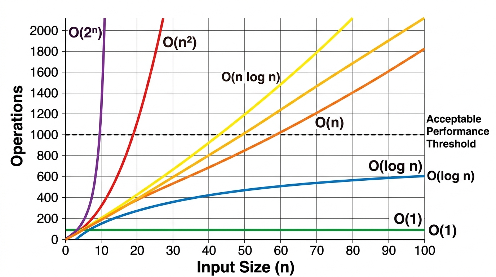

# Core Algorithms & Assessment Tactical Guide

> *"Algorithms are not trivia; they are the baseline vocabulary of computational efficiency under resource constraints."*

---

## The Veteran's Perspective: Patterns vs. Memorization

For senior engineers, architects, and engineering managers returning to technical assessments after years in leadership, coding assessments present a unique hurdle. You have architected distributed ledgers, managed multi-million-dollar technology budgets, and led high-performing engineering teams. Yet, when faced with a 70-minute timer and a blank editor window, a frustrating mental block occurs: your mind goes blank.

This happens because **algorithmic problem-solving is like mathematics**. You cannot master calculus by passively reading a textbook or watching someone solve equations on a whiteboard. Reading a solution creates a deceptive illusion of competence—you nod along, thinking, *"Yes, that makes sense."* But when you pick up the pencil (or open the IDE) to solve a problem from scratch, you realize you have not internalized the mechanics.

Furthermore, attempting to memorize hundreds of individual algorithm problems is a dangerous trap. Under time pressure, memorized code snippets dissolve. 

The only sustainable path back to coding mastery is **pattern-based problem solving**:
1. **Learn the 24 Canonical Programming Patterns**—the core mathematical invariants and code skeletons that govern all algorithmic problems.
2. **Analyze the problem structure** to map requirements directly to a pattern ID (`[PAT-01]` through `[PAT-24]`).
3. **Practice by doing.** Implement 2–3 problems for each pattern independently until the code skeleton becomes pure muscle memory.

When you master the 24 patterns below, you no longer need to memorize hundreds of solutions. You simply recognize the pattern, apply the appropriate code skeleton, and derive the solution cleanly on demand.

---

## General Coding Assessment (general coding assessment) Tactics

Standardized online coding assessments (e.g., General Coding Assessments, HackerRank, or Codility) evaluate speed, accuracy, and edge-case handling under severe time constraints. The most common format is the **70-Minute, 4-Question Speed Run**.

### The 4-Question Blueprint

| Question | Difficulty | Target Time | Primary Pattern Types | Tactical Rule |
|---|---|---|---|---|
| **Easy-tier** | Easy | 5–8 Min | `[PAT-01]`, `[PAT-02]` | Write clean, brute-force code immediately. Do not over-optimize. |
| **Medium-tier** | Medium | 10–12 Min | `[PAT-03]`, `[PAT-06]`, `[PAT-10]` | Watch for array bounds and off-by-one errors. |
| **Medium-Hard-tier** | Medium-Hard | 15–20 Min | `[PAT-04]`, `[PAT-13]`, `[PAT-14]` | Identify the window state or queue batching early. |
| **Hard-tier** | Hard | 20–25 Min | `[PAT-05]`, `[PAT-09]`, `[PAT-11]`, `[PAT-19]` | If brute force is $O(N^2)$, look for a monotonic property or DP state. |

### The 70-Minute general coding assessment Master Plan

1. **The 3-Minute Limit:** If you get stuck on a compile or logic bug for more than 3 minutes, comment out your changes, revert to your last working baseline, and rethink your boundary conditions.
2. **Never print in a loop:** Printing to standard output inside loops kills execution speed and causes hidden test timeouts.
3. **Submit immediately:** Once your solution passes visible test cases, submit it and move on.
4. **Strategic Order (1 -> 2 -> 4 -> 3):** On platforms like automated testing platforms, Hard-tier is often worth significantly more points than Medium-Hard-tier and is usually more deterministic (e.g., Monotonic Stack or Binary Search) than Medium-Hard-tier, which can involve tedious simulation.

---

### Complexity Foundations: A Quick Reference

Before diving into the 25 canonical patterns, ensure you have instant recall of these complexity classes:

| Complexity | Name | Example | Max N for 1s |
|-----------|------|---------|-------------|
| O(1) | Constant | HashMap lookup | ∞ |
| O(log N) | Logarithmic | Binary search | 10^18 |
| O(N) | Linear | Single pass scan | 10^8 |
| O(N log N) | Linearithmic | Merge sort | 10^6 |
| O(N²) | Quadratic | Nested loops | 10^4 |
| O(2^N) | Exponential | Subset generation | 20-25 |
| O(N!) | Factorial | Permutations | 10-12 |

{width=85%}

**The Constraint-to-Complexity Rule:** Read the problem constraints FIRST. If N ≤ 10^4, O(N²) is acceptable. If N ≤ 10^5, you need O(N log N) or better. If N ≤ 10^6, you need O(N). This single rule eliminates 50% of wrong algorithm choices before you write a line of code.

{width=85%}

---

# The 24 Canonical Programming Patterns

The following catalog defines the 24 fundamental patterns of computational problem-solving. Each pattern represents a proven, invariant structure for solving a specific class of problems.

---

## Module 1: Array & String Mechanics

### [PAT-01] Direct Indexing & Frequency Buckets

- **Invariant:** When the input domain is finite (e.g., ASCII characters, digits $0..9$), a fixed-size array (`int[256]`) provides $O(1)$ direct-indexing lookup without hash overhead.
- **Mental Model:** Use the array index itself as the key.
- **Canonical Code Skeleton:**
```python
def first_unique_char(s: str) -> int:
    counts = [0] * 256
    for c in s:
        counts[ord(c)] += 1
    for i, c in enumerate(s):
        if counts[ord(c)] == 1:
            return i
    return -1
```

- **Diagnostic Triggers:** "First non-repeating character", "Anagram check", "Character frequency".
- **Boundary Conditions:** Ensure array size covers the domain (`256` for ASCII, `26` for lowercase English).
- **Real-World Application:** High-speed network packet inspection, audit log frequency counting.

---

### [PAT-02] In-Place Mutation & Two-Pointer Compaction

- **Invariant:** A `write` pointer tracks the boundary of valid elements while a `read` pointer scans the array, mutating data in-place in $O(1)$ extra space.
- **Mental Model:** Filter or compact elements in a single pass without allocating a new array.
- **Canonical Code Skeleton:**
```python
def remove_duplicates(nums: list[int]) -> int:
    if not nums:
        return 0
    write = 1
    for read in range(1, len(nums)):
        if nums[read] != nums[read - 1]:
            nums[write] = nums[read]
            write += 1
    return write
```

- **Diagnostic Triggers:** "In-place removal", "Compact array", "Move zeroes to end".
- **Boundary Conditions:** Handle empty array or single-element array upfront.
- **Real-World Application:** Memory defragmentation, log stream sanitization.

---

### [PAT-03] Prefix Sums & Range Query Invariants

- **Invariant:** The sum of elements between indices $i$ and $j$ equals `prefix[j + 1] - prefix[i]`, turning range sum queries into $O(1)$ operations.
- **Mental Model:** Precompute cumulative totals so any subarray sum is computed by subtraction.
- **Canonical Code Skeleton:**
```python
from collections import defaultdict

def subarray_sum(nums: list[int], k: int) -> int:
    pref_counts = defaultdict(int)
    pref_counts[0] = 1
    current_sum = 0
    count = 0
    
    for num in nums:
        current_sum += num
        if current_sum - k in pref_counts:
            count += pref_counts[current_sum - k]
        pref_counts[current_sum] += 1
        
    return count
```

- **Diagnostic Triggers:** "Subarray sum equals K", "Range sum queries", "Equal number of 0s and 1s".
- **Boundary Conditions:** Always initialize `prefCounts.put(0, 1)` to account for subarrays starting at index 0.
- **Real-World Application:** Financial ledger balance auditing, telemetry interval aggregation.

---

## Module 2: Windowing & Pointer Navigation

### [PAT-04] Dynamic Sliding Window (Variable Size)

- **Invariant:** Maintain a window `[left...right]`. Expand `right` to include elements. When constraint is violated, shrink from `left` until valid.
- **Mental Model:** An expanding and contracting net scanning an array.
- **Canonical Code Skeleton:**
```python
def longest_subarray(nums: list[int], k: int) -> int:
    left = 0
    result = 0
    zero_count = 0
    
    for right in range(len(nums)):
        if nums[right] == 0:
            zero_count += 1
            
        while zero_count > k:
            if nums[left] == 0:
                zero_count -= 1
            left += 1
            
        result = max(result, right - left + 1)
        
    return result
```

- **Diagnostic Triggers:** "Longest/shortest subarray satisfying condition X", "At most K distinct elements".
- **Boundary Conditions:** Set-based windows must shrink BEFORE expanding; HashMap/Sum-based windows expand FIRST then shrink.
- **Real-World Application:** Sliding-window rate limiters, network throughput monitoring.

---

### [PAT-05] Fixed-Size Monotonic Deque Window

- **Invariant:** Maintain a `Deque` of indices where corresponding values are strictly decreasing from front to back. Front always holds the maximum of the current window.
- **Mental Model:** A sliding window of fixed size $K$ that tracks max/min in $O(1)$ amortized time.
- **Canonical Code Skeleton:**
```python
from collections import deque

def max_sliding_window(nums: list[int], k: int) -> list[int]:
    dq = deque()
    res = []
    
    for i in range(len(nums)):
        while dq and dq[0] < i - k + 1:
            dq.popleft() # Expire
        while dq and nums[dq[-1]] < nums[i]:
            dq.pop() # Kill weaker
        dq.append(i)
        if i >= k - 1:
            res.append(nums[dq[0]])
            
    return res
```

- **Diagnostic Triggers:** "Maximum/minimum in every window of size K".
- **Boundary Conditions:** Deque stores INDICES, not values. Window is full when `i >= k - 1`.
- **Real-World Application:** Real-time SLA monitoring, financial tick-data peak detection.

---

### [PAT-06] Converging Two-Pointers

- **Invariant:** Two pointers start at opposite ends (`left = 0`, `right = n - 1`) of a sorted array and move inward based on comparison with target.
- **Mental Model:** Squeezing the search space from both boundaries.
- **Canonical Code Skeleton:**
```python
def two_sum_sorted(nums: list[int], target: int) -> list[int]:
    left, right = 0, len(nums) - 1
    while left < right:
        curr_sum = nums[left] + nums[right]
        if curr_sum == target:
            return [left, right]
        elif curr_sum < target:
            left += 1
        else:
            right -= 1
    return []
```

- **Diagnostic Triggers:** "Sorted array + find pair", "Container with most water", "Palindrome validation".
- **Boundary Conditions:** Array MUST be sorted. Loop condition is `left < right` (pointers must not overlap for pairs).
- **Real-World Application:** Order matching engines, debit-credit balance pairing.

---

### [PAT-07] Fast & Slow Pointers (Floyd's Cycle Detection)

- **Invariant:** `slow` moves 1 step while `fast` moves 2 steps. If a cycle exists, `fast` will eventually catch `slow`.
- **Mental Model:** Two runners on a circular track.
- **Canonical Code Skeleton:**
```python
def has_cycle(head: 'ListNode') -> bool:
    slow, fast = head, head
    while fast and fast.next:
        slow = slow.next
        fast = fast.next.next
        if slow == fast:
            return True
    return False
```

- **Diagnostic Triggers:** "Detect cycle in linked list", "Find duplicate number", "Happy number".
- **Boundary Conditions:** Check `fast != null && fast.next != null` to avoid `NullPointerException`.
- **Real-World Application:** Circular reference detection in graph engines, deadlock detection.

---

## Module 3: Stacks, Queues & Monotonic Structures

### [PAT-08] LIFO Matching & Expression Parsing

- **Invariant:** Push open symbols onto a stack. When a closing symbol is encountered, pop and verify it matches the expected opening symbol.
- **Mental Model:** Last-in, first-out validation of nested structures.
- **Canonical Code Skeleton:**
```python
def is_valid_parentheses(s: str) -> bool:
    stack = []
    for c in s:
        if c == '(':
            stack.append(')')
        elif c == '{':
            stack.append('}')
        elif c == '[':
            stack.append(']')
        elif not stack or stack.pop() != c:
            return False
    return len(stack) == 0
```

- **Diagnostic Triggers:** "Valid parentheses", "Evaluate expression", "Simplify file path".
- **Boundary Conditions:** Stack must be empty at the end. Check `stack.isEmpty()` before popping.
- **Real-World Application:** JSON/XML syntax parsers, compiler AST validation, undo stacks.

---

### [PAT-09] Monotonic Stack ("The Waiting Room")

- **Invariant:** Stack holds unresolved element indices in decreasing order. When a larger element arrives, it pops colder elements and resolves their answers.
- **Mental Model:** A waiting room where people stay until someone taller arrives to liberate them.
- **Canonical Code Skeleton:**
```python
def daily_temperatures(temps: list[int]) -> list[int]:
    ans = [0] * len(temps)
    stack = [] # Stores INDICES
    
    for i in range(len(temps)):
        while stack and temps[stack[-1]] < temps[i]:
            prev_idx = stack.pop()
            ans[prev_idx] = i - prev_idx
        stack.append(i)
        
    return ans
```

- **Diagnostic Triggers:** "Next greater element", "Daily temperatures", "Largest rectangle in histogram".
- **Boundary Conditions:** Store INDICES on stack, not values. Unresolved items remain `0` or `-1`.
- **Real-World Application:** Stock price drop alerts, automated threshold breach notifications.

---

## Module 4: Search Space & Decision Trees

### [PAT-10] Monotonic Partition Binary Search

- **Invariant:** In a rotated sorted array, at least one half (left or right) is always strictly sorted.
- **Mental Model:** Halving search space by identifying the sorted partition.
- **Canonical Code Skeleton:**
```python
def search_rotated(nums: list[int], target: int) -> int:
    left, right = 0, len(nums) - 1
    while left <= right:
        mid = left + (right - left) // 2
        if nums[mid] == target:
            return mid
            
        if nums[left] <= nums[mid]: # Left half sorted (MUST use <=)
            if nums[left] <= target < nums[mid]:
                right = mid - 1
            else:
                left = mid + 1
        else: # Right half sorted
            if nums[mid] < target <= nums[right]:
                left = mid + 1
            else:
                right = mid - 1
    return -1
```

- **Diagnostic Triggers:** "Search in rotated sorted array", "Find minimum in rotated sorted array".
- **Boundary Conditions:** Use `nums[left] <= nums[mid]` (with `<=`) to handle single-element partitions.
- **Real-World Application:** Distributed partition log search, sharded database key lookups.

---

### [PAT-11] Binary Search on Solution Range

- **Invariant:** When the answer lies within a known numeric range `[min...max]` and a predicate function `feasible(x)` is monotonic, binary search finds the optimal value.
- **Mental Model:** Guess the answer, test if it works, halve the range.
- **Canonical Code Skeleton:**
```python
def ship_within_days(weights: list[int], days: int) -> int:
    lo, hi = max(weights), sum(weights)
    
    def can_ship(capacity: int) -> bool:
        day_count = 1
        current_load = 0
        for w in weights:
            if current_load + w > capacity:
                day_count += 1
                current_load = 0
            current_load += w
        return day_count <= days

    while lo < hi:
        mid = lo + (hi - lo) // 2
        if can_ship(mid):
            hi = mid # Try smaller capacity
        else:
            lo = mid + 1 # Must increase capacity
            
    return lo
```

- **Diagnostic Triggers:** "Find minimum capacity", "Koko eating bananas", "Split array largest sum".
- **Boundary Conditions:** Define correct range bounds `[lo, hi]` upfront.
- **Real-World Application:** Capacity planning, thread pool sizing, rate limit optimization.

---

### [PAT-12] Backtracking & State-Space Pruning

- **Invariant:** Explore decision paths recursively; when a path violates constraints, backtrack (undo state change) and try the next branch.
- **Mental Model:** Exploring a maze by dropping breadcrumbs and stepping back when hitting a dead end.
- **Canonical Code Skeleton:**
```python
def backtrack(res: list[list[int]], path: list[int], nums: list[int], used: list[bool]) -> None:
    if len(path) == len(nums):
        res.append(list(path))
        return
        
    for i in range(len(nums)):
        if used[i]:
            continue
        used[i] = True
        path.append(nums[i])
        backtrack(res, path, nums, used) # Recurse
        path.pop() # Undo (backtrack)
        used[i] = False
```

- **Diagnostic Triggers:** "Generate all permutations/combinations", "Sudoku solver", "N-Queens".
- **Boundary Conditions:** Always make a deep copy `new ArrayList<>(path)` when adding to results.
- **Real-World Application:** Constraint satisfaction solvers, security permission path traversal.

---

## Module 5: Graph & Grid Traversals

### [PAT-13] Level-by-Level BFS Wavefront

- **Invariant:** Queue processes nodes layer-by-layer (`int size = queue.size()`). First time target is popped = shortest path in unweighted graph/grid.
- **Mental Model:** Water ripples expanding outward in concentric circles.
- **Canonical Code Skeleton:**
```python
from collections import deque

def shortest_path(grid: list[list[str]], start_r: int, start_c: int) -> int:
    rows, cols = len(grid), len(grid[0])
    queue = deque([(start_r, start_c)])
    visited = [[False] * cols for _ in range(rows)]
    visited[start_r][start_c] = True # Mark visited ON PUSH
    
    steps = 0
    dirs = [(1, 0), (-1, 0), (0, 1), (0, -1)]
    
    while queue:
        size = len(queue)
        for _ in range(size):
            curr_r, curr_c = queue.popleft()
            if grid[curr_r][curr_c] == 'E':
                return steps
                
            for dr, dc in dirs:
                nr, nc = curr_r + dr, curr_c + dc
                if (0 <= nr < rows and 0 <= nc < cols and 
                    not visited[nr][nc] and grid[nr][nc] != 'X'):
                    visited[nr][nc] = True # MARK ON PUSH!
                    queue.append((nr, nc))
        steps += 1
        
    return -1
```

- **Diagnostic Triggers:** "Shortest path in grid", "Minimum steps to reach goal", "Word ladder".
- **Boundary Conditions:** ALWAYS mark `visited = true` on `offer()`, NOT on `poll()`.
- **Real-World Application:** Network routing protocols, social network distance calculation.

---

### [PAT-14] Multi-Source BFS Parallel Spreading

- **Invariant:** Push ALL starting origin points into the Queue at time $t=0$. The wavefront expands from all origins simultaneously.
- **Mental Model:** Multiple fires starting at different spots and spreading at equal speed.
- **Canonical Code Skeleton:**
```python
from collections import deque

def oranges_rotting(grid: list[list[int]]) -> int:
    rows, cols = len(grid), len(grid[0])
    queue = deque()
    fresh_count = 0
    
    for r in range(rows):
        for c in range(cols):
            if grid[r][c] == 2:
                queue.append((r, c)) # Push ALL sources
            elif grid[r][c] == 1:
                fresh_count += 1
                
    if fresh_count == 0:
        return 0
        
    minutes = 0
    dirs = [(1, 0), (-1, 0), (0, 1), (0, -1)]
    
    while queue and fresh_count > 0:
        size = len(queue)
        minutes += 1
        for _ in range(size):
            curr_r, curr_c = queue.popleft()
            for dr, dc in dirs:
                nr, nc = curr_r + dr, curr_c + dc
                if 0 <= nr < rows and 0 <= nc < cols and grid[nr][nc] == 1:
                    grid[nr][nc] = 2 # Mutate grid as visited
                    fresh_count -= 1
                    queue.append((nr, nc))
                    
    return minutes if fresh_count == 0 else -1
```

- **Diagnostic Triggers:** "Rotting oranges", "Walls and gates", "Multi-point fire propagation".
- **Boundary Conditions:** Track remaining fresh target count to avoid extra minute increment.
- **Real-World Application:** Multi-datacenter cache invalidation, rumor/virus propagation modeling.

---

### [PAT-15] DFS Component Sinking & Flood Fill

- **Invariant:** Traverse connected component recursively; mutate cell value (`'1' -> '0'`) to mark visited and eliminate memory overhead.
- **Mental Model:** Sinking an island as you walk over it so you never visit it again.
- **Canonical Code Skeleton:**
```python
def num_islands(grid: list[list[str]]) -> int:
    def dfs_sink(r: int, c: int) -> None:
        if r < 0 or r >= len(grid) or c < 0 or c >= len(grid[0]) or grid[r][c] == '0':
            return
        grid[r][c] = '0' # Sink cell
        dfs_sink(r + 1, c)
        dfs_sink(r - 1, c)
        dfs_sink(r, c + 1)
        dfs_sink(r, c - 1)

    count = 0
    for r in range(len(grid)):
        for c in range(len(grid[0])):
            if grid[r][c] == '1':
                count += 1
                dfs_sink(r, c)
                
    return count
```

- **Diagnostic Triggers:** "Number of islands", "Surrounded regions", "Flood fill".
- **Boundary Conditions:** Base case must check bounds BEFORE accessing `grid[r][c]`.
- **Real-World Application:** Image segmentation, cluster isolation, GIS landmass detection.

---

### [PAT-16] Topological Sort (Kahn's & DFS)

- **Invariant:** Process nodes with in-degree 0 first. Reduces in-degree of neighbors. If processed count $< N$, a cycle exists.
- **Mental Model:** Resolving build dependencies in order.
- **Canonical Code Skeleton:**
```python
from collections import deque

def find_order(num_courses: int, prerequisites: list[list[int]]) -> list[int]:
    in_degree = [0] * num_courses
    adj = [[] for _ in range(num_courses)]
    
    for dest, src in prerequisites:
        adj[src].append(dest)
        in_degree[dest] += 1
        
    queue = deque([i for i in range(num_courses) if in_degree[i] == 0])
    
    order = []
    while queue:
        curr = queue.popleft()
        order.append(curr)
        for neighbor in adj[curr]:
            in_degree[neighbor] -= 1
            if in_degree[neighbor] == 0:
                queue.append(neighbor)
                
    return order if len(order) == num_courses else []
```

- **Diagnostic Triggers:** "Course schedule", "Task dependency ordering", "Build order".
- **Boundary Conditions:** Return empty array if `idx != numCourses` (cycle detected).
- **Real-World Application:** Maven/Gradle build execution, CI/CD pipeline stage ordering.

---

### [PAT-17] Disjoint Set Union (Union-Find)

- **Invariant:** Maintain connected sets using parent pointers with path compression and rank optimization for near $O(1)$ amortized `find` and `union`.
- **Mental Model:** Merging social groups and checking if two people share the same root leader.
- **Canonical Code Skeleton:**
```python
class UnionFind:
    def __init__(self, n: int):
        self.parent = list(range(n))
        self.rank = [0] * n
        
    def find(self, i: int) -> int:
        if self.parent[i] == i:
            return i
        self.parent[i] = self.find(self.parent[i]) # Path compression
        return self.parent[i]
        
    def union(self, i: int, j: int) -> bool:
        root_i = self.find(i)
        root_j = self.find(j)
        
        if root_i != root_j:
            if self.rank[root_i] < self.rank[root_j]:
                self.parent[root_i] = root_j
            elif self.rank[root_i] > self.rank[root_j]:
                self.parent[root_j] = root_i
            else:
                self.parent[root_j] = root_i
                self.rank[root_i] += 1
            return True
            
        return False # Already connected!
```

- **Diagnostic Triggers:** "Redundant connection", "Number of connected components", "Accounts merge".
- **Boundary Conditions:** Path compression `parent[i] = find(parent[i])` is essential for optimal speed.
- **Real-World Application:** Network topology clustering, distributed consensus membership tracking.

---

### [PAT-18] Weighted Shortest Path (Dijkstra / Min-Heap)

- **Invariant:** Use a `PriorityQueue` ordered by distance. Always expand the unvisited node with the smallest tentative distance.
- **Mental Model:** Exploring shortest path on a map with varying road costs.
- **Canonical Code Skeleton:**
```python
import heapq
from collections import defaultdict

def network_delay_time(times: list[list[int]], n: int, k: int) -> int:
    adj = defaultdict(list)
    for u, v, w in times:
        adj[u].append((v, w))
        
    pq = [(0, k)] # [dist, node]
    dist_map = {}
    
    while pq:
        d, node = heapq.heappop(pq)
        
        if node in dist_map:
            continue
        dist_map[node] = d
        
        for neighbor, weight in adj[node]:
            if neighbor not in dist_map:
                heapq.heappush(pq, (d + weight, neighbor))
                
    return max(dist_map.values()) if len(dist_map) == n else -1
```

- **Diagnostic Triggers:** "Network delay time", "Cheapest flight within K stops", "Shortest path with weights".
- **Boundary Conditions:** PriorityQueue stores `[node, total_distance]`. Skip already finalized nodes (`dist.containsKey(node)`).
- **Real-World Application:** Latency-based API gateway routing, Google Maps route optimization.

---

## Module 6: Dynamic Programming & Optimization

### [PAT-19] 1D Choice Optimization (O(1) Space DP)

- **Invariant:** State `dp[i]` depends only on `dp[i - 1]` and `dp[i - 2]`. Space can be optimized from $O(N)$ array to 2 variables (`prev1`, `prev2`).
- **Mental Model:** Making optimal choice between taking current item or skipping it.
- **Canonical Code Skeleton:**
```python
def rob(nums: list[int]) -> int:
    if not nums:
        return 0
    prev2, prev1 = 0, 0
    
    for num in nums:
        curr = max(prev1, prev2 + num) # Skip vs Take
        prev2 = prev1
        prev1 = curr
        
    return prev1
```

- **Diagnostic Triggers:** "House robber", "Climbing stairs", "Min cost climbing stairs".
- **Boundary Conditions:** Handle single-element input upfront.
- **Real-World Application:** Capacity allocation, CPU time-slot scheduling.

---

### [PAT-20] 0/1 & Unbounded Knapsack DP

- **Invariant:** `dp[w]` represents max value for capacity `w`. Iterate items and update capacity backwards for 0/1 (use item once) or forwards for unbounded (use item infinitely).
- **Mental Model:** Packing a backpack with items to maximize value without exceeding weight capacity.
- **Canonical Code Skeleton (Coin Change - Unbounded):**
```python
def coin_change(coins: list[int], amount: int) -> int:
    dp = [amount + 1] * (amount + 1)
    dp[0] = 0
    
    for i in range(1, amount + 1):
        for coin in coins:
            if i - coin >= 0:
                dp[i] = min(dp[i], dp[i - coin] + 1)
                
    return -1 if dp[amount] > amount else dp[amount]
```

- **Diagnostic Triggers:** "Coin change", "Partition equal subset sum", "Knapsack capacity".
- **Boundary Conditions:** Fill array with sentinel value (`amount + 1`) representing infinity.
- **Real-World Application:** Resource packing in cloud instances, currency change calculators.

---

### [PAT-21] 2D Grid Path Optimization

- **Invariant:** `dp[r][c]` represents min/max value to reach cell `(r, c)`, which depends on `dp[r - 1][c]` (from top) and `dp[r][c - 1]` (from left).
- **Mental Model:** Walking down and right on a grid accumulating values.
- **Canonical Code Skeleton:**
```python
def min_path_sum(grid: list[list[int]]) -> int:
    rows, cols = len(grid), len(grid[0])
    dp = [[0] * cols for _ in range(rows)]
    
    for r in range(rows):
        for c in range(cols):
            if r == 0 and c == 0:
                dp[r][c] = grid[r][c]
            elif r == 0:
                dp[r][c] = dp[r][c - 1] + grid[r][c]
            elif c == 0:
                dp[r][c] = dp[r - 1][c] + grid[r][c]
            else:
                dp[r][c] = min(dp[r - 1][c], dp[r][c - 1]) + grid[r][c]
                
    return dp[rows - 1][cols - 1]
```

- **Diagnostic Triggers:** "Minimum path sum", "Unique paths in grid", "Dungeon game".
- **Boundary Conditions:** Initialize first row and first column carefully.
- **Real-World Application:** Cost-effective data routing across grid-structured networks.

---

### [PAT-22] String Alignment & Sequence DP

- **Invariant:** `dp[i][j]` represents optimal alignment score for prefix `s1[0..i-1]` and `s2[0..j-1]`.
- **Mental Model:** 2D grid matching characters of two strings.
- **Canonical Code Skeleton (Longest Common Subsequence):**
```python
def longest_common_subsequence(text1: str, text2: str) -> int:
    m, n = len(text1), len(text2)
    dp = [[0] * (n + 1) for _ in range(m + 1)]
    
    for i in range(1, m + 1):
        for j in range(1, n + 1):
            if text1[i - 1] == text2[j - 1]:
                dp[i][j] = 1 + dp[i - 1][j - 1]
            else:
                dp[i][j] = max(dp[i - 1][j], dp[i][j - 1])
                
    return dp[m][n]
```

- **Diagnostic Triggers:** "Longest common subsequence", "Edit distance", "Wildcard matching".
- **Boundary Conditions:** Matrix dimensions are `(m + 1) x (n + 1)`. Access chars using `i - 1` and `j - 1`.
- **Real-World Application:** Git diff algorithms, DNA sequence alignment, text similarity search.

---

### [PAT-23] Sweep-Line & Interval Scheduling

- **Invariant:** Sort intervals by start time. Use a pointer or heap to process overlapping boundaries.
- **Mental Model:** Sweeping a vertical timeline left-to-right across time intervals.
- **Canonical Code Skeleton:**
```python
import heapq

def min_meeting_rooms(intervals: list[list[int]]) -> int:
    if not intervals:
        return 0
    intervals.sort(key=lambda x: x[0])
    
    min_heap = [intervals[0][1]] # Stores end times
    
    for i in range(1, len(intervals)):
        if intervals[i][0] >= min_heap[0]:
            heapq.heappop(min_heap) # Room freed up!
        heapq.heappush(min_heap, intervals[i][1]) # Allocate room
        
    return len(min_heap)
```

- **Diagnostic Triggers:** "Meeting rooms II", "Merge intervals", "Non-overlapping intervals".
- **Boundary Conditions:** Always sort intervals by start time `a[0] - b[0]` first.
- **Real-World Application:** Calendar scheduling engines, hotel room allocation, cloud VM provisioning.

---

### [PAT-24] Trie Prefix Search & Retrieval

- **Invariant:** Tree structure where each node represents a character. Root-to-node path forms a string prefix, enabling $O(L)$ word lookup where $L$ is word length.
- **Mental Model:** Dictionary tree branching by character.
- **Canonical Code Skeleton:**
```python
class TrieNode:
    def __init__(self):
        self.children = {}
        self.is_word = False

class Trie:
    def __init__(self):
        self.root = TrieNode()
        
    def insert(self, word: str) -> None:
        curr = self.root
        for c in word:
            if c not in curr.children:
                curr.children[c] = TrieNode()
            curr = curr.children[c]
        curr.is_word = True
        
    def search(self, word: str) -> bool:
        node = self._get_node(word)
        return node is not None and node.is_word
        
    def starts_with(self, prefix: str) -> bool:
        return self._get_node(prefix) is not None
        
    def _get_node(self, s: str) -> 'TrieNode':
        curr = self.root
        for c in s:
            if c not in curr.children:
                return None
            curr = curr.children[c]
        return curr
```

- **Diagnostic Triggers:** "Implement Trie", "Word search II (grid + dictionary)", "Replace words / autocomplete".
- **Boundary Conditions:** Use `c - 'a'` for lowercase alphabets. Set `isWord = true` at termination node.
- **Real-World Application:** Autocomplete search suggestions, IP routing prefix tables, spell checkers.

---

### [PAT-25] Priority Queue / Min-Max Heap

**Diagnostic Trigger:** "Find the K-th largest/smallest", "Merge K sorted lists", "Schedule tasks by priority", or any problem requiring efficient access to the minimum or maximum element while dynamically inserting.

**Invariant:** The heap property is maintained: for a min-heap, every parent node is ≤ its children. This guarantees O(1) access to the minimum and O(log N) insertion/extraction.

**Canonical Skeleton:**
```python
import heapq
from collections import Counter

def top_k_frequent(nums: list[int], k: int) -> list[int]:
    freq_map = Counter(nums)
    
    min_heap = []
    for num, count in freq_map.items():
        heapq.heappush(min_heap, (count, num))
        if len(min_heap) > k:
            heapq.heappop(min_heap)
            
    return [num for count, num in min_heap]
```


**Complexity:** O(N log K) time, O(N + K) space.

> **Note on Mathematical and Bit Manipulation Patterns:** Several common interview problems rely on mathematical properties (XOR for finding missing/duplicate numbers, modular arithmetic, Gauss's sum formula) or bitwise operations (bitmask DP, bit counting). These techniques are cross-cutting tools that complement the structural patterns above rather than forming standalone patterns. When you encounter a problem involving XOR properties, power-of-two checks, or bitmask state encoding, recognize these as mathematical invariants that can be combined with the canonical patterns.
