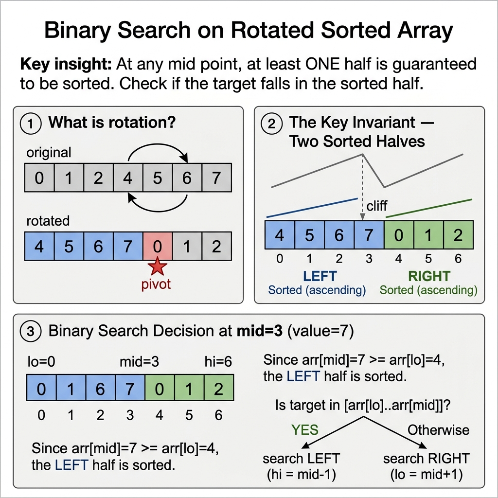
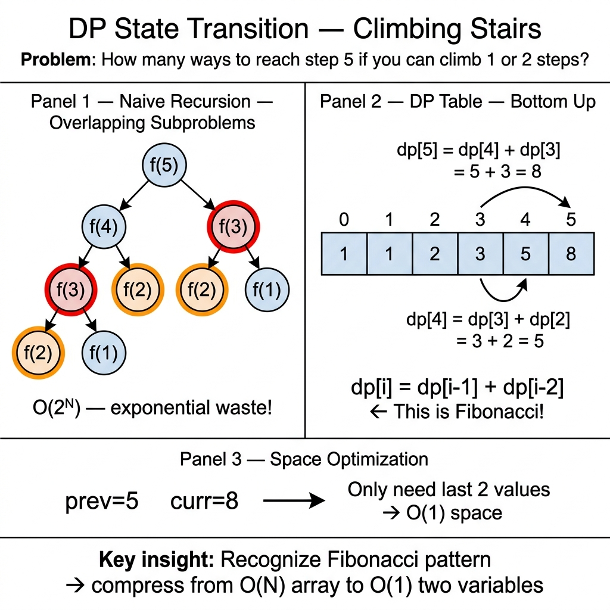
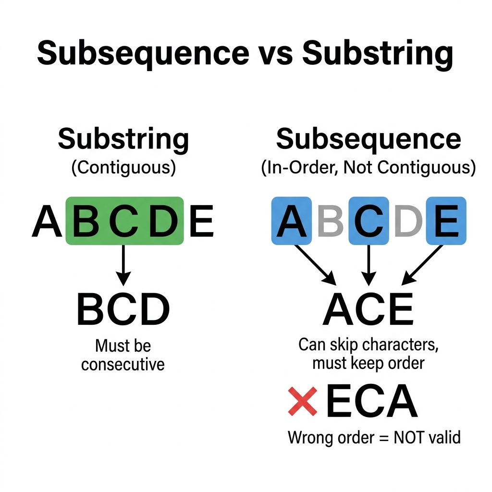
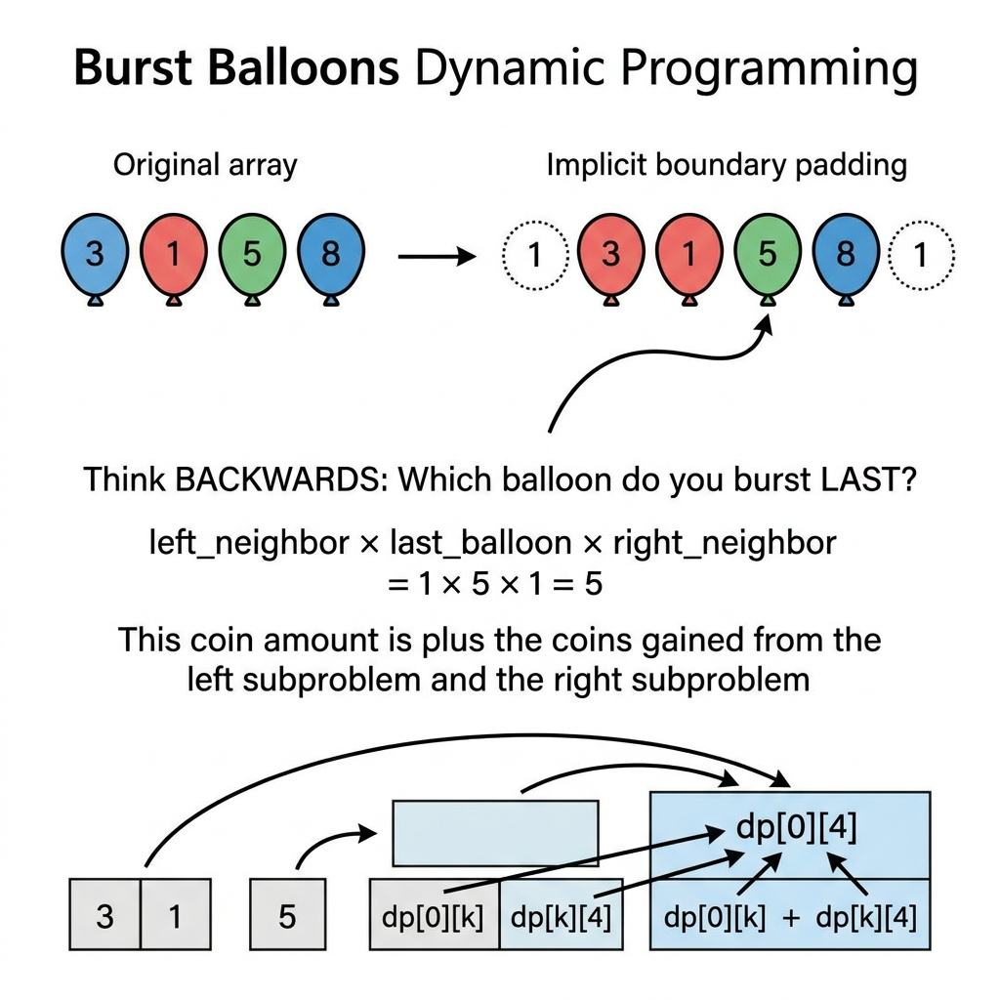
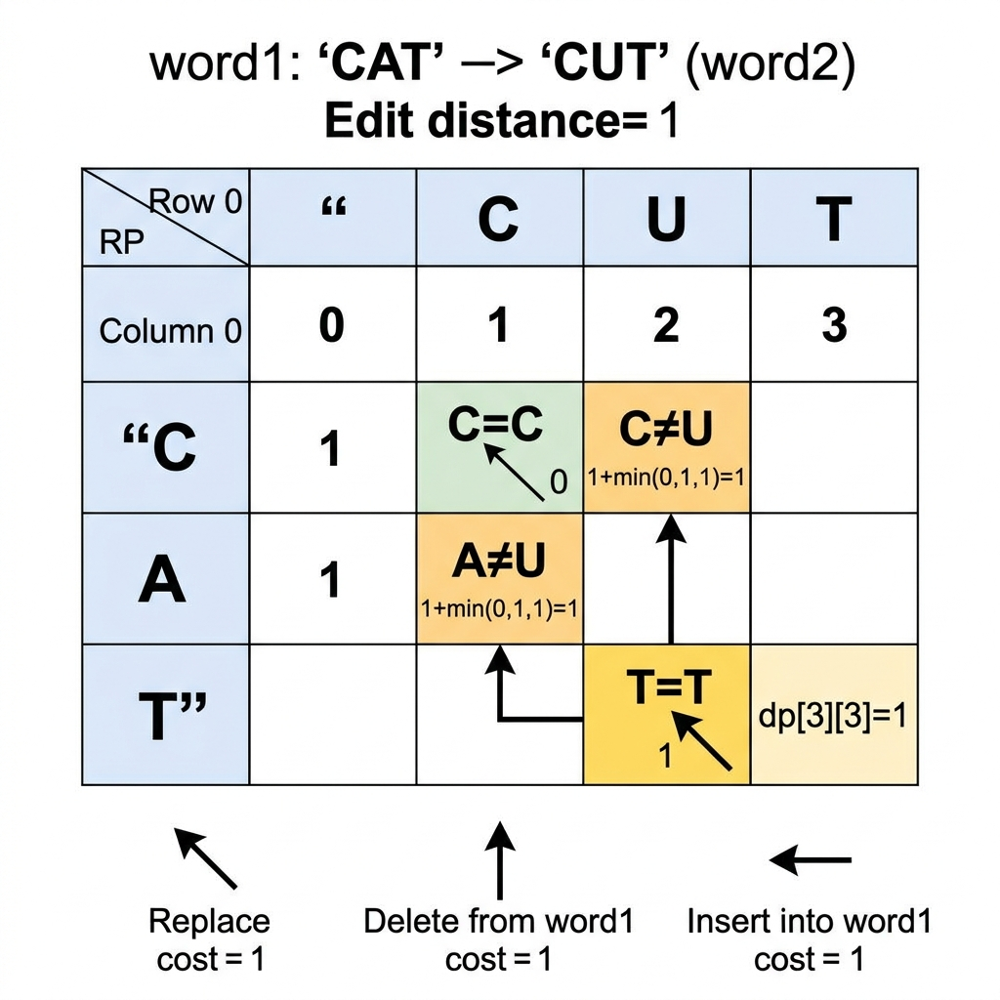
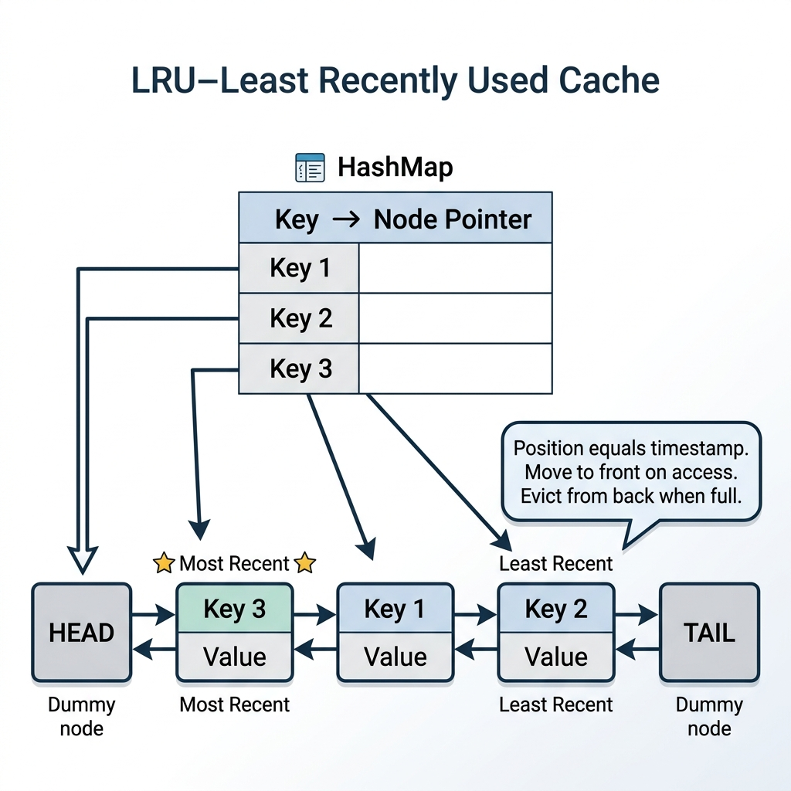
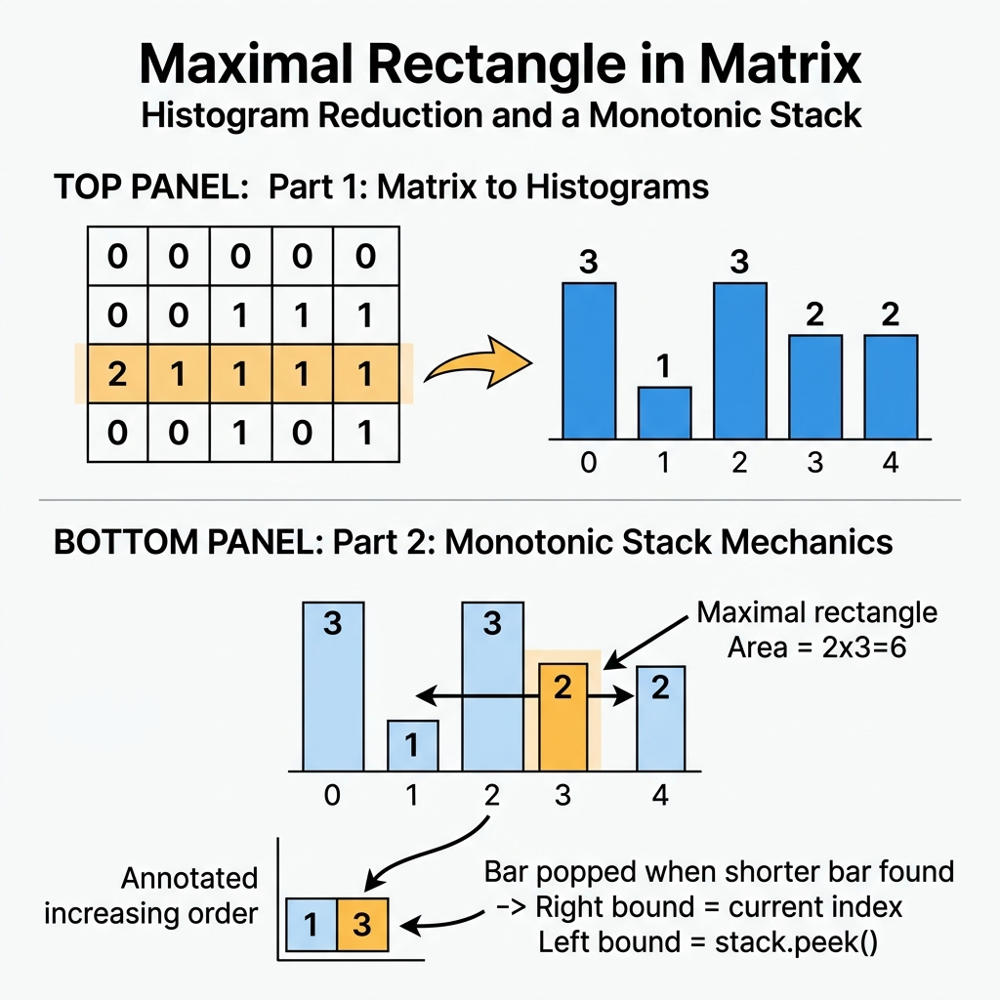

# Hard-tier Mastery — Algorithmic Optimization: Binary Search Variants, Monotonic Structures, Dynamic Programming, and Graph Algorithms

This chapter covers Hard-tier of the General Coding Assessments (Hard difficulty, ~25 minutes target time). Hard-tier is the most challenging question testing optimal $\mathcal{O}(\log N)$ or $\mathcal{O}(N)$ solutions, DP state transitions, and graph algorithms.

## Essential Terminology & Vocabulary

### Rotated Sorted Array & Monotonic Partition Invariant

**1. Conceptual Definition: What is a Rotated Sorted Array?**
A **Rotated Sorted Array** is an array that was originally sorted in ascending order (with unique elements), but has been shifted (rotated) at some unknown pivot index $K$.

For example, consider the original sorted array:
```
Original Sorted Array: [0, 1, 2, 4, 5, 6, 7]
```

If we rotate this array at pivot index $K = 3$ (shifting elements from index 3 onwards to the front), we get:

```
Rotated Sorted Array: [4, 5, 6, 7, 0, 1, 2]
```

Notice what happened:

- The single monotonically increasing sequence is split into **two sorted sub-arrays**: $[4, 5, 6, 7]$ (the left segment) and $[0, 1, 2]$ (the right segment).
- The array is no longer sorted overall, so standard Binary Search (which assumes `nums[left] <= nums[right]`) fails if implemented naively.

{width=85%}

* * *

**2. The Core Mathematical Invariant**
The key insight that allows us to achieve $\mathcal{O}(\log N)$ time complexity is the **Monotonic Partition Invariant**:

> **The Fundamental Invariant:** Whenever you split a Rotated Sorted Array into two halves using a midpoint `mid = left + (right - left) / 2`, **AT LEAST ONE OF THE TWO HALVES IS GUARANTEED TO BE STRICTLY MONOTONICALLY SORTED.**

> **Proof by Exhaustion.** Consider array `A[lo..hi]` with midpoint `mid = (lo + hi) / 2`. The rotation point (the index where `A[i] > A[i+1]`) can only exist in one contiguous segment.
> - **Case 1:** Rotation point is in `A[mid+1..hi]`. Then `A[lo..mid]` contains no rotation point, so `A[lo] ≤ A[lo+1] ≤ ... ≤ A[mid]` — the left half is sorted.
> - **Case 2:** Rotation point is in `A[lo..mid]`. Then `A[mid+1..hi]` contains no rotation point, so `A[mid+1] ≤ ... ≤ A[hi]` — the right half is sorted.
> - **Case 3:** No rotation point exists in `A[lo..hi]` (entire subarray is sorted). Both halves are sorted.
>
> In all cases, at least one half is sorted. ∎

- If `nums[left] <= nums[mid]`: The **LEFT half** `[left ... mid]` is monotonically sorted.
- If `nums[left] > nums[mid]`: The **RIGHT half** `[mid ... right]` is monotonically sorted.

* * *

**3. Step-by-Step Binary Search Decision Rule**
Because one half is always sorted, we can easily check if our `target` lies within the boundaries of that sorted half:

1. Calculate `mid = left + (right - left) / 2`.
2. If `nums[mid] == target`, return `mid` immediately.
3. Check which half is sorted:

   - **Case A: Left Half `[left ... mid]` is Sorted (`nums[left] <= nums[mid]`)**
     - Is `target` in range `[nums[left] ... nums[mid]]`?
       - If **Yes**: Eliminate the right half $\rightarrow$ `right = mid - 1`.
       - If **No**: Eliminate the left half $\rightarrow$ `left = mid + 1`.
   - **Case B: Right Half `[mid ... right]` is Sorted (`nums[left] > nums[mid]`)**
     - Is `target` in range `[nums[mid] ... nums[right]]`?
       - If **Yes**: Eliminate the left half $\rightarrow$ `left = mid + 1`.
       - If **No**: Eliminate the right half $\rightarrow$ `right = mid - 1`.

* * *

**4. Complete Worked Execution Trace (`nums = [4, 5, 6, 7, 0, 1, 2]`, `target = 0`)**

Let's trace searching for `target = 0`:

* **Iteration 1:**
  - `left = 0` (val `4`), `right = 6` (val `2`).
  - `mid = 0 + (6 - 0) / 2 = 3` $\rightarrow$ `nums[3] = 7`.
  - Is `nums[mid] == target`? `7 == 0` (False).
  - Check left half sortedness: `nums[0] (4) <= nums[3] (7)` $\rightarrow$ **Left Half `[4, 5, 6, 7]` IS SORTED.**
  - Is `target` (0) within `[4 ... 7]`? No (`0 < 4`).
  - Action: Eliminate left half $\rightarrow$ `left = mid + 1 = 4`.

* **Iteration 2:**
  - `left = 4` (val `0`), `right = 6` (val `2`).
  - `mid = 4 + (6 - 4) / 2 = 5` $\rightarrow$ `nums[5] = 1`.
  - Is `nums[mid] == target`? `1 == 0` (False).
  - Check left half sortedness: `nums[4] (0) <= nums[5] (1)` $\rightarrow$ **Left Half `[0, 1]` IS SORTED.**
  - Is `target` (0) within `[0 ... 1]`? Yes! (`0 >= 0` and `0 <= 1`).
  - Action: Eliminate right half $\rightarrow$ `right = mid - 1 = 4`.

* **Iteration 3:**
  - `left = 4` (val `0`), `right = 4` (val `0`).
  - `mid = 4 + (4 - 4) / 2 = 4` $\rightarrow$ `nums[4] = 0`.
  - Is `nums[mid] == target`? `0 == 0` (True!).
  - **Return index `4`!** (Exact $\mathcal{O}(\log N)$ solution reached in 3 steps).

### Binary Search on Answer Space (Parametric Binary Search)
**Definition:** A technique where we search for an optimal value (the "answer") within a known range `[low, high]` instead of searching for a specific element in an array. We use a monotonic predicate function (e.g., `canFulfill(mid)`) to determine whether a given value `mid` is feasible. 
**Why it matters:** It transforms optimization problems (e.g., "find the minimum capacity") into a series of simpler decision problems (e.g., "is capacity X sufficient?"), enabling $\mathcal{O}(N \log(\max - \min))$ solutions.
**When to use:** When the answer space is bounded, the feasibility function is monotonic (if $x$ is valid, $x+1$ is also valid, or vice versa), and calculating feasibility takes linear time $\mathcal{O}(N)$.

### Monotonic Stack & Deque
**Definition:** A stack or double-ended queue (deque) where elements are maintained in strictly increasing or strictly decreasing order. 
**Why it matters:** It provides $\mathcal{O}(1)$ amortized time complexity for range maximum/minimum lookups or finding the "next greater element". Elements are pushed and popped at most once.
**When to use:** Finding the next greater/smaller element, sliding window maximum/minimum, and calculating histogram areas.

### Dynamic Programming State Transition (1D, 2D, Interval DP)
**Definition:** The mathematical rule or formula that relates the solution of a larger problem to its smaller overlapping subproblems. 

- **1D DP:** The state depends on a single variable (e.g., index `i`). Transition: `dp[i] = dp[i-1] + dp[i-2]`.
- **2D DP:** The state depends on two variables (e.g., strings of length `i` and `j`). Transition: `dp[i][j] = ...`.
- **Interval DP:** The state is defined by a range `[i, j]`. Subproblems are smaller intervals within the range.

**Why it matters:** Properly defining the state and transition is the core of any DP solution. It turns exponential $\mathcal{O}(2^N)$ backtracking into polynomial time $\mathcal{O}(N)$ or $\mathcal{O}(N^2)$ solutions.

### Memoization vs Tabulation
**Definition:** The two primary methods for implementing Dynamic Programming.

| Feature | Memoization (Top-Down) | Tabulation (Bottom-Up) |
| --- | --- | --- |
| **Direction** | Start from the main problem, recursively call subproblems. | Start from base cases, iteratively build up to the main problem. |
| **State Storage** | Hash Map or Array. | N-dimensional Array. |
| **Overhead** | Recursive stack overhead (potential StackOverflow). | No recursive overhead, generally faster constant time. |
| **When to use** | When not all subproblems need to be evaluated. | When all subproblems will definitely be evaluated. |

### Knapsack Variants
**Definition:** A family of combinatorial optimization problems involving packing items into a capacity-constrained space to maximize value.

- **0/1 Knapsack:** Each item can be chosen at most once. Transition relies on picking or skipping: `dp[i][w] = max(dp[i-1][w], dp[i-1][w-weight[i]] + value[i])`.
- **Unbounded Knapsack:** Each item can be chosen infinitely many times.
- **Subset Sum:** A specialized 0/1 Knapsack where we want to know if a subset sums exactly to `target`.

**Why it matters:** They form the basis for numerous resource allocation and subset combination problems in technical interviews.

### Topological Sort
**Definition:** A linear ordering of vertices in a Directed Acyclic Graph (DAG) such that for every directed edge $U \rightarrow V$, vertex $U$ comes before $V$ in the ordering.
**Why it matters:** Kahn's Algorithm (using an in-degree array and queue) processes dependencies efficiently in $\mathcal{O}(V + E)$ time.
**When to use:** Task scheduling, resolving prerequisites (like courses or build systems), finding dependency cycles.

### BFS Shortest Path
**Definition:** Breadth-First Search traversal to find the shortest path in an **unweighted** graph. It processes nodes level-by-level using a Queue.
**Why it matters:** It guarantees that the first time a target node is reached, it is via the shortest possible path (fewest edges). 
**When to use:** Shortest path on grids or unweighted graphs, state transitions requiring fewest moves (like word ladders or minimum jumps).

### Two-pointer
**Definition:** Using two indices (usually `left` and `right`) to traverse a sequence simultaneously. 
**Why it matters:** It optimally narrows down search spaces without requiring extra memory, often reducing $\mathcal{O}(N^2)$ to $\mathcal{O}(N)$.
**When to use:** Finding pairs in sorted arrays, bounding areas (like trapping rain water or container with most water), and cycle detection.

### Greedy
**Definition:** Making the locally optimal choice at each step with the hope that these local choices lead to a globally optimal solution.
**Why it matters:** When a greedy choice property can be proven (e.g., via contradiction or exchange arguments), the algorithm is extremely fast and space-efficient.
**When to use:** Interval scheduling, jump games, Huffman coding, minimum spanning trees.

### DP State Compression
When processing a dynamic programming grid where the current row only depends on the previous row, this technique replaces `dp[N][M]` with two 1D arrays `prev[]` and `curr[]`.
Why it matters: It halves memory usage and often reduces O(N*M) space to O(M).

### Binary Search Loop Termination
This deals with the crucial choice between `while (lo < hi)` and `while (lo <= hi)` loops, paired with `mid = lo + (hi - lo) / 2` to prevent overflow. Choosing the wrong termination condition causes infinite loops.
Why it matters: Boundary conditions and termination logic are the #1 source of binary search bugs.

### Interval DP Framework
This DP pattern defines the state `dp[i][j]` as the optimal solution for a subarray from `i` to `j`. It enumerates a split point `k` to divide the interval into smaller subproblems.
Why it matters: It is essential for solving burst balloons, matrix chain multiplication, and palindrome partitioning.

### Union-Find (Disjoint Set Union)
This data structure tracks elements partitioned into disjoint subsets. It combines a `find()` method using path compression with a `union()` method utilizing union-by-rank to achieve near O(1) amortized operations.
Why it matters: It is the optimal structure for connected components, cycle detection, and Kruskal's Minimum Spanning Tree.

### Dijkstra's Algorithm
This is an optimal pathfinding algorithm that utilizes a priority queue for a breadth-first search on weighted edges. It processes nodes in order of shortest accumulated distance in O((V+E) log V) time.
Why it matters: It is the gold standard for solving single-source shortest path problems with non-negative weights.

### Backtracking Template
This pattern generates all possible configurations by exhaustively exploring decision trees. It strictly follows a "choose, explore, unchoose" structured layout with early pruning.
Why it matters: It is universally used to generate all combinations, permutations, and subsets in optimization problems.

### LRU Cache Architecture
This system design paradigm combines a `HashMap<Key, Node>` with a doubly linked list. The hash map provides instant access, while the list maintains temporal usage order.
Why it matters: It allows O(1) get and put operations by seamlessly combining hash lookup with ordered eviction.

### Fibonacci DP Recognition
This refers to identifying when a problem's state perfectly maps to the linear recurrence `dp[i] = dp[i-1] + dp[i-2]`. The entire array state can be compressed into two variables.
Why it matters: Problems like climbing stairs, decode ways, and tiling can be instantly recognized and compressed to O(1) space.

{width=85%}

* * *

## Reusable Code Templates

### Template A: Binary Search
```python
# Standard Binary Search
def binary_search(nums: list[int], target: int) -> int:
    left, right = 0, len(nums) - 1
    while left <= right:
        mid = left + (right - left) // 2
        if nums[mid] == target: return mid
        elif nums[mid] < target: left = mid + 1
        else: right = mid - 1
    return -1

# Binary Search on Answer Space (Leftmost valid)
def binary_search_answer_space(min_val: int, max_val: int) -> int:
    left, right = min_val, max_val
    best = -1
    while left <= right:
        mid = left + (right - left) // 2
        if is_valid(mid):
            best = mid
            right = mid - 1 # Try to find a smaller valid answer
        else:
            left = mid + 1
    return best
```

### Template B: Monotonic Stack
```python
def next_greater_element(self, nums: list[int]) -> list[int]:
    n = len(nums)
    result = [-1] * n
    stack = [] # stores indices
    for i in range(n):
        # Maintain strictly decreasing stack
        while stack and nums[i] > nums[stack[-1]]:
            prev_index = stack.pop()
            result[prev_index] = nums[i] # Found next greater!
        stack.append(i)
    return result
```

### Template C: 1D DP with State Compression
```python
def dp_state_compression(self, nums: list[int]) -> int:
    if not nums: return 0
    prev2 = 0 # dp[i-2]
    prev1 = nums[0] # dp[i-1]
    for i in range(1, len(nums)):
        curr = max(prev1, prev2 + nums[i])
        prev2 = prev1
        prev1 = curr
    return prev1
```

### Template D: BFS with Level Tracking
```python
def bfs_level(self, start: 'Node', target: 'Node') -> int:
    from collections import deque
    queue = deque([start])
    visited = {start}
    
    level = 0
    while queue:
        size = len(queue)
        for _ in range(size):
            curr = queue.popleft()
            if curr == target: return level
            
            for neighbor in curr.neighbors:
                if neighbor not in visited:
                    visited.add(neighbor)
                    queue.append(neighbor)
        level += 1 # Increment level after exploring all nodes at current depth
    return -1
```

### Template E: Topological Sort (Kahn's Algorithm)
```python
def topological_sort(self, num_nodes: int, edges: list[list[int]]) -> list[int]:
    from collections import deque
    adj = [[] for _ in range(num_nodes)]
    in_degree = [0] * num_nodes
    
    for u, v in edges:
        adj[v].append(u) # v -> u
        in_degree[u] += 1
        
    queue = deque(i for i in range(num_nodes) if in_degree[i] == 0)
    
    order = []
    while queue:
        curr = queue.popleft()
        order.append(curr)
        for neighbor in adj[curr]:
            in_degree[neighbor] -= 1
            if in_degree[neighbor] == 0:
                queue.append(neighbor)
                
    return order if len(order) == num_nodes else [] # Empty if cycle exists
```

* * *

## Solved Exemplar Problems

**1. Search in Rotated Sorted Array**
**Difficulty Classification:** This problem is classified as Medium on all major assessment platforms. It appears in this chapter because it demonstrates the advanced application of the Binary Search pattern **[PAT-10] Monotonic Partition Binary Search** with a modified invariant. For assessment preparation, treat this as a medium-tier warm-up before tackling the harder DP and graph problems in this chapter.
**Specification:** Given an integer array sorted in ascending order (with distinct values) and rotated at an unknown pivot, find the index of `target`.

**Example:** `nums = [4,5,6,7,0,1,2]`, `target = 0` $\rightarrow$ output `4`.

**Pattern:** Rotated Binary Search

**Explanation:** We use the monotonic partition invariant. At any midpoint, at least one half of the array is strictly sorted. We identify the sorted half and check if the target falls within its range.

```python
def search(self, nums: list[int], target: int) -> int:
    if not nums: return -1
    left, right = 0, len(nums) - 1
    
    while left <= right:
        mid = left + (right - left) // 2
        if nums[mid] == target: return mid
        
        # Left half is sorted
        if nums[left] <= nums[mid]:
            if nums[left] <= target < nums[mid]:
                right = mid - 1 # Target is in the sorted left half
            else:
                left = mid + 1 # Target must be in the right half
        # Right half is sorted
        else:
            if nums[mid] < target <= nums[right]:
                left = mid + 1 # Target is in the sorted right half
            else:
                right = mid - 1 # Target must be in the left half
    return -1
# Time Complexity: O(log N)
# Space Complexity: O(1)
```

* * *

**2. Sliding Window Maximum**
**Specification:** Return an array of the maximum values in every sliding window of size `K`.

**Example:** `nums = [1,3,-1,-3,5,3,6,7]`, `k = 3` $\rightarrow$ output `[3,3,5,5,6,7]`.

**Pattern:** Monotonic Deque

**Explanation:** We maintain a deque of indices such that the values are in strictly decreasing order. The front of the deque always holds the maximum element's index for the current window. We remove elements from the front that fall out of the window.

```python
def max_sliding_window(self, nums: list[int], k: int) -> list[int]:
    if not nums or k <= 0: return []
    n = len(nums)
    res = [0] * (n - k + 1)
    res_index = 0
    from collections import deque
    q = deque()
    
    for i in range(n):
        # Remove indices outside the current window
        if q and q[0] < i - k + 1:
            q.popleft()
        # Remove smaller elements (maintain decreasing order)
        while q and nums[q[-1]] < nums[i]:
            q.pop()
        q.append(i)
        
        # Record max for the window
        if i >= k - 1:
            res[res_index] = nums[q[0]]
            res_index += 1
            
    return res
# Time Complexity: O(N) since each element is pushed/popped at most once
# Space Complexity: O(K) for the deque
```

* * *

**3. Longest Common Subsequence**
**Specification:** Return the length of the longest common subsequence between two strings.

**Example:** `text1 = "abcde"`, `text2 = "ace"` $\rightarrow$ output `3` ("ace").

**Pattern:** 2D DP

> ⚠️ **Common Confusion: Subsequence ≠ Substring**
>
> A **substring** must be contiguous (`"BCD"` from `"ABCDE"`). A **subsequence** can skip characters but must preserve order (`"ACE"` from `"ABCDE"` — pick A, skip B, pick C, skip D, pick E). The order matters: `"ECA"` is **not** a valid subsequence of `"ABCDE"` because the characters appear in the wrong order.

{width=85%}

**Trace-Through:** For `text1 = "CAT"`, `text2 = "CART"`, the DP table builds the answer cell by cell. Each cell asks: "What is the longest common subsequence using only the first *i* characters of text1 and first *j* characters of text2?"

|  | "" | C | A | R | T |
|---|---|---|---|---|---|
| **""** | 0 | 0 | 0 | 0 | 0 |
| **C** | 0 | **1** ↖ | 1 ← | 1 ← | 1 ← |
| **A** | 0 | 1 ↑ | **2** ↖ | 2 ← | 2 ← |
| **T** | 0 | 1 ↑ | 2 ↑ | 2 ↑ | **3** ↖ |

- ↖ (diagonal + 1): Characters **match** — extend the LCS we had before both characters.
- ← or ↑ (max of left/above): Characters **don't match** — carry forward the best LCS from skipping one character.

The bold diagonal cells show: C matches C (1), A matches A (2), T matches T (3). The "R" in "CART" is simply skipped. **LCS = "CAT", length 3.**

**Explanation:** `dp[i][j]` represents the LCS of the prefixes of length `i` and `j`. If characters match, we add 1 to the result of `dp[i-1][j-1]`. If not, we take the max of skipping a character in either string.

```python
def longest_common_subsequence(self, text1: str, text2: str) -> int:
    if len(text1) < len(text2): return self.longest_common_subsequence(text2, text1)
    m, n = len(text1), len(text2)
    prev = [0] * (n + 1)
    curr = [0] * (n + 1)
    
    for i in range(1, m + 1):
        for j in range(1, n + 1):
            if text1[i - 1] == text2[j - 1]:
                curr[j] = prev[j - 1] + 1
            else:
                curr[j] = max(prev[j], curr[j - 1])
        prev, curr = curr, prev
        curr = [0] * (n + 1)
        
    return prev[n]
# Time Complexity: O(M * N)
# Space Complexity: O(min(M, N)) - Space compressed DP as taught in the vocabulary section.
```

* * *

**4. Burst Balloons**
> ⚠️ **Assessment Realism Note:** Interval DP problems like Burst Balloons are extremely unlikely in timed assessments (the O(N³) derivation requires 30+ minutes of focused work). This exemplar is included for comprehensive pattern coverage. For timed assessment practice, prioritize the multi-source BFS, 1D DP, and monotonic stack problems in this chapter.

**Specification:** Maximize coins by bursting balloons. Bursting `nums[i]` yields `nums[i-1] * nums[i] * nums[i+1]` coins.

**Example:** `nums = [3,1,5,8]` $\rightarrow$ output `167`.

**Pattern:** Interval DP

> ⚠️ **The Key Trick: Think BACKWARDS**
>
> The natural instinct is to simulate bursting balloons left-to-right, but that creates dependency chaos — bursting balloon `i` changes the neighbors of balloon `i+1`. Instead, ask: **"Which balloon do I burst LAST?"** If balloon `k` is the *last* to burst in interval `(i, j)`, then at that moment only `arr[i]` and `arr[j]` remain as its neighbors. This makes the left and right subproblems *independent*.

{width=85%}

**Trace-Through:** For `nums = [3, 1, 5, 8]`, we pad with 1s: `arr = [1, 3, 1, 5, 8, 1]`.

- **Interval length 1** (single balloons): burst `3` alone → `1×3×1 = 3`. Burst `1` alone → `3×1×5 = 15`. Burst `5` alone → `1×5×8 = 40`. Burst `8` alone → `5×8×1 = 40`.
- **Interval length 2** (pairs): Try each as the *last* to burst. E.g., for `(3,1)`: if `3` is last → `1×3×5 + dp[1][2] = 15 + 15 = 30`. If `1` is last → `1×1×5 + dp[0][1] = 5 + 3 = 8`. Best = `30`.
- **Build up** to the full interval `dp[0][5]` = `167`.

The three nested loops enumerate: interval length → starting position → which balloon is last.

**Explanation:** We think backwards: what is the LAST balloon to be burst in an interval `[left, right]`? This allows us to split the problem into independent subproblems. `dp[i][j]` is the max coins obtained from bursting balloons strictly between `i` and `j`.

```python
def max_coins(self, nums: list[int]) -> int:
    n = len(nums)
    arr = [1] + nums + [1] # Padding with 1s
    
    dp = [[0] * (n + 2) for _ in range(n + 2)]
    
    # len_ is the length of the interval strictly between i and j
    for len_ in range(1, n + 1):
        for i in range(n - len_ + 1):
            j = i + len_ + 1
            # k is the index of the LAST balloon to burst in (i, j)
            for k in range(i + 1, j):
                coins = arr[i] * arr[k] * arr[j] + dp[i][k] + dp[k][j]
                dp[i][j] = max(dp[i][j], coins)
                
    return dp[0][n + 1]
# Time Complexity: O(N^3)
# Space Complexity: O(N^2)
```

* * *

**5. Maximum Product Subarray**
**Specification:** Find a contiguous non-empty subarray with the maximum product.

**Example:** `nums = [2,3,-2,4]` $\rightarrow$ output `6` (subarray `[2,3]`).

**Pattern:** 1D DP (Min/Max Tracking)

**Explanation:** Since multiplying two negative numbers yields a positive number, we must track BOTH the maximum product and the minimum product ending at the current position.

```python
def max_product(self, nums: list[int]) -> int:
    if not nums: return 0
    max_val = min_val = result = nums[0]
    
    for i in range(1, len(nums)):
        # If current is negative, max and min will swap roles
        if nums[i] < 0:
            max_val, min_val = min_val, max_val
            
        max_val = max(nums[i], max_val * nums[i])
        min_val = min(nums[i], min_val * nums[i])
        result = max(result, max_val)
        
    return result
# Time Complexity: O(N)
# Space Complexity: O(1)
```

* * *

**6. Median of Two Sorted Arrays**
**Specification:** Find the median of two sorted arrays in $\mathcal{O}(\log(M+N))$ time.

**Example:** `nums1 = [1,3]`, `nums2 = [2]` $\rightarrow$ output `2.0`.

**Pattern:** Binary Search on Partitions

**Explanation:** We binary search for the correct partition index in the smaller array such that the left halves of both arrays contain exactly half the total elements, and the largest element on the left is $\le$ the smallest element on the right.

```python
def find_median_sorted_arrays(self, A: list[int], B: list[int]) -> float:
    if len(A) > len(B): return self.find_median_sorted_arrays(B, A) # ensure A is smaller
    m, n = len(A), len(B)
    left, right = 0, m
    
    while left <= right:
        i = (left + right) // 2 # partition A
        j = (m + n + 1) // 2 - i # partition B
        
        max_left_a = float('-inf') if i == 0 else A[i - 1]
        min_right_a = float('inf') if i == m else A[i]
        max_left_b = float('-inf') if j == 0 else B[j - 1]
        min_right_b = float('inf') if j == n else B[j]
        
        if max_left_a <= min_right_b and max_left_b <= min_right_a:
            # Correct partition found
            if (m + n) % 2 == 0:
                return (max(max_left_a, max_left_b) + min(min_right_a, min_right_b)) / 2.0
            else:
                return max(max_left_a, max_left_b)
        elif max_left_a > min_right_b:
            right = i - 1 # move partition left in A
        else:
            left = i + 1 # move partition right in A
            
    return 0.0
# Time Complexity: O(log(min(M, N)))
# Space Complexity: O(1)
```

* * *

**7. Trapping Rain Water**
**Specification:** Calculate how much rain water can be trapped after raining.

**Example:** `height = [0,1,0,2,1,0,1,3,2,1,2,1]` $\rightarrow$ output `6`.

**Pattern:** Two-Pointer

**Explanation:** The amount of water above a bar depends on `min(max_left, max_right)`. We use two pointers from both ends, safely moving the pointer that points to the strictly smaller max bound, adding water along the way.

```python
def trap(self, height: list[int]) -> int:
    if not height: return 0
    left, right = 0, len(height) - 1
    left_max = right_max = total_water = 0
    
    while left < right:
        if height[left] < height[right]:
            if height[left] >= left_max: left_max = height[left]
            else: total_water += left_max - height[left]
            left += 1
        else:
            if height[right] >= right_max: right_max = height[right]
            else: total_water += right_max - height[right]
            right -= 1
            
    return total_water
# Time Complexity: O(N)
# Space Complexity: O(1)
```

* * *

**8. Daily Temperatures**
*Note: While placed in this chapter for its use of the Monotonic Stack pattern **[PAT-09] Monotonic Stack ("The Waiting Room")**, this problem is a Medium-difficulty gateway to the pattern. Use it as a warm-up before tackling the harder exemplars below.*
**Specification:** Find the number of days you have to wait after each day to get a warmer temperature.

**Example:** `[73,74,75,71,69,72,76,73]` $\rightarrow$ output `[1,1,4,2,1,1,0,0]`.

**Pattern:** Monotonic Stack

**Explanation:** We maintain a stack of indices representing days where we haven't found a warmer day yet (decreasing order). When we find a warmer day, we pop from the stack and compute the wait time.

```python
def daily_temperatures(self, temperatures: list[int]) -> list[int]:
    n = len(temperatures)
    res = [0] * n
    stack = []
    
    for i in range(n):
        # While current temp is greater than temp at stack top
        while stack and temperatures[i] > temperatures[stack[-1]]:
            prev_index = stack.pop()
            res[prev_index] = i - prev_index
        stack.append(i)
        
    return res
# Time Complexity: O(N)
# Space Complexity: O(N)
```

* * *

**9. Edit Distance / Levenshtein**
**Specification:** Minimum insertions, deletions, substitutions to convert `word1` to `word2`.

**Example:** `word1 = "horse"`, `word2 = "ros"` $\rightarrow$ output `3`.

**Pattern:** 2D DP

> ⚠️ **The Three Operations — Mapped to Table Directions**
>
> At each cell, you choose the cheapest of three operations: **Replace** (↖ diagonal + 1), **Delete** from word1 (↑ up + 1), **Insert** into word1 (← left + 1). If characters already match, the diagonal costs 0 (no operation needed).

{width=85%}

**Trace-Through:** Convert `"CAT"` → `"CUT"` (answer: 1 — just replace A with U).

|  | "" | C | U | T |
|---|---|---|---|---|
| **""** | 0 | 1 | 2 | 3 |
| **C** | 1 | **0** ↖ | 1 | 2 |
| **A** | 2 | 1 | **1** ↖ | 2 |
| **T** | 3 | 2 | 2 | **1** ↖ |

- **Row 0 / Col 0** (base cases): Converting "" → "CUT" costs 3 inserts. Converting "CAT" → "" costs 3 deletes.
- **dp[1][1]:** C = C → match! Free! Diagonal `dp[0][0]` = 0.
- **dp[2][2]:** A ≠ U → mismatch. `1 + min(dp[1][1], dp[1][2], dp[2][1])` = `1 + min(0, 1, 1)` = **1** (replace A→U).
- **dp[3][3]:** T = T → match! Diagonal `dp[2][2]` = 1. **Answer: 1 edit.**

**Real-world use:** Spell checkers, DNA alignment, fuzzy string matching, and `git diff` all use variants of this algorithm.

**Explanation:** `dp[i][j]` is the edit distance between `word1` prefix length `i` and `word2` prefix length `j`. If characters match, cost is `dp[i-1][j-1]`. Otherwise, cost is `1 + min(insert, delete, replace)`.

```python
def min_distance(self, word1: str, word2: str) -> int:
    m, n = len(word1), len(word2)
    dp = [[0] * (n + 1) for _ in range(m + 1)]
    
    # Base cases
    for i in range(m + 1): dp[i][0] = i
    for j in range(n + 1): dp[0][j] = j
    
    for i in range(1, m + 1):
        for j in range(1, n + 1):
            if word1[i - 1] == word2[j - 1]:
                dp[i][j] = dp[i - 1][j - 1] # No op
            else:
                dp[i][j] = 1 + min(dp[i - 1][j - 1], # Replace
                                   dp[i - 1][j],     # Delete
                                   dp[i][j - 1])     # Insert
                                   
    return dp[m][n]
# Time Complexity: O(M * N)
# Space Complexity: O(M * N)
```

* * *

**10. LRU Cache**
**Specification:** Design a cache with Least Recently Used eviction policy supporting `get` and `put` in $\mathcal{O}(1)$ time.

**Pattern:** HashMap + Doubly Linked List

> ⚠️ **"Why no timestamp?" — Position IS the Timestamp**
>
> A common question is: "Shouldn't we store a timestamp for when each item was last used?" The answer is no — the **position in the linked list** is the timestamp. The node closest to HEAD was used most recently. The node closest to TAIL was used longest ago. Every `get()` or `put()` moves that node to the HEAD. No clock needed — the list order *is* the chronological record.

{width=85%}

**Trace-Through:** Cache capacity = 2.

| Operation | HashMap | Linked List (HEAD → TAIL) | Why |
|:-----------------|:-------------------|:--------------------------|:-------------------------------------------------------|
| `put(1, "A")` | {1→A} | **[1]** | First entry, goes to head |
| `put(2, "B")` | {1→A, 2→B} | **[2, 1]** | Newest at head |
| `get(1)` | {1→A, 2→B} | **[1, 2]** | Accessed 1 → move to head |
| `put(3, "C")` | {1→A, 3→C} | **[3, 1]** | Full! Evict tail (2). Add 3 at head |
| `get(2)` | returns -1 | **[3, 1]** | Key 2 was evicted |

Notice: after `get(1)`, key 1 moved to head, saving it from eviction. Key 2, untouched at the tail, got evicted when capacity was exceeded. **The list position told us which was "least recently used" without any timestamps.**

**Explanation:** The HashMap provides $\mathcal{O}(1)$ access to nodes. The Doubly Linked List maintains the eviction order. Moving a node to the head of the list designates it as most recently used.

```python
class Node:
    def __init__(self, key=0, val=0):
        self.key = key
        self.val = val
        self.prev = None
        self.next = None

class LRUCache:
    def __init__(self, capacity: int):
        self.capacity = capacity
        self.cache = {}
        self.head = Node()
        self.tail = Node()
        self.head.next = self.tail
        self.tail.prev = self.head

    def get(self, key: int) -> int:
        if key not in self.cache: return -1
        node = self.cache[key]
        self._remove(node)
        self._insert(node)
        return node.val

    def put(self, key: int, value: int) -> None:
        if key in self.cache:
            self._remove(self.cache[key])
        if len(self.cache) == self.capacity:
            lru = self.tail.prev
            self._remove(lru)
            del self.cache[lru.key]
            
        new_node = Node(key, value)
        self._insert(new_node)
        self.cache[key] = new_node

    def _remove(self, node: Node) -> None:
        node.prev.next = node.next
        node.next.prev = node.prev

    def _insert(self, node: Node) -> None:
        node.next = self.head.next
        node.next.prev = node
        self.head.next = node
        node.prev = self.head
# Time Complexity: O(1) for both get and put
# Space Complexity: O(Capacity)
```

* * *

**11. Maximal Rectangle in Binary Matrix**
**Specification:** Find the largest rectangle containing only `1`s in a 2D binary matrix.

**Example:** Input matrix $\rightarrow$ Output `6` (formed by the 2x3 rectangle of 1s in rows 1-2, cols 2-4):
```text
1 0 1 0 0
1 0 1 1 1
1 1 1 1 1
1 0 0 1 0
```

**Pattern:** Histogram Reduction + Monotonic Stack

> ⚠️ **The Two-Step Intuition: Row Histograms + Monotonic Stack**
>
> **Step 1 (Matrix $\rightarrow$ Histograms):** Process the matrix row by row. At each row, compute column heights. If `matrix[r][c] == '1'`, `heights[c] += 1`; if `'0'`, `heights[c] = 0`. Each row forms a 1D histogram.
>
> **Step 2 (Largest Rectangle in Histogram):** For any bar `K` of height `H`, how far can it stretch left and right? It stretches until it hits a **strictly shorter bar** on the left and right.
> - We maintain a stack of indices with **increasing heights**.
> - When we see a **shorter bar** at index `i`, the bar at `stack.peek()` cannot stretch right any further!
> - Pop the bar `h = heights[stack.pop()]`. Its right bound is `i`, its left bound is the new `stack.peek()`. 
> - $\text{Width} = i - \text{stack.peek()} - 1$. $\text{Area} = h \times \text{width}$.
> - A dummy bar of height `0` at `i = n` forces all remaining bars off the stack at the end.

{width=85%}

**Trace-Through (Monotonic Stack for Heights `[3, 1, 3, 2, 2]`):**

| Index `i` | Height `h` | Action | Stack State | Area Calculated |
|:---------:|:----------:|:-----------------------------|:------------|:----------------|
| 0 | 3 | Push 0 | `[0]` | — |
| 1 | 1 | `1 < 3` $\rightarrow$ Pop 0 (h=3) | `[]` | `height=3, width=1` $\rightarrow$ **3** |
| 1 | 1 | Push 1 | `[1]` | — |
| 2 | 3 | Push 2 | `[1, 2]` | — |
| 3 | 2 | `2 < 3` $\rightarrow$ Pop 2 (h=3) | `[1]` | `height=3, width=3-1-1=1` $\rightarrow$ **3** |
| 3 | 2 | Push 3 | `[1, 3]` | — |
| 4 | 2 | Push 4 | `[1, 3, 4]` | — |
| 5 (sentinel) | 0 | `0 < 2` $\rightarrow$ Pop 4 (h=2) | `[1, 3]` | `height=2, width=5-3-1=1` $\rightarrow$ **2** |
| 5 (sentinel) | 0 | `0 < 2` $\rightarrow$ Pop 3 (h=2) | `[1]` | `height=2, width=5-1-1=3` $\rightarrow$ **6** ✅ |
| 5 (sentinel) | 0 | `0 < 1` $\rightarrow$ Pop 1 (h=1) | `[]` | `height=1, width=5` $\rightarrow$ **5** |

**Explanation:** We treat each row as the base of a histogram and update heights. We then run the $\mathcal{O}(N)$ "Largest Rectangle in Histogram" algorithm using a monotonic stack on each row.

```python
def maximal_rectangle(self, matrix: list[list[str]]) -> int:
    if not matrix or not matrix[0]: return 0
    cols = len(matrix[0])
    heights = [0] * cols
    max_area = 0
    
    for row in matrix:
        # Update histogram heights
        for c in range(cols):
            heights[c] = heights[c] + 1 if row[c] == '1' else 0
        max_area = max(max_area, self._max_histogram(heights))
        
    return max_area

def _max_histogram(self, heights: list[int]) -> int:
    stack = []
    max_val = 0
    n = len(heights)
    
    for i in range(n + 1):
        h = 0 if i == n else heights[i]
        while stack and h < heights[stack[-1]]:
            height = heights[stack.pop()]
            width = i if not stack else i - stack[-1] - 1
            max_val = max(max_val, height * width)
        stack.append(i)
        
    return max_val
# Time Complexity: O(R * C)
# Space Complexity: O(C)
```

* * *

**12. Word Ladder**
**Specification:** Find the shortest sequence of word mutations from `beginWord` to `endWord`, changing one letter at a time, using a dictionary.

**Example:** `begin = "hit", end = "cog", list = ["hot","dot","dog","lot","log","cog"]` $\rightarrow$ output `5`.

**Pattern:** BFS

**Explanation:** We use BFS because we want the shortest path in an unweighted graph. For each word, we generate all valid next mutations and enqueue them, tracking the level.

```python
def ladder_length(self, begin_word: str, end_word: str, word_list: list[str]) -> int:
    word_set = set(word_list)
    if end_word not in word_set: return 0
    
    from collections import deque
    queue = deque([begin_word])
    level = 1
    
    while queue:
        for _ in range(len(queue)): # Level-by-level processing
            curr = queue.popleft()
            for j in range(len(curr)):
                for c in 'abcdefghijklmnopqrstuvwxyz':
                    if c == curr[j]: continue
                    next_word = curr[:j] + c + curr[j+1:]
                    if next_word == end_word: return level + 1
                    if next_word in word_set: # remove serves as 'visited' check
                        word_set.remove(next_word)
                        queue.append(next_word)
        level += 1
        
    return 0
# Time Complexity: O(M^2 * N) where M is word length, N is number of words
# Space Complexity: O(M * N)
```

* * *

**13. Coin Change**
**Specification:** Find the minimum number of coins needed to make up a given amount.

**Example:** `coins = [1,2,5]`, `amount = 11` $\rightarrow$ output `3`.

**Pattern:** 1D DP (Unbounded Knapsack)

**Explanation:** `dp[i]` is the minimum coins needed for amount `i`. We iterate through amounts and coins, taking the min of using the coin or not: `dp[i] = min(dp[i], dp[i - coin] + 1)`.

```python
def coin_change(self, coins: list[int], amount: int) -> int:
    dp = [amount + 1] * (amount + 1) # Fill with max invalid value
    dp[0] = 0
    
    for i in range(1, amount + 1):
        for coin in coins:
            if i >= coin:
                dp[i] = min(dp[i], dp[i - coin] + 1)
                
    return -1 if dp[amount] > amount else dp[amount]
# Time Complexity: O(Amount * N)
# Space Complexity: O(Amount)
```

* * *

**14. House Robber**
**Specification:** Maximum money you can rob from houses where you cannot rob adjacent houses.

**Example:** `[2,7,9,3,1]` $\rightarrow$ output `12`.

**Pattern:** 1D DP with State Compression

**Explanation:** The transition is `dp[i] = max(dp[i-1], dp[i-2] + nums[i])`. We only need to store the previous two values, saving space.

```python
def rob(self, nums: list[int]) -> int:
    if not nums: return 0
    prev1 = 0 # max so far excluding current
    prev2 = 0 # max so far including current (-2)
    
    for num in nums:
        temp = max(prev1, prev2 + num) # rob or don't rob
        prev2 = prev1
        prev1 = temp
        
    return prev1
# Time Complexity: O(N)
# Space Complexity: O(1)
```

* * *

**15. Regular Expression Matching**
**Specification:** Implement regex matching with support for `.` (any single char) and `*` (zero or more of the preceding char).

**Example:** `s = "ab", p = ".*"` $\rightarrow$ output `true`.

**Pattern:** 2D DP

**Explanation:** Complex transition logic based on whether we see a `*`. We either treat `*` as zero occurrences (`dp[i][j-2]`) or multiple occurrences (`dp[i-1][j]` if the preceding char matches).

```python
def is_match(self, s: str, p: str) -> bool:
    m, n = len(s), len(p)
    dp = [[False] * (n + 1) for _ in range(m + 1)]
    dp[0][0] = True
    
    # Match empty string with patterns like a*b*
    for j in range(1, n + 1):
        if p[j - 1] == '*': dp[0][j] = dp[0][j - 2]
        
    for i in range(1, m + 1):
        for j in range(1, n + 1):
            if p[j - 1] == '.' or p[j - 1] == s[i - 1]:
                dp[i][j] = dp[i - 1][j - 1] # Single char match
            elif p[j - 1] == '*':
                dp[i][j] = dp[i][j - 2] # Match zero times
                # If preceding char matches, match one or more times
                if p[j - 2] == '.' or p[j - 2] == s[i - 1]:
                    dp[i][j] = dp[i][j] or dp[i - 1][j]
                    
    return dp[m][n]
# Time Complexity: O(M * N)
# Space Complexity: O(M * N)
```

* * *

**16. Course Schedule II**
**Specification:** Return the ordering of courses you should take to finish all courses given prerequisite pairs `[course, prereq]`.

**Example:** `num = 4, prereqs = [[1,0],[2,0],[3,1],[3,2]]` $\rightarrow$ output `[0,1,2,3]`.

**Pattern:** Topological Sort (Kahn's)

**Explanation:** We count the in-degree of each course. A course with in-degree 0 has no prerequisites and can be taken. We enqueue it, take it, and decrement the in-degree of its neighbors.

```python
def find_order(self, num_courses: int, prerequisites: list[list[int]]) -> list[int]:
    in_degree = [0] * num_courses
    adj = [[] for _ in range(num_courses)]
    
    for dest, src in prerequisites:
        adj[src].append(dest)
        in_degree[dest] += 1
        
    from collections import deque
    q = deque(i for i in range(num_courses) if in_degree[i] == 0)
    
    res = []
    while q:
        curr = q.popleft()
        res.append(curr)
        for nxt in adj[curr]:
            in_degree[nxt] -= 1
            if in_degree[nxt] == 0:
                q.append(nxt)
                
    return res if len(res) == num_courses else [] # If not all courses taken, cycle exists
# Time Complexity: O(V + E)
# Space Complexity: O(V + E)
```

* * *

**17. Partition Equal Subset Sum**
**Specification:** Determine if an array can be partitioned into two subsets with equal sums.

**Example:** `nums = [1,5,11,5]` $\rightarrow$ output `true`.

**Pattern:** 0/1 Knapsack DP

**Explanation:** The problem translates to: "Is there a subset that sums exactly to `total_sum / 2`?" We use a 1D DP array where `dp[j]` is true if a sum `j` is achievable.

```python
def can_partition(self, nums: list[int]) -> bool:
    total = sum(nums)
    if total % 2 != 0: return False
    
    target = total // 2
    dp = [False] * (target + 1)
    dp[0] = True
    
    for num in nums:
        # Iterate backwards to avoid reusing the same element
        for j in range(target, num - 1, -1):
            dp[j] = dp[j] or dp[j - num]
            
    return dp[target]
# Time Complexity: O(N * Target)
# Space Complexity: O(Target)
```

* * *

**18. Decode Ways**
**Specification:** Given a string of digits, return the number of ways it can be decoded (`A=1`, `Z=26`).

**Example:** `s = "226"` $\rightarrow$ output `3` (BZ, VF, BBF).

**Pattern:** 1D DP

**Explanation:** Very similar to Fibonacci. The number of ways to decode up to `i` is the ways to decode up to `i-1` (if single digit valid) plus the ways to decode up to `i-2` (if two digits valid).

```python
def num_decodings(self, s: str) -> int:
    if not s or s[0] == '0': return 0
    n = len(s)
    dp = [0] * (n + 1)
    dp[0] = dp[1] = 1
    
    for i in range(2, n + 1):
        one_digit = int(s[i - 1:i])
        two_digits = int(s[i - 2:i])
        
        if 1 <= one_digit <= 9:
            dp[i] += dp[i - 1]
        if 10 <= two_digits <= 26:
            dp[i] += dp[i - 2]
            
    return dp[n]
# Time Complexity: O(N)
# Space Complexity: O(N) which can be optimized to O(1)
```

* * *

**19. Stock Span**
**Specification:** Design a class that calculates the stock's span (consecutive days prior where price was $\le$ today).

**Example:** `[100, 80, 60, 70, 60, 75, 85]` $\rightarrow$ output `[1, 1, 1, 2, 1, 4, 6]`.

**Pattern:** Monotonic Stack

**Explanation:** Maintain a stack of pairs `{price, span}`. If the incoming price is greater than the top of the stack, pop the stack and accumulate the span. This maintains a strictly decreasing stack.

```python
class StockSpanner:
    def __init__(self):
        # Array holds [price, span]
        self.stack = []
        
    def next(self, price: int) -> int:
        span = 1
        while self.stack and self.stack[-1][0] <= price:
            span += self.stack.pop()[1] # Accumulate previous spans
        self.stack.append([price, span])
        return span
# Time Complexity: Amortized O(1) per next() call
# Space Complexity: O(N)
```

* * *

**20. Longest Increasing Subsequence**
**Specification:** Find the length of the longest strictly increasing subsequence in an array.

**Example:** `nums = [10,9,2,5,3,7,101,18]` $\rightarrow$ output `4` (`[2,3,7,101]`).

**Pattern:** DP + Binary Search

**Explanation:** We maintain an array `tails` where `tails[i]` stores the smallest tail of all increasing subsequences of length `i+1`. We binary search the position to update in `tails`.

```python
def length_of_lis(self, nums: list[int]) -> int:
    tails = [0] * len(nums)
    size = 0
    for x in nums:
        left, right = 0, size
        while left != right:
            mid = left + (right - left) // 2
            if tails[mid] < x:
                left = mid + 1
            else:
                right = mid
        tails[left] = x
        if left == size: size += 1 # Found a larger element, expand LIS
    return size
# Time Complexity: O(N log N)
# Space Complexity: O(N)
```

* * *

**21. Find Minimum in Rotated Sorted Array**
**Specification:** Return the minimum element in a rotated sorted array in $\mathcal{O}(\log N)$.

**Example:** `[3,4,5,1,2]` $\rightarrow$ output `1`.

**Pattern:** Binary Search

**Explanation:** If `nums[mid] > nums[right]`, the minimum is in the right half. Else, the minimum is in the left half (including mid).
```python
def find_min(self, nums: list[int]) -> int:
    left, right = 0, len(nums) - 1
    while left < right:
        mid = left + (right - left) // 2
        if nums[mid] > nums[right]: left = mid + 1
        else: right = mid
    return nums[left]
# Time Complexity: O(log N)
# Space Complexity: O(1)
```

* * *

**22. Kth Smallest Element in Sorted Matrix**
**Specification:** Find the K-th smallest element in a matrix where rows and columns are sorted.

**Example:** `matrix = [[1,5,9],[10,11,13],[12,13,15]], k = 8` $\rightarrow$ output `13`.

**Pattern:** Binary Search on Answer Space

**Explanation:** Binary search the value space `[min, max]`. Count how many elements are $\le$ mid. If count $< k$, `left = mid + 1`. Else `right = mid`.
```python
def kth_smallest(self, matrix: list[list[int]], k: int) -> int:
    n = len(matrix)
    left, right = matrix[0][0], matrix[n-1][n-1]
    while left < right:
        mid = left + (right - left) // 2
        count = self._count_less_equal(matrix, mid)
        if count < k: left = mid + 1
        else: right = mid
    return left

def _count_less_equal(self, matrix: list[list[int]], target: int) -> int:
    n, i, j, count = len(matrix), len(matrix) - 1, 0, 0
    while i >= 0 and j < n:
        if matrix[i][j] <= target:
            count += i + 1
            j += 1
        else:
            i -= 1
    return count
# Time Complexity: O(N log(Max - Min))
# Space Complexity: O(1)
```

* * *

**23. Jump Game II**
**Specification:** Return minimum jumps to reach the last index. You can jump up to `nums[i]` steps from index `i`.

**Example:** `[2,3,1,1,4]` $\rightarrow$ output `2`.

**Pattern:** Greedy BFS levels

**Explanation:** We maintain the farthest reach for the current jump level. When `i == currentEnd`, we must make a jump and update `currentEnd = farthest`.
```python
def jump(self, nums: list[int]) -> int:
    jumps = current_end = farthest = 0
    for i in range(len(nums) - 1):
        farthest = max(farthest, i + nums[i])
        if i == current_end:
            jumps += 1
            current_end = farthest
    return jumps
# Time Complexity: O(N)
# Space Complexity: O(1)
```

* * *

**24. Unique Paths**
**Specification:** Count ways to reach bottom-right from top-left moving only right and down.

**Example:** `m = 3, n = 7` $\rightarrow$ output `28`.

**Pattern:** 2D DP

**Explanation:** `dp[i][j] = dp[i-1][j] + dp[i][j-1]`.
```python
def unique_paths(self, m: int, n: int) -> int:
    dp = [[0] * n for _ in range(m)]
    for i in range(m): dp[i][0] = 1
    for j in range(n): dp[0][j] = 1
    for i in range(1, m):
        for j in range(1, n):
            dp[i][j] = dp[i-1][j] + dp[i][j-1]
    return dp[m-1][n-1]
# Time Complexity: O(M * N)
# Space Complexity: O(M * N) (can be optimized to O(N))
```

* * *

**25. Maximum Subarray / Kadane's Algorithm**
**Specification:** Find contiguous subarray with largest sum.

**Example:** `[-2,1,-3,4,-1,2,1,-5,4]` $\rightarrow$ output `6`.

**Pattern:** DP / Greedy

**Explanation:** At each step, either add the current element to the previous sum, or start a new subarray if the previous sum is negative.
```python
def max_sub_array(self, nums: list[int]) -> int:
    max_sum = current_sum = nums[0]
    for i in range(1, len(nums)):
        current_sum = max(nums[i], current_sum + nums[i])
        max_sum = max(max_sum, current_sum)
    return max_sum
# Time Complexity: O(N)
# Space Complexity: O(1)
```

* * *

**26. Climbing Stairs**
**Specification:** Number of ways to climb `n` stairs (taking 1 or 2 steps).

**Example:** `n = 3` $\rightarrow$ output `3`.

**Pattern:** Fibonacci DP

**Explanation:** `dp[i] = dp[i-1] + dp[i-2]`.
```python
def climb_stairs(self, n: int) -> int:
    if n <= 2: return n
    prev2, prev1 = 1, 2
    for i in range(3, n + 1):
        curr = prev1 + prev2
        prev2, prev1 = prev1, curr
    return prev1
# Time Complexity: O(N)
# Space Complexity: O(1)
```

* * *

**27. Largest Rectangle in Histogram**
**Specification:** Find area of largest rectangle in histogram.

**Example:** `[2,1,5,6,2,3]` $\rightarrow$ output `10`.

**Pattern:** Monotonic Stack

**Explanation:** Stack stores indices of strictly increasing heights. Pop when a smaller height is found, calculating area using the popped height as the bottleneck.
```python
def largest_rectangle_area(self, heights: list[int]) -> int:
    stack = []
    max_area = 0
    n = len(heights)
    for i in range(n + 1):
        h = 0 if i == n else heights[i]
        while stack and h < heights[stack[-1]]:
            height = heights[stack.pop()]
            width = i if not stack else i - stack[-1] - 1
            max_area = max(max_area, height * width)
        stack.append(i)
    return max_area
# Time Complexity: O(N)
# Space Complexity: O(N)
```

* * *

**28. Merge K Sorted Lists**
**Specification:** Merge K sorted linked lists into one sorted list.

**Example:** `[[1,4,5],[1,3,4],[2,6]]` $\rightarrow$ output `[1,1,2,3,4,4,5,6]`.

**Pattern:** Min-Heap

**Explanation:** Put all list heads into a PriorityQueue. Extract the min, append to result, and insert the next node from the extracted list.
```python
class ListNode:
    def __init__(self, val=0, next=None):
        self.val = val
        self.next = next
        
def merge_k_lists(self, lists: list[ListNode]) -> ListNode:
    import heapq
    
    # Python heapq requires a way to break ties if vals are equal.
    # We can use id(node) or an index.
    pq = []
    for i, head in enumerate(lists):
        if head:
            heapq.heappush(pq, (head.val, i, head))
            
    dummy = ListNode(0)
    curr = dummy
    
    while pq:
        val, i, min_node = heapq.heappop(pq)
        curr.next = min_node
        curr = curr.next
        if min_node.next:
            heapq.heappush(pq, (min_node.next.val, i, min_node.next))
            
    return dummy.next
# Time Complexity: O(N log K)
# Space Complexity: O(K)
```

* * *

**29. Longest Valid Parentheses**
**Specification:** Find length of longest valid (well-formed) parentheses substring.

**Example:** `")()())"` $\rightarrow$ output `4`.

**Pattern:** DP

**Explanation:** `dp[i]` is the length of longest valid substring ending at `i`. If `s[i] == ')'` and `s[i-1] == '('`, `dp[i] = dp[i-2] + 2`. If `s[i-1] == ')'`, match earlier part.
```python
def longest_valid_parentheses(self, s: str) -> int:
    max_len = 0
    dp = [0] * len(s)
    for i in range(1, len(s)):
        if s[i] == ')':
            if s[i - 1] == '(':
                dp[i] = (dp[i - 2] if i >= 2 else 0) + 2
            elif i - dp[i - 1] > 0 and s[i - dp[i - 1] - 1] == '(':
                dp[i] = dp[i - 1] + (dp[i - dp[i - 1] - 2] if (i - dp[i - 1]) >= 2 else 0) + 2
            max_len = max(max_len, dp[i])
    return max_len
# Time Complexity: O(N)
# Space Complexity: O(N)
```

* * *

**30. Container With Most Water**
**Specification:** Find two lines that together with x-axis forms a container holding the most water.

**Example:** `[1,8,6,2,5,4,8,3,7]` $\rightarrow$ output `49`.

**Pattern:** Two-pointer

**Explanation:** Area is `width * min(h[L], h[R])`. Move the pointer pointing to the shorter line to potentially find a taller line.
```python
def max_area(self, height: list[int]) -> int:
    max_area = 0
    left, right = 0, len(height) - 1
    while left < right:
        w = right - left
        h = min(height[left], height[right])
        max_area = max(max_area, w * h)
        if height[left] < height[right]: left += 1
        else: right -= 1
    return max_area
# Time Complexity: O(N)
# Space Complexity: O(1)
```

* * *

## Practice Problem Bank

**31. Capacity To Ship Packages Within D Days**
**Specification:** A conveyor belt has packages that must be shipped in D days. The i-th package has weight `weights[i]`. Each day, you load the ship with packages in the order given up to the ship's max weight capacity. Return the least weight capacity of the ship.

**Example:** `weights = [1,2,3,4,5,6,7,8,9,10], D = 5` $\rightarrow$ output `15`.

**Constraints:** `1 <= D <= weights.length <= 5*10^4`

**Strategic Hint:** Use Binary Search on Answer Space (`[max(weights), sum(weights)]`).

**32. Russian Doll Envelopes**
**Specification:** Given a 2D array of envelopes `[width, height]`, you can put one inside another if both width and height of the inner are strictly smaller. Find the maximum number of envelopes you can Russian doll.

**Example:** `envelopes = [[5,4],[6,4],[6,7],[2,3]]` $\rightarrow$ output `3`.

**Constraints:** `1 <= envelopes.length <= 10^5`

**Strategic Hint:** Sort by width ASC and height DESC, then apply Longest Increasing Subsequence logic with DP + Binary Search.

**33. Course Schedule**
**Specification:** There are `numCourses` to take. Some courses have prerequisites. Determine if it is possible to finish all courses.

**Example:** `numCourses = 2, prerequisites = [[1,0],[0,1]]` $\rightarrow$ output `false`.

**Constraints:** `1 <= numCourses <= 2000`

**Strategic Hint:** Use Kahn's Algorithm for Topological Sort to detect cycles in the DAG.

**34. Next Greater Element II**
**Specification:** Given a circular integer array, return the next greater number for every element. If it doesn't exist, return -1.

**Example:** `nums = [1,2,1]` $\rightarrow$ output `[2,-1,2]`.

**Constraints:** `1 <= nums.length <= 10^4`

**Strategic Hint:** Use a Monotonic Stack and loop through the array twice to simulate circularity.

**35. Koko Eating Bananas**
**Specification:** Koko wants to eat all bananas in `H` hours. Return her minimum eating speed `K` bananas per hour.

**Example:** `piles = [3,6,7,11], H = 8` $\rightarrow$ output `4`.

**Constraints:** `1 <= piles.length <= 10^4`

**Strategic Hint:** Use Binary Search on Answer Space with bounds `[1, max(piles)]`.

**36. Palindrome Partitioning II**
**Specification:** Given a string, partition it such that every substring is a palindrome. Return the minimum cuts needed.

**Example:** `s = "aab"` $\rightarrow$ output `1` ("aa", "b").

**Constraints:** `1 <= s.length <= 2000`

**Strategic Hint:** 1D DP where `dp[i]` is min cuts for suffix `s[i..n]`. Expand from centers to find palindromes.

**37. Search a 2D Matrix**
**Specification:** Write an efficient algorithm that searches for a value in an `m x n` matrix. Each row is sorted from left to right, and the first integer of each row is greater than the last integer of the previous row.

**Example:** `matrix = [[1,3,5,7],[10,11,16,20],[23,30,34,60]], target = 3` $\rightarrow$ output `true`.

**Constraints:** `m == matrix.length, n == matrix[i].length, 1 <= m, n <= 100`

**Strategic Hint:** Treat the 2D matrix as a flat 1D array and use standard Binary Search.

**38. Minimum Path Sum**
**Specification:** Given a `m x n` grid filled with non-negative numbers, find a path from top left to bottom right which minimizes the sum of all numbers along its path.

**Example:** `grid = [[1,3,1],[1,5,1],[4,2,1]]` $\rightarrow$ output `7`.

**Constraints:** `1 <= m, n <= 200`

**Strategic Hint:** 2D DP modifying the grid in-place: `grid[i][j] += min(grid[i-1][j], grid[i][j-1])`.

**39. Perfect Squares**
**Specification:** Given an integer `n`, return the least number of perfect square numbers that sum to `n`.

**Example:** `n = 12` $\rightarrow$ output `3` (4 + 4 + 4).

**Constraints:** `1 <= n <= 10^4`

**Strategic Hint:** 1D DP similar to Coin Change where coins are perfect squares up to `sqrt(n)`.

**40. Combination Sum IV**
**Specification:** Given an array of distinct integers and a target, return the number of possible combinations that add up to target.

**Example:** `nums = [1,2,3], target = 4` $\rightarrow$ output `7`.

**Constraints:** `1 <= nums.length <= 200`

**Strategic Hint:** 1D DP where `dp[i] += dp[i - num]` for all valid `num` in `nums`.

**41. Split Array Largest Sum**
**Specification:** Split an array into `k` non-empty contiguous subarrays such that the largest sum among these subarrays is minimized.

**Example:** `nums = [7,2,5,10,8], k = 2` $\rightarrow$ output `18`.

**Constraints:** `1 <= nums.length <= 1000`

**Strategic Hint:** Binary Search on Answer Space where `left = max(nums)` and `right = sum(nums)`.

**42. Trapping Rain Water II**
**Specification:** Given an `m x n` integer matrix of heights, return the volume of water it can trap after raining.

**Example:** `heightMap = [[1,4,3,1,3,2],[3,2,1,3,2,4],[2,3,3,2,3,1]]` $\rightarrow$ output `4`.

**Constraints:** `1 <= m, n <= 200`

**Strategic Hint:** Use a Min-Heap starting with boundary cells and simulate a rising water level using BFS.

**43. Maximize Distance to Closest Person**
**Specification:** In a row of seats, 1 means occupied, 0 means empty. Find a seat to maximize distance to the closest person.

**Example:** `seats = [1,0,0,0,1,0,1]` $\rightarrow$ output `2`.

**Constraints:** `2 <= seats.length <= 20000`

**Strategic Hint:** Two-pointer approach counting zeros between ones, with edge cases for edges of the array.

**44. Minimum Window Substring**
**Specification:** Given two strings `s` and `t`, return the minimum window substring of `s` such that every character in `t` is included in the window.

**Example:** `s = "ADOBECODEBANC", t = "ABC"` $\rightarrow$ output `"BANC"`.

**Constraints:** `1 <= s.length, t.length <= 10^5`

**Strategic Hint:** Sliding Window Two-Pointer with a character frequency map to track fulfillment.

**45. Largest Divisible Subset**
**Specification:** Given a set of distinct positive integers, find the largest subset such that every pair `(Si, Sj)` satisfies `Si % Sj == 0` or `Sj % Si == 0`.

**Example:** `nums = [1,2,3]` $\rightarrow$ output `[1,2]` or `[1,3]`.

**Constraints:** `1 <= nums.length <= 1000`

**Strategic Hint:** Sort first. Use 1D DP `dp[i]` representing the max subset ending with `nums[i]`, tracking parents to reconstruct.

**46. Interleaving String**
**Specification:** Given strings `s1`, `s2`, and `s3`, find whether `s3` is formed by an interleaving of `s1` and `s2`.

**Example:** `s1 = "aabcc", s2 = "dbbca", s3 = "aadbbcbcac"` $\rightarrow$ output `true`.

**Constraints:** `0 <= s1.length, s2.length <= 100`

**Strategic Hint:** 2D DP where `dp[i][j]` means if `s3.substring(0, i+j)` can be formed by `s1.substring(0, i)` and `s2.substring(0, j)`.

**47. Shortest Path in Binary Matrix**
**Specification:** Find the shortest clear path from top-left to bottom-right in a grid.

**Example:** `grid = [[0,1],[1,0]]` $\rightarrow$ output `2`.

**Constraints:** `1 <= n <= 100`

**Strategic Hint:** BFS with Level Tracking since we want the shortest path in an unweighted grid with 8 directions.

**48. Task Scheduler**
**Specification:** Given an array of CPU tasks and a cooldown `n`, return the least number of intervals needed to finish all tasks.

**Example:** `tasks = ["A","A","A","B","B","B"], n = 2` $\rightarrow$ output `8`.

**Constraints:** `1 <= tasks.length <= 10^4`

**Strategic Hint:** Greedy approach or Math formula based on the frequency of the most common task.

**49. 132 Pattern**
**Specification:** Given an array of integers, find if there is a 132 pattern (`i < j < k` and `nums[i] < nums[k] < nums[j]`).

**Example:** `nums = [3,1,4,2]` $\rightarrow$ output `true`.

**Constraints:** `1 <= nums.length <= 2 * 10^5`

**Strategic Hint:** Traverse backwards maintaining a Monotonic Stack to find the `nums[k]` value while keeping track of max `nums[k]`.

**50. Minimum Size Subarray Sum**
**Specification:** Return the minimal length of a contiguous subarray of which the sum is greater than or equal to `target`.

**Example:** `target = 7, nums = [2,3,1,2,4,3]` $\rightarrow$ output `2`.

**Constraints:** `1 <= nums.length <= 10^5`

**Strategic Hint:** Sliding Window Two-Pointer. Expand right until sum is met, then contract left to minimize.

**51. Frog Jump**
**Specification:** A frog crosses a river with stones. If the last jump was `k` units, the next jump must be `k-1`, `k`, or `k+1`. Can it reach the last stone?

**Example:** `stones = [0,1,3,5,6,8,12,17]` $\rightarrow$ output `true`.

**Constraints:** `2 <= stones.length <= 2000`

**Strategic Hint:** 2D DP or Hash Map of sets where `map.get(stone)` contains all possible jump lengths that reached this stone.

**52. Rotting Oranges**
**Specification:** Every minute, any fresh orange adjacent to a rotten one becomes rotten. Return minimum minutes until no cell has a fresh orange.

**Example:** `grid = [[2,1,1],[1,1,0],[0,1,1]]` $\rightarrow$ output `4`.

**Constraints:** `1 <= m, n <= 10`

**Strategic Hint:** Multi-source BFS starting with all rotten oranges in the queue at minute 0.

**53. Word Break**
**Specification:** Given a string and a dictionary, determine if the string can be segmented into a space-separated sequence of dictionary words.

**Example:** `s = "leetcode", wordDict = ["leet", "code"]` $\rightarrow$ output `true`.

**Constraints:** `1 <= s.length <= 300`

**Strategic Hint:** 1D DP `dp[i]` is true if `s.substring(0, i)` can be broken down.

**54. Max Consecutive Ones III**
**Specification:** Given a binary array and an integer `k`, return the max number of consecutive `1`s if you can flip at most `k` `0`s.

**Example:** `nums = [1,1,1,0,0,0,1,1,1,1,0], k = 2` $\rightarrow$ output `6`.

**Constraints:** `1 <= nums.length <= 10^5`

**Strategic Hint:** Sliding Window. The window can contain at most `k` zeros.

**55. Jump Game**
**Specification:** Determine if you can reach the last index starting from the first.

**Example:** `nums = [2,3,1,1,4]` $\rightarrow$ output `true`.

**Constraints:** `1 <= nums.length <= 10^4`

**Strategic Hint:** Greedy approach tracking the maximum reachable index `maxReach = max(maxReach, i + nums[i])`.

**56. Wiggle Subsequence**
**Specification:** Find length of longest subsequence that alternates between strictly increasing and strictly decreasing.

**Example:** `nums = [1,7,4,9,2,5]` $\rightarrow$ output `6`.

**Constraints:** `1 <= nums.length <= 1000`

**Strategic Hint:** 1D DP tracking the longest ending with an "up" transition and a "down" transition.

**57. Predict the Winner**
**Specification:** Two players pick numbers from either end of an array. Determine if Player 1 can guarantee a win.

**Example:** `nums = [1, 5, 2]` $\rightarrow$ output `false`.

**Constraints:** `1 <= nums.length <= 20`

**Strategic Hint:** Interval DP `dp[i][j]` representing the max score difference a player can achieve taking from `[i, j]`.

**58. Find K-th Smallest Pair Distance**
**Specification:** Find the K-th smallest distance among all pairs `(nums[i], nums[j])` in an array.

**Example:** `nums = [1,3,1], k = 1` $\rightarrow$ output `0`.

**Constraints:** `n <= 10^4`

**Strategic Hint:** Binary Search on Answer Space with sliding window to count pairs with distance $\le$ `mid`.

**59. Cheapest Flights Within K Stops**
**Specification:** Find the cheapest price from `src` to `dst` with up to `k` stops.

**Example:** `n = 3, flights = [[0,1,100],[1,2,100],[0,2,500]], src = 0, dst = 2, k = 1` $\rightarrow$ output `200`.

**Constraints:** `1 <= n <= 100`

**Strategic Hint:** Bellman-Ford or BFS with level tracking (up to K levels) tracking minimum costs.

**60. Remove K Digits**
**Specification:** Given a string representing a non-negative integer, remove `k` digits to form the smallest possible integer.

**Example:** `num = "1432219", k = 3` $\rightarrow$ output `"1219"`.

**Constraints:** `1 <= num.length <= 10^5`

**Strategic Hint:** Monotonic Stack (increasing). Pop strictly larger digits while `k > 0`.
