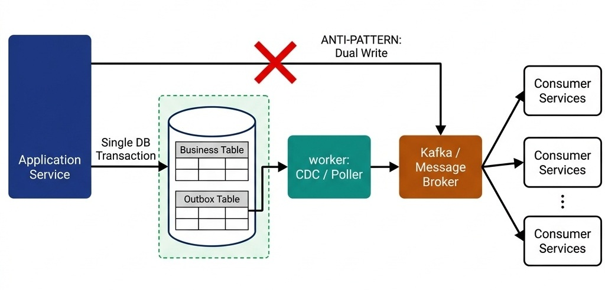
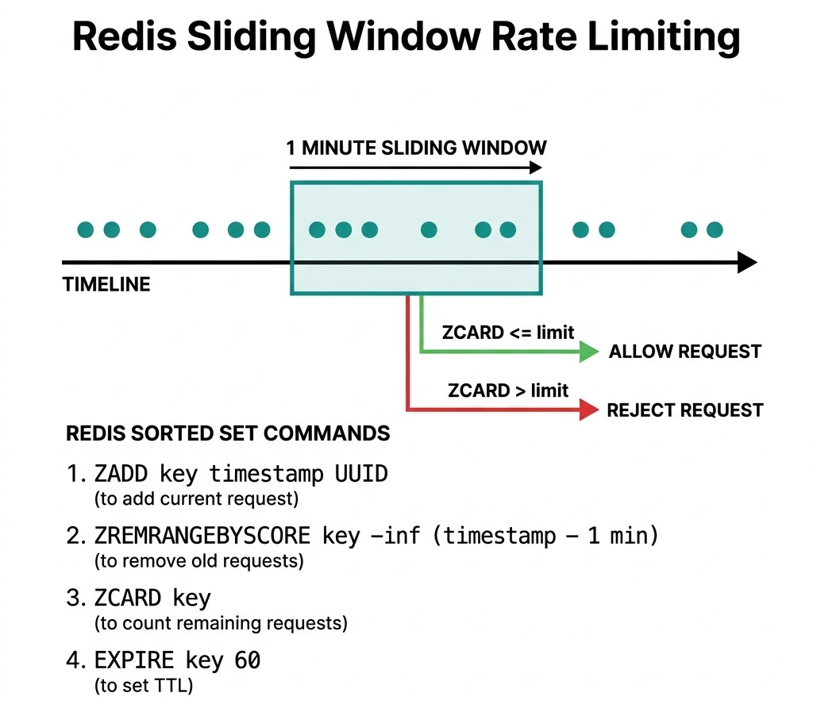
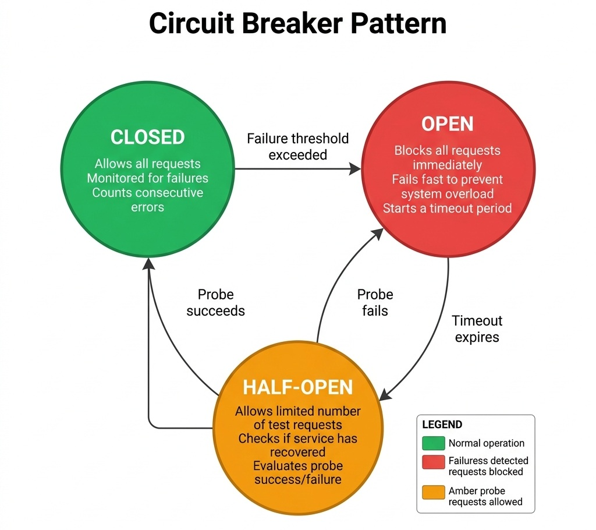

# Enterprise Integration and Resiliency

> *"In a distributed system, failure is not an anomaly; it is a normal state of operation. Designing for reliability is the science of preventing local failures from becoming global disasters."*


## The Distributed Transaction Dilemma

In monolithic architectures, maintaining data consistency is straightforward: you open a database transaction, perform updates, and commit. If any step fails, the database rolls back all changes.

In a microservices architecture, however, a single business action can span multiple service boundaries. For instance, when a user purchases stock on ZenithTrade:

1.  The Exchange service matches the order.
2.  The AuraPay ledger service updates the account balance.
3.  The Custody service updates securities ownership.

Since these services use independent databases, you cannot use a database transaction (2PC - Two-Phase Commit is generally avoided in high-performance cloud environments due to lock overhead and latency). If the ledger debit succeeds but the custody credit fails, the system enters an inconsistent state.

In a senior architecture interview, you must explain how to resolve this. You will be evaluated on your understanding of the **Saga Pattern** and the **Transactional Outbox Pattern**.


## The Dual-Write Anti-Pattern

A common architectural flaw is the **Dual-Write**. This occurs when a service attempts to modify a database and send a message to a message broker (like Kafka or RabbitMQ) within the same API request:

```python
# Anti-pattern: Dual-Write
def complete_transaction(tx: TransactionRecord) -> None:
    database.save(tx) # Database Write
    kafka_producer.send("transaction-topic", tx) # Network Call
```


This is highly unreliable:

- If the database write succeeds but the message broker is temporarily down or network packet loss occurs, the message is lost, and downstream services (like Auditing or Risk Engine) are never notified.
- If you reverse the order and send the message first, the database write might fail (e.g., due to a constraint violation), but the rest of the system will process the event, leading to phantom actions.

### The Transactional Outbox Pattern
To guarantee **At-Least-Once Delivery**, you must write the business data and an event record to an "outbox" table *in the same local database transaction*. Because they use the same database, either both writes succeed, or both fail.

A background process (or CDC log tailer like Debezium) then polls the outbox table, publishes the events to the message broker, and marks them as processed.

The following code illustrates this Outbox Publisher worker:

```python
from abc import ABC, abstractmethod
from dataclasses import dataclass
from datetime import datetime
from uuid import UUID

@dataclass
class OutboxEvent:
    id: UUID
    aggregate_type: str
    aggregate_id: UUID
    event_type: str
    payload: str
    created_at: datetime
    processed: bool

class MessageBrokerClient(ABC):
    @abstractmethod
    def publish(self, topic: str, payload: str):
        pass

class OutboxRepository(ABC):
    @abstractmethod
    def find_unprocessed_and_lock(self, limit: int) -> List[OutboxEvent]:
        pass

    @abstractmethod
    def mark_as_processed(self, event_id: UUID):
        pass

class TransactionalOutboxPublisher:
    """
    Service that polls the database Outbox table and publishes events to the broker.
    Guarantees At-Least-Once delivery of domain events.
    """
    def __init__(self, outbox_repository: OutboxRepository, broker_client: MessageBrokerClient):
        self.outbox_repository = outbox_repository
        self.broker_client = broker_client

    def publish_pending_events(self):
        # Retrieve unprocessed events under lock
        pending_events = self.outbox_repository.find_unprocessed_and_lock(100)

        for event in pending_events:
            try:
                # Publish to broker (external network call)
                topic = f"events.{event.aggregate_type.lower()}"
                self.broker_client.publish(topic, event.payload)

                # Mark as processed in the database
                self.outbox_repository.mark_as_processed(event.id)
            except Exception as e:
                # If publishing fails, we log and skip.
                # It will be retried on the next poll cycle (At-Least-Once).
                print(f"Failed to publish outbox event {event.id}: {str(e)}. Will retry.")
```


{width=85%}

If the message broker fails during publication, the event remains unmarked in the database and will be retried in the next execution cycle. This ensures that the message is eventually delivered at least once.


## Event Sourcing

For financial ledgers (like AuraPay) where correctness and auditability are paramount, storing only the "current state" of an account is insufficient. A senior candidate should discuss **Event Sourcing**:

### State vs. Stream

- **State-Based Storage:** Storing a row `Account(id=101, balance=500.00)`. If a balance mismatch occurs, it is impossible to trace *why* the balance is incorrect without parsing external database logs.
- **Event-Sourced Storage:** Storing a stream of immutable events: `[Deposited(50.00), Deposited(70.00), Debited(20.00)]`. The current balance is a derived projection computed by folding/aggregating these events over time:

$$\text{Current Balance} = \sum \text{Credit Events} - \sum \text{Debit Events}$$

### Key Invariants & Advantages

1. **Mathematical Auditability:** Every balance change is linked to an immutable event. Historians can reconstruct the ledger state at any specific millisecond.
2. **Side-Effect Isolation:** Commands generate events. Events are appended to the event store (a sequential, write-only database) and then published to message brokers to trigger downstream read-projections, fully separating writes from read overhead.


## Distributed Sagas

A **Saga** is a sequence of local transactions. Each local transaction updates the database within a single service. If a step fails, the Saga orchestrator or participants execute a series of **compensating transactions** that undo the changes made by the preceding steps.

> **Why is it called a "Saga"?** The term comes from a **1987 research paper** by Hector Garcia-Molina and Kenneth Salem at Princeton University. They chose "Saga" because, like an epic literary saga with many chapters, a distributed transaction is a long-running story told through a sequence of smaller, self-contained episodes. If the story goes wrong at any chapter, you cannot un-tell the earlier chapters — you must write new compensating chapters to undo their effects. The metaphor is surprisingly precise.

There are two primary ways to design a Saga:

### Choreography-Based Saga
In a choreography-based saga, there is no central coordinator. Each service performs its transaction and emits an event. Other services listen to these events and perform their tasks.

-   **Pros:** Decoupled, no single point of failure, simple to implement for small workflows.
-   **Cons:** Hard to understand as the number of services grows; risks of cyclic dependencies.

### Orchestration-Based Saga
In an orchestration-based saga, a central service (the orchestrator) coordinates the workflow. It tells the participants what local transactions to execute and in what order. If a failure occurs, the orchestrator issues the rollbacks.

-   **Pros:** Clear visibility into the state of the transaction; easier to debug and manage complex flows.
-   **Cons:** Introduces a central point of failure; requires a state-machine engine.

{width=90%}


## Distributed Rate Limiting

To protect microservices from cascading failures or brute-force spikes, you must implement rate limiting. In a distributed environment, rate limits cannot be stored in-memory on a single application node.

### Redis Sliding Window Rate Limiter
We use Redis to store request timestamps. A sliding window rate limiter maintains a sorted set for each user:

1.  **Add Request:** Add current timestamp to sorted set using `ZADD`.
2.  **Prune Old Requests:** Remove timestamps older than the sliding window (e.g., current time minus 1 minute) using `ZREMRANGEBYSCORE`.
3.  **Count Volume:** Count active timestamps using `ZCARD`.
4.  **Enforce Limit:** If the count exceeds the threshold, reject the request. Otherwise, allow it and set a key TTL (`EXPIRE`) to reclaim memory when the client goes inactive.

{width=70%}


## Microservice Resiliency Patterns

When designing distributed systems, you must prevent cascading failures where one slow service consumes all resources on upstream callers.

```
[Client] ---> [API Gateway] ---> [Exchange Service] ---> [Slow Ledger Service]
                                 (Threads Exhausted)
```

### Circuit Breakers
A **Circuit Breaker** wraps remote calls. It monitors failure rates.

-   **Closed State:** Requests pass through.
-   **Open State:** When the failure rate crosses a threshold (e.g., 50% failures over 10 seconds), the circuit trips (opens). Subsequent requests fail fast immediately, preventing resource exhaustion on the caller.
-   **Half-Open State:** After a timeout, the breaker allows a few probe requests to pass. If they succeed, it closes; if they fail, it opens again.

{width=85%}

> **Why is it called a "Circuit Breaker"?** The pattern is borrowed directly from **electrical engineering**. In your home's breaker panel, a circuit breaker trips (opens) when it detects excessive current, preventing an electrical fire. Michael Nygard popularized the software version in his 2007 book *Release It!*, mapping the electrical metaphor to distributed systems: when a downstream service is failing, "trip the breaker" to fail fast and protect the calling system from cascading overload. The three states (Closed, Open, Half-Open) mirror how a physical breaker resets after the fault clears.

### Bulkheads
Named after the watertight compartments of a ship's hull. The **Bulkhead Pattern** isolates resources (like thread pools or memory) allocated to specific services. If the Ledger Service slows down, only the thread pool dedicated to the Ledger will exhaust its threads. The rest of the Exchange Service (such as market data streaming) remains completely unaffected.

> **Why "Bulkhead"?** On a cargo ship, bulkheads are vertical walls that divide the hull into sealed compartments. If one compartment floods, the bulkheads prevent water from spreading to adjacent compartments — the ship stays afloat. In software, we partition thread pools and connection pools the same way: one failing dependency can drain its own pool without sinking the entire application.

### Mock Interview Transcript: Cascading Failures

> **Interviewer:** Your payment service is experiencing cascading failures. Walk me through your approach to stop the bleeding and restore stability.
> **Candidate:** First, we need to halt the cascade. I would ensure we have circuit breakers wrapping our downstream calls to the payment gateway. If the failure rate spikes, the breaker trips to the open state, immediately returning an error instead of blocking threads. 
> **Interviewer:** Good. But if the breaker is open, all payments fail. Do you have a fallback?
> **Candidate:** We can implement a fallback strategy, like queuing the payment request in an outbox or Kafka topic for deferred processing, or serving a cached "payment pending" response to the user.
> **Interviewer:** What happens if your fallback also fails, say the queue broker is unreachable?
> **Candidate:** Actually, let me reconsider... If the fallback infrastructure is also down, we must fail gracefully. We return a clear 503 Service Unavailable to the client. We shouldn't try complex secondary fallbacks because that introduces more points of failure during an incident. We'd rely on bulkhead isolation to ensure this doesn't bring down unrelated services, like the user profile service.
> **Interviewer:** Makes sense. How do you decide the timeout thresholds before tripping the circuit breaker?
> **Candidate:** We shouldn't guess. We derive them from our SLAs and historical p99 latencies. If p99 is normally 200ms, a timeout of 500ms might be appropriate. For retries, we'd use exponential backoff with jitter to avoid overwhelming the recovering service.
> **Interviewer:** And how do you test this?
> **Candidate:** We'd use chaos engineering, deliberately injecting latency into the payment gateway in a staging environment to observe the breaker state transitions and bulkhead thread pools.

**Technical Summary:** The candidate effectively utilized circuit breakers to fail fast, bulkhead isolation to protect the broader system, and exponential backoff for retries. They correctly identified that complex fallbacks can exacerbate outages and demonstrated a data-driven approach to setting timeout thresholds using p99 metrics.


## Microservices Observability

A resilient architecture is impossible to manage without deep visibility into execution paths. In technical interviews, discuss the **Three Pillars of Observability**:

### Structured Logging & Trace Propagation
Never write plain text logs. All logs must be output as structured JSON. To trace a single request as it hops across multiple microservices (API Gateway $\to$ Exchange $\to$ Ledger), utilize **Trace Context Propagation**:

- When a request enters the API Gateway, the gateway checks for a `traceparent` HTTP header (W3C standard). If missing, it generates a unique `trace_id` (128-bit).
- The gateway includes this `trace_id` in all outgoing HTTP requests, gRPC metadata, or Kafka message headers.
- Every service logs the current `trace_id` along with its log statements. In centralized log management systems (like ELK Stack or Datadog), searching for a single `trace_id` brings up the exact execution timeline across all services.

### Distributed Tracing
Utilize OpenTelemetry to capture spans (timed execution blocks). Spans record database queries, network latencies, and function call execution times, creating visualization traces to pinpoint latency hotspots.

### Metrics Collection
Expose endpoints (e.g., Prometheus Prometheus JMX/Micrometer) to collect performance metrics:

- **System Metrics:** CPU usage, memory utilization, JVM garbage collection frequency, thread counts.
- **Application Metrics:** API request rates, HTTP 5xx error counts, database connection pool saturation, and circuit breaker states.


> ⭐ **STAR Moment: Compensating Transactions vs Rollback**
> 
> In a system design interview, make sure to emphasize that a Saga cannot "rollback" in the traditional database sense, because the initial transactions have already been committed. Instead, we must write explicit **compensating transactions** (e.g., if a debit was committed, the compensation is a credit). You must design these compensating operations to be **idempotent**, as they may be retried multiple times during a network partition.
