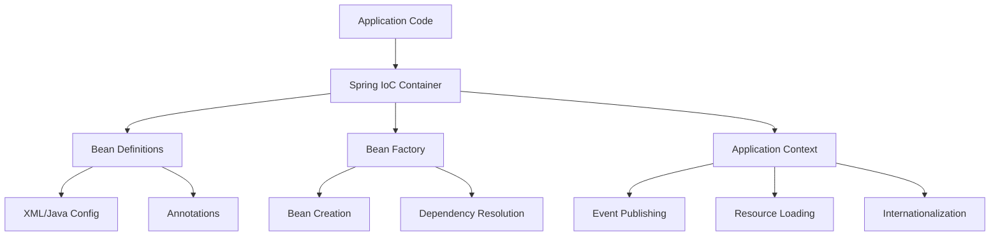
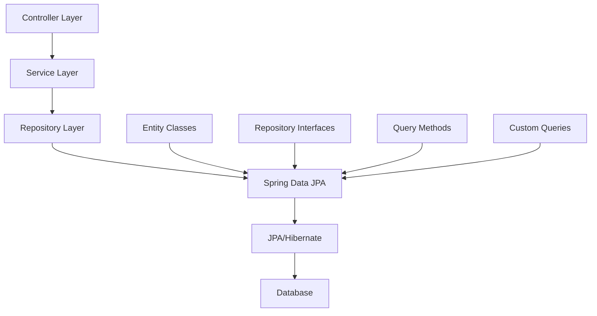
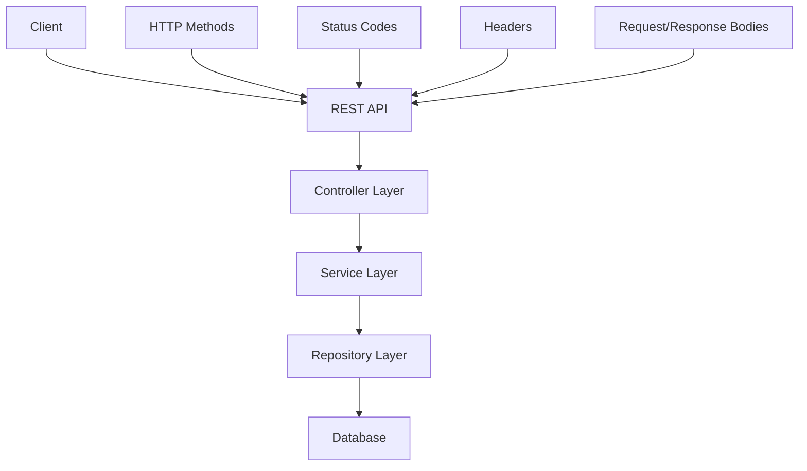
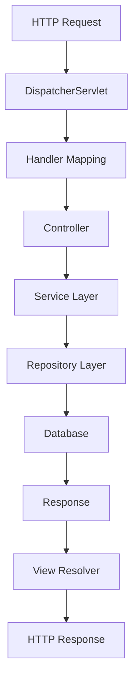
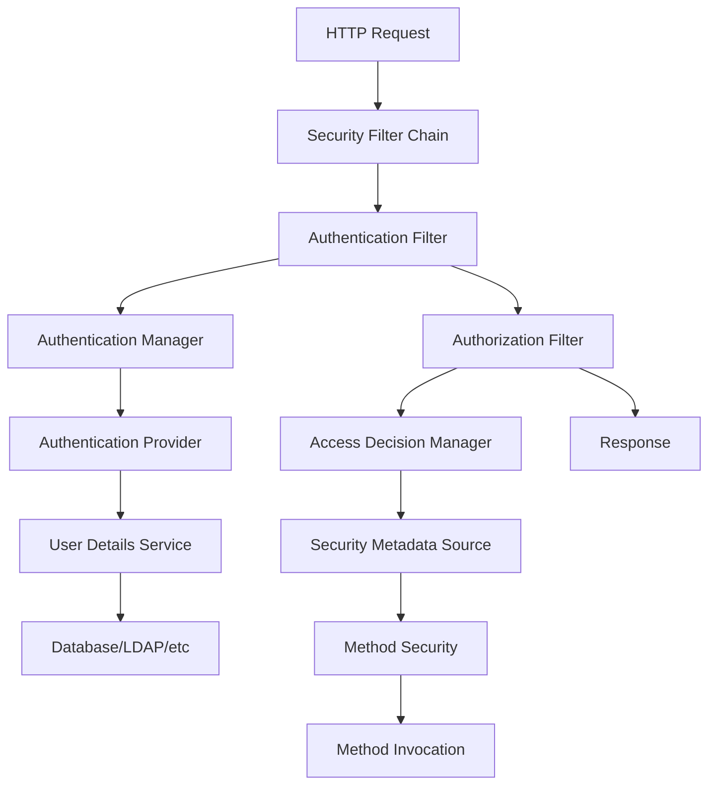
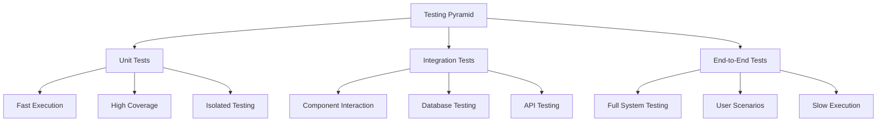

# Spring Framework Comprehensive Guide
## Master Spring Framework from Fundamentals to Advanced Patterns

### Table of Contents
1. [Introduction to Spring Framework](#introduction)
2. [Dependency Injection (DI) Fundamentals](#dependency-injection)
3. [Aspect-Oriented Programming (AOP)](#aspect-oriented-programming)
4. [Spring Core Container](#spring-core-container)
5. [Spring Boot Auto-Configuration](#spring-boot)
6. [Spring Data Access](#spring-data)
7. [Spring Web & REST APIs](#spring-web)
8. [Spring Security](#spring-security)
9. [Spring Testing](#spring-testing)
10. [Spring Interview Questions](#interview-questions)
11. [Project Ideas & Real-World Applications](#project-ideas)

---

## Introduction

Welcome to the comprehensive Spring Framework guide! This book assumes you're already proficient in Java from our Core Java Mastery Guide and are ready to dive deep into enterprise Java development with Spring.

### What You'll Learn
- **Dependency Injection**: Master IoC container and bean lifecycle
- **AOP**: Understand cross-cutting concerns and aspect weaving
- **Spring Boot**: Build production-ready applications with auto-configuration
- **REST APIs**: Create robust, scalable web services
- **Data Access**: Work with databases using Spring Data
- **Security**: Implement authentication and authorization
- **Testing**: Write comprehensive tests for Spring applications

### Prerequisites
- Java 8+ proficiency
- Understanding of OOP principles
- Basic knowledge of web development concepts
- Familiarity with Maven/Gradle

### Learning Path
1. Start with DI fundamentals
2. Progress through AOP concepts
3. Build REST APIs with Spring Boot
4. Add data persistence and security
5. Practice with real-world projects

---

## Dependency Injection (DI) Fundamentals

Dependency Injection is the heart of Spring Framework. It's an implementation of the Inversion of Control (IoC) principle that makes your code more maintainable, testable, and loosely coupled.

### What is Dependency Injection?

Dependency Injection is a design pattern where dependencies (objects that a class needs) are provided to the class from the outside, rather than the class creating them internally.

**Traditional Approach (Tight Coupling):**
```java
public class UserService {
    private UserRepository userRepository;
    
    public UserService() {
        this.userRepository = new UserRepositoryImpl(); // Tight coupling!
    }
}
```

**Spring DI Approach (Loose Coupling):**
```java
@Service
public class UserService {
    private final UserRepository userRepository;
    
    @Autowired
    public UserService(UserRepository userRepository) {
        this.userRepository = userRepository; // Loose coupling!
    }
}
```

### Types of Dependency Injection

#### 1. Constructor Injection (Recommended)
```java
@Service
public class UserService {
    private final UserRepository userRepository;
    private final EmailService emailService;
    
    // Spring automatically injects dependencies
    public UserService(UserRepository userRepository, EmailService emailService) {
        this.userRepository = userRepository;
        this.emailService = emailService;
    }
}
```

#### 2. Setter Injection
```java
@Service
public class UserService {
    private UserRepository userRepository;
    private EmailService emailService;
    
    @Autowired
    public void setUserRepository(UserRepository userRepository) {
        this.userRepository = userRepository;
    }
    
    @Autowired
    public void setEmailService(EmailService emailService) {
        this.emailService = emailService;
    }
}
```

#### 3. Field Injection (Not Recommended)
```java
@Service
public class UserService {
    @Autowired
    private UserRepository userRepository;
    
    @Autowired
    private EmailService emailService;
}
```

### Why Constructor Injection is Preferred

1. **Immutability**: Dependencies can be marked as `final`
2. **Required Dependencies**: Constructor ensures all required dependencies are provided
3. **Testing**: Easier to create unit tests with mocks
4. **Performance**: No reflection needed for field access

### Bean Lifecycle in Spring

```mermaid
graph TD
    A[Bean Definition] --> B[Instantiation]
    B --> C[Property Population]
    C --> D[BeanNameAware]
    D --> E[BeanFactoryAware]
    E --> F[ApplicationContextAware]
    F --> G[BeanPostProcessor.preProcess]
    G --> H[@PostConstruct]
    H --> I[InitializingBean.afterPropertiesSet]
    I --> J[Custom Init Method]
    J --> K[BeanPostProcessor.postProcess]
    K --> L[Bean Ready]
    L --> M[@PreDestroy]
    M --> N[DisposableBean.destroy]
    N --> O[Custom Destroy Method]
    O --> P[Bean Destroyed]
```

### Practical Example: User Management System

Let's build a complete example showing DI in action:

```java
// 1. Repository Interface
public interface UserRepository {
    User save(User user);
    User findById(Long id);
    List<User> findAll();
}

// 2. Repository Implementation
@Repository
public class UserRepositoryImpl implements UserRepository {
    private final Map<Long, User> users = new HashMap<>();
    private Long nextId = 1L;
    
    @Override
    public User save(User user) {
        if (user.getId() == null) {
            user.setId(nextId++);
        }
        users.put(user.getId(), user);
        return user;
    }
    
    @Override
    public User findById(Long id) {
        return users.get(id);
    }
    
    @Override
    public List<User> findAll() {
        return new ArrayList<>(users.values());
    }
}

// 3. Service Layer
@Service
public class UserService {
    private final UserRepository userRepository;
    private final EmailService emailService;
    
    public UserService(UserRepository userRepository, EmailService emailService) {
        this.userRepository = userRepository;
        this.emailService = emailService;
    }
    
    public User createUser(String name, String email) {
        User user = new User(name, email);
        User savedUser = userRepository.save(user);
        
        // Send welcome email
        emailService.sendWelcomeEmail(savedUser.getEmail());
        
        return savedUser;
    }
    
    public User getUserById(Long id) {
        return userRepository.findById(id);
    }
    
    public List<User> getAllUsers() {
        return userRepository.findAll();
    }
}

// 4. Email Service
@Service
public class EmailService {
    public void sendWelcomeEmail(String email) {
        System.out.println("Sending welcome email to: " + email);
        // Actual email sending logic would go here
    }
}

// 5. User Entity
public class User {
    private Long id;
    private String name;
    private String email;
    
    public User(String name, String email) {
        this.name = name;
        this.email = email;
    }
    
    // Getters and setters
    public Long getId() { return id; }
    public void setId(Long id) { this.id = id; }
    public String getName() { return name; }
    public void setName(String name) { this.name = name; }
    public String getEmail() { return email; }
    public void setEmail(String email) { this.email = email; }
}
```

### Configuration Options

#### XML Configuration (Legacy)
```xml
<?xml version="1.0" encoding="UTF-8"?>
<beans xmlns="http://www.springframework.org/schema/beans"
       xmlns:xsi="http://www.w3.org/2001/XMLSchema-instance"
       xsi:schemaLocation="http://www.springframework.org/schema/beans
       http://www.springframework.org/schema/beans/spring-beans.xsd">
    
    <bean id="userRepository" class="com.example.UserRepositoryImpl"/>
    <bean id="emailService" class="com.example.EmailService"/>
    
    <bean id="userService" class="com.example.UserService">
        <constructor-arg ref="userRepository"/>
        <constructor-arg ref="emailService"/>
    </bean>
</beans>
```

#### Java Configuration (Modern)
```java
@Configuration
@ComponentScan("com.example")
public class AppConfig {
    
    @Bean
    public UserRepository userRepository() {
        return new UserRepositoryImpl();
    }
    
    @Bean
    public EmailService emailService() {
        return new EmailService();
    }
    
    @Bean
    public UserService userService(UserRepository userRepository, EmailService emailService) {
        return new UserService(userRepository, emailService);
    }
}
```

#### Component Scanning (Most Common)
```java
@SpringBootApplication
@ComponentScan("com.example")
public class Application {
    public static void main(String[] args) {
        SpringApplication.run(Application.class, args);
    }
}
```

### Dependency Injection Best Practices

1. **Use Constructor Injection** for required dependencies
2. **Make Dependencies Final** when possible
3. **Avoid Circular Dependencies** - they indicate design issues
4. **Use @Qualifier** when you have multiple beans of the same type
5. **Keep Beans Stateless** when possible
6. **Use Interface-Based Programming** for flexibility

### Common Annotations

- `@Component`: Generic Spring-managed component
- `@Service`: Business logic layer component
- `@Repository`: Data access layer component
- `@Controller`: Web layer component
- `@Autowired`: Automatic dependency injection
- `@Qualifier`: Specify which bean to inject
- `@Primary`: Mark as primary bean when multiple candidates exist
- `@Lazy`: Initialize bean only when first accessed

### Testing with Dependency Injection

```java
@ExtendWith(SpringExtension.class)
@ContextConfiguration(classes = TestConfig.class)
class UserServiceTest {
    
    @Autowired
    private UserService userService;
    
    @MockBean
    private UserRepository userRepository;
    
    @MockBean
    private EmailService emailService;
    
    @Test
    void createUser_ShouldSaveAndSendEmail() {
        // Given
        User user = new User("John Doe", "john@example.com");
        when(userRepository.save(any(User.class))).thenReturn(user);
        
        // When
        User result = userService.createUser("John Doe", "john@example.com");
        
        // Then
        verify(userRepository).save(any(User.class));
        verify(emailService).sendWelcomeEmail("john@example.com");
        assertEquals("John Doe", result.getName());
    }
}
```

---

## Aspect-Oriented Programming (AOP)

Aspect-Oriented Programming is a programming paradigm that allows you to separate cross-cutting concerns from your main business logic. Spring AOP provides a clean way to implement logging, security, transactions, and other cross-cutting concerns without cluttering your business code.

### What are Cross-Cutting Concerns?

Cross-cutting concerns are functionalities that span across multiple modules of your application:

- **Logging**: Recording method calls, parameters, and return values
- **Security**: Authentication and authorization checks
- **Transactions**: Database transaction management
- **Performance Monitoring**: Method execution time tracking
- **Caching**: Result caching and invalidation
- **Error Handling**: Centralized exception handling

### AOP Core Concepts

#### 1. Aspect
A class that contains advice and pointcuts.

#### 2. Advice
The action taken by an aspect at a particular join point.

#### 3. Join Point
A point during the execution of a program (method execution, exception handling, etc.).

#### 4. Pointcut
An expression that matches join points.

#### 5. Weaving
The process of linking aspects with other application types to create an advised object.

### Types of Advice

```java
@Aspect
@Component
public class LoggingAspect {
    
    private static final Logger logger = LoggerFactory.getLogger(LoggingAspect.class);
    
    // 1. Before Advice - executes before method execution
    @Before("execution(* com.example.service.*.*(..))")
    public void logBeforeMethodExecution(JoinPoint joinPoint) {
        String methodName = joinPoint.getSignature().getName();
        String className = joinPoint.getTarget().getClass().getSimpleName();
        logger.info("Before executing {}.{}", className, methodName);
    }
    
    // 2. After Advice - executes after method execution (success or failure)
    @After("execution(* com.example.service.*.*(..))")
    public void logAfterMethodExecution(JoinPoint joinPoint) {
        String methodName = joinPoint.getSignature().getName();
        logger.info("After executing method: {}", methodName);
    }
    
    // 3. AfterReturning Advice - executes only after successful method execution
    @AfterReturning(
        pointcut = "execution(* com.example.service.*.*(..))",
        returning = "result"
    )
    public void logAfterReturning(JoinPoint joinPoint, Object result) {
        String methodName = joinPoint.getSignature().getName();
        logger.info("Method {} returned: {}", methodName, result);
    }
    
    // 4. AfterThrowing Advice - executes only when method throws exception
    @AfterThrowing(
        pointcut = "execution(* com.example.service.*.*(..))",
        throwing = "error"
    )
    public void logAfterThrowing(JoinPoint joinPoint, Throwable error) {
        String methodName = joinPoint.getSignature().getName();
        logger.error("Method {} threw exception: {}", methodName, error.getMessage());
    }
    
    // 5. Around Advice - executes before and after method execution
    @Around("execution(* com.example.service.*.*(..))")
    public Object logAroundMethodExecution(ProceedingJoinPoint joinPoint) throws Throwable {
        String methodName = joinPoint.getSignature().getName();
        long startTime = System.currentTimeMillis();
        
        logger.info("Starting execution of method: {}", methodName);
        
        try {
            Object result = joinPoint.proceed(); // Execute the actual method
            long endTime = System.currentTimeMillis();
            logger.info("Method {} completed in {} ms", methodName, (endTime - startTime));
            return result;
        } catch (Exception e) {
            logger.error("Method {} failed with exception: {}", methodName, e.getMessage());
            throw e;
        }
    }
}
```

### Pointcut Expressions

Pointcuts define where advice should be applied. Here are common patterns:

```java
@Aspect
@Component
public class CommonPointcuts {
    
    // All methods in service package
    @Pointcut("execution(* com.example.service.*.*(..))")
    public void serviceLayer() {}
    
    // All public methods
    @Pointcut("execution(public * *(..))")
    public void publicMethods() {}
    
    // Methods with specific annotations
    @Pointcut("@annotation(com.example.annotation.LogExecutionTime)")
    public void logExecutionTimeMethods() {}
    
    // Methods with specific parameters
    @Pointcut("execution(* *(String, Long))")
    public void methodsWithStringAndLongParams() {}
    
    // Combining pointcuts
    @Pointcut("serviceLayer() && publicMethods()")
    public void publicServiceMethods() {}
}
```

### Custom Annotations for AOP

Create custom annotations to mark methods for specific AOP behavior:

```java
// 1. Custom Annotation
@Target(ElementType.METHOD)
@Retention(RetentionPolicy.RUNTIME)
public @interface LogExecutionTime {
    String value() default "";
}

@Target(ElementType.METHOD)
@Retention(RetentionPolicy.RUNTIME)
public @interface Secure {
    String[] roles() default {};
}

@Target(ElementType.METHOD)
@Retention(RetentionPolicy.RUNTIME)
public @interface Cacheable {
    String key() default "";
    int ttl() default 300; // seconds
}

// 2. AOP Implementation
@Aspect
@Component
public class CustomAspects {
    
    private static final Logger logger = LoggerFactory.getLogger(CustomAspects.class);
    
    // Performance monitoring aspect
    @Around("@annotation(logExecutionTime)")
    public Object logExecutionTime(ProceedingJoinPoint joinPoint, LogExecutionTime logExecutionTime) throws Throwable {
        String methodName = joinPoint.getSignature().getName();
        String customValue = logExecutionTime.value();
        
        long startTime = System.currentTimeMillis();
        logger.info("Starting execution of method: {} - {}", methodName, customValue);
        
        try {
            Object result = joinPoint.proceed();
            long endTime = System.currentTimeMillis();
            long duration = endTime - startTime;
            
            logger.info("Method {} completed in {} ms - {}", methodName, duration, customValue);
            
            // Log slow methods
            if (duration > 1000) {
                logger.warn("SLOW METHOD: {} took {} ms", methodName, duration);
            }
            
            return result;
        } catch (Exception e) {
            logger.error("Method {} failed after {} ms", methodName, System.currentTimeMillis() - startTime);
            throw e;
        }
    }
    
    // Security aspect
    @Before("@annotation(secure)")
    public void checkSecurity(JoinPoint joinPoint, Secure secure) {
        String[] requiredRoles = secure.roles();
        String currentUser = getCurrentUser(); // Implementation needed
        
        if (!hasRequiredRoles(currentUser, requiredRoles)) {
            throw new SecurityException("User " + currentUser + " doesn't have required roles: " + Arrays.toString(requiredRoles));
        }
        
        logger.info("Security check passed for user: {} on method: {}", 
                   currentUser, joinPoint.getSignature().getName());
    }
    
    // Caching aspect
    @Around("@annotation(cacheable)")
    public Object cacheMethodResult(ProceedingJoinPoint joinPoint, Cacheable cacheable) throws Throwable {
        String cacheKey = generateCacheKey(joinPoint, cacheable);
        
        // Try to get from cache first
        Object cachedResult = cache.get(cacheKey);
        if (cachedResult != null) {
            logger.debug("Cache hit for key: {}", cacheKey);
            return cachedResult;
        }
        
        // Execute method and cache result
        Object result = joinPoint.proceed();
        cache.put(cacheKey, result, cacheable.ttl());
        logger.debug("Cached result for key: {}", cacheKey);
        
        return result;
    }
    
    // Helper methods
    private String getCurrentUser() {
        // Implementation to get current authenticated user
        return "current-user";
    }
    
    private boolean hasRequiredRoles(String user, String[] roles) {
        // Implementation to check user roles
        return true; // Simplified for example
    }
    
    private String generateCacheKey(ProceedingJoinPoint joinPoint, Cacheable cacheable) {
        String methodName = joinPoint.getSignature().getName();
        String className = joinPoint.getTarget().getClass().getSimpleName();
        Object[] args = joinPoint.getArgs();
        
        return className + "." + methodName + "(" + Arrays.toString(args) + ")";
    }
}
```

### Practical Example: Transaction Management

Spring AOP is heavily used for transaction management. Here's how it works:

```java
@Service
@Transactional
public class UserService {
    
    private final UserRepository userRepository;
    private final EmailService emailService;
    
    public UserService(UserRepository userRepository, EmailService emailService) {
        this.userRepository = userRepository;
        this.emailService = emailService;
    }
    
    // This method will be wrapped in a transaction
    @Transactional(rollbackFor = Exception.class)
    public User createUserWithProfile(String name, String email, String profileData) {
        try {
            // Create user
            User user = new User(name, email);
            User savedUser = userRepository.save(user);
            
            // Create profile (if this fails, user creation should rollback)
            Profile profile = new Profile(savedUser.getId(), profileData);
            profileRepository.save(profile);
            
            // Send welcome email (non-critical, won't cause rollback)
            emailService.sendWelcomeEmail(savedUser.getEmail());
            
            return savedUser;
        } catch (Exception e) {
            // Transaction will automatically rollback
            throw new UserCreationException("Failed to create user", e);
        }
    }
}

// The @Transactional annotation is processed by Spring AOP
// It creates a proxy that wraps the method execution in a transaction
```

### Performance Monitoring Aspect

```java
@Aspect
@Component
public class PerformanceMonitoringAspect {
    
    private static final Logger logger = LoggerFactory.getLogger(PerformanceMonitoringAspect.class);
    private final Map<String, MethodStats> methodStats = new ConcurrentHashMap<>();
    
    @Around("@annotation(org.springframework.web.bind.annotation.RequestMapping) || " +
            "@annotation(org.springframework.web.bind.annotation.GetMapping) || " +
            "@annotation(org.springframework.web.bind.annotation.PostMapping)")
    public Object monitorPerformance(ProceedingJoinPoint joinPoint) throws Throwable {
        String methodName = joinPoint.getSignature().getName();
        String className = joinPoint.getTarget().getClass().getSimpleName();
        String fullMethodName = className + "." + methodName;
        
        long startTime = System.currentTimeMillis();
        long startMemory = Runtime.getRuntime().totalMemory() - Runtime.getRuntime().freeMemory();
        
        try {
            Object result = joinPoint.proceed();
            recordSuccess(fullMethodName, startTime, startMemory);
            return result;
        } catch (Exception e) {
            recordFailure(fullMethodName, startTime, startMemory);
            throw e;
        }
    }
    
    private void recordSuccess(String methodName, long startTime, long startMemory) {
        long executionTime = System.currentTimeMillis() - startTime;
        long endMemory = Runtime.getRuntime().totalMemory() - Runtime.getRuntime().freeMemory();
        long memoryUsed = endMemory - startMemory;
        
        MethodStats stats = methodStats.computeIfAbsent(methodName, k -> new MethodStats());
        stats.recordSuccess(executionTime, memoryUsed);
        
        if (executionTime > 1000) {
            logger.warn("SLOW METHOD: {} took {} ms", methodName, executionTime);
        }
    }
    
    private void recordFailure(String methodName, long startTime, long startMemory) {
        long executionTime = System.currentTimeMillis() - startTime;
        long endMemory = Runtime.getRuntime().totalMemory() - Runtime.getRuntime().freeMemory();
        long memoryUsed = endMemory - startMemory;
        
        MethodStats stats = methodStats.computeIfAbsent(methodName, k -> new MethodStats());
        stats.recordFailure(executionTime, memoryUsed);
        
        logger.error("METHOD FAILED: {} after {} ms", methodName, executionTime);
    }
    
    // Method to get performance statistics
    public Map<String, MethodStats> getMethodStats() {
        return new HashMap<>(methodStats);
    }
    
    // Inner class to track method statistics
    public static class MethodStats {
        private long totalCalls = 0;
        private long successfulCalls = 0;
        private long failedCalls = 0;
        private long totalExecutionTime = 0;
        private long totalMemoryUsed = 0;
        private long minExecutionTime = Long.MAX_VALUE;
        private long maxExecutionTime = 0;
        
        public void recordSuccess(long executionTime, long memoryUsed) {
            totalCalls++;
            successfulCalls++;
            totalExecutionTime += executionTime;
            totalMemoryUsed += memoryUsed;
            minExecutionTime = Math.min(minExecutionTime, executionTime);
            maxExecutionTime = Math.max(maxExecutionTime, executionTime);
        }
        
        public void recordFailure(long executionTime, long memoryUsed) {
            totalCalls++;
            failedCalls++;
            totalExecutionTime += executionTime;
            totalMemoryUsed += memoryUsed;
            minExecutionTime = Math.min(minExecutionTime, executionTime);
            maxExecutionTime = Math.max(maxExecutionTime, executionTime);
        }
        
        public double getAverageExecutionTime() {
            return totalCalls > 0 ? (double) totalExecutionTime / totalCalls : 0;
        }
        
        public double getSuccessRate() {
            return totalCalls > 0 ? (double) successfulCalls / totalCalls : 0;
        }
        
        // Getters
        public long getTotalCalls() { return totalCalls; }
        public long getSuccessfulCalls() { return successfulCalls; }
        public long getFailedCalls() { return failedCalls; }
        public long getMinExecutionTime() { return minExecutionTime; }
        public long getMaxExecutionTime() { return maxExecutionTime; }
    }
}
```

### AOP Best Practices

1. **Keep Aspects Focused**: Each aspect should handle one specific concern
2. **Use Pointcuts Efficiently**: Avoid overly broad pointcuts that affect too many methods
3. **Handle Exceptions Properly**: Ensure your aspects don't swallow important exceptions
4. **Monitor Performance**: Be aware that AOP adds overhead to method calls
5. **Test Thoroughly**: AOP can make debugging more complex, so test your aspects well
6. **Document Pointcuts**: Make your pointcut expressions clear and well-documented

### Common AOP Use Cases

- **Logging**: Method entry/exit, parameters, return values
- **Security**: Authentication, authorization, audit trails
- **Transactions**: Database transaction management
- **Caching**: Method result caching
- **Performance Monitoring**: Execution time, memory usage
- **Error Handling**: Centralized exception handling and logging
- **Validation**: Input parameter validation
- **Retry Logic**: Automatic retry for failed operations

---

## Spring Core Container

The Spring Core Container is the foundation of the Spring Framework. It provides the IoC (Inversion of Control) container that manages the creation, configuration, and lifecycle of beans. Understanding the core container is essential for building robust Spring applications.

### IoC Container Architecture



### Bean Factory vs Application Context

#### Bean Factory
The basic IoC container that provides basic dependency injection functionality.

```java
// Basic BeanFactory usage
Resource resource = new ClassPathResource("beans.xml");
BeanFactory factory = new XmlBeanFactory(resource);

UserService userService = (UserService) factory.getBean("userService");
```

#### Application Context
A more advanced container that extends BeanFactory with additional features:

```java
// ApplicationContext provides more features
ApplicationContext context = new ClassPathXmlApplicationContext("beans.xml");
// or
ApplicationContext context = new AnnotationConfigApplicationContext(AppConfig.class);

UserService userService = context.getBean(UserService.class);
```

**Key Differences:**
- **Event Publishing**: ApplicationContext supports application events
- **Resource Loading**: Built-in support for resource loading
- **Internationalization**: Message source support
- **AOP Integration**: Automatic AOP proxy creation

### Bean Scopes

Spring beans can have different scopes that determine their lifecycle and how many instances are created:

#### 1. Singleton (Default)
Only one instance per Spring container:

```java
@Service
@Scope("singleton") // or just omit @Scope
public class UserService {
    private int instanceCount = 0;
    
    public UserService() {
        instanceCount++;
        System.out.println("UserService instance created: " + instanceCount);
    }
    
    public int getInstanceCount() {
        return instanceCount;
    }
}
```

#### 2. Prototype
New instance every time the bean is requested:

```java
@Service
@Scope("prototype")
public class OrderService {
    private final String instanceId = UUID.randomUUID().toString();
    
    public String getInstanceId() {
        return instanceId;
    }
}
```

#### 3. Request Scope
One instance per HTTP request (web applications):

```java
@Component
@Scope(value = WebApplicationContext.SCOPE_REQUEST, proxyMode = ScopedProxyMode.TARGET_CLASS)
public class UserSession {
    private String sessionId;
    private LocalDateTime createdAt;
    
    public UserSession() {
        this.sessionId = UUID.randomUUID().toString();
        this.createdAt = LocalDateTime.now();
    }
    
    // getters and setters
}
```

#### 4. Session Scope
One instance per HTTP session (web applications):

```java
@Component
@Scope(value = WebApplicationContext.SCOPE_SESSION, proxyMode = ScopedProxyMode.TARGET_CLASS)
public class ShoppingCart {
    private List<Item> items = new ArrayList<>();
    private String userId;
    
    public void addItem(Item item) {
        items.add(item);
    }
    
    public List<Item> getItems() {
        return items;
    }
}
```

#### 5. Application Scope
One instance per ServletContext:

```java
@Component
@Scope(value = WebApplicationContext.SCOPE_APPLICATION, proxyMode = ScopedProxyMode.TARGET_CLASS)
public class ApplicationConfig {
    private Map<String, String> globalSettings = new HashMap<>();
    
    public void setSetting(String key, String value) {
        globalSettings.put(key, value);
    }
    
    public String getSetting(String key) {
        return globalSettings.get(key);
    }
}
```

### Bean Lifecycle Management

Spring provides several interfaces and annotations to hook into the bean lifecycle:

#### 1. Initialization and Destruction

```java
@Service
public class DatabaseConnectionManager implements InitializingBean, DisposableBean {
    
    private Connection connection;
    private String url;
    private String username;
    private String password;
    
    // Custom initialization method
    @PostConstruct
    public void customInit() {
        System.out.println("Custom initialization method called");
    }
    
    // InitializingBean interface method
    @Override
    public void afterPropertiesSet() throws Exception {
        System.out.println("InitializingBean.afterPropertiesSet() called");
        // Initialize database connection
        connection = DriverManager.getConnection(url, username, password);
    }
    
    // Custom destruction method
    @PreDestroy
    public void customDestroy() {
        System.out.println("Custom destruction method called");
    }
    
    // DisposableBean interface method
    @Override
    public void destroy() throws Exception {
        System.out.println("DisposableBean.destroy() called");
        if (connection != null && !connection.isClosed()) {
            connection.close();
        }
    }
    
    // Getters and setters for properties
    public void setUrl(String url) { this.url = url; }
    public void setUsername(String username) { this.username = username; }
    public void setPassword(String password) { this.password = password; }
}
```

#### 2. Bean Post Processors

Custom post processors can modify beans after initialization:

```java
@Component
public class CustomBeanPostProcessor implements BeanPostProcessor {
    
    private static final Logger logger = LoggerFactory.getLogger(CustomBeanPostProcessor.class);
    
    @Override
    public Object postProcessBeforeInitialization(Object bean, String beanName) throws BeansException {
        logger.info("Before initialization: {}", beanName);
        
        // Example: Add custom annotation processing
        if (bean.getClass().isAnnotationPresent(Loggable.class)) {
            logger.info("Bean {} is marked as @Loggable", beanName);
        }
        
        return bean;
    }
    
    @Override
    public Object postProcessAfterInitialization(Object bean, String beanName) throws BeansException {
        logger.info("After initialization: {}", beanName);
        
        // Example: Wrap beans with proxies for specific interfaces
        if (bean instanceof UserService) {
            logger.info("UserService bean {} initialized successfully", beanName);
        }
        
        return bean;
    }
}
```

### Property Resolution and External Configuration

Spring provides flexible ways to configure beans with external properties:

#### 1. Properties File Configuration

```properties
# application.properties
database.url=jdbc:mysql://localhost:3306/mydb
database.username=root
database.password=secret
database.pool.size=10
database.pool.max-wait=30000

app.name=Spring Demo Application
app.version=1.0.0
app.debug=true
```

#### 2. Java Configuration with Properties

```java
@Configuration
@PropertySource("classpath:application.properties")
public class DatabaseConfig {
    
    @Value("${database.url}")
    private String databaseUrl;
    
    @Value("${database.username}")
    private String username;
    
    @Value("${database.password}")
    private String password;
    
    @Value("${database.pool.size:5}") // Default value if property not found
    private int poolSize;
    
    @Bean
    public DataSource dataSource() {
        HikariConfig config = new HikariConfig();
        config.setJdbcUrl(databaseUrl);
        config.setUsername(username);
        config.setPassword(password);
        config.setMaximumPoolSize(poolSize);
        
        return new HikariDataSource(config);
    }
}
```

#### 3. Environment-Specific Configuration

```java
@Configuration
@Profile("development")
public class DevelopmentConfig {
    
    @Bean
    public DataSource dataSource() {
        // Development database configuration
        return new EmbeddedDatabaseBuilder()
            .setType(EmbeddedDatabaseType.H2)
            .addScript("classpath:schema.sql")
            .addScript("classpath:data.sql")
            .build();
    }
}

@Configuration
@Profile("production")
public class ProductionConfig {
    
    @Bean
    public DataSource dataSource() {
        // Production database configuration
        return new HikariDataSource();
    }
}
```

### Bean Definition Inheritance

Spring supports bean definition inheritance to reduce configuration duplication:

```xml
<!-- Parent bean definition -->
<bean id="abstractUserService" abstract="true">
    <property name="emailService" ref="emailService"/>
    <property name="notificationService" ref="notificationService"/>
</bean>

<!-- Child bean inherits from parent -->
<bean id="adminUserService" parent="abstractUserService" class="com.example.AdminUserService">
    <property name="adminLevel" value="SUPER_ADMIN"/>
</bean>

<bean id="regularUserService" parent="abstractUserService" class="com.example.RegularUserService">
    <property name="userLevel" value="STANDARD"/>
</bean>
```

### Factory Beans

Factory beans allow you to create complex objects that can't be easily instantiated with constructors:

```java
@Component
public class UserFactoryBean implements FactoryBean<User> {
    
    private String userType;
    private String name;
    private String email;
    
    @Override
    public User getObject() throws Exception {
        switch (userType.toLowerCase()) {
            case "admin":
                return new AdminUser(name, email, "SUPER_ADMIN");
            case "moderator":
                return new ModeratorUser(name, email, "MODERATOR");
            case "regular":
                return new RegularUser(name, email, "STANDARD");
            default:
                throw new IllegalArgumentException("Unknown user type: " + userType);
        }
    }
    
    @Override
    public Class<?> getObjectType() {
        return User.class;
    }
    
    @Override
    public boolean isSingleton() {
        return false; // Each call creates a new instance
    }
    
    // Setters for configuration
    public void setUserType(String userType) { this.userType = userType; }
    public void setName(String name) { this.name = name; }
    public void setEmail(String email) { this.email = email; }
}
```

### Container Events

Spring provides an event system for beans to communicate:

```java
// 1. Custom Event
public class UserCreatedEvent extends ApplicationEvent {
    private final User user;
    
    public UserCreatedEvent(Object source, User user) {
        super(source);
        this.user = user;
    }
    
    public User getUser() {
        return user;
    }
}

// 2. Event Publisher
@Service
public class UserService {
    
    private final ApplicationEventPublisher eventPublisher;
    private final UserRepository userRepository;
    
    public UserService(ApplicationEventPublisher eventPublisher, UserRepository userRepository) {
        this.eventPublisher = eventPublisher;
        this.userRepository = userRepository;
    }
    
    public User createUser(String name, String email) {
        User user = new User(name, email);
        User savedUser = userRepository.save(user);
        
        // Publish event
        eventPublisher.publishEvent(new UserCreatedEvent(this, savedUser));
        
        return savedUser;
    }
}

// 3. Event Listener
@Component
public class UserEventListener {
    
    private static final Logger logger = LoggerFactory.getLogger(UserEventListener.class);
    
    @EventListener
    public void handleUserCreated(UserCreatedEvent event) {
        User user = event.getUser();
        logger.info("User created: {} ({})", user.getName(), user.getEmail());
        
        // Send welcome email, create profile, etc.
    }
    
    @EventListener
    @Async // Process events asynchronously
    public void handleUserCreatedAsync(UserCreatedEvent event) {
        // Async processing
        logger.info("Async processing user creation for: {}", event.getUser().getName());
    }
}
```

### Container Configuration Best Practices

1. **Use Java Configuration**: Prefer `@Configuration` over XML
2. **Component Scanning**: Use `@ComponentScan` for automatic bean discovery
3. **Profile-Based Configuration**: Use profiles for environment-specific settings
4. **External Properties**: Keep configuration in external files
5. **Bean Naming**: Use meaningful bean names and IDs
6. **Scope Appropriately**: Choose the right scope for your beans
7. **Lazy Initialization**: Use `@Lazy` for expensive beans that aren't immediately needed

### Performance Considerations

- **Singleton Scope**: Most memory-efficient, but be careful with state
- **Prototype Scope**: More memory usage, but no shared state issues
- **Bean Post Processors**: Add overhead to bean creation
- **Event System**: Asynchronous processing for better performance
- **Lazy Beans**: Initialize only when needed

---

## Spring Boot Auto-Configuration

Spring Boot is a game-changer in the Spring ecosystem. It eliminates boilerplate configuration and provides opinionated defaults that make it incredibly easy to create production-ready Spring applications. This chapter explores how Spring Boot's auto-configuration works and how to leverage it effectively.

### What is Spring Boot?

Spring Boot is a framework that simplifies the development of Spring applications by providing:

- **Auto-configuration**: Automatic configuration based on classpath and properties
- **Starter Dependencies**: Simplified dependency management
- **Embedded Servers**: Built-in Tomcat, Jetty, or Undertow
- **Actuator**: Production-ready monitoring and metrics
- **DevTools**: Developer productivity tools

### Auto-Configuration Magic

```mermaid
graph TD
    A[Spring Boot Application] --> B[Classpath Scanning]
    B --> C[Conditional Bean Creation]
    C --> D[Auto-Configuration Classes]
    D --> E[Bean Registration]
    E --> F[Application Ready]
    
    G[@EnableAutoConfiguration] --> H[AutoConfigurationImportSelector]
    H --> I[spring.factories]
    I --> J[Auto-Configuration Classes]
    J --> K[@ConditionalOnClass]
    K --> L[@ConditionalOnMissingBean]
    L --> M[Bean Creation]
```

### How Auto-Configuration Works

#### 1. The @SpringBootApplication Annotation

```java
@SpringBootApplication
public class MyApplication {
    public static void main(String[] args) {
        SpringApplication.run(MyApplication.class, args);
    }
}
```

This annotation is equivalent to:

```java
@Configuration
@EnableAutoConfiguration
@ComponentScan
public class MyApplication {
    // ...
}
```

#### 2. Auto-Configuration Process

Spring Boot follows this process:

1. **Classpath Scanning**: Examines what's on the classpath
2. **Conditional Evaluation**: Checks if conditions are met
3. **Bean Creation**: Creates beans only when needed
4. **Ordering**: Applies auto-configuration in the correct order

#### 3. Conditional Annotations

```java
@Configuration
@ConditionalOnClass(DataSource.class)
@ConditionalOnMissingBean(DataSource.class)
@EnableConfigurationProperties(DataSourceProperties.class)
public class DataSourceAutoConfiguration {
    
    @Bean
    @ConditionalOnProperty(name = "spring.datasource.type", havingValue = "com.zaxxer.hikari.HikariDataSource")
    public DataSource dataSource(DataSourceProperties properties) {
        return properties.initializeDataSourceBuilder()
            .type(HikariDataSource.class)
            .build();
    }
}
```

**Common Conditional Annotations:**
- `@ConditionalOnClass`: Bean created only if specified class is on classpath
- `@ConditionalOnMissingBean`: Bean created only if no bean of this type exists
- `@ConditionalOnProperty`: Bean created based on property values
- `@ConditionalOnWebApplication`: Bean created only in web applications
- `@ConditionalOnNotWebApplication`: Bean created only in non-web applications

### Starter Dependencies

Starters are dependency descriptors that bring in all necessary dependencies for a specific functionality:

#### 1. Core Starters

```xml
<!-- Spring Boot Starter Web -->
<dependency>
    <groupId>org.springframework.boot</groupId>
    <artifactId>spring-boot-starter-web</artifactId>
</dependency>

<!-- Spring Boot Starter Data JPA -->
<dependency>
    <groupId>org.springframework.boot</groupId>
    <artifactId>spring-boot-starter-data-jpa</artifactId>
</dependency>

<!-- Spring Boot Starter Security -->
<dependency>
    <groupId>org.springframework.boot</groupId>
    <artifactId>spring-boot-starter-security</artifactId>
</dependency>
```

#### 2. What Each Starter Brings

**spring-boot-starter-web:**
- Spring MVC
- Embedded Tomcat
- Jackson for JSON
- Validation
- Spring Boot Actuator

**spring-boot-starter-data-jpa:**
- Spring Data JPA
- Hibernate
- H2 (for testing)
- Connection pooling

**spring-boot-starter-security:**
- Spring Security
- Spring Security Web
- Spring Security Config

### Custom Auto-Configuration

You can create your own auto-configuration classes:

```java
// 1. Auto-Configuration Class
@Configuration
@ConditionalOnClass(MyService.class)
@EnableConfigurationProperties(MyServiceProperties.class)
public class MyServiceAutoConfiguration {
    
    @Bean
    @ConditionalOnMissingBean
    public MyService myService(MyServiceProperties properties) {
        return new MyService(properties.getUrl(), properties.getTimeout());
    }
}

// 2. Properties Class
@ConfigurationProperties("my.service")
public class MyServiceProperties {
    private String url = "http://localhost:8080";
    private int timeout = 5000;
    
    // getters and setters
    public String getUrl() { return url; }
    public void setUrl(String url) { this.url = url; }
    public int getTimeout() { return timeout; }
    public void setTimeout(int timeout) { this.timeout = timeout; }
}

// 3. Register in META-INF/spring.factories
# META-INF/spring.factories
org.springframework.boot.autoconfigure.EnableAutoConfiguration=\
com.example.MyServiceAutoConfiguration
```

### External Configuration

Spring Boot provides multiple ways to configure your application:

#### 1. Properties Files

```properties
# application.properties
server.port=8080
spring.datasource.url=jdbc:mysql://localhost:3306/mydb
spring.datasource.username=root
spring.datasource.password=secret
spring.jpa.hibernate.ddl-auto=update
spring.jpa.show-sql=true

# Custom properties
app.name=My Spring Boot App
app.version=1.0.0
app.feature.enabled=true
```

#### 2. YAML Configuration

```yaml
# application.yml
server:
  port: 8080
  
spring:
  datasource:
    url: jdbc:mysql://localhost:3306/mydb
    username: root
    password: secret
  jpa:
    hibernate:
      ddl-auto: update
    show-sql: true
    
app:
  name: My Spring Boot App
  version: 1.0.0
  feature:
    enabled: true
```

#### 3. Environment Variables

```bash
export SPRING_PROFILES_ACTIVE=production
export SERVER_PORT=9090
export SPRING_DATASOURCE_URL=jdbc:postgresql://localhost:5432/proddb
```

#### 4. Command Line Arguments

```bash
java -jar myapp.jar --server.port=9090 --spring.profiles.active=production
```

### Profiles

Profiles allow you to have different configurations for different environments:

#### 1. Profile-Specific Properties

```properties
# application-dev.properties
spring.datasource.url=jdbc:h2:mem:testdb
spring.jpa.hibernate.ddl-auto=create-drop
logging.level.com.example=DEBUG

# application-prod.properties
spring.datasource.url=jdbc:mysql://prod-server:3306/proddb
spring.jpa.hibernate.ddl-auto=validate
logging.level.com.example=WARN
```

#### 2. Profile Activation

```java
@Configuration
@Profile("development")
public class DevelopmentConfig {
    
    @Bean
    public DataSource dataSource() {
        return new EmbeddedDatabaseBuilder()
            .setType(EmbeddedDatabaseType.H2)
            .addScript("classpath:schema.sql")
            .addScript("classpath:data.sql")
            .build();
    }
}

@Configuration
@Profile("production")
public class ProductionConfig {
    
    @Bean
    public DataSource dataSource() {
        HikariConfig config = new HikariConfig();
        config.setJdbcUrl(System.getenv("DATABASE_URL"));
        config.setUsername(System.getenv("DATABASE_USERNAME"));
        config.setPassword(System.getenv("DATABASE_PASSWORD"));
        return new HikariDataSource(config);
    }
}
```

#### 3. Profile Selection

```bash
# Environment variable
export SPRING_PROFILES_ACTIVE=production

# Command line
java -jar app.jar --spring.profiles.active=production

# In application.properties
spring.profiles.active=development
```

### Spring Boot Actuator

Actuator provides production-ready features to monitor and manage your application:

#### 1. Dependencies

```xml
<dependency>
    <groupId>org.springframework.boot</groupId>
    <artifactId>spring-boot-starter-actuator</artifactId>
</dependency>
```

#### 2. Endpoints

```properties
# Enable all endpoints
management.endpoints.web.exposure.include=*

# Enable specific endpoints
management.endpoints.web.exposure.include=health,info,metrics,env

# Custom endpoint path
management.endpoints.web.base-path=/actuator
```

#### 3. Custom Health Indicator

```java
@Component
public class DatabaseHealthIndicator implements HealthIndicator {
    
    private final DataSource dataSource;
    
    public DatabaseHealthIndicator(DataSource dataSource) {
        this.dataSource = dataSource;
    }
    
    @Override
    public Health health() {
        try (Connection connection = dataSource.getConnection()) {
            if (connection.isValid(1000)) {
                return Health.up()
                    .withDetail("database", "Available")
                    .withDetail("url", connection.getMetaData().getURL())
                    .build();
            } else {
                return Health.down()
                    .withDetail("database", "Not Available")
                    .build();
            }
        } catch (SQLException e) {
            return Health.down()
                .withDetail("database", "Error")
                .withException(e)
                .build();
        }
    }
}
```

### Spring Boot DevTools

DevTools provides development-time features:

#### 1. Dependencies

```xml
<dependency>
    <groupId>org.springframework.boot</groupId>
    <artifactId>spring-boot-devtools</artifactId>
    <scope>runtime</scope>
    <optional>true</optional>
</dependency>
```

#### 2. Features

- **Automatic Restart**: Restart application when files change
- **Live Reload**: Refresh browser when resources change
- **Property Defaults**: Sensible defaults for development
- **Remote Support**: Remote development support

### Embedded Servers

Spring Boot can embed different web servers:

#### 1. Tomcat (Default)

```xml
<dependency>
    <groupId>org.springframework.boot</groupId>
    <artifactId>spring-boot-starter-web</artifactId>
</dependency>
```

#### 2. Jetty

```xml
<dependency>
    <groupId>org.springframework.boot</groupId>
    <artifactId>spring-boot-starter-web</artifactId>
    <exclusions>
        <exclusion>
            <groupId>org.springframework.boot</groupId>
            <artifactId>spring-boot-starter-tomcat</artifactId>
        </exclusion>
    </exclusions>
</dependency>
<dependency>
    <groupId>org.springframework.boot</groupId>
    <artifactId>spring-boot-starter-jetty</artifactId>
</dependency>
```

#### 3. Undertow

```xml
<dependency>
    <groupId>org.springframework.boot</groupId>
    <artifactId>spring-boot-starter-web</artifactId>
    <exclusions>
        <exclusion>
            <groupId>org.springframework.boot</groupId>
            <artifactId>spring-boot-starter-tomcat</artifactId>
        </exclusion>
    </exclusions>
</dependency>
<dependency>
    <groupId>org.springframework.boot</groupId>
    <artifactId>spring-boot-starter-undertow</artifactId>
</dependency>
```

### Spring Boot Testing

Spring Boot provides excellent testing support:

#### 1. Test Dependencies

```xml
<dependency>
    <groupId>org.springframework.boot</groupId>
    <artifactId>spring-boot-starter-test</artifactId>
    <scope>test</scope>
</dependency>
```

#### 2. Test Annotations

```java
@SpringBootTest
@AutoConfigureTestDatabase(replace = AutoConfigureTestDatabase.Replace.NONE)
class UserServiceIntegrationTest {
    
    @Autowired
    private UserService userService;
    
    @Test
    void createUser_ShouldPersistToDatabase() {
        User user = userService.createUser("John Doe", "john@example.com");
        
        assertThat(user.getId()).isNotNull();
        assertThat(user.getName()).isEqualTo("John Doe");
    }
}

@WebMvcTest(UserController.class)
class UserControllerTest {
    
    @Autowired
    private MockMvc mockMvc;
    
    @MockBean
    private UserService userService;
    
    @Test
    void createUser_ShouldReturnCreatedUser() throws Exception {
        User user = new User("John Doe", "john@example.com");
        when(userService.createUser(anyString(), anyString())).thenReturn(user);
        
        mockMvc.perform(post("/api/users")
                .contentType(MediaType.APPLICATION_JSON)
                .content("{\"name\":\"John Doe\",\"email\":\"john@example.com\"}"))
            .andExpect(status().isCreated())
            .andExpect(jsonPath("$.name").value("John Doe"));
    }
}
```

### Spring Boot Best Practices

1. **Use Starters**: Leverage starter dependencies for consistent configurations
2. **Externalize Configuration**: Keep configuration in external files
3. **Use Profiles**: Separate configuration for different environments
4. **Leverage Auto-Configuration**: Don't override unless necessary
5. **Monitor with Actuator**: Use Actuator endpoints for production monitoring
6. **Test Thoroughly**: Use Spring Boot's testing support
7. **Keep Dependencies Minimal**: Only include what you need

### Common Auto-Configuration Classes

- `DataSourceAutoConfiguration`: Database connection configuration
- `JpaRepositoriesAutoConfiguration`: JPA repository configuration
- `WebMvcAutoConfiguration`: Spring MVC configuration
- `SecurityAutoConfiguration`: Spring Security configuration
- `RedisAutoConfiguration`: Redis configuration
- `RabbitAutoConfiguration`: RabbitMQ configuration

---

## Spring Data Access

Spring provides comprehensive support for data access through various technologies. This chapter covers Spring Data JPA, transaction management, and best practices for building robust data access layers.

### Spring Data JPA Overview

Spring Data JPA simplifies data access by providing repository abstractions and reducing boilerplate code:



### Entity Classes

Entities represent database tables and are the foundation of JPA:

```java
@Entity
@Table(name = "users")
public class User {
    
    @Id
    @GeneratedValue(strategy = GenerationType.IDENTITY)
    private Long id;
    
    @Column(name = "username", nullable = false, unique = true, length = 50)
    private String username;
    
    @Column(name = "email", nullable = false, unique = true)
    private String email;
    
    @Column(name = "password_hash", nullable = false)
    private String passwordHash;
    
    @Column(name = "created_at")
    @Temporal(TemporalType.TIMESTAMP)
    private LocalDateTime createdAt;
    
    @Column(name = "updated_at")
    @Temporal(TemporalType.TIMESTAMP)
    private LocalDateTime updatedAt;
    
    @Enumerated(EnumType.STRING)
    @Column(name = "status")
    private UserStatus status;
    
    @OneToMany(mappedBy = "user", cascade = CascadeType.ALL, fetch = FetchType.LAZY)
    private List<Order> orders = new ArrayList<>();
    
    @ManyToMany(fetch = FetchType.EAGER)
    @JoinTable(
        name = "user_roles",
        joinColumns = @JoinColumn(name = "user_id"),
        inverseJoinColumns = @JoinColumn(name = "role_id")
    )
    private Set<Role> roles = new HashSet<>();
    
    // JPA Lifecycle Callbacks
    @PrePersist
    protected void onCreate() {
        createdAt = LocalDateTime.now();
        updatedAt = LocalDateTime.now();
    }
    
    @PreUpdate
    protected void onUpdate() {
        updatedAt = LocalDateTime.now();
    }
    
    // Constructors
    public User() {}
    
    public User(String username, String email, String passwordHash) {
        this.username = username;
        this.email = email;
        this.passwordHash = passwordHash;
        this.status = UserStatus.ACTIVE;
    }
    
    // Business Methods
    public void addRole(Role role) {
        roles.add(role);
    }
    
    public void removeRole(Role role) {
        roles.remove(role);
    }
    
    public boolean hasRole(String roleName) {
        return roles.stream()
            .anyMatch(role -> role.getName().equals(roleName));
    }
    
    // Getters and Setters
    public Long getId() { return id; }
    public void setId(Long id) { this.id = id; }
    public String getUsername() { return username; }
    public void setUsername(String username) { this.username = username; }
    public String getEmail() { return email; }
    public void setEmail(String email) { this.email = email; }
    public String getPasswordHash() { return passwordHash; }
    public void setPasswordHash(String passwordHash) { this.passwordHash = passwordHash; }
    public LocalDateTime getCreatedAt() { return createdAt; }
    public void setCreatedAt(LocalDateTime createdAt) { this.createdAt = createdAt; }
    public LocalDateTime getUpdatedAt() { return updatedAt; }
    public void setUpdatedAt(LocalDateTime updatedAt) { this.updatedAt = updatedAt; }
    public UserStatus getStatus() { return status; }
    public void setStatus(UserStatus status) { this.status = status; }
    public List<Order> getOrders() { return orders; }
    public void setOrders(List<Order> orders) { this.orders = orders; }
    public Set<Role> getRoles() { return roles; }
    public void setRoles(Set<Role> roles) { this.roles = roles; }
}

// Enum for User Status
public enum UserStatus {
    ACTIVE, INACTIVE, SUSPENDED, DELETED
}
```

### Repository Interfaces

Spring Data JPA repositories provide powerful data access capabilities:

#### 1. Basic Repository Interface

```java
@Repository
public interface UserRepository extends JpaRepository<User, Long> {
    
    // Query Methods - Spring Data JPA automatically generates queries
    Optional<User> findByUsername(String username);
    Optional<User> findByEmail(String email);
    List<User> findByStatus(UserStatus status);
    List<User> findByCreatedAtBetween(LocalDateTime start, LocalDateTime end);
    List<User> findByUsernameContainingIgnoreCase(String username);
    List<User> findByRolesName(String roleName);
    
    // Count queries
    long countByStatus(UserStatus status);
    boolean existsByEmail(String email);
    
    // Delete queries
    void deleteByStatus(UserStatus status);
    
    // Custom queries with @Query
    @Query("SELECT u FROM User u WHERE u.status = :status AND u.createdAt >= :since")
    List<User> findActiveUsersSince(@Param("status") UserStatus status, 
                                   @Param("since") LocalDateTime since);
    
    @Query("SELECT u.username, COUNT(o) FROM User u LEFT JOIN u.orders o " +
           "WHERE u.status = :status GROUP BY u.username")
    List<Object[]> findUserOrderCounts(@Param("status") UserStatus status);
    
    // Native SQL queries
    @Query(value = "SELECT * FROM users WHERE YEAR(created_at) = :year", nativeQuery = true)
    List<User> findUsersByYear(@Param("year") int year);
    
    // Modifying queries
    @Modifying
    @Transactional
    @Query("UPDATE User u SET u.status = :newStatus WHERE u.status = :oldStatus")
    int updateUserStatus(@Param("oldStatus") UserStatus oldStatus, 
                        @Param("newStatus") UserStatus newStatus);
}
```

#### 2. Custom Repository Implementation

```java
// Custom repository interface
public interface UserRepositoryCustom {
    List<User> findUsersWithComplexCriteria(UserSearchCriteria criteria);
    void bulkUpdateUserStatus(List<Long> userIds, UserStatus status);
}

// Implementation class
public class UserRepositoryImpl implements UserRepositoryCustom {
    
    @PersistenceContext
    private EntityManager entityManager;
    
    @Override
    public List<User> findUsersWithComplexCriteria(UserSearchCriteria criteria) {
        CriteriaBuilder cb = entityManager.getCriteriaBuilder();
        CriteriaQuery<User> query = cb.createQuery(User.class);
        Root<User> root = query.from(User.class);
        
        List<Predicate> predicates = new ArrayList<>();
        
        if (criteria.getUsername() != null) {
            predicates.add(cb.like(cb.lower(root.get("username")), 
                                 "%" + criteria.getUsername().toLowerCase() + "%"));
        }
        
        if (criteria.getStatus() != null) {
            predicates.add(cb.equal(root.get("status"), criteria.getStatus()));
        }
        
        if (criteria.getCreatedAfter() != null) {
            predicates.add(cb.greaterThanOrEqualTo(root.get("createdAt"), 
                                                 criteria.getCreatedAfter()));
        }
        
        if (criteria.getRoleNames() != null && !criteria.getRoleNames().isEmpty()) {
            Join<User, Role> roleJoin = root.join("roles");
            predicates.add(roleJoin.get("name").in(criteria.getRoleNames()));
        }
        
        query.where(predicates.toArray(new Predicate[0]));
        
        if (criteria.getSortBy() != null) {
            if ("username".equals(criteria.getSortBy())) {
                query.orderBy(criteria.isAscending() ? 
                    cb.asc(root.get("username")) : cb.desc(root.get("username")));
            }
        }
        
        return entityManager.createQuery(query).getResultList();
    }
    
    @Override
    public void bulkUpdateUserStatus(List<Long> userIds, UserStatus status) {
        String jpql = "UPDATE User u SET u.status = :status WHERE u.id IN :userIds";
        entityManager.createQuery(jpql)
            .setParameter("status", status)
            .setParameter("userIds", userIds)
            .executeUpdate();
    }
}

// Search criteria class
public class UserSearchCriteria {
    private String username;
    private UserStatus status;
    private LocalDateTime createdAfter;
    private List<String> roleNames;
    private String sortBy;
    private boolean ascending = true;
    
    // Getters and setters
    public String getUsername() { return username; }
    public void setUsername(String username) { this.username = username; }
    public UserStatus getStatus() { return status; }
    public void setStatus(UserStatus status) { this.status = status; }
    public LocalDateTime getCreatedAfter() { return createdAfter; }
    public void setCreatedAfter(LocalDateTime createdAfter) { this.createdAfter = createdAfter; }
    public List<String> getRoleNames() { return roleNames; }
    public void setRoleNames(List<String> roleNames) { this.roleNames = roleNames; }
    public String getSortBy() { return sortBy; }
    public void setSortBy(String sortBy) { this.sortBy = sortBy; }
    public boolean isAscending() { return ascending; }
    public void setAscending(boolean ascending) { this.ascending = ascending; }
}
```

### Service Layer with Transactions

The service layer orchestrates business logic and manages transactions:

```java
@Service
@Transactional
public class UserService {
    
    private final UserRepository userRepository;
    private final PasswordEncoder passwordEncoder;
    private final EmailService emailService;
    
    public UserService(UserRepository userRepository, 
                      PasswordEncoder passwordEncoder,
                      EmailService emailService) {
        this.userRepository = userRepository;
        this.passwordEncoder = passwordEncoder;
        this.emailService = emailService;
    }
    
    @Transactional(readOnly = true)
    public User getUserById(Long id) {
        return userRepository.findById(id)
            .orElseThrow(() -> new UserNotFoundException("User not found with id: " + id));
    }
    
    @Transactional(readOnly = true)
    public User getUserByUsername(String username) {
        return userRepository.findByUsername(username)
            .orElseThrow(() -> new UserNotFoundException("User not found with username: " + username));
    }
    
    @Transactional(readOnly = true)
    public List<User> getUsersByStatus(UserStatus status) {
        return userRepository.findByStatus(status);
    }
    
    @Transactional
    public User createUser(CreateUserRequest request) {
        // Check if username or email already exists
        if (userRepository.existsByEmail(request.getEmail())) {
            throw new UserAlreadyExistsException("Email already registered: " + request.getEmail());
        }
        
        if (userRepository.findByUsername(request.getUsername()).isPresent()) {
            throw new UserAlreadyExistsException("Username already taken: " + request.getUsername());
        }
        
        // Create new user
        User user = new User(
            request.getUsername(),
            request.getEmail(),
            passwordEncoder.encode(request.getPassword())
        );
        
        // Add default role
        Role defaultRole = new Role("USER");
        user.addRole(defaultRole);
        
        User savedUser = userRepository.save(user);
        
        // Send welcome email (non-critical, won't cause rollback)
        try {
            emailService.sendWelcomeEmail(savedUser.getEmail());
        } catch (Exception e) {
            // Log error but don't fail user creation
            // In production, you might want to use @Async for this
        }
        
        return savedUser;
    }
    
    @Transactional
    public User updateUser(Long userId, UpdateUserRequest request) {
        User user = getUserById(userId);
        
        if (request.getUsername() != null && !request.getUsername().equals(user.getUsername())) {
            // Check if new username is available
            if (userRepository.findByUsername(request.getUsername()).isPresent()) {
                throw new UserAlreadyExistsException("Username already taken: " + request.getUsername());
            }
            user.setUsername(request.getUsername());
        }
        
        if (request.getEmail() != null && !request.getEmail().equals(user.getEmail())) {
            // Check if new email is available
            if (userRepository.existsByEmail(request.getEmail())) {
                throw new UserAlreadyExistsException("Email already registered: " + request.getEmail());
            }
            user.setEmail(request.getEmail());
        }
        
        if (request.getPassword() != null) {
            user.setPasswordHash(passwordEncoder.encode(request.getPassword()));
        }
        
        return userRepository.save(user);
    }
    
    @Transactional
    public void deleteUser(Long userId) {
        User user = getUserById(userId);
        user.setStatus(UserStatus.DELETED);
        userRepository.save(user);
    }
    
    @Transactional
    public void activateUser(Long userId) {
        User user = getUserById(userId);
        user.setStatus(UserStatus.ACTIVE);
        userRepository.save(user);
    }
    
    @Transactional(readOnly = true)
    public Page<User> searchUsers(UserSearchCriteria criteria, Pageable pageable) {
        // For complex searches, use custom repository method
        if (criteria.hasComplexCriteria()) {
            List<User> users = userRepository.findUsersWithComplexCriteria(criteria);
            return new PageImpl<>(users, pageable, users.size());
        }
        
        // For simple searches, use Spring Data JPA query methods
        if (criteria.getUsername() != null) {
            return userRepository.findByUsernameContainingIgnoreCase(criteria.getUsername(), pageable);
        }
        
        if (criteria.getStatus() != null) {
            return userRepository.findByStatus(criteria.getStatus(), pageable);
        }
        
        // Default: return all users with pagination
        return userRepository.findAll(pageable);
    }
    
    @Transactional
    public void bulkUpdateUserStatus(List<Long> userIds, UserStatus newStatus) {
        userRepository.bulkUpdateUserStatus(userIds, newStatus);
    }
}

// Request DTOs
public class CreateUserRequest {
    @NotBlank(message = "Username is required")
    @Size(min = 3, max = 50, message = "Username must be between 3 and 50 characters")
    private String username;
    
    @NotBlank(message = "Email is required")
    @Email(message = "Email must be valid")
    private String email;
    
    @NotBlank(message = "Password is required")
    @Size(min = 6, message = "Password must be at least 6 characters")
    private String password;
    
    // Getters and setters
    public String getUsername() { return username; }
    public void setUsername(String username) { this.username = username; }
    public String getEmail() { return email; }
    public void setEmail(String email) { this.email = email; }
    public String getPassword() { return password; }
    public void setPassword(String password) { this.password = password; }
}

public class UpdateUserRequest {
    @Size(min = 3, max = 50, message = "Username must be between 3 and 50 characters")
    private String username;
    
    @Email(message = "Email must be valid")
    private String email;
    
    @Size(min = 6, message = "Password must be at least 6 characters")
    private String password;
    
    // Getters and setters
    public String getUsername() { return username; }
    public void setUsername(String username) { this.username = username; }
    public String getEmail() { return email; }
    public void setEmail(String email) { this.email = email; }
    public String getPassword() { return password; }
    public void setPassword(String password) { this.password = password; }
}
```

### Transaction Management

Spring provides declarative and programmatic transaction management:

#### 1. Declarative Transactions

```java
@Service
@Transactional
public class OrderService {
    
    private final OrderRepository orderRepository;
    private final UserRepository userRepository;
    private final InventoryService inventoryService;
    private final PaymentService paymentService;
    
    public OrderService(OrderRepository orderRepository,
                       UserRepository userRepository,
                       InventoryService inventoryService,
                       PaymentService paymentService) {
        this.orderRepository = orderRepository;
        this.userRepository = userRepository;
        this.inventoryService = inventoryService;
        this.paymentService = paymentService;
    }
    
    @Transactional
    public Order createOrder(CreateOrderRequest request) {
        // This method runs in a transaction
        User user = userRepository.findById(request.getUserId())
            .orElseThrow(() -> new UserNotFoundException("User not found"));
        
        // Check inventory
        if (!inventoryService.checkAvailability(request.getItems())) {
            throw new InsufficientInventoryException("Some items are not available");
        }
        
        // Process payment
        PaymentResult paymentResult = paymentService.processPayment(
            request.getPaymentMethod(), request.getTotalAmount());
        
        if (!paymentResult.isSuccessful()) {
            throw new PaymentFailedException("Payment failed: " + paymentResult.getErrorMessage());
        }
        
        // Create order
        Order order = new Order(user, request.getItems(), request.getTotalAmount());
        Order savedOrder = orderRepository.save(order);
        
        // Update inventory
        inventoryService.updateInventory(request.getItems());
        
        // Send confirmation email (non-critical)
        try {
            emailService.sendOrderConfirmation(user.getEmail(), savedOrder);
        } catch (Exception e) {
            // Log error but don't fail order creation
        }
        
        return savedOrder;
    }
    
    @Transactional(readOnly = true)
    public Order getOrderById(Long orderId) {
        return orderRepository.findById(orderId)
            .orElseThrow(() -> new OrderNotFoundException("Order not found"));
    }
    
    @Transactional
    public void cancelOrder(Long orderId) {
        Order order = getOrderById(orderId);
        
        if (order.getStatus() == OrderStatus.CANCELLED) {
            throw new InvalidOrderStateException("Order is already cancelled");
        }
        
        if (order.getStatus() == OrderStatus.SHIPPED) {
            throw new InvalidOrderStateException("Cannot cancel shipped order");
        }
        
        order.setStatus(OrderStatus.CANCELLED);
        orderRepository.save(order);
        
        // Refund payment
        paymentService.refundPayment(order.getPaymentId());
        
        // Restore inventory
        inventoryService.restoreInventory(order.getItems());
    }
}
```

#### 2. Programmatic Transactions

```java
@Service
public class ComplexOrderService {
    
    private final TransactionTemplate transactionTemplate;
    private final OrderRepository orderRepository;
    
    public ComplexOrderService(PlatformTransactionManager transactionManager,
                             OrderRepository orderRepository) {
        this.transactionTemplate = new TransactionTemplate(transactionManager);
        this.orderRepository = orderRepository;
    }
    
    public void processOrdersInBatches(List<Long> orderIds) {
        // Process orders in batches with custom transaction boundaries
        int batchSize = 100;
        
        for (int i = 0; i < orderIds.size(); i += batchSize) {
            List<Long> batch = orderIds.subList(i, Math.min(i + batchSize, orderIds.size()));
            
            transactionTemplate.execute(status -> {
                try {
                    processBatch(batch);
                    return null;
                } catch (Exception e) {
                    status.setRollbackOnly();
                    throw e;
                }
            });
        }
    }
    
    private void processBatch(List<Long> orderIds) {
        // Process a batch of orders
        for (Long orderId : orderIds) {
            // Process individual order
            processOrder(orderId);
        }
    }
    
    private void processOrder(Long orderId) {
        // Individual order processing logic
        Order order = orderRepository.findById(orderId)
            .orElseThrow(() -> new OrderNotFoundException("Order not found: " + orderId));
        
        // Process order...
    }
}
```

### Data Access Best Practices

1. **Use Repository Pattern**: Encapsulate data access logic in repositories
2. **Leverage Query Methods**: Use Spring Data JPA's query method generation
3. **Optimize Fetching**: Use appropriate fetch types (LAZY vs EAGER)
4. **Handle Transactions**: Use @Transactional appropriately
5. **Validate Input**: Always validate input data
6. **Handle Exceptions**: Implement proper exception handling
7. **Use DTOs**: Separate entity classes from data transfer objects
8. **Implement Pagination**: Use Pageable for large result sets
9. **Cache When Appropriate**: Use caching for frequently accessed data
10. **Monitor Performance**: Use Spring Boot Actuator for database metrics

### Performance Optimization

```java
@Repository
public interface UserRepository extends JpaRepository<User, Long> {
    
    // Use projections to fetch only needed fields
    @Query("SELECT u.username, u.email, u.status FROM User u WHERE u.status = :status")
    List<UserSummary> findUserSummariesByStatus(@Param("status") UserStatus status);
    
    // Use entity graphs for complex fetching
    @EntityGraph(attributePaths = {"roles", "profile"})
    @Query("SELECT u FROM User u WHERE u.status = :status")
    List<User> findUsersWithRolesAndProfile(@Param("status") UserStatus status);
    
    // Batch operations
    @Modifying
    @Transactional
    @Query("UPDATE User u SET u.lastLoginAt = :lastLoginAt WHERE u.id IN :userIds")
    int updateLastLoginForUsers(@Param("userIds") List<Long> userIds, 
                               @Param("lastLoginAt") LocalDateTime lastLoginAt);
}

// Projection interface for optimized queries
public interface UserSummary {
    String getUsername();
    String getEmail();
    UserStatus getStatus();
}
```

---

## Spring Web & REST APIs

Spring Web MVC provides a robust foundation for building RESTful web services. This chapter covers REST API design, controllers, request/response handling, and best practices for building scalable web applications.

### REST API Fundamentals

REST (Representational State Transfer) is an architectural style for designing networked applications:



**REST Principles:**
- **Stateless**: Each request contains all information needed
- **Client-Server**: Separation of concerns
- **Cacheable**: Responses can be cached
- **Uniform Interface**: Consistent API design
- **Layered System**: Client doesn't know about layers

### Spring MVC Architecture



### REST Controller Implementation

#### 1. Basic REST Controller

```java
@RestController
@RequestMapping("/api/v1/users")
@Validated
public class UserController {
    
    private final UserService userService;
    private final UserMapper userMapper;
    
    public UserController(UserService userService, UserMapper userMapper) {
        this.userService = userService;
        this.userMapper = userMapper;
    }
    
    @GetMapping
    public ResponseEntity<PageResponse<UserDto>> getUsers(
            @RequestParam(defaultValue = "0") int page,
            @RequestParam(defaultValue = "20") int size,
            @RequestParam(required = false) String username,
            @RequestParam(required = false) UserStatus status) {
        
        Pageable pageable = PageRequest.of(page, size, Sort.by("createdAt").descending());
        UserSearchCriteria criteria = new UserSearchCriteria(username, status);
        
        Page<User> users = userService.searchUsers(criteria, pageable);
        Page<UserDto> userDtos = users.map(userMapper::toDto);
        
        PageResponse<UserDto> response = new PageResponse<>(
            userDtos.getContent(),
            userDtos.getTotalElements(),
            userDtos.getTotalPages(),
            userDtos.getNumber(),
            userDtos.getSize()
        );
        
        return ResponseEntity.ok(response);
    }
    
    @GetMapping("/{id}")
    public ResponseEntity<UserDto> getUserById(@PathVariable Long id) {
        User user = userService.getUserById(id);
        UserDto userDto = userMapper.toDto(user);
        return ResponseEntity.ok(userDto);
    }
    
    @PostMapping
    public ResponseEntity<UserDto> createUser(@Valid @RequestBody CreateUserRequest request) {
        User user = userService.createUser(request);
        UserDto userDto = userMapper.toDto(user);
        
        return ResponseEntity
            .created(URI.create("/api/v1/users/" + user.getId()))
            .body(userDto);
    }
    
    @PutMapping("/{id}")
    public ResponseEntity<UserDto> updateUser(
            @PathVariable Long id,
            @Valid @RequestBody UpdateUserRequest request) {
        
        User user = userService.updateUser(id, request);
        UserDto userDto = userMapper.toDto(user);
        return ResponseEntity.ok(userDto);
    }
    
    @DeleteMapping("/{id}")
    public ResponseEntity<Void> deleteUser(@PathVariable Long id) {
        userService.deleteUser(id);
        return ResponseEntity.noContent().build();
    }
    
    @PatchMapping("/{id}/status")
    public ResponseEntity<UserDto> updateUserStatus(
            @PathVariable Long id,
            @RequestParam UserStatus status) {
        
        User user = userService.updateUserStatus(id, status);
        UserDto userDto = userMapper.toDto(user);
        return ResponseEntity.ok(userDto);
    }
    
    @GetMapping("/{id}/orders")
    public ResponseEntity<List<OrderDto>> getUserOrders(@PathVariable Long id) {
        List<Order> orders = userService.getUserOrders(id);
        List<OrderDto> orderDtos = orders.stream()
            .map(orderMapper::toDto)
            .collect(Collectors.toList());
        
        return ResponseEntity.ok(orderDtos);
    }
}
```

#### 2. Request/Response DTOs

```java
// Request DTOs
public class CreateUserRequest {
    @NotBlank(message = "Username is required")
    @Size(min = 3, max = 50, message = "Username must be between 3 and 50 characters")
    private String username;
    
    @NotBlank(message = "Email is required")
    @Email(message = "Email must be valid")
    private String email;
    
    @NotBlank(message = "Password is required")
    @Size(min = 6, message = "Password must be at least 6 characters")
    private String password;
    
    @Pattern(regexp = "^[A-Za-z\\s]+$", message = "Name can only contain letters and spaces")
    private String fullName;
    
    @PhoneNumber
    private String phoneNumber;
    
    // Getters and setters
    public String getUsername() { return username; }
    public void setUsername(String username) { this.username = username; }
    public String getEmail() { return email; }
    public void setEmail(String email) { this.email = email; }
    public String getPassword() { return password; }
    public void setPassword(String password) { this.password = password; }
    public String getFullName() { return fullName; }
    public void setFullName(String fullName) { this.fullName = fullName; }
    public String getPhoneNumber() { return phoneNumber; }
    public void setPhoneNumber(String phoneNumber) { this.phoneNumber = phoneNumber; }
}

public class UpdateUserRequest {
    @Size(min = 3, max = 50, message = "Username must be between 3 and 50 characters")
    private String username;
    
    @Email(message = "Email must be valid")
    private String email;
    
    @Size(min = 6, message = "Password must be at least 6 characters")
    private String password;
    
    @Pattern(regexp = "^[A-Za-z\\s]+$", message = "Name can only contain letters and spaces")
    private String fullName;
    
    @PhoneNumber
    private String phoneNumber;
    
    // Getters and setters
    public String getUsername() { return username; }
    public void setUsername(String username) { this.username = username; }
    public String getEmail() { return email; }
    public void setEmail(String email) { this.email = email; }
    public String getPassword() { return password; }
    public void setPassword(String password) { this.password = password; }
    public String getFullName() { return fullName; }
    public void setFullName(String fullName) { this.fullName = fullName; }
    public String getPhoneNumber() { return phoneNumber; }
    public void setPhoneNumber(String phoneNumber) { this.phoneNumber = phoneNumber; }
}

// Response DTOs
public class UserDto {
    private Long id;
    private String username;
    private String email;
    private String fullName;
    private String phoneNumber;
    private UserStatus status;
    private LocalDateTime createdAt;
    private LocalDateTime updatedAt;
    private List<String> roles;
    
    // Getters and setters
    public Long getId() { return id; }
    public void setId(Long id) { this.id = id; }
    public String getUsername() { return username; }
    public void setUsername(String username) { this.username = username; }
    public String getEmail() { return email; }
    public void setEmail(String email) { this.email = email; }
    public String getFullName() { return fullName; }
    public void setFullName(String fullName) { this.fullName = fullName; }
    public String getPhoneNumber() { return phoneNumber; }
    public void setPhoneNumber(String phoneNumber) { this.phoneNumber = phoneNumber; }
    public UserStatus getStatus() { return status; }
    public void setStatus(UserStatus status) { this.status = status; }
    public LocalDateTime getCreatedAt() { return createdAt; }
    public void setCreatedAt(LocalDateTime createdAt) { this.createdAt = createdAt; }
    public LocalDateTime getUpdatedAt() { return updatedAt; }
    public void setUpdatedAt(LocalDateTime updatedAt) { this.updatedAt = updatedAt; }
    public List<String> getRoles() { return roles; }
    public void setRoles(List<String> roles) { this.roles = roles; }
}

public class PageResponse<T> {
    private List<T> content;
    private long totalElements;
    private int totalPages;
    private int currentPage;
    private int pageSize;
    
    public PageResponse(List<T> content, long totalElements, int totalPages, int currentPage, int pageSize) {
        this.content = content;
        this.totalElements = totalElements;
        this.totalPages = totalPages;
        this.currentPage = currentPage;
        this.pageSize = pageSize;
    }
    
    // Getters
    public List<T> getContent() { return content; }
    public long getTotalElements() { return totalElements; }
    public int getTotalPages() { return totalPages; }
    public int getCurrentPage() { return currentPage; }
    public int getPageSize() { return pageSize; }
}
```

#### 3. Mapper Classes

```java
@Component
public class UserMapper {
    
    public UserDto toDto(User user) {
        if (user == null) {
            return null;
        }
        
        UserDto dto = new UserDto();
        dto.setId(user.getId());
        dto.setUsername(user.getUsername());
        dto.setEmail(user.getEmail());
        dto.setFullName(user.getFullName());
        dto.setPhoneNumber(user.getPhoneNumber());
        dto.setStatus(user.getStatus());
        dto.setCreatedAt(user.getCreatedAt());
        dto.setUpdatedAt(user.getUpdatedAt());
        
        if (user.getRoles() != null) {
            dto.setRoles(user.getRoles().stream()
                .map(Role::getName)
                .collect(Collectors.toList()));
        }
        
        return dto;
    }
    
    public User toEntity(CreateUserRequest request) {
        if (request == null) {
            return null;
        }
        
        User user = new User();
        user.setUsername(request.getUsername());
        user.setEmail(request.getEmail());
        user.setFullName(request.getFullName());
        user.setPhoneNumber(request.getPhoneNumber());
        
        return user;
    }
    
    public void updateEntityFromRequest(UpdateUserRequest request, User user) {
        if (request == null || user == null) {
            return;
        }
        
        if (request.getUsername() != null) {
            user.setUsername(request.getUsername());
        }
        if (request.getEmail() != null) {
            user.setEmail(request.getEmail());
        }
        if (request.getFullName() != null) {
            user.setFullName(request.getFullName());
        }
        if (request.getPhoneNumber() != null) {
            user.setPhoneNumber(request.getPhoneNumber());
        }
    }
}
```

### Advanced REST Features

#### 1. File Upload Controller

```java
@RestController
@RequestMapping("/api/v1/files")
public class FileController {
    
    private final FileService fileService;
    
    public FileController(FileService fileService) {
        this.fileService = fileService;
    }
    
    @PostMapping("/upload")
    public ResponseEntity<FileUploadResponse> uploadFile(
            @RequestParam("file") MultipartFile file,
            @RequestParam(value = "description", required = false) String description) {
        
        if (file.isEmpty()) {
            throw new FileUploadException("File cannot be empty");
        }
        
        FileMetadata fileMetadata = fileService.uploadFile(file, description);
        FileUploadResponse response = new FileUploadResponse(
            fileMetadata.getId(),
            fileMetadata.getFileName(),
            fileMetadata.getFileSize(),
            fileMetadata.getContentType(),
            fileMetadata.getDownloadUrl()
        );
        
        return ResponseEntity.ok(response);
    }
    
    @GetMapping("/download/{fileId}")
    public ResponseEntity<Resource> downloadFile(@PathVariable String fileId) {
        FileDownload fileDownload = fileService.downloadFile(fileId);
        
        return ResponseEntity.ok()
            .header(HttpHeaders.CONTENT_DISPOSITION, 
                "attachment; filename=\"" + fileDownload.getFileName() + "\"")
            .contentType(MediaType.parseMediaType(fileDownload.getContentType()))
            .body(fileDownload.getResource());
    }
    
    @DeleteMapping("/{fileId}")
    public ResponseEntity<Void> deleteFile(@PathVariable String fileId) {
        fileService.deleteFile(fileId);
        return ResponseEntity.noContent().build();
    }
}
```

#### 2. Async Controller

```java
@RestController
@RequestMapping("/api/v1/async")
public class AsyncController {
    
    private final AsyncService asyncService;
    
    public AsyncController(AsyncService asyncService) {
        this.asyncService = asyncService;
    }
    
    @PostMapping("/process")
    public ResponseEntity<AsyncTaskResponse> processAsync(@RequestBody ProcessRequest request) {
        String taskId = asyncService.submitTask(request);
        
        AsyncTaskResponse response = new AsyncTaskResponse(
            taskId,
            "Task submitted successfully",
            "/api/v1/async/status/" + taskId
        );
        
        return ResponseEntity.accepted().body(response);
    }
    
    @GetMapping("/status/{taskId}")
    public ResponseEntity<TaskStatusResponse> getTaskStatus(@PathVariable String taskId) {
        TaskStatus status = asyncService.getTaskStatus(taskId);
        
        TaskStatusResponse response = new TaskStatusResponse(
            taskId,
            status.getStatus(),
            status.getProgress(),
            status.getResult(),
            status.getErrorMessage()
        );
        
        return ResponseEntity.ok(response);
    }
    
    @GetMapping("/tasks")
    public ResponseEntity<List<TaskSummaryResponse>> getActiveTasks() {
        List<TaskSummary> tasks = asyncService.getActiveTasks();
        
        List<TaskSummaryResponse> responses = tasks.stream()
            .map(task -> new TaskSummaryResponse(
                task.getId(),
                task.getStatus(),
                task.getProgress(),
                task.getSubmittedAt()
            ))
            .collect(Collectors.toList());
        
        return ResponseEntity.ok(responses);
    }
}
```

### Exception Handling

#### 1. Global Exception Handler

```java
@ControllerAdvice
public class GlobalExceptionHandler {
    
    private static final Logger logger = LoggerFactory.getLogger(GlobalExceptionHandler.class);
    
    @ExceptionHandler(UserNotFoundException.class)
    public ResponseEntity<ErrorResponse> handleUserNotFound(UserNotFoundException ex) {
        logger.warn("User not found: {}", ex.getMessage());
        
        ErrorResponse error = new ErrorResponse(
            "USER_NOT_FOUND",
            ex.getMessage(),
            HttpStatus.NOT_FOUND.value(),
            LocalDateTime.now()
        );
        
        return ResponseEntity.status(HttpStatus.NOT_FOUND).body(error);
    }
    
    @ExceptionHandler(UserAlreadyExistsException.class)
    public ResponseEntity<ErrorResponse> handleUserAlreadyExists(UserAlreadyExistsException ex) {
        logger.warn("User already exists: {}", ex.getMessage());
        
        ErrorResponse error = new ErrorResponse(
            "USER_ALREADY_EXISTS",
            ex.getMessage(),
            HttpStatus.CONFLICT.value(),
            LocalDateTime.now()
        );
        
        return ResponseEntity.status(HttpStatus.CONFLICT).body(error);
    }
    
    @ExceptionHandler(ValidationException.class)
    public ResponseEntity<ErrorResponse> handleValidation(ValidationException ex) {
        logger.warn("Validation error: {}", ex.getMessage());
        
        ErrorResponse error = new ErrorResponse(
            "VALIDATION_ERROR",
            ex.getMessage(),
            HttpStatus.BAD_REQUEST.value(),
            LocalDateTime.now()
        );
        
        return ResponseEntity.badRequest().body(error);
    }
    
    @ExceptionHandler(MethodArgumentNotValidException.class)
    public ResponseEntity<ErrorResponse> handleValidationErrors(MethodArgumentNotValidException ex) {
        List<String> errors = ex.getBindingResult()
            .getFieldErrors()
            .stream()
            .map(error -> error.getField() + ": " + error.getDefaultMessage())
            .collect(Collectors.toList());
        
        ErrorResponse error = new ErrorResponse(
            "VALIDATION_ERROR",
            "Validation failed: " + String.join(", ", errors),
            HttpStatus.BAD_REQUEST.value(),
            LocalDateTime.now()
        );
        
        return ResponseEntity.badRequest().body(error);
    }
    
    @ExceptionHandler(Exception.class)
    public ResponseEntity<ErrorResponse> handleGenericException(Exception ex) {
        logger.error("Unexpected error occurred", ex);
        
        ErrorResponse error = new ErrorResponse(
            "INTERNAL_SERVER_ERROR",
            "An unexpected error occurred",
            HttpStatus.INTERNAL_SERVER_ERROR.value(),
            LocalDateTime.now()
        );
        
        return ResponseEntity.status(HttpStatus.INTERNAL_SERVER_ERROR).body(error);
    }
}

// Error Response DTO
public class ErrorResponse {
    private String code;
    private String message;
    private int status;
    private LocalDateTime timestamp;
    private String path;
    
    public ErrorResponse(String code, String message, int status, LocalDateTime timestamp) {
        this.code = code;
        this.message = message;
        this.status = status;
        this.timestamp = timestamp;
    }
    
    // Getters and setters
    public String getCode() { return code; }
    public void setCode(String code) { this.code = code; }
    public String getMessage() { return message; }
    public void setMessage(String message) { this.message = message; }
    public int getStatus() { return status; }
    public void setStatus(int status) { this.status = status; }
    public LocalDateTime getTimestamp() { return timestamp; }
    public void setTimestamp(LocalDateTime timestamp) { this.timestamp = timestamp; }
    public String getPath() { return path; }
    public void setPath(String path) { this.path = path; }
}
```

### API Documentation with OpenAPI

#### 1. OpenAPI Configuration

```java
@Configuration
@OpenAPIDefinition(
    info = @Info(
        title = "User Management API",
        version = "1.0.0",
        description = "API for managing users and their profiles",
        contact = @Contact(
            name = "API Support",
            email = "support@example.com"
        ),
        license = @License(
            name = "MIT License",
            url = "https://opensource.org/licenses/MIT"
        )
    ),
    servers = {
        @Server(url = "http://localhost:8080", description = "Development Server"),
        @Server(url = "https://api.example.com", description = "Production Server")
    }
)
public class OpenApiConfig {
    
    @Bean
    public OpenAPI customOpenAPI() {
        return new OpenAPI()
            .components(new Components()
                .addSecuritySchemes("bearer-jwt", new SecurityScheme()
                    .type(SecurityScheme.Type.HTTP)
                    .scheme("bearer")
                    .bearerFormat("JWT")
                    .description("JWT token for authentication")))
            .addSecurityItem(new SecurityRequirement().addList("bearer-jwt"));
    }
}
```

#### 2. Controller Documentation

```java
@RestController
@RequestMapping("/api/v1/users")
@Tag(name = "User Management", description = "Operations for managing users")
public class UserController {
    
    @Operation(
        summary = "Get all users",
        description = "Retrieve a paginated list of users with optional filtering",
        responses = {
            @ApiResponse(
                responseCode = "200",
                description = "Successfully retrieved users",
                content = @Content(
                    mediaType = "application/json",
                    schema = @Schema(implementation = PageResponse.class)
                )
            ),
            @ApiResponse(
                responseCode = "400",
                description = "Invalid request parameters",
                content = @Content(
                    mediaType = "application/json",
                    schema = @Schema(implementation = ErrorResponse.class)
                )
            )
        }
    )
    @GetMapping
    public ResponseEntity<PageResponse<UserDto>> getUsers(
            @Parameter(description = "Page number (0-based)", example = "0")
            @RequestParam(defaultValue = "0") int page,
            
            @Parameter(description = "Page size", example = "20")
            @RequestParam(defaultValue = "20") int size,
            
            @Parameter(description = "Filter by username")
            @RequestParam(required = false) String username,
            
            @Parameter(description = "Filter by user status")
            @RequestParam(required = false) UserStatus status) {
        
        // Implementation...
        return ResponseEntity.ok(new PageResponse<>());
    }
    
    @Operation(
        summary = "Create a new user",
        description = "Create a new user with the provided information",
        responses = {
            @ApiResponse(
                responseCode = "201",
                description = "User created successfully",
                content = @Content(
                    mediaType = "application/json",
                    schema = @Schema(implementation = UserDto.class)
                )
            ),
            @ApiResponse(
                responseCode = "400",
                description = "Invalid user data",
                content = @Content(
                    mediaType = "application/json",
                    schema = @Schema(implementation = ErrorResponse.class)
                )
            ),
            @ApiResponse(
                responseCode = "409",
                description = "User already exists",
                content = @Content(
                    mediaType = "application/json",
                    schema = @Schema(implementation = ErrorResponse.class)
                )
            )
        }
    )
    @PostMapping
    public ResponseEntity<UserDto> createUser(
            @Parameter(description = "User creation request", required = true)
            @Valid @RequestBody CreateUserRequest request) {
        
        // Implementation...
        return ResponseEntity.status(HttpStatus.CREATED).body(new UserDto());
    }
}
```

### REST API Best Practices

1. **Use Proper HTTP Methods**: GET, POST, PUT, DELETE, PATCH
2. **Return Appropriate Status Codes**: 200, 201, 400, 404, 500, etc.
3. **Implement Pagination**: Use Pageable for large datasets
4. **Version Your APIs**: Use URL versioning (/api/v1/, /api/v2/)
5. **Use DTOs**: Separate entity classes from API contracts
6. **Implement Validation**: Use Bean Validation annotations
7. **Handle Errors Gracefully**: Provide meaningful error messages
8. **Document Your APIs**: Use OpenAPI/Swagger
9. **Implement Caching**: Use ETags and cache headers
10. **Secure Your APIs**: Implement authentication and authorization

### Performance Considerations

- **Use Projections**: Fetch only needed fields
- **Implement Caching**: Cache frequently accessed data
- **Use Async Processing**: For long-running operations
- **Optimize Queries**: Use appropriate fetch types and joins
- **Implement Pagination**: Avoid loading large datasets
- **Use Compression**: Enable gzip compression
- **Monitor Performance**: Use Spring Boot Actuator

---

## Spring Security

Spring Security is a powerful framework that provides comprehensive security services for Spring applications. This chapter covers authentication, authorization, and security best practices for building secure web applications.

### Spring Security Architecture



### Security Configuration

#### 1. Basic Security Configuration

```java
@Configuration
@EnableWebSecurity
@EnableMethodSecurity(prePostEnabled = true)
public class SecurityConfig {
    
    private final UserDetailsService userDetailsService;
    private final PasswordEncoder passwordEncoder;
    private final JwtAuthenticationFilter jwtAuthFilter;
    
    public SecurityConfig(UserDetailsService userDetailsService,
                         PasswordEncoder passwordEncoder,
                         JwtAuthenticationFilter jwtAuthFilter) {
        this.userDetailsService = userDetailsService;
        this.passwordEncoder = passwordEncoder;
        this.jwtAuthFilter = jwtAuthFilter;
    }
    
    @Bean
    public SecurityFilterChain filterChain(HttpSecurity http) throws Exception {
        http
            .csrf(csrf -> csrf.disable()) // Disable CSRF for REST APIs
            .authorizeHttpRequests(authz -> authz
                .requestMatchers("/api/v1/auth/**").permitAll()
                .requestMatchers("/api/v1/public/**").permitAll()
                .requestMatchers("/actuator/health").permitAll()
                .requestMatchers("/swagger-ui/**", "/v3/api-docs/**").permitAll()
                .requestMatchers(HttpMethod.GET, "/api/v1/users/**").hasRole("USER")
                .requestMatchers(HttpMethod.POST, "/api/v1/users/**").hasRole("ADMIN")
                .requestMatchers(HttpMethod.PUT, "/api/v1/users/**").hasRole("USER")
                .requestMatchers(HttpMethod.DELETE, "/api/v1/users/**").hasRole("ADMIN")
                .anyRequest().authenticated()
            )
            .sessionManagement(session -> session
                .sessionCreationPolicy(SessionCreationPolicy.STATELESS)
            )
            .authenticationProvider(authenticationProvider())
            .addFilterBefore(jwtAuthFilter, UsernamePasswordAuthenticationFilter.class)
            .exceptionHandling(ex -> ex
                .authenticationEntryPoint(new JwtAuthenticationEntryPoint())
                .accessDeniedHandler(new JwtAccessDeniedHandler())
            );
        
        return http.build();
    }
    
    @Bean
    public AuthenticationProvider authenticationProvider() {
        DaoAuthenticationProvider provider = new DaoAuthenticationProvider();
        provider.setUserDetailsService(userDetailsService);
        provider.setPasswordEncoder(passwordEncoder);
        return provider;
    }
    
    @Bean
    public AuthenticationManager authenticationManager(AuthenticationConfiguration config) throws Exception {
        return config.getAuthenticationManager();
    }
    
    @Bean
    public PasswordEncoder passwordEncoder() {
        return new BCryptPasswordEncoder();
    }
}
```

#### 2. JWT Configuration

```java
@Component
public class JwtService {
    
    @Value("${jwt.secret}")
    private String secretKey;
    
    @Value("${jwt.expiration}")
    private long jwtExpiration;
    
    @Value("${jwt.refresh-token.expiration}")
    private long refreshExpiration;
    
    public String extractUsername(String token) {
        return extractClaim(token, Claims::getSubject);
    }
    
    public <T> T extractClaim(String token, Function<Claims, T> claimsResolver) {
        final Claims claims = extractAllClaims(token);
        return claimsResolver.apply(claims);
    }
    
    public String generateToken(UserDetails userDetails) {
        return generateToken(new HashMap<>(), userDetails);
    }
    
    public String generateToken(Map<String, Object> extraClaims, UserDetails userDetails) {
        return buildToken(extraClaims, userDetails, jwtExpiration);
    }
    
    public String generateRefreshToken(UserDetails userDetails) {
        return buildToken(new HashMap<>(), userDetails, refreshExpiration);
    }
    
    private String buildToken(Map<String, Object> extraClaims, UserDetails userDetails, long expiration) {
        return Jwts.builder()
            .setClaims(extraClaims)
            .setSubject(userDetails.getUsername())
            .setIssuedAt(new Date(System.currentTimeMillis()))
            .setExpiration(new Date(System.currentTimeMillis() + expiration))
            .signWith(getSignInKey(), SignatureAlgorithm.HS256)
            .compact();
    }
    
    public boolean isTokenValid(String token, UserDetails userDetails) {
        final String username = extractUsername(token);
        return (username.equals(userDetails.getUsername())) && !isTokenExpired(token);
    }
    
    private boolean isTokenExpired(String token) {
        return extractExpiration(token).before(new Date());
    }
    
    private Date extractExpiration(String token) {
        return extractClaim(token, Claims::getExpiration);
    }
    
    private Claims extractAllClaims(String token) {
        return Jwts.parserBuilder()
            .setSigningKey(getSignInKey())
            .build()
            .parseClaimsJws(token)
            .getBody();
    }
    
    private Key getSignInKey() {
        byte[] keyBytes = Decoders.BASE64.decode(secretKey);
        return Keys.hmacShaKeyFor(keyBytes);
    }
}
```

### Authentication Implementation

#### 1. User Details Service

```java
@Service
@Transactional
public class CustomUserDetailsService implements UserDetailsService {
    
    private final UserRepository userRepository;
    
    public CustomUserDetailsService(UserRepository userRepository) {
        this.userRepository = userRepository;
    }
    
    @Override
    public UserDetails loadUserByUsername(String username) throws UsernameNotFoundException {
        User user = userRepository.findByUsername(username)
            .orElseThrow(() -> new UsernameNotFoundException("User not found: " + username));
        
        return createUserDetails(user);
    }
    
    public UserDetails loadUserById(Long id) {
        User user = userRepository.findById(id)
            .orElseThrow(() -> new UsernameNotFoundException("User not found with id: " + id));
        
        return createUserDetails(user);
    }
    
    private UserDetails createUserDetails(User user) {
        List<GrantedAuthority> authorities = user.getRoles().stream()
            .map(role -> new SimpleGrantedAuthority("ROLE_" + role.getName()))
            .collect(Collectors.toList());
        
        return new org.springframework.security.core.userdetails.User(
            user.getUsername(),
            user.getPasswordHash(),
            user.getStatus() == UserStatus.ACTIVE,
            true, // accountNonExpired
            true, // credentialsNonExpired
            user.getStatus() != UserStatus.SUSPENDED, // accountNonLocked
            authorities
        );
    }
}
```

#### 2. Authentication Controller

```java
@RestController
@RequestMapping("/api/v1/auth")
@Validated
public class AuthenticationController {
    
    private final AuthenticationManager authenticationManager;
    private final UserService userService;
    private final JwtService jwtService;
    private final RefreshTokenService refreshTokenService;
    
    public AuthenticationController(AuthenticationManager authenticationManager,
                                 UserService userService,
                                 JwtService jwtService,
                                 RefreshTokenService refreshTokenService) {
        this.authenticationManager = authenticationManager;
        this.userService = userService;
        this.jwtService = jwtService;
        this.refreshTokenService = refreshTokenService;
    }
    
    @PostMapping("/login")
    public ResponseEntity<AuthenticationResponse> authenticate(@Valid @RequestBody LoginRequest request) {
        try {
            Authentication authentication = authenticationManager.authenticate(
                new UsernamePasswordAuthenticationToken(
                    request.getUsername(),
                    request.getPassword()
                )
            );
            
            UserDetails userDetails = (UserDetails) authentication.getPrincipal();
            String jwt = jwtService.generateToken(userDetails);
            String refreshToken = jwtService.generateRefreshToken(userDetails);
            
            // Save refresh token
            refreshTokenService.saveRefreshToken(userDetails.getUsername(), refreshToken);
            
            AuthenticationResponse response = new AuthenticationResponse(
                jwt,
                refreshToken,
                "Bearer",
                jwtService.extractExpiration(jwt).getTime()
            );
            
            return ResponseEntity.ok(response);
            
        } catch (AuthenticationException e) {
            throw new InvalidCredentialsException("Invalid username or password");
        }
    }
    
    @PostMapping("/register")
    public ResponseEntity<AuthenticationResponse> register(@Valid @RequestBody RegisterRequest request) {
        // Check if user already exists
        if (userService.existsByUsername(request.getUsername())) {
            throw new UserAlreadyExistsException("Username already taken");
        }
        
        if (userService.existsByEmail(request.getEmail())) {
            throw new UserAlreadyExistsException("Email already registered");
        }
        
        // Create user
        User user = userService.createUser(request);
        UserDetails userDetails = userService.createUserDetails(user);
        
        // Generate tokens
        String jwt = jwtService.generateToken(userDetails);
        String refreshToken = jwtService.generateRefreshToken(userDetails);
        
        // Save refresh token
        refreshTokenService.saveRefreshToken(userDetails.getUsername(), refreshToken);
        
        AuthenticationResponse response = new AuthenticationResponse(
            jwt,
            refreshToken,
            "Bearer",
            jwtService.extractExpiration(jwt).getTime()
        );
        
        return ResponseEntity.status(HttpStatus.CREATED).body(response);
    }
    
    @PostMapping("/refresh")
    public ResponseEntity<AuthenticationResponse> refreshToken(@Valid @RequestBody RefreshTokenRequest request) {
        String refreshToken = request.getRefreshToken();
        
        if (!refreshTokenService.validateRefreshToken(refreshToken)) {
            throw new InvalidRefreshTokenException("Invalid refresh token");
        }
        
        String username = refreshTokenService.getUsernameFromToken(refreshToken);
        UserDetails userDetails = userService.loadUserByUsername(username);
        
        String newJwt = jwtService.generateToken(userDetails);
        String newRefreshToken = jwtService.generateRefreshToken(userDetails);
        
        // Update refresh token
        refreshTokenService.updateRefreshToken(username, newRefreshToken);
        
        AuthenticationResponse response = new AuthenticationResponse(
            newJwt,
            newRefreshToken,
            "Bearer",
            jwtService.extractExpiration(newJwt).getTime()
        );
        
        return ResponseEntity.ok(response);
    }
    
    @PostMapping("/logout")
    public ResponseEntity<Void> logout(@RequestBody LogoutRequest request) {
        refreshTokenService.revokeRefreshToken(request.getRefreshToken());
        return ResponseEntity.ok().build();
    }
}

// Request/Response DTOs
public class LoginRequest {
    @NotBlank(message = "Username is required")
    private String username;
    
    @NotBlank(message = "Password is required")
    private String password;
    
    // Getters and setters
    public String getUsername() { return username; }
    public void setUsername(String username) { this.username = username; }
    public String getPassword() { return password; }
    public void setPassword(String password) { this.password = password; }
}

public class RegisterRequest {
    @NotBlank(message = "Username is required")
    @Size(min = 3, max = 50, message = "Username must be between 3 and 50 characters")
    private String username;
    
    @NotBlank(message = "Email is required")
    @Email(message = "Email must be valid")
    private String email;
    
    @NotBlank(message = "Password is required")
    @Size(min = 6, message = "Password must be at least 6 characters")
    private String password;
    
    @NotBlank(message = "Full name is required")
    private String fullName;
    
    // Getters and setters
    public String getUsername() { return username; }
    public void setUsername(String username) { this.username = username; }
    public String getEmail() { return email; }
    public void setEmail(String email) { this.email = email; }
    public String getPassword() { return password; }
    public void setPassword(String password) { this.password = password; }
    public String getFullName() { return fullName; }
    public void setFullName(String fullName) { this.fullName = fullName; }
}

public class AuthenticationResponse {
    private String accessToken;
    private String refreshToken;
    private String tokenType;
    private long expiresIn;
    
    public AuthenticationResponse(String accessToken, String refreshToken, String tokenType, long expiresIn) {
        this.accessToken = accessToken;
        this.refreshToken = refreshToken;
        this.tokenType = tokenType;
        this.expiresIn = expiresIn;
    }
    
    // Getters
    public String getAccessToken() { return accessToken; }
    public String getRefreshToken() { return refreshToken; }
    public String getTokenType() { return tokenType; }
    public long getExpiresIn() { return expiresIn; }
}
```

### Authorization Implementation

#### 1. Method-Level Security

```java
@Service
@Transactional
public class UserService {
    
    private final UserRepository userRepository;
    private final PasswordEncoder passwordEncoder;
    
    public UserService(UserRepository userRepository, PasswordEncoder passwordEncoder) {
        this.userRepository = userRepository;
        this.passwordEncoder = passwordEncoder;
    }
    
    @PreAuthorize("hasRole('ADMIN') or #userId == authentication.principal.id")
    public User getUserById(Long userId) {
        return userRepository.findById(userId)
            .orElseThrow(() -> new UserNotFoundException("User not found"));
    }
    
    @PreAuthorize("hasRole('ADMIN')")
    public List<User> getAllUsers() {
        return userRepository.findAll();
    }
    
    @PreAuthorize("hasRole('ADMIN') or #userId == authentication.principal.id")
    public User updateUser(Long userId, UpdateUserRequest request) {
        User user = getUserById(userId);
        
        // Update logic...
        return userRepository.save(user);
    }
    
    @PreAuthorize("hasRole('ADMIN')")
    public void deleteUser(Long userId) {
        User user = getUserById(userId);
        userRepository.delete(user);
    }
    
    @PreAuthorize("hasRole('ADMIN')")
    public void assignRole(Long userId, String roleName) {
        User user = getUserById(userId);
        Role role = roleRepository.findByName(roleName)
            .orElseThrow(() -> new RoleNotFoundException("Role not found"));
        
        user.addRole(role);
        userRepository.save(user);
    }
    
    @PreAuthorize("hasRole('ADMIN')")
    public void revokeRole(Long userId, String roleName) {
        User user = getUserById(userId);
        Role role = roleRepository.findByName(roleName)
            .orElseThrow(() -> new RoleNotFoundException("Role not found"));
        
        user.removeRole(role);
        userRepository.save(user);
    }
}
```

#### 2. Custom Permission Evaluator

```java
@Component
public class CustomPermissionEvaluator implements PermissionEvaluator {
    
    private final UserService userService;
    
    public CustomPermissionEvaluator(UserService userService) {
        this.userService = userService;
    }
    
    @Override
    public boolean hasPermission(Authentication authentication, Object targetDomainObject, Object permission) {
        if (authentication == null || targetDomainObject == null || !(permission instanceof String)) {
            return false;
        }
        
        String targetType = targetDomainObject.getClass().getSimpleName().toUpperCase();
        return hasPrivilege(authentication, targetType, permission.toString().toUpperCase());
    }
    
    @Override
    public boolean hasPermission(Authentication authentication, Serializable targetId, String targetType, Object permission) {
        if (authentication == null || targetType == null || !(permission instanceof String)) {
            return false;
        }
        
        return hasPrivilege(authentication, targetType.toUpperCase(), permission.toString().toUpperCase());
    }
    
    private boolean hasPrivilege(Authentication authentication, String targetType, String permission) {
        for (GrantedAuthority grantedAuth : authentication.getAuthorities()) {
            if (grantedAuth.getAuthority().startsWith("ROLE_")) {
                String role = grantedAuth.getAuthority().substring(5);
                
                if (hasRolePermission(role, targetType, permission)) {
                    return true;
                }
            }
        }
        return false;
    }
    
    private boolean hasRolePermission(String role, String targetType, String permission) {
        // Define role-based permissions
        Map<String, Set<String>> rolePermissions = new HashMap<>();
        
        // Admin has all permissions
        rolePermissions.put("ADMIN", Set.of("ALL"));
        
        // User permissions
        rolePermissions.put("USER", Set.of(
            "USER_READ_OWN",
            "USER_UPDATE_OWN",
            "ORDER_CREATE",
            "ORDER_READ_OWN"
        ));
        
        // Moderator permissions
        rolePermissions.put("MODERATOR", Set.of(
            "USER_READ",
            "USER_UPDATE",
            "ORDER_READ",
            "ORDER_UPDATE"
        ));
        
        Set<String> permissions = rolePermissions.get(role);
        if (permissions == null) {
            return false;
        }
        
        return permissions.contains("ALL") || 
               permissions.contains(targetType + "_" + permission);
    }
}
```

### Security Filters

#### 1. JWT Authentication Filter

```java
@Component
public class JwtAuthenticationFilter extends OncePerRequestFilter {
    
    private final JwtService jwtService;
    private final UserDetailsService userDetailsService;
    
    public JwtAuthenticationFilter(JwtService jwtService, UserDetailsService userDetailsService) {
        this.jwtService = jwtService;
        this.userDetailsService = userDetailsService;
    }
    
    @Override
    protected void doFilterInternal(HttpServletRequest request,
                                  HttpServletResponse response,
                                  FilterChain filterChain) throws ServletException, IOException {
        
        final String authHeader = request.getHeader("Authorization");
        final String jwt;
        final String username;
        
        if (authHeader == null || !authHeader.startsWith("Bearer ")) {
            filterChain.doFilter(request, response);
            return;
        }
        
        try {
            jwt = authHeader.substring(7);
            username = jwtService.extractUsername(jwt);
            
            if (username != null && SecurityContextHolder.getContext().getAuthentication() == null) {
                UserDetails userDetails = userDetailsService.loadUserByUsername(username);
                
                if (jwtService.isTokenValid(jwt, userDetails)) {
                    UsernamePasswordAuthenticationToken authToken = new UsernamePasswordAuthenticationToken(
                        userDetails,
                        null,
                        userDetails.getAuthorities()
                    );
                    authToken.setDetails(new WebAuthenticationDetailsSource().buildDetails(request));
                    SecurityContextHolder.getContext().setAuthentication(authToken);
                }
            }
        } catch (Exception e) {
            // Log the error but don't fail the request
            logger.error("JWT authentication error", e);
        }
        
        filterChain.doFilter(request, response);
    }
}
```

#### 2. Rate Limiting Filter

```java
@Component
public class RateLimitingFilter extends OncePerRequestFilter {
    
    private final RateLimiter rateLimiter;
    
    public RateLimitingFilter(RateLimiter rateLimiter) {
        this.rateLimiter = rateLimiter;
    }
    
    @Override
    protected void doFilterInternal(HttpServletRequest request,
                                  HttpServletResponse response,
                                  FilterChain filterChain) throws ServletException, IOException {
        
        String clientIp = getClientIpAddress(request);
        String endpoint = request.getRequestURI();
        
        if (!rateLimiter.allowRequest(clientIp, endpoint)) {
            response.setStatus(HttpStatus.TOO_MANY_REQUESTS.value());
            response.getWriter().write("Rate limit exceeded. Please try again later.");
            return;
        }
        
        filterChain.doFilter(request, response);
    }
    
    private String getClientIpAddress(HttpServletRequest request) {
        String xForwardedFor = request.getHeader("X-Forwarded-For");
        if (xForwardedFor != null && !xForwardedFor.isEmpty()) {
            return xForwardedFor.split(",")[0].trim();
        }
        
        String xRealIp = request.getHeader("X-Real-IP");
        if (xRealIp != null && !xRealIp.isEmpty()) {
            return xRealIp;
        }
        
        return request.getRemoteAddr();
    }
}

@Component
public class RateLimiter {
    
    private final Map<String, TokenBucket> buckets = new ConcurrentHashMap<>();
    private final int capacity = 100; // tokens per bucket
    private final int refillRate = 10; // tokens per second
    
    public boolean allowRequest(String clientIp, String endpoint) {
        String key = clientIp + ":" + endpoint;
        TokenBucket bucket = buckets.computeIfAbsent(key, k -> new TokenBucket(capacity, refillRate));
        return bucket.tryConsume(1);
    }
    
    private static class TokenBucket {
        private final int capacity;
        private final int refillRate;
        private int tokens;
        private long lastRefillTime;
        
        public TokenBucket(int capacity, int refillRate) {
            this.capacity = capacity;
            this.refillRate = refillRate;
            this.tokens = capacity;
            this.lastRefillTime = System.currentTimeMillis();
        }
        
        public synchronized boolean tryConsume(int tokens) {
            refill();
            
            if (this.tokens >= tokens) {
                this.tokens -= tokens;
                return true;
            }
            
            return false;
        }
        
        private void refill() {
            long now = System.currentTimeMillis();
            long timePassed = now - lastRefillTime;
            int tokensToAdd = (int) (timePassed / 1000 * refillRate);
            
            if (tokensToAdd > 0) {
                tokens = Math.min(capacity, tokens + tokensToAdd);
                lastRefillTime = now;
            }
        }
    }
}
```

### Security Best Practices

1. **Use HTTPS**: Always use HTTPS in production
2. **Implement Rate Limiting**: Prevent abuse and DDoS attacks
3. **Validate Input**: Always validate and sanitize user input
4. **Use Strong Passwords**: Enforce password complexity requirements
5. **Implement Account Lockout**: Lock accounts after failed attempts
6. **Use JWT Expiration**: Set reasonable token expiration times
7. **Implement Refresh Tokens**: For better security
8. **Log Security Events**: Monitor and log security-related activities
9. **Regular Security Updates**: Keep dependencies updated
10. **Security Headers**: Use security headers like CSP, HSTS

### Common Security Vulnerabilities

- **SQL Injection**: Use parameterized queries
- **XSS (Cross-Site Scripting)**: Validate and escape user input
- **CSRF (Cross-Site Request Forgery)**: Use CSRF tokens
- **Session Fixation**: Regenerate session IDs after login
- **Insecure Direct Object References**: Validate user permissions
- **Missing Function Level Access Control**: Use method-level security

---

## Spring Testing

Spring provides excellent testing support that makes it easy to test your applications at different levels. This chapter covers unit testing, integration testing, and testing best practices for Spring applications.

### Testing Strategy



### Unit Testing

Unit tests focus on testing individual components in isolation:

#### 1. Service Layer Testing

```java
@ExtendWith(MockitoExtension.class)
class UserServiceTest {
    
    @Mock
    private UserRepository userRepository;
    
    @Mock
    private PasswordEncoder passwordEncoder;
    
    @Mock
    private EmailService emailService;
    
    @InjectMocks
    private UserService userService;
    
    @Test
    void createUser_WithValidData_ShouldCreateUser() {
        // Given
        CreateUserRequest request = new CreateUserRequest();
        request.setUsername("john_doe");
        request.setEmail("john@example.com");
        request.setPassword("password123");
        request.setFullName("John Doe");
        
        User savedUser = new User("john_doe", "john@example.com", "encoded_password");
        savedUser.setId(1L);
        savedUser.setFullName("John Doe");
        
        when(userRepository.existsByEmail("john@example.com")).thenReturn(false);
        when(userRepository.findByUsername("john_doe")).thenReturn(Optional.empty());
        when(passwordEncoder.encode("password123")).thenReturn("encoded_password");
        when(userRepository.save(any(User.class))).thenReturn(savedUser);
        
        // When
        User result = userService.createUser(request);
        
        // Then
        assertThat(result).isNotNull();
        assertThat(result.getId()).isEqualTo(1L);
        assertThat(result.getUsername()).isEqualTo("john_doe");
        assertThat(result.getEmail()).isEqualTo("john@example.com");
        assertThat(result.getFullName()).isEqualTo("John Doe");
        
        verify(userRepository).existsByEmail("john@example.com");
        verify(userRepository).findByUsername("john_doe");
        verify(passwordEncoder).encode("password123");
        verify(userRepository).save(any(User.class));
    }
    
    @Test
    void createUser_WithExistingEmail_ShouldThrowException() {
        // Given
        CreateUserRequest request = new CreateUserRequest();
        request.setEmail("existing@example.com");
        
        when(userRepository.existsByEmail("existing@example.com")).thenReturn(true);
        
        // When & Then
        assertThatThrownBy(() -> userService.createUser(request))
            .isInstanceOf(UserAlreadyExistsException.class)
            .hasMessage("Email already registered: existing@example.com");
        
        verify(userRepository).existsByEmail("existing@example.com");
        verify(userRepository, never()).save(any(User.class));
    }
    
    @Test
    void getUserById_WithValidId_ShouldReturnUser() {
        // Given
        Long userId = 1L;
        User user = new User("john_doe", "john@example.com", "password");
        user.setId(userId);
        
        when(userRepository.findById(userId)).thenReturn(Optional.of(user));
        
        // When
        User result = userService.getUserById(userId);
        
        // Then
        assertThat(result).isEqualTo(user);
        verify(userRepository).findById(userId);
    }
    
    @Test
    void getUserById_WithInvalidId_ShouldThrowException() {
        // Given
        Long userId = 999L;
        when(userRepository.findById(userId)).thenReturn(Optional.empty());
        
        // When & Then
        assertThatThrownBy(() -> userService.getUserById(userId))
            .isInstanceOf(UserNotFoundException.class)
            .hasMessage("User not found with id: 999");
        
        verify(userRepository).findById(userId);
    }
    
    @Test
    void updateUser_WithValidData_ShouldUpdateUser() {
        // Given
        Long userId = 1L;
        UpdateUserRequest request = new UpdateUserRequest();
        request.setFullName("John Smith");
        request.setEmail("john.smith@example.com");
        
        User existingUser = new User("john_doe", "john@example.com", "password");
        existingUser.setId(userId);
        existingUser.setFullName("John Doe");
        
        User updatedUser = new User("john_doe", "john.smith@example.com", "password");
        updatedUser.setId(userId);
        updatedUser.setFullName("John Smith");
        
        when(userRepository.findById(userId)).thenReturn(Optional.of(existingUser));
        when(userRepository.existsByEmail("john.smith@example.com")).thenReturn(false);
        when(userRepository.save(any(User.class))).thenReturn(updatedUser);
        
        // When
        User result = userService.updateUser(userId, request);
        
        // Then
        assertThat(result.getFullName()).isEqualTo("John Smith");
        assertThat(result.getEmail()).isEqualTo("john.smith@example.com");
        
        verify(userRepository).findById(userId);
        verify(userRepository).existsByEmail("john.smith@example.com");
        verify(userRepository).save(any(User.class));
    }
}
```

#### 2. Repository Layer Testing

```java
@DataJpaTest
@AutoConfigureTestDatabase(replace = AutoConfigureTestDatabase.Replace.NONE)
class UserRepositoryTest {
    
    @Autowired
    private UserRepository userRepository;
    
    @Autowired
    private TestEntityManager entityManager;
    
    @Test
    void findByUsername_WithExistingUsername_ShouldReturnUser() {
        // Given
        User user = new User("john_doe", "john@example.com", "password");
        entityManager.persistAndFlush(user);
        
        // When
        Optional<User> result = userRepository.findByUsername("john_doe");
        
        // Then
        assertThat(result).isPresent();
        assertThat(result.get().getUsername()).isEqualTo("john_doe");
        assertThat(result.get().getEmail()).isEqualTo("john@example.com");
    }
    
    @Test
    void findByUsername_WithNonExistingUsername_ShouldReturnEmpty() {
        // When
        Optional<User> result = userRepository.findByUsername("non_existing");
        
        // Then
        assertThat(result).isEmpty();
    }
    
    @Test
    void existsByEmail_WithExistingEmail_ShouldReturnTrue() {
        // Given
        User user = new User("john_doe", "john@example.com", "password");
        entityManager.persistAndFlush(user);
        
        // When
        boolean exists = userRepository.existsByEmail("john@example.com");
        
        // Then
        assertThat(exists).isTrue();
    }
    
    @Test
    void findByStatus_WithActiveUsers_ShouldReturnUsers() {
        // Given
        User activeUser1 = new User("user1", "user1@example.com", "password");
        activeUser1.setStatus(UserStatus.ACTIVE);
        entityManager.persistAndFlush(activeUser1);
        
        User activeUser2 = new User("user2", "user2@example.com", "password");
        activeUser2.setStatus(UserStatus.ACTIVE);
        entityManager.persistAndFlush(activeUser2);
        
        User inactiveUser = new User("user3", "user3@example.com", "password");
        inactiveUser.setStatus(UserStatus.INACTIVE);
        entityManager.persistAndFlush(inactiveUser);
        
        // When
        List<User> activeUsers = userRepository.findByStatus(UserStatus.ACTIVE);
        
        // Then
        assertThat(activeUsers).hasSize(2);
        assertThat(activeUsers).allMatch(user -> user.getStatus() == UserStatus.ACTIVE);
    }
    
    @Test
    void findByCreatedAtBetween_WithDateRange_ShouldReturnUsers() {
        // Given
        LocalDateTime now = LocalDateTime.now();
        LocalDateTime yesterday = now.minusDays(1);
        LocalDateTime tomorrow = now.plusDays(1);
        
        User oldUser = new User("old_user", "old@example.com", "password");
        oldUser.setCreatedAt(yesterday.minusDays(1));
        entityManager.persistAndFlush(oldUser);
        
        User recentUser = new User("recent_user", "recent@example.com", "password");
        recentUser.setCreatedAt(now);
        entityManager.persistAndFlush(recentUser);
        
        User futureUser = new User("future_user", "future@example.com", "password");
        futureUser.setCreatedAt(tomorrow.plusDays(1));
        entityManager.persistAndFlush(futureUser);
        
        // When
        List<User> usersInRange = userRepository.findByCreatedAtBetween(yesterday, tomorrow);
        
        // Then
        assertThat(usersInRange).hasSize(1);
        assertThat(usersInRange.get(0).getUsername()).isEqualTo("recent_user");
    }
}
```

### Integration Testing

Integration tests verify that components work together correctly:

#### 1. Service Integration Test

```java
@SpringBootTest
@Transactional
@AutoConfigureTestDatabase(replace = AutoConfigureTestDatabase.Replace.NONE)
class UserServiceIntegrationTest {
    
    @Autowired
    private UserService userService;
    
    @Autowired
    private UserRepository userRepository;
    
    @Autowired
    private PasswordEncoder passwordEncoder;
    
    @Test
    void createUser_ShouldPersistToDatabase() {
        // Given
        CreateUserRequest request = new CreateUserRequest();
        request.setUsername("john_doe");
        request.setEmail("john@example.com");
        request.setPassword("password123");
        request.setFullName("John Doe");
        
        // When
        User createdUser = userService.createUser(request);
        
        // Then
        assertThat(createdUser.getId()).isNotNull();
        assertThat(createdUser.getUsername()).isEqualTo("john_doe");
        assertThat(createdUser.getEmail()).isEqualTo("john@example.com");
        assertThat(createdUser.getFullName()).isEqualTo("John Doe");
        assertThat(createdUser.getStatus()).isEqualTo(UserStatus.ACTIVE);
        assertThat(createdUser.getCreatedAt()).isNotNull();
        assertThat(createdUser.getUpdatedAt()).isNotNull();
        
        // Verify persistence
        User savedUser = userRepository.findById(createdUser.getId()).orElse(null);
        assertThat(savedUser).isNotNull();
        assertThat(savedUser.getUsername()).isEqualTo("john_doe");
        assertThat(passwordEncoder.matches("password123", savedUser.getPasswordHash())).isTrue();
    }
    
    @Test
    void updateUser_ShouldUpdateDatabase() {
        // Given
        User user = new User("john_doe", "john@example.com", "password");
        user.setFullName("John Doe");
        user = userRepository.save(user);
        
        UpdateUserRequest request = new UpdateUserRequest();
        request.setFullName("John Smith");
        request.setEmail("john.smith@example.com");
        
        // When
        User updatedUser = userService.updateUser(user.getId(), request);
        
        // Then
        assertThat(updatedUser.getFullName()).isEqualTo("John Smith");
        assertThat(updatedUser.getEmail()).isEqualTo("john.smith@example.com");
        
        // Verify database update
        User savedUser = userRepository.findById(user.getId()).orElse(null);
        assertThat(savedUser).isNotNull();
        assertThat(savedUser.getFullName()).isEqualTo("John Smith");
        assertThat(savedUser.getEmail()).isEqualTo("john.smith@example.com");
    }
    
    @Test
    void deleteUser_ShouldMarkAsDeleted() {
        // Given
        User user = new User("john_doe", "john@example.com", "password");
        user = userRepository.save(user);
        
        // When
        userService.deleteUser(user.getId());
        
        // Then
        User deletedUser = userRepository.findById(user.getId()).orElse(null);
        assertThat(deletedUser).isNotNull();
        assertThat(deletedUser.getStatus()).isEqualTo(UserStatus.DELETED);
    }
}
```

#### 2. Controller Integration Test

```java
@WebMvcTest(UserController.class)
@AutoConfigureMockMvc
class UserControllerIntegrationTest {
    
    @Autowired
    private MockMvc mockMvc;
    
    @MockBean
    private UserService userService;
    
    @MockBean
    private UserMapper userMapper;
    
    @Autowired
    private ObjectMapper objectMapper;
    
    @Test
    void createUser_WithValidData_ShouldReturnCreatedUser() throws Exception {
        // Given
        CreateUserRequest request = new CreateUserRequest();
        request.setUsername("john_doe");
        request.setEmail("john@example.com");
        request.setPassword("password123");
        request.setFullName("John Doe");
        
        User user = new User("john_doe", "john@example.com", "password");
        user.setId(1L);
        user.setFullName("John Doe");
        
        UserDto userDto = new UserDto();
        userDto.setId(1L);
        userDto.setUsername("john_doe");
        userDto.setEmail("john@example.com");
        userDto.setFullName("John Doe");
        
        when(userService.createUser(any(CreateUserRequest.class))).thenReturn(user);
        when(userMapper.toDto(user)).thenReturn(userDto);
        
        // When & Then
        mockMvc.perform(post("/api/v1/users")
                .contentType(MediaType.APPLICATION_JSON)
                .content(objectMapper.writeValueAsString(request)))
            .andExpect(status().isCreated())
            .andExpect(header().string("Location", "/api/v1/users/1"))
            .andExpect(jsonPath("$.id").value(1))
            .andExpect(jsonPath("$.username").value("john_doe"))
            .andExpect(jsonPath("$.email").value("john@example.com"))
            .andExpect(jsonPath("$.fullName").value("John Doe"));
        
        verify(userService).createUser(any(CreateUserRequest.class));
        verify(userMapper).toDto(user);
    }
    
    @Test
    void createUser_WithInvalidData_ShouldReturnBadRequest() throws Exception {
        // Given
        CreateUserRequest request = new CreateUserRequest();
        // Missing required fields
        
        // When & Then
        mockMvc.perform(post("/api/v1/users")
                .contentType(MediaType.APPLICATION_JSON)
                .content(objectMapper.writeValueAsString(request)))
            .andExpect(status().isBadRequest())
            .andExpect(jsonPath("$.code").value("VALIDATION_ERROR"));
        
        verify(userService, never()).createUser(any(CreateUserRequest.class));
    }
    
    @Test
    void getUserById_WithValidId_ShouldReturnUser() throws Exception {
        // Given
        Long userId = 1L;
        User user = new User("john_doe", "john@example.com", "password");
        user.setId(userId);
        
        UserDto userDto = new UserDto();
        userDto.setId(userId);
        userDto.setUsername("john_doe");
        userDto.setEmail("john@example.com");
        
        when(userService.getUserById(userId)).thenReturn(user);
        when(userMapper.toDto(user)).thenReturn(userDto);
        
        // When & Then
        mockMvc.perform(get("/api/v1/users/{id}", userId))
            .andExpect(status().isOk())
            .andExpect(jsonPath("$.id").value(userId))
            .andExpect(jsonPath("$.username").value("john_doe"))
            .andExpect(jsonPath("$.email").value("john@example.com"));
        
        verify(userService).getUserById(userId);
        verify(userMapper).toDto(user);
    }
    
    @Test
    void getUserById_WithInvalidId_ShouldReturnNotFound() throws Exception {
        // Given
        Long userId = 999L;
        when(userService.getUserById(userId))
            .thenThrow(new UserNotFoundException("User not found with id: " + userId));
        
        // When & Then
        mockMvc.perform(get("/api/v1/users/{id}", userId))
            .andExpect(status().isNotFound())
            .andExpect(jsonPath("$.code").value("USER_NOT_FOUND"))
            .andExpect(jsonPath("$.message").value("User not found with id: 999"));
        
        verify(userService).getUserById(userId);
    }
    
    @Test
    void getUsers_WithPagination_ShouldReturnPaginatedResults() throws Exception {
        // Given
        List<User> users = Arrays.asList(
            new User("user1", "user1@example.com", "password"),
            new User("user2", "user2@example.com", "password")
        );
        
        Page<User> userPage = new PageImpl<>(users, PageRequest.of(0, 20), 2);
        
        List<UserDto> userDtos = Arrays.asList(
            new UserDto(), new UserDto()
        );
        
        PageResponse<UserDto> pageResponse = new PageResponse<>(
            userDtos, 2, 1, 0, 20
        );
        
        when(userService.searchUsers(any(UserSearchCriteria.class), any(Pageable.class)))
            .thenReturn(userPage);
        when(userMapper.toDto(any(User.class)))
            .thenReturn(userDtos.get(0), userDtos.get(1));
        
        // When & Then
        mockMvc.perform(get("/api/v1/users")
                .param("page", "0")
                .param("size", "20"))
            .andExpect(status().isOk())
            .andExpect(jsonPath("$.content").isArray())
            .andExpect(jsonPath("$.totalElements").value(2))
            .andExpect(jsonPath("$.totalPages").value(1))
            .andExpect(jsonPath("$.currentPage").value(0))
            .andExpect(jsonPath("$.pageSize").value(20));
    }
}
```

### Test Configuration

#### 1. Test Configuration Class

```java
@TestConfiguration
public class TestConfig {
    
    @Bean
    public PasswordEncoder passwordEncoder() {
        return new BCryptPasswordEncoder();
    }
    
    @Bean
    public ObjectMapper objectMapper() {
        ObjectMapper mapper = new ObjectMapper();
        mapper.registerModule(new JavaTimeModule());
        mapper.disable(SerializationFeature.WRITE_DATES_AS_TIMESTAMPS);
        return mapper;
    }
    
    @Bean
    public Clock clock() {
        return Clock.fixed(Instant.parse("2023-01-01T00:00:00Z"), ZoneOffset.UTC);
    }
}
```

#### 2. Test Properties

```properties
# test/resources/application-test.properties
spring.datasource.url=jdbc:h2:mem:testdb;DB_CLOSE_DELAY=-1;DB_CLOSE_ON_EXIT=FALSE
spring.datasource.driver-class-name=org.h2.Driver
spring.datasource.username=sa
spring.datasource.password=

spring.jpa.hibernate.ddl-auto=create-drop
spring.jpa.show-sql=true
spring.jpa.properties.hibernate.format_sql=true

spring.jpa.properties.hibernate.dialect=org.hibernate.dialect.H2Dialect

# Disable security for testing
spring.autoconfigure.exclude=org.springframework.boot.autoconfigure.security.servlet.SecurityAutoConfiguration

# Logging
logging.level.org.springframework.security=DEBUG
logging.level.org.hibernate.SQL=DEBUG
logging.level.org.hibernate.type.descriptor.sql.BasicBinder=TRACE
```

### Testing Best Practices

1. **Test Naming**: Use descriptive test names that explain the scenario
2. **Arrange-Act-Assert**: Structure tests with clear sections
3. **Test Isolation**: Each test should be independent
4. **Mock External Dependencies**: Mock external services and databases
5. **Use Test Data Builders**: Create test data efficiently
6. **Test Edge Cases**: Include boundary conditions and error scenarios
7. **Maintain Test Data**: Keep test data clean and organized
8. **Use Assertions**: Use meaningful assertions with clear messages
9. **Test Coverage**: Aim for high test coverage
10. **Performance**: Keep tests fast and efficient

### Test Utilities

#### 1. Test Data Builder

```java
public class UserTestDataBuilder {
    
    private String username = "test_user";
    private String email = "test@example.com";
    private String password = "password123";
    private String fullName = "Test User";
    private UserStatus status = UserStatus.ACTIVE;
    private Long id = null;
    private LocalDateTime createdAt = LocalDateTime.now();
    private LocalDateTime updatedAt = LocalDateTime.now();
    private Set<Role> roles = new HashSet<>();
    
    public UserTestDataBuilder username(String username) {
        this.username = username;
        return this;
    }
    
    public UserTestDataBuilder email(String email) {
        this.email = email;
        return this;
    }
    
    public UserTestDataBuilder password(String password) {
        this.password = password;
        return this;
    }
    
    public UserTestDataBuilder fullName(String fullName) {
        this.fullName = fullName;
        return this;
    }
    
    public UserTestDataBuilder status(UserStatus status) {
        this.status = status;
        return this;
    }
    
    public UserTestDataBuilder id(Long id) {
        this.id = id;
        return this;
    }
    
    public UserTestDataBuilder roles(Role... roles) {
        this.roles = new HashSet<>(Arrays.asList(roles));
        return this;
    }
    
    public User build() {
        User user = new User(username, email, password);
        user.setFullName(fullName);
        user.setStatus(status);
        user.setId(id);
        user.setCreatedAt(createdAt);
        user.setUpdatedAt(updatedAt);
        user.setRoles(roles);
        return user;
    }
    
    public static UserTestDataBuilder aUser() {
        return new UserTestDataBuilder();
    }
}
```

#### 2. Test Helper Methods

```java
public class TestHelper {
    
    public static CreateUserRequest createValidUserRequest() {
        CreateUserRequest request = new CreateUserRequest();
        request.setUsername("john_doe");
        request.setEmail("john@example.com");
        request.setPassword("password123");
        request.setFullName("John Doe");
        return request;
    }
    
    public static CreateUserRequest createInvalidUserRequest() {
        CreateUserRequest request = new CreateUserRequest();
        // Missing required fields
        return request;
    }
    
    public static User createTestUser() {
        return UserTestDataBuilder.aUser()
            .username("test_user")
            .email("test@example.com")
            .fullName("Test User")
            .build();
    }
    
    public static UserDto createTestUserDto() {
        UserDto dto = new UserDto();
        dto.setId(1L);
        dto.setUsername("test_user");
        dto.setEmail("test@example.com");
        dto.setFullName("Test User");
        dto.setStatus(UserStatus.ACTIVE);
        dto.setCreatedAt(LocalDateTime.now());
        dto.setUpdatedAt(LocalDateTime.now());
        return dto;
    }
    
    public static String asJsonString(Object obj) {
        try {
            ObjectMapper mapper = new ObjectMapper();
            mapper.registerModule(new JavaTimeModule());
            mapper.disable(SerializationFeature.WRITE_DATES_AS_TIMESTAMPS);
            return mapper.writeValueAsString(obj);
        } catch (Exception e) {
            throw new RuntimeException(e);
        }
    }
}
```

### Performance Testing

```java
@SpringBootTest
@AutoConfigureTestDatabase(replace = AutoConfigureTestDatabase.Replace.NONE)
class UserServicePerformanceTest {
    
    @Autowired
    private UserService userService;
    
    @Autowired
    private UserRepository userRepository;
    
    @Test
    void createMultipleUsers_ShouldCompleteWithinTimeLimit() {
        // Given
        int userCount = 100;
        List<CreateUserRequest> requests = new ArrayList<>();
        
        for (int i = 0; i < userCount; i++) {
            CreateUserRequest request = new CreateUserRequest();
            request.setUsername("user" + i);
            request.setEmail("user" + i + "@example.com");
            request.setPassword("password" + i);
            request.setFullName("User " + i);
            requests.add(request);
        }
        
        // When & Then
        long startTime = System.currentTimeMillis();
        
        for (CreateUserRequest request : requests) {
            userService.createUser(request);
        }
        
        long endTime = System.currentTimeMillis();
        long duration = endTime - startTime;
        
        // Should complete within 5 seconds
        assertThat(duration).isLessThan(5000);
        
        // Verify all users were created
        assertThat(userRepository.count()).isEqualTo(userCount);
    }
    
    @Test
    void searchUsers_WithLargeDataset_ShouldCompleteWithinTimeLimit() {
        // Given
        int userCount = 1000;
        createTestUsers(userCount);
        
        UserSearchCriteria criteria = new UserSearchCriteria();
        criteria.setStatus(UserStatus.ACTIVE);
        Pageable pageable = PageRequest.of(0, 100);
        
        // When & Then
        long startTime = System.currentTimeMillis();
        
        Page<User> result = userService.searchUsers(criteria, pageable);
        
        long endTime = System.currentTimeMillis();
        long duration = endTime - startTime;
        
        // Should complete within 1 second
        assertThat(duration).isLessThan(1000);
        assertThat(result.getContent()).hasSize(100);
        assertThat(result.getTotalElements()).isEqualTo(userCount);
    }
    
    private void createTestUsers(int count) {
        for (int i = 0; i < count; i++) {
            User user = UserTestDataBuilder.aUser()
                .username("user" + i)
                .email("user" + i + "@example.com")
                .fullName("User " + i)
                .build();
            userRepository.save(user);
        }
    }
}
```

---

## Spring Interview Questions

This chapter provides a comprehensive collection of Spring Framework interview questions commonly asked in technical interviews. These questions cover various aspects of Spring, from basic concepts to advanced topics.

### Core Spring Framework Questions

#### 1. What is Spring Framework and what are its main features?

**Answer:**
Spring Framework is an open-source application framework for Java that provides comprehensive infrastructure support for developing Java applications. Its main features include:

- **Dependency Injection (DI)**: Implements Inversion of Control (IoC) container
- **Aspect-Oriented Programming (AOP)**: Separates cross-cutting concerns
- **Spring MVC**: Web application framework
- **Spring Data**: Data access abstraction
- **Spring Security**: Authentication and authorization
- **Transaction Management**: Declarative and programmatic transaction support
- **Test Framework**: Comprehensive testing support

**Example:**
```java
@SpringBootApplication
public class MyApplication {
    public static void main(String[] args) {
        SpringApplication.run(MyApplication.class, args);
    }
}
```

#### 2. Explain the difference between BeanFactory and ApplicationContext.

**Answer:**
- **BeanFactory**: Basic IoC container that provides basic dependency injection functionality
- **ApplicationContext**: Extends BeanFactory with additional features like:
  - Event publishing
  - Resource loading
  - Internationalization
  - AOP support
  - Better integration with Spring's other modules

**Example:**
```java
// BeanFactory - basic functionality
Resource resource = new ClassPathResource("beans.xml");
BeanFactory factory = new XmlBeanFactory(resource);
UserService userService = (UserService) factory.getBean("userService");

// ApplicationContext - enhanced functionality
ApplicationContext context = new ClassPathXmlApplicationContext("beans.xml");
UserService userService = context.getBean(UserService.class);
```

#### 3. What are the different types of Dependency Injection in Spring?

**Answer:**
Spring supports three types of dependency injection:

1. **Constructor Injection** (Recommended):
```java
@Service
public class UserService {
    private final UserRepository userRepository;
    
    public UserService(UserRepository userRepository) {
        this.userRepository = userRepository;
    }
}
```

2. **Setter Injection**:
```java
@Service
public class UserService {
    private UserRepository userRepository;
    
    @Autowired
    public void setUserRepository(UserRepository userRepository) {
        this.userRepository = userRepository;
    }
}
```

3. **Field Injection** (Not Recommended):
```java
@Service
public class UserService {
    @Autowired
    private UserRepository userRepository;
}
```

#### 4. What are Spring Bean Scopes?

**Answer:**
Spring supports several bean scopes:

- **Singleton** (Default): One instance per Spring container
- **Prototype**: New instance every time requested
- **Request**: One instance per HTTP request (web applications)
- **Session**: One instance per HTTP session (web applications)
- **Application**: One instance per ServletContext
- **WebSocket**: One instance per WebSocket session

**Example:**
```java
@Service
@Scope("prototype")
public class OrderService {
    private final String instanceId = UUID.randomUUID().toString();
    
    public String getInstanceId() {
        return instanceId;
    }
}
```

#### 5. Explain the Spring Bean Lifecycle.

**Answer:**
The Spring bean lifecycle includes:

1. **Instantiation**: Bean is created
2. **Property Population**: Dependencies are injected
3. **BeanNameAware**: Bean name is set
4. **BeanFactoryAware**: BeanFactory reference is set
5. **ApplicationContextAware**: ApplicationContext reference is set
6. **BeanPostProcessor.preProcess**: Pre-processing
7. **@PostConstruct**: Custom initialization
8. **InitializingBean.afterPropertiesSet**: Interface method
9. **Custom Init Method**: XML-defined init method
10. **BeanPostProcessor.postProcess**: Post-processing
11. **Bean Ready**: Bean is ready for use
12. **@PreDestroy**: Custom destruction
13. **DisposableBean.destroy**: Interface method
14. **Custom Destroy Method**: XML-defined destroy method

**Example:**
```java
@Service
public class DatabaseConnectionManager implements InitializingBean, DisposableBean {
    
    @PostConstruct
    public void customInit() {
        System.out.println("Custom initialization");
    }
    
    @Override
    public void afterPropertiesSet() throws Exception {
        System.out.println("InitializingBean method");
    }
    
    @PreDestroy
    public void customDestroy() {
        System.out.println("Custom destruction");
    }
    
    @Override
    public void destroy() throws Exception {
        System.out.println("DisposableBean method");
    }
}
```

### Spring Boot Questions

#### 6. What is Spring Boot and how does it differ from Spring Framework?

**Answer:**
Spring Boot is a framework built on top of Spring Framework that simplifies Spring application development by providing:

- **Auto-configuration**: Automatic configuration based on classpath
- **Starter Dependencies**: Simplified dependency management
- **Embedded Servers**: Built-in Tomcat, Jetty, or Undertow
- **Actuator**: Production-ready monitoring and metrics
- **DevTools**: Developer productivity tools

**Example:**
```java
@SpringBootApplication
public class MyApplication {
    public static void main(String[] args) {
        SpringApplication.run(MyApplication.class, args);
    }
}
```

#### 7. How does Spring Boot Auto-configuration work?

**Answer:**
Spring Boot auto-configuration works through:

1. **@EnableAutoConfiguration**: Triggers auto-configuration
2. **Classpath Scanning**: Examines available classes
3. **Conditional Beans**: Creates beans only when conditions are met
4. **spring.factories**: Configuration classes are registered here

**Example:**
```java
@Configuration
@ConditionalOnClass(DataSource.class)
@ConditionalOnMissingBean(DataSource.class)
public class DataSourceAutoConfiguration {
    
    @Bean
    public DataSource dataSource() {
        // Auto-configured DataSource
        return new HikariDataSource();
    }
}
```

#### 8. What are Spring Boot Starters?

**Answer:**
Starters are dependency descriptors that bring in all necessary dependencies for a specific functionality:

- **spring-boot-starter-web**: Web application with embedded Tomcat
- **spring-boot-starter-data-jpa**: JPA with Hibernate
- **spring-boot-starter-security**: Spring Security
- **spring-boot-starter-test**: Testing support

**Example:**
```xml
<dependency>
    <groupId>org.springframework.boot</groupId>
    <artifactId>spring-boot-starter-web</artifactId>
</dependency>
```

### Spring AOP Questions

#### 9. What is Aspect-Oriented Programming (AOP)?

**Answer:**
AOP is a programming paradigm that allows you to separate cross-cutting concerns from your main business logic. Spring AOP provides:

- **Aspects**: Classes containing advice and pointcuts
- **Advice**: Actions taken at join points
- **Join Points**: Points during program execution
- **Pointcuts**: Expressions that match join points

**Example:**
```java
@Aspect
@Component
public class LoggingAspect {
    
    @Before("execution(* com.example.service.*.*(..))")
    public void logBeforeMethodExecution(JoinPoint joinPoint) {
        String methodName = joinPoint.getSignature().getName();
        System.out.println("Before executing: " + methodName);
    }
}
```

#### 10. What are the different types of Advice in Spring AOP?

**Answer:**
Spring AOP supports five types of advice:

1. **@Before**: Executes before method execution
2. **@After**: Executes after method execution (success or failure)
3. **@AfterReturning**: Executes only after successful method execution
4. **@AfterThrowing**: Executes only when method throws exception
5. **@Around**: Executes before and after method execution

**Example:**
```java
@Aspect
@Component
public class PerformanceAspect {
    
    @Around("@annotation(LogExecutionTime)")
    public Object logExecutionTime(ProceedingJoinPoint joinPoint) throws Throwable {
        long startTime = System.currentTimeMillis();
        
        Object result = joinPoint.proceed();
        
        long endTime = System.currentTimeMillis();
        System.out.println("Method took: " + (endTime - startTime) + "ms");
        
        return result;
    }
}
```

### Spring Data Questions

#### 11. What is Spring Data JPA?

**Answer:**
Spring Data JPA is a framework that simplifies data access by providing:

- **Repository Abstractions**: Reduces boilerplate code
- **Query Methods**: Automatic query generation
- **Custom Queries**: @Query annotation support
- **Pagination**: Built-in pagination support
- **Auditing**: Automatic timestamp management

**Example:**
```java
@Repository
public interface UserRepository extends JpaRepository<User, Long> {
    
    // Query method - automatically generates query
    Optional<User> findByUsername(String username);
    
    // Custom query
    @Query("SELECT u FROM User u WHERE u.status = :status")
    List<User> findUsersByStatus(@Param("status") UserStatus status);
}
```

#### 12. How do you implement pagination in Spring Data JPA?

**Answer:**
Pagination is implemented using `Pageable` and `Page`:

```java
@GetMapping("/users")
public ResponseEntity<Page<UserDto>> getUsers(
        @RequestParam(defaultValue = "0") int page,
        @RequestParam(defaultValue = "20") int size) {
    
    Pageable pageable = PageRequest.of(page, size, Sort.by("createdAt").descending());
    Page<User> users = userRepository.findAll(pageable);
    
    Page<UserDto> userDtos = users.map(userMapper::toDto);
    return ResponseEntity.ok(userDtos);
}
```

### Spring Security Questions

#### 13. What is Spring Security and how do you configure it?

**Answer:**
Spring Security is a framework that provides authentication, authorization, and other security features. Configuration includes:

```java
@Configuration
@EnableWebSecurity
public class SecurityConfig {
    
    @Bean
    public SecurityFilterChain filterChain(HttpSecurity http) throws Exception {
        http
            .authorizeHttpRequests(authz -> authz
                .requestMatchers("/public/**").permitAll()
                .requestMatchers("/api/**").authenticated()
                .anyRequest().authenticated()
            )
            .formLogin(form -> form.permitAll())
            .logout(logout -> logout.permitAll());
        
        return http.build();
    }
}
```

#### 14. How do you implement JWT authentication in Spring Security?

**Answer:**
JWT authentication implementation includes:

1. **JWT Service**: Token generation and validation
2. **JWT Filter**: Intercepts requests and validates tokens
3. **Security Configuration**: Configures security filters

**Example:**
```java
@Component
public class JwtAuthenticationFilter extends OncePerRequestFilter {
    
    @Override
    protected void doFilterInternal(HttpServletRequest request,
                                  HttpServletResponse response,
                                  FilterChain filterChain) throws ServletException, IOException {
        
        String token = extractToken(request);
        
        if (token != null && jwtService.isTokenValid(token)) {
            String username = jwtService.extractUsername(token);
            UserDetails userDetails = userDetailsService.loadUserByUsername(username);
            
            UsernamePasswordAuthenticationToken authToken = 
                new UsernamePasswordAuthenticationToken(userDetails, null, userDetails.getAuthorities());
            
            SecurityContextHolder.getContext().setAuthentication(authToken);
        }
        
        filterChain.doFilter(request, response);
    }
}
```

### Spring Testing Questions

#### 15. How do you test Spring applications?

**Answer:**
Spring provides comprehensive testing support:

1. **Unit Tests**: Test individual components with mocks
2. **Integration Tests**: Test component interactions
3. **Web Tests**: Test web layer with MockMvc
4. **Data Tests**: Test data access layer

**Example:**
```java
@ExtendWith(SpringExtension.class)
@WebMvcTest(UserController.class)
class UserControllerTest {
    
    @Autowired
    private MockMvc mockMvc;
    
    @MockBean
    private UserService userService;
    
    @Test
    void getUser_ShouldReturnUser() throws Exception {
        User user = new User("john", "john@example.com");
        when(userService.getUserById(1L)).thenReturn(user);
        
        mockMvc.perform(get("/api/users/1"))
            .andExpect(status().isOk())
            .andExpect(jsonPath("$.username").value("john"));
    }
}
```

### Advanced Spring Questions

#### 16. How do you implement custom annotations in Spring?

**Answer:**
Custom annotations are implemented using:

1. **Annotation Definition**: Define the annotation
2. **AOP Implementation**: Use aspects to process annotations
3. **Bean Post Processing**: Process annotations during bean creation

**Example:**
```java
// Custom annotation
@Target(ElementType.METHOD)
@Retention(RetentionPolicy.RUNTIME)
public @interface LogExecutionTime {
    String value() default "";
}

// AOP implementation
@Aspect
@Component
public class LogExecutionTimeAspect {
    
    @Around("@annotation(logExecutionTime)")
    public Object logExecutionTime(ProceedingJoinPoint joinPoint, LogExecutionTime logExecutionTime) throws Throwable {
        long startTime = System.currentTimeMillis();
        
        Object result = joinPoint.proceed();
        
        long endTime = System.currentTimeMillis();
        System.out.println("Method took: " + (endTime - startTime) + "ms");
        
        return result;
    }
}
```

#### 17. How do you implement event-driven architecture in Spring?

**Answer:**
Spring provides an event system using:

1. **ApplicationEventPublisher**: Publishes events
2. **@EventListener**: Listens for events
3. **Custom Events**: Extend ApplicationEvent

**Example:**
```java
// Custom event
public class UserCreatedEvent extends ApplicationEvent {
    private final User user;
    
    public UserCreatedEvent(Object source, User user) {
        super(source);
        this.user = user;
    }
    
    public User getUser() { return user; }
}

// Event publisher
@Service
public class UserService {
    
    private final ApplicationEventPublisher eventPublisher;
    
    public User createUser(CreateUserRequest request) {
        User user = userRepository.save(new User(request));
        
        // Publish event
        eventPublisher.publishEvent(new UserCreatedEvent(this, user));
        
        return user;
    }
}

// Event listener
@Component
public class UserEventListener {
    
    @EventListener
    public void handleUserCreated(UserCreatedEvent event) {
        User user = event.getUser();
        // Send welcome email, create profile, etc.
    }
}
```

#### 18. How do you implement caching in Spring?

**Answer:**
Spring caching is implemented using:

1. **@EnableCaching**: Enables caching
2. **@Cacheable**: Caches method results
3. **@CacheEvict**: Removes cache entries
4. **@CachePut**: Updates cache entries

**Example:**
```java
@Configuration
@EnableCaching
public class CacheConfig {
    
    @Bean
    public CacheManager cacheManager() {
        return new ConcurrentMapCacheManager("users", "orders");
    }
}

@Service
public class UserService {
    
    @Cacheable(value = "users", key = "#id")
    public User getUserById(Long id) {
        return userRepository.findById(id)
            .orElseThrow(() -> new UserNotFoundException("User not found"));
    }
    
    @CacheEvict(value = "users", key = "#user.id")
    public User updateUser(User user) {
        return userRepository.save(user);
    }
}
```

### Performance and Best Practices Questions

#### 19. How do you optimize Spring application performance?

**Answer:**
Performance optimization includes:

1. **Use Appropriate Bean Scopes**: Singleton for stateless beans
2. **Lazy Initialization**: Initialize beans only when needed
3. **Connection Pooling**: Use connection pools for databases
4. **Caching**: Implement caching for frequently accessed data
5. **Async Processing**: Use @Async for long-running operations
6. **Profiling**: Use Spring Boot Actuator for monitoring

**Example:**
```java
@Service
public class UserService {
    
    @Async
    public CompletableFuture<String> processUserAsync(Long userId) {
        // Long-running operation
        return CompletableFuture.completedFuture("Processed user: " + userId);
    }
    
    @Cacheable("users")
    public User getUserById(Long id) {
        return userRepository.findById(id).orElse(null);
    }
}
```

#### 20. What are common Spring anti-patterns and how to avoid them?

**Answer:**
Common anti-patterns and solutions:

1. **Circular Dependencies**: Use @Lazy or redesign
2. **Too Many Singletons**: Use appropriate scopes
3. **Field Injection**: Use constructor injection
4. **Large XML Configurations**: Use Java configuration
5. **Not Using Profiles**: Use profiles for environment-specific configs

**Example:**
```java
// Anti-pattern: Field injection
@Service
public class UserService {
    @Autowired
    private UserRepository userRepository; // Avoid this
}

// Good practice: Constructor injection
@Service
public class UserService {
    private final UserRepository userRepository;
    
    public UserService(UserRepository userRepository) {
        this.userRepository = userRepository;
    }
}
```

### Interview Tips

1. **Understand Core Concepts**: Focus on DI, AOP, and IoC
2. **Practice Coding**: Be ready to write code examples
3. **Know Spring Boot**: Understand auto-configuration and starters
4. **Security Knowledge**: Be familiar with authentication and authorization
5. **Testing Experience**: Know how to test Spring applications
6. **Real-world Examples**: Be prepared to discuss practical implementations
7. **Performance Awareness**: Understand optimization techniques
8. **Latest Features**: Stay updated with Spring Framework versions

### Sample Interview Scenarios

#### Scenario 1: Design a User Management System
- Design entities and relationships
- Implement service layer with transactions
- Add security and validation
- Implement caching and pagination

#### Scenario 2: Build a REST API
- Design REST endpoints
- Implement proper error handling
- Add authentication and authorization
- Include comprehensive testing

#### Scenario 3: Optimize Performance
- Identify bottlenecks
- Implement caching strategies
- Use async processing
- Monitor and measure improvements

---

## Project Ideas & Real-World Applications

This chapter provides practical project ideas and real-world applications that you can build using Spring Framework. These projects will help you apply the concepts learned throughout this guide and build a strong portfolio.

### E-Commerce Platform

#### Project Overview
Build a comprehensive e-commerce platform with user management, product catalog, shopping cart, order processing, and payment integration.

#### Key Features
- **User Management**: Registration, authentication, profiles, roles
- **Product Catalog**: Categories, products, search, filtering
- **Shopping Cart**: Add/remove items, quantity management
- **Order Processing**: Order creation, status tracking, history
- **Payment Integration**: Multiple payment gateways
- **Admin Panel**: Product management, order management, analytics

#### Technical Implementation

```java
// Product Entity
@Entity
@Table(name = "products")
public class Product {
    @Id
    @GeneratedValue(strategy = GenerationType.IDENTITY)
    private Long id;
    
    @Column(nullable = false)
    private String name;
    
    @Column(columnDefinition = "TEXT")
    private String description;
    
    @Column(nullable = false, precision = 10, scale = 2)
    private BigDecimal price;
    
    @Column(nullable = false)
    private Integer stockQuantity;
    
    @ManyToOne(fetch = FetchType.LAZY)
    @JoinColumn(name = "category_id")
    private Category category;
    
    @OneToMany(mappedBy = "product", cascade = CascadeType.ALL)
    private List<ProductImage> images = new ArrayList<>();
    
    @Enumerated(EnumType.STRING)
    private ProductStatus status;
    
    // Getters, setters, and business methods
}

// Order Processing Service
@Service
@Transactional
public class OrderService {
    
    private final OrderRepository orderRepository;
    private final ProductService productService;
    private final PaymentService paymentService;
    private final EmailService emailService;
    
    public Order createOrder(CreateOrderRequest request) {
        // Validate cart items
        List<CartItem> cartItems = validateCartItems(request.getCartItems());
        
        // Calculate total
        BigDecimal total = calculateTotal(cartItems);
        
        // Create order
        Order order = new Order();
        order.setUser(request.getUser());
        order.setItems(cartItems);
        order.setTotalAmount(total);
        order.setStatus(OrderStatus.PENDING);
        
        // Process payment
        PaymentResult paymentResult = paymentService.processPayment(
            request.getPaymentMethod(), total);
        
        if (!paymentResult.isSuccessful()) {
            throw new PaymentFailedException("Payment failed: " + paymentResult.getErrorMessage());
        }
        
        // Update inventory
        updateInventory(cartItems);
        
        // Save order
        Order savedOrder = orderRepository.save(order);
        
        // Send confirmation email
        emailService.sendOrderConfirmation(order.getUser().getEmail(), savedOrder);
        
        return savedOrder;
    }
    
    private List<CartItem> validateCartItems(List<CartItemRequest> cartItemRequests) {
        List<CartItem> cartItems = new ArrayList<>();
        
        for (CartItemRequest request : cartItemRequests) {
            Product product = productService.getProductById(request.getProductId());
            
            if (product.getStockQuantity() < request.getQuantity()) {
                throw new InsufficientStockException(
                    "Insufficient stock for product: " + product.getName());
            }
            
            CartItem cartItem = new CartItem();
            cartItem.setProduct(product);
            cartItem.setQuantity(request.getQuantity());
            cartItem.setPrice(product.getPrice());
            cartItems.add(cartItem);
        }
        
        return cartItems;
    }
}
```

#### Learning Outcomes
- Complex entity relationships
- Transaction management
- Payment gateway integration
- Shopping cart implementation
- Order workflow management

### Task Management System

#### Project Overview
Create a collaborative task management system with project management, team collaboration, and real-time updates.

#### Key Features
- **Project Management**: Create, update, delete projects
- **Task Management**: Assign tasks, set priorities, track progress
- **Team Collaboration**: User roles, permissions, notifications
- **Real-time Updates**: WebSocket integration for live updates
- **File Attachments**: Upload and manage project files
- **Reporting**: Project progress, team performance analytics

#### Technical Implementation

```java
// Project Entity
@Entity
@Table(name = "projects")
public class Project {
    @Id
    @GeneratedValue(strategy = GenerationType.IDENTITY)
    private Long id;
    
    @Column(nullable = false)
    private String name;
    
    @Column(columnDefinition = "TEXT")
    private String description;
    
    @Enumerated(EnumType.STRING)
    private ProjectStatus status;
    
    @ManyToOne(fetch = FetchType.LAZY)
    @JoinColumn(name = "owner_id")
    private User owner;
    
    @ManyToMany
    @JoinTable(
        name = "project_members",
        joinColumns = @JoinColumn(name = "project_id"),
        inverseJoinColumns = @JoinColumn(name = "user_id")
    )
    private Set<User> members = new HashSet<>();
    
    @OneToMany(mappedBy = "project", cascade = CascadeType.ALL)
    private List<Task> tasks = new ArrayList<>();
    
    @Column(name = "created_at")
    private LocalDateTime createdAt;
    
    @Column(name = "updated_at")
    private LocalDateTime updatedAt;
    
    // Getters, setters, and business methods
}

// WebSocket Controller for Real-time Updates
@Controller
public class ProjectWebSocketController {
    
    @MessageMapping("/project/{projectId}/task")
    @SendTo("/topic/project/{projectId}")
    public TaskUpdateMessage handleTaskUpdate(@DestinationVariable Long projectId,
                                           TaskUpdateMessage message) {
        // Process task update
        // Broadcast to all project members
        return message;
    }
    
    @MessageMapping("/project/{projectId}/join")
    public void joinProject(@DestinationVariable Long projectId,
                           @Payload String username) {
        // Add user to project room
        // Send notification to other members
    }
}

// Task Service with Real-time Notifications
@Service
@Transactional
public class TaskService {
    
    private final TaskRepository taskRepository;
    private final SimpMessagingTemplate messagingTemplate;
    private final NotificationService notificationService;
    
    public Task createTask(CreateTaskRequest request) {
        Task task = new Task();
        task.setTitle(request.getTitle());
        task.setDescription(request.getDescription());
        task.setPriority(request.getPriority());
        task.setProject(request.getProject());
        task.setAssignee(request.getAssignee());
        task.setStatus(TaskStatus.TODO);
        
        Task savedTask = taskRepository.save(task);
        
        // Send real-time notification
        TaskUpdateMessage message = new TaskUpdateMessage(
            "TASK_CREATED", savedTask, request.getProject().getId());
        
        messagingTemplate.convertAndSend(
            "/topic/project/" + request.getProject().getId(), message);
        
        // Send email notification to assignee
        if (request.getAssignee() != null) {
            notificationService.sendTaskAssignmentNotification(
                request.getAssignee(), savedTask);
        }
        
        return savedTask;
    }
}
```

#### Learning Outcomes
- WebSocket integration
- Real-time notifications
- Complex permission systems
- File upload and management
- Project workflow design

### Social Media API

#### Project Overview
Build a social media platform API with user profiles, posts, comments, likes, and social connections.

#### Key Features
- **User Profiles**: Profile creation, updates, avatar management
- **Content Management**: Create, edit, delete posts and comments
- **Social Interactions**: Follow/unfollow, like/unlike, share
- **Feed Generation**: Personalized content feed
- **Search**: User and content search functionality
- **Notifications**: Real-time activity notifications

#### Technical Implementation

```java
// Post Entity with Social Features
@Entity
@Table(name = "posts")
public class Post {
    @Id
    @GeneratedValue(strategy = GenerationType.IDENTITY)
    private Long id;
    
    @Column(columnDefinition = "TEXT", nullable = false)
    private String content;
    
    @ManyToOne(fetch = FetchType.LAZY)
    @JoinColumn(name = "author_id", nullable = false)
    private User author;
    
    @OneToMany(mappedBy = "post", cascade = CascadeType.ALL)
    private List<Comment> comments = new ArrayList<>();
    
    @OneToMany(mappedBy = "post", cascade = CascadeType.ALL)
    private List<Like> likes = new ArrayList<>();
    
    @Column(name = "created_at")
    private LocalDateTime createdAt;
    
    @Column(name = "updated_at")
    private LocalDateTime updatedAt;
    
    // Business methods
    public void addComment(Comment comment) {
        comments.add(comment);
        comment.setPost(this);
    }
    
    public void addLike(Like like) {
        likes.add(like);
        like.setPost(this);
    }
    
    public boolean isLikedBy(User user) {
        return likes.stream()
            .anyMatch(like -> like.getUser().equals(user));
    }
    
    public int getLikeCount() {
        return likes.size();
    }
    
    public int getCommentCount() {
        return comments.size();
    }
}

// Feed Service for Personalized Content
@Service
@Transactional
public class FeedService {
    
    private final PostRepository postRepository;
    private final UserService userService;
    private final FollowService followService;
    
    public Page<PostDto> getUserFeed(Long userId, Pageable pageable) {
        User user = userService.getUserById(userId);
        
        // Get users that the current user follows
        List<User> followingUsers = followService.getFollowingUsers(user);
        followingUsers.add(user); // Include user's own posts
        
        // Get posts from followed users
        Page<Post> posts = postRepository.findByAuthorInOrderByCreatedAtDesc(
            followingUsers, pageable);
        
        return posts.map(this::convertToDto);
    }
    
    public Page<PostDto> getExploreFeed(Pageable pageable) {
        // Get trending posts (most liked/commented in recent time)
        Page<Post> posts = postRepository.findTrendingPosts(pageable);
        return posts.map(this::convertToDto);
    }
    
    public Page<PostDto> searchPosts(String query, Pageable pageable) {
        Page<Post> posts = postRepository.searchByContent(query, pageable);
        return posts.map(this::convertToDto);
    }
    
    private PostDto convertToDto(Post post) {
        PostDto dto = new PostDto();
        dto.setId(post.getId());
        dto.setContent(post.getContent());
        dto.setAuthor(userService.convertToDto(post.getAuthor()));
        dto.setLikeCount(post.getLikeCount());
        dto.setCommentCount(post.getCommentCount());
        dto.setCreatedAt(post.getCreatedAt());
        return dto;
    }
}

// Notification Service for Social Interactions
@Service
public class NotificationService {
    
    private final NotificationRepository notificationRepository;
    private final SimpMessagingTemplate messagingTemplate;
    
    public void notifyNewFollower(User follower, User followed) {
        Notification notification = new Notification();
        notification.setType(NotificationType.NEW_FOLLOWER);
        notification.setUser(followed);
        notification.setMessage(follower.getUsername() + " started following you");
        notification.setData(Map.of("followerId", follower.getId()));
        
        notificationRepository.save(notification);
        
        // Send real-time notification
        messagingTemplate.convertAndSendToUser(
            followed.getUsername(),
            "/topic/notifications",
            notification
        );
    }
    
    public void notifyNewLike(User liker, Post post) {
        if (liker.equals(post.getAuthor())) {
            return; // Don't notify for own likes
        }
        
        Notification notification = new Notification();
        notification.setType(NotificationType.NEW_LIKE);
        notification.setUser(post.getAuthor());
        notification.setMessage(liker.getUsername() + " liked your post");
        notification.setData(Map.of("postId", post.getId(), "likerId", liker.getId()));
        
        notificationRepository.save(notification);
        
        // Send real-time notification
        messagingTemplate.convertAndSendToUser(
            post.getAuthor().getUsername(),
            "/topic/notifications",
            notification
        );
    }
}
```

#### Learning Outcomes
- Social media algorithms
- Real-time notifications
- Content recommendation systems
- Search and filtering
- Social graph management

### Microservices Architecture

#### Project Overview
Design and implement a microservices-based system with service discovery, API gateway, and distributed data management.

#### Key Services
- **User Service**: User management and authentication
- **Product Service**: Product catalog and inventory
- **Order Service**: Order processing and management
- **Payment Service**: Payment processing
- **Notification Service**: Email and push notifications
- **API Gateway**: Request routing and load balancing

#### Technical Implementation

```java
// API Gateway Configuration
@Configuration
@EnableDiscoveryClient
public class GatewayConfig {
    
    @Bean
    public RouteLocator customRouteLocator(RouteLocatorBuilder builder) {
        return builder.routes()
            .route("user-service", r -> r
                .path("/api/users/**")
                .filters(f -> f
                    .rewritePath("/api/users/(?<segment>.*)", "/${segment}")
                    .addRequestHeader("X-Response-Time", System.currentTimeMillis() + ""))
                .uri("lb://user-service"))
            .route("product-service", r -> r
                .path("/api/products/**")
                .filters(f -> f
                    .rewritePath("/api/products/(?<segment>.*)", "/${segment}")
                    .addRequestHeader("X-Response-Time", System.currentTimeMillis() + ""))
                .uri("lb://product-service"))
            .route("order-service", r -> r
                .path("/api/orders/**")
                .filters(f -> f
                    .rewritePath("/api/orders/(?<segment>.*)", "/${segment}")
                    .addRequestHeader("X-Response-Time", System.currentTimeMillis() + ""))
                .uri("lb://order-service"))
            .build();
    }
    
    @Bean
    public CustomFilter customFilter() {
        return new CustomFilter();
    }
}

// Service Discovery with Eureka
@SpringBootApplication
@EnableDiscoveryClient
public class UserServiceApplication {
    
    public static void main(String[] args) {
        SpringApplication.run(UserServiceApplication.class, args);
    }
    
    @Bean
    @LoadBalanced
    public RestTemplate restTemplate() {
        return new RestTemplate();
    }
}

// Inter-Service Communication
@Service
public class UserService {
    
    private final RestTemplate restTemplate;
    private final String productServiceUrl = "http://product-service";
    
    public ProductDto getUserProduct(Long userId, Long productId) {
        // Call product service
        ResponseEntity<ProductDto> response = restTemplate.getForEntity(
            productServiceUrl + "/products/" + productId, ProductDto.class);
        
        if (response.getStatusCode() == HttpStatus.OK) {
            return response.getBody();
        }
        
        throw new ProductNotFoundException("Product not found");
    }
    
    public void updateUserPreferences(Long userId, UserPreferences preferences) {
        // Update user preferences
        // Notify other services about the change
        
        // Publish event to message queue
        // This could be implemented with RabbitMQ, Kafka, etc.
    }
}

// Circuit Breaker Pattern
@Service
public class ProductServiceClient {
    
    private final RestTemplate restTemplate;
    private final CircuitBreakerFactory circuitBreakerFactory;
    
    public ProductDto getProduct(Long productId) {
        CircuitBreaker circuitBreaker = circuitBreakerFactory.create("product-service");
        
        return circuitBreaker.run(
            () -> restTemplate.getForObject(
                "http://product-service/products/" + productId, ProductDto.class),
            throwable -> getFallbackProduct(productId)
        );
    }
    
    private ProductDto getFallbackProduct(Long productId) {
        // Return cached product or default product
        return new ProductDto();
    }
}
```

#### Learning Outcomes
- Microservices architecture
- Service discovery and registration
- API gateway patterns
- Circuit breaker patterns
- Distributed data management
- Inter-service communication

### Real-Time Chat Application

#### Project Overview
Build a real-time chat application with private messaging, group chats, file sharing, and presence indicators.

#### Key Features
- **Real-time Messaging**: WebSocket-based chat
- **Private Chats**: One-on-one conversations
- **Group Chats**: Multi-user conversations
- **File Sharing**: Upload and share files
- **Presence Indicators**: Online/offline status
- **Message History**: Persistent chat history
- **Push Notifications**: Mobile and web notifications

#### Technical Implementation

```java
// Chat Message Entity
@Entity
@Table(name = "chat_messages")
public class ChatMessage {
    @Id
    @GeneratedValue(strategy = GenerationType.IDENTITY)
    private Long id;
    
    @Column(columnDefinition = "TEXT", nullable = false)
    private String content;
    
    @Enumerated(EnumType.STRING)
    private MessageType type;
    
    @ManyToOne(fetch = FetchType.LAZY)
    @JoinColumn(name = "sender_id", nullable = false)
    private User sender;
    
    @ManyToOne(fetch = FetchType.LAZY)
    @JoinColumn(name = "chat_room_id", nullable = false)
    private ChatRoom chatRoom;
    
    @OneToMany(mappedBy = "message", cascade = CascadeType.ALL)
    private List<MessageAttachment> attachments = new ArrayList<>();
    
    @Column(name = "sent_at")
    private LocalDateTime sentAt;
    
    @Column(name = "read_at")
    private LocalDateTime readAt;
    
    // Getters, setters, and business methods
}

// WebSocket Chat Controller
@Controller
public class ChatController {
    
    @MessageMapping("/chat/{roomId}")
    @SendTo("/topic/chat/{roomId}")
    public ChatMessageDto handleChatMessage(@DestinationVariable String roomId,
                                         ChatMessageRequest message) {
        // Process and save message
        ChatMessage chatMessage = chatService.saveMessage(roomId, message);
        
        // Convert to DTO and broadcast
        return chatMessageMapper.toDto(chatMessage);
    }
    
    @MessageMapping("/chat/{roomId}/typing")
    @SendTo("/topic/chat/{roomId}/typing")
    public TypingIndicatorDto handleTypingIndicator(@DestinationVariable String roomId,
                                                   TypingIndicatorRequest request) {
        return new TypingIndicatorDto(request.getUserId(), request.isTyping());
    }
    
    @MessageMapping("/chat/{roomId}/join")
    public void joinChatRoom(@DestinationVariable String roomId,
                           @Payload String username) {
        // Add user to chat room
        // Send notification to other members
    }
}

// Chat Service with Real-time Features
@Service
@Transactional
public class ChatService {
    
    private final ChatMessageRepository messageRepository;
    private final ChatRoomRepository chatRoomRepository;
    private final UserService userService;
    private final SimpMessagingTemplate messagingTemplate;
    
    public ChatMessage saveMessage(String roomId, ChatMessageRequest request) {
        ChatRoom chatRoom = chatRoomRepository.findById(roomId)
            .orElseThrow(() -> new ChatRoomNotFoundException("Chat room not found"));
        
        User sender = userService.getUserById(request.getSenderId());
        
        ChatMessage message = new ChatMessage();
        message.setContent(request.getContent());
        message.setType(request.getType());
        message.setSender(sender);
        message.setChatRoom(chatRoom);
        message.setSentAt(LocalDateTime.now());
        
        // Handle attachments
        if (request.getAttachments() != null) {
            for (AttachmentRequest attachmentRequest : request.getAttachments()) {
                MessageAttachment attachment = new MessageAttachment();
                attachment.setFileName(attachmentRequest.getFileName());
                attachment.setFileUrl(attachmentRequest.getFileUrl());
                attachment.setFileSize(attachmentRequest.getFileSize());
                attachment.setMessage(message);
                message.getAttachments().add(attachment);
            }
        }
        
        ChatMessage savedMessage = messageRepository.save(message);
        
        // Update chat room last message
        chatRoom.setLastMessage(savedMessage);
        chatRoom.setLastActivity(LocalDateTime.now());
        chatRoomRepository.save(chatRoom);
        
        // Send real-time notification to offline users
        notifyOfflineUsers(chatRoom, savedMessage);
        
        return savedMessage;
    }
    
    public List<ChatMessageDto> getChatHistory(String roomId, int limit) {
        Pageable pageable = PageRequest.of(0, limit, Sort.by("sentAt").descending());
        Page<ChatMessage> messages = messageRepository.findByChatRoomIdOrderBySentAtDesc(
            roomId, pageable);
        
        return messages.getContent().stream()
            .map(chatMessageMapper::toDto)
            .collect(Collectors.toList());
    }
    
    private void notifyOfflineUsers(ChatRoom chatRoom, ChatMessage message) {
        // Get offline users in the chat room
        List<User> offlineUsers = chatRoom.getParticipants().stream()
            .filter(user -> !user.isOnline())
            .collect(Collectors.toList());
        
        // Send push notifications
        for (User user : offlineUsers) {
            notificationService.sendPushNotification(
                user, "New message in " + chatRoom.getName());
        }
    }
}
```

#### Learning Outcomes
- WebSocket implementation
- Real-time messaging
- File upload and sharing
- Presence management
- Push notifications
- Chat room management

### Project Implementation Guidelines

#### 1. Planning Phase
- **Requirements Analysis**: Define clear project requirements
- **Architecture Design**: Plan system architecture and database design
- **Technology Stack**: Choose appropriate technologies and frameworks
- **Timeline**: Set realistic milestones and deadlines

#### 2. Development Phase
- **Start Small**: Begin with core features and iterate
- **Test-Driven Development**: Write tests before implementing features
- **Code Quality**: Follow coding standards and best practices
- **Version Control**: Use Git with proper branching strategy

#### 3. Testing Phase
- **Unit Testing**: Test individual components
- **Integration Testing**: Test component interactions
- **Performance Testing**: Test system performance under load
- **Security Testing**: Test for common vulnerabilities

#### 4. Deployment Phase
- **Environment Setup**: Configure development, staging, and production
- **CI/CD Pipeline**: Automate build and deployment
- **Monitoring**: Implement logging and monitoring
- **Documentation**: Create comprehensive documentation

### Portfolio Building Tips

1. **Choose Diverse Projects**: Select projects that showcase different skills
2. **Document Everything**: Maintain detailed README files and documentation
3. **Use Version Control**: Keep all code in public repositories
4. **Deploy Live**: Host applications on cloud platforms
5. **Write Blog Posts**: Share your learning journey and insights
6. **Contribute to Open Source**: Participate in community projects
7. **Record Demos**: Create video demonstrations of your applications
8. **Get Feedback**: Share your projects and gather feedback

### Next Steps After Projects

1. **Advanced Topics**: Explore Spring Cloud, reactive programming
2. **Cloud Deployment**: Learn AWS, Azure, or Google Cloud
3. **Containerization**: Master Docker and Kubernetes
4. **Performance Optimization**: Learn profiling and tuning
5. **Security**: Deep dive into application security
6. **Architecture Patterns**: Study microservices and event-driven architecture
7. **Contributing**: Contribute to Spring Framework or related projects
8. **Teaching**: Share your knowledge through blogs or mentoring

---

## Next Steps

After completing this guide, you'll be ready to:
- Build enterprise-grade Spring applications
- Design scalable microservices
- Implement best practices in production
- Ace Spring Framework interviews
- Contribute to open-source Spring projects

---

*This book is part of our comprehensive software development series. Continue your learning journey with our other guides on Core Java, Machine Learning, Neural Networks, and Natural Language Processing.*
